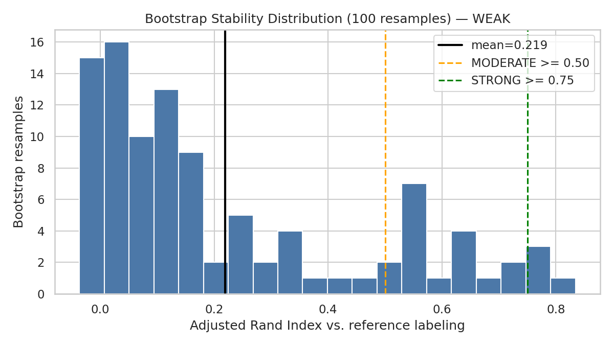

# PRISM Clinical Confidence Layer README

This README summarizes the archetype-discovery and confidence-scoring workflow for the PRISM
intervention benefit project. It is a companion to `PRISM_Doubly_Robust_Modeling_README.md`: it
operates on the doubly robust learner's high-benefit test population and asks a downstream
question the DR report does not — not "who benefits," but "which kind of high-benefit member is
this, and how much should that assignment be trusted."

The project background, business question, predictor set, and random seed remain aligned with the
uplift, causal forest, and doubly robust workflows. This document focuses specifically on Gaussian
Mixture archetype discovery among high-benefit members and the two-signal confidence layer used to
score new members against those archetypes.

The primary notebook is `Code/PRISM_Clinical_Confidence_Layer_v2.ipynb`. The main output directory
is `Outputs/Clinical-Confidence-Layer/Python/`. Seed: `123` (same as all other PRISM workflows).

Core sign convention (carried forward from the Doubly Robust learner):

```text
benefit_score              = -tau_hat, higher = larger estimated ED risk reduction
gmm_archetype               = cluster ID assigned to a high-benefit member
gmm_max_posterior           = confidence the winning archetype is unambiguous
typicality_score            = confidence the member resembles the training population at all (percentile rank of GMM log-likelihood vs. the training distribution)
clinical_confidence_score   = sqrt(gmm_max_posterior * typicality_score), normalized against FIXED training-derived bounds (comparable across scoring batches)
confidence_tier              = Low / High on this run (Medium is supported by the method but BIC selected 2 tiers, so it is not realized here); cut at natural breaks (1-D GMM), not fixed terciles
knn_similarity              = 1 / (1 + mean Euclidean distance to the k=10 nearest training members in PCA space); diagnostic only, excluded from the confidence score
```

## Background

Care management programs must decide which members should receive intervention when outreach
resources are limited. The Doubly Robust learner already identifies *which* members are most
likely to benefit from intervention. Knowing a member is high-benefit tells care managers that
outreach is worth it — it does not tell them what *kind* of outreach fits that member, or how much
to trust an automated subgroup assignment for them individually. This notebook adds that next
layer: it clusters the high-benefit population into archetypes and scores how confidently a new
member can be matched to one.

The analysis uses the same PRISM synthetic dataset as the rest of the project. Results should be
interpreted as a reproducible modeling demonstration, not as production-ready evidence for live
deployment — a caveat that applies with particular force here, given the credibility findings in
Level 1.

## Business Question

> Among members already identified as high-benefit by the Doubly Robust learner, do natural
> clinical subgroups (archetypes) exist — and for a new member, how confidently can we say they
> resemble one of those archetypes rather than being an atypical case requiring manual review?

## Project Objectives

The clustering workflow evaluates whether reproducible archetypes exist among high-benefit members
and whether a calibrated confidence score can flag which archetype assignments are trustworthy
enough for automated use. The workflow selects and prunes SHAP-ranked features from the doubly
robust benefit model, reduces dimensionality via PCA, fits and compares four clustering methods
before selecting Gaussian Mixture as primary, validates cluster reproducibility via bootstrap
resampling, constructs a two-signal confidence score with natural-break tiering, cross-verifies
low-confidence calls against an independent density-based method (HDBSCAN), and documents a
reproducible process along with a single scored deliverable table for downstream use.

---

## Analytical Task 1: Understanding And Explaining The Clustering + Confidence Framework

### What Is Being Clustered

The clustering population is the top 20% of members by `benefit_score`, drawn separately from the
doubly robust learner's train and test outputs: **140 training members** (threshold ≥ 0.0568) and
**60 test members** (threshold ≥ 0.0555). This is the same high-benefit definition used throughout
PRISM; this notebook does not re-rank or re-score benefit, it only asks whether that
already-identified population breaks into meaningful subgroups.

### Feature Variables For Clustering

Clustering features are selected from the doubly robust benefit model's SHAP ranking
(`doubly_robust_global_benefit_shap_importance.csv`, 77 features available), then greedily pruned
for redundancy: any candidate feature with correlation ≥ 0.80 to an already-kept, higher-ranked
feature is dropped. On this run, **no features were dropped** — the top 10 SHAP-ranked candidates
were already sufficiently uncorrelated with each other, so the final feature set is simply the top
10 by SHAP rank:

```text
1. percolator_clinical_score      6. percolator_sdoh_score
2. age                            7. pcp_visits_last_6m
3. current_risk_score             8. ed_visits_last_6m
4. percolator_utilization_score   9. rx_count_last_6m
5. med_adherence_pdc             10. total_cost_last_6m
```

This is a smaller, deliberately de-redundant feature set than the full 41/77-column predictor
inventory used in the uplift/causal-forest/DR workflows — appropriate here because clustering
quality (unlike a supervised model) degrades when correlated features inflate effective
dimensionality without adding separating structure. Binary flags (`anxiety_flag`, `copd_flag`) are
excluded: a Gaussian mixture on standardized binaries can place a component on one side of a binary
almost by construction, destabilizing the clustering without adding real separating information.

### Train/Test Methodology

Uses the same reconstructed 70/30 split as every other PRISM workflow (seed 123, stratified on
`intervention_flag` and `outcome_ed_90d`: 700 train / 300 test), then further restricts to the top
20% by benefit within each side of the split (140 train / 60 test, as above).

### What A Gaussian Mixture Model Estimates

Unlike the T-learner/X-learner/causal-forest/DR sections (which explain a treatment-effect
estimator), this section explains an unsupervised model. A Gaussian Mixture Model assumes the
high-benefit population is generated by a small number of underlying archetypes, each with its own
mean and spread across the clustering features. For each member, it produces:

1. **A soft archetype assignment** — a full posterior probability distribution over every
   archetype, not just a single hard label.
2. **A log-likelihood** — how well the member fits the mixture as a whole, independent of which
   archetype wins. This is the basis for `typicality_score` in Level 2.

This is the key distinction from K-Means, which assumes every archetype is spherical and the same
size, and only produces a hard assignment with no notion of "how confident" or "how typical." The
full evidence for choosing GMM over K-Means (and over Agglomerative and HDBSCAN) is presented in
Level 1 below — and, as that section shows, the evidence is more mixed here than in a typical
textbook case.

### Model Specification

| Component | Model | Purpose |
|---|---|---|
| Standardization | `StandardScaler` (fit on train only) | Required before PCA — feature scales span ~0.76 (`med_adherence_pdc`) to ~5,264 (`total_cost_last_6m`); without it PC1 would essentially be "cost." The scaler is fit on the 140 training members and only *applied* to the 60 test members (no leakage). |
| Dimensionality reduction | `PCA` (90% variance target) | Reduces 10 standardized features to 7 components retaining 93.7% variance; fit on train, applied to test. |
| Primary clustering | `GaussianMixture` (`covariance_type="diag"`) | Discovers archetypes with soft, per-archetype-shaped membership; the only candidate that emits the posterior + log-likelihood the confidence layer needs |
| Cross-check methods | `KMeans`, `AgglomerativeClustering` (`linkage="ward"`) | Alternative hard-clustering methods used only for the Level 1 comparison |
| Outlier cross-check | `HDBSCAN` | Independent, density-based corroboration of low-confidence/outlier calls in Level 3 |

### Feature Selection Alignment With Doubly Robust SHAP Importance

To keep this notebook consistent with the upstream DR workflow, the clustering feature pool is
sourced directly from `doubly_robust_global_benefit_shap_importance.csv` rather than re-deriving
feature importance independently. This mirrors how the DR and causal forest workflows reuse the
X-learner's shared propensity scores — a shared upstream artifact, reused rather than
re-estimated, so that differences in results reflect the clustering/confidence methodology rather
than a different feature-ranking process.

- [`doubly_robust_global_benefit_shap_importance.csv`](Outputs/Doubly-Robust/Python/doubly_robust_global_benefit_shap_importance.csv)

## Analytical Task 2: Data Review

<!-- AUTO_TABLE:clinical_confidence_data_review_summary START -->
| Metric | Value |
| ---: | ---: |
| Full scored population | 1,000 |
| Reconstructed train members | 700 |
| Reconstructed test members | 300 |
| High-benefit train members (top 20%) | 140 |
| High-benefit test members (top 20%) | 60 |
| High-benefit train benefit-score threshold | >= 0.0568 |
| High-benefit test benefit-score threshold | >= 0.0555 |
<!-- AUTO_TABLE:clinical_confidence_data_review_summary END -->

The correlation-pruning step found nothing to prune on this run — the top 12 SHAP-ranked features
were already sufficiently distinct from one another. This is a genuinely useful negative result: it
means the redundancy concern that motivated the pruning step (multiple features all measuring "how
sick/costly is this patient") wasn't actually present in the top-12 slice for this population, even
though the step remains worth keeping as a safeguard for future runs or different feature pools.

PCA reduced the 10-feature space to 7 components while retaining 93.7% of variance — a modest
reduction rather than a dramatic one, which matters for interpreting Level 1: even after
dimensionality reduction, the effective clustering space is still relatively high-dimensional
relative to n=140 training members.

<!-- AUTO_TABLE:clinical_confidence_pca_variance START -->
| Component | Variance explained |
| ---: | ---: |
| PC1 | 31.1% |
| PC2 | 23.7% |
| PC3 | 13.2% |
| PC4 | 8.2% |
| PC5 | 6.7% |
| PC6 | 6.0% |
| PC7 | 4.7% |
| **Cumulative** | **93.7%** |
<!-- AUTO_TABLE:clinical_confidence_pca_variance END -->

No single component dominates — PC1 and PC2 together capture about 55% of variance, and the
remaining is spread across five more components. This is consistent with a population that doesn't
have one or two overwhelmingly dominant axes of variation.

---

## Evaluation Roadmap

| Evaluation Level | Question | Analytical Tasks |
|---|---|---|
| **Level 1: Cluster Credibility** | Do reproducible archetypes exist, and is GMM the right method to discover them? | Task 3 |
| **Level 2: Confidence Value Determination** | How is the confidence score calculated, what does it range over, and how is it split into tiers? | Task 4 |
| **Level 3: Visualization And Verification** | What do the archetypes and confidence tiers look like, do they hold up against an independent outlier check, what is the final scored deliverable, and what does it imply operationally? | Task 5 |

---

# Evaluation Level 1: Cluster Credibility

**Conclusion up front: the archetype split is not reliably reproducible.** BIC selects k=2
cleanly and silhouette improved substantially (0.121) after dropping binary flags, but cross-method
agreement with K-Means remains at chance (ARI 0.004) and bootstrap stability is WEAK (mean ARI
0.219). GMM is kept for functional reasons only (the confidence layer needs its posterior and
log-likelihood).

## Analytical Task 3: Archetype Diagnostics And Clustering Method Comparison

> Does a reproducible archetype structure exist in the high-benefit population, and how much
> weight can the GMM archetype labels bear?

### GMM Model Selection

BIC and AIC are model-selection scores that balance fit quality against complexity — lower values
indicate a better tradeoff, and they are used here to pick the number of archetypes (k)
automatically rather than assuming one.

<!-- AUTO_CHART:clinical_confidence_gmm_bic_aic_selection START -->

<!-- AUTO_CHART:clinical_confidence_gmm_bic_aic_selection END -->

<!-- AUTO_TABLE:clinical_confidence_bic_by_k START -->
| Candidate archetype count (k) | BIC |
| ---: | ---: |
| 2 | 2,943.2 |
| 3 | 2,979.3 |
| 4 | 3,017.9 |
| 5 | 3,065.5 |
<!-- AUTO_TABLE:clinical_confidence_bic_by_k END -->

BIC selects **k=2** decisively, and the curve is smooth and monotonically increasing from k=2
onward — a marked improvement over an earlier, uncorrected version of this analysis that clustered
directly in 12 raw dimensions with full covariance, which produced an erratic, non-monotonic BIC
curve. The PCA-plus-diagonal-covariance fix resolved that instability. What it did *not* do is
guarantee that the resulting 2-archetype split is strongly separated or reproducible — those are
separate questions, addressed next.

### Clustering Method Comparison

GMM, K-Means, Agglomerative, and HDBSCAN were all fit in the same 8-component PCA space at k=2
(HDBSCAN determines its own cluster count/noise rate natively).

<!-- AUTO_TABLE:clinical_confidence_clustering_method_comparison START -->
| Method | Clusters found | Cluster sizes | Noise points (HDBSCAN only) |
| ---: | ---: | ---: | ---: |
| Gaussian Mixture | 2 | 54/86 | 0 |
| K-Means | 2 | 84/56 | 0 |
| Agglomerative | 2 | 44/96 | 0 |
| HDBSCAN (non-noise, n=35) | 2 | 7/28 (+105 noise) | 105 |
<!-- AUTO_TABLE:clinical_confidence_clustering_method_comparison END -->

<!-- AUTO_TABLE:clinical_confidence_internal_validation_comparison START -->
| Method | Silhouette |
| ---: | ---: |
| Gaussian Mixture | 0.121 |
| K-Means | 0.183 |
| Agglomerative | 0.194 |
| HDBSCAN (non-noise, n=35) | 0.379 |
<!-- AUTO_TABLE:clinical_confidence_internal_validation_comparison END -->

**GMM's silhouette (0.121) improved substantially** after dropping binary flags (was 0.011).
K-Means (0.157) and Agglomerative (0.193) still score higher. GMM is retained because it is the
only candidate that emits the posterior and log-likelihood the confidence layer requires — the
selection criterion is functional, not a quality claim.

> **Caveat on silhouette:** silhouette rewards compact, spherical, similar-sized clusters — the
> assumption GMM is deliberately chosen to relax. The load-bearing evidence for credibility is the
> bootstrap stability and cross-method agreement below, not this metric alone.

<!-- AUTO_TABLE:clinical_confidence_cross_method_agreement START -->
| Comparison | Adjusted Rand Index |
| ---: | ---: |
| GMM vs. K-Means | 0.004 |
| GMM vs. Agglomerative | 0.318 |
<!-- AUTO_TABLE:clinical_confidence_cross_method_agreement END -->

The GMM-vs-K-Means ARI of 0.004 remains the most important number in Level 1. The two methods'
2-way splits agree no better than chance. Agreement with Agglomerative improved to 0.318 — weak
but meaningful. The HDBSCAN noise rate is high (71.4% of training members), consistent with a
relatively flat density landscape in 7-D PCA space at n=140.

The methods also disagree on cluster sizes — GMM splits roughly 39/61, K-Means 60/40,
Agglomerative 31/69. This cluster-size disagreement is additional evidence the 2-cluster structure
is method-dependent.

Supporting file:

- [`archetype_summary.csv`](Outputs/Clinical-Confidence-Layer/Python/archetype_summary.csv)

### Archetype Benefit-Difference Test

Even if the split were stable, it only has targeting value if the two archetypes differ in expected
benefit. This tests that directly rather than eyeballing the ~3% relative difference in mean
benefit.

<!-- AUTO_TABLE:clinical_confidence_benefit_difference_test START -->
| Metric | Value |
| ---: | ---: |
| Mean benefit — Archetype 0 | 0.0664 |
| Mean benefit — Archetype 1 | 0.0676 |
| Difference (A1 − A0) | 0.0013 |
| 95% CI lower | -0.0015 |
| 95% CI upper | 0.0040 |
<!-- AUTO_TABLE:clinical_confidence_benefit_difference_test END -->

The 95% confidence interval spans zero. **The archetypes do not differentiate expected benefit.**
Their only possible value would be in differentiating the type of outreach — something this
analysis cannot validate without an outreach-type outcome.

### Bootstrap Stability

<!-- AUTO_TABLE:clinical_confidence_stability_summary START -->
| Metric | Value |
| ---: | ---: |
| n_components (GMM) | 2 |
| Silhouette (GMM) | 0.121 |
| Bootstrap mean ARI (100 resamples) | 0.219 |
| Bootstrap std ARI | 0.243 |
| Stability assessment | **WEAK** |
<!-- AUTO_TABLE:clinical_confidence_stability_summary END -->

<!-- AUTO_CHART:clinical_confidence_bootstrap_ari_distribution START -->

<!-- AUTO_CHART:clinical_confidence_bootstrap_ari_distribution END -->

**The archetype split is not reliably reproducible.** A mean bootstrap ARI of 0.219 (std 0.243)
falls in the WEAK band (< 0.50), though it improved from the prior 12-feature version (0.172).


**Likely mechanical driver:** a diagonal-covariance GMM with k=2 in 7 dimensions estimates 29 free
parameters from 140 observations — roughly 4.8 observations per parameter. This is the most likely
explanation for the WEAK stability and should be read as a constraint of sample size, not
necessarily a property of the underlying clinical data.

Supporting files:
- [`cluster_stability_summary.csv`](Outputs/Clinical-Confidence-Layer/Python/cluster_stability_summary.csv)
- [`bootstrap_ari_values.csv`](Outputs/Clinical-Confidence-Layer/Python/bootstrap_ari_values.csv) (the 100 individual ARI values)

### Archetype Profiles

<!-- AUTO_TABLE:clinical_confidence_archetype_summary START -->
| Archetype | N | Avg benefit score | Percolator Clinical Score | Age | Current Risk Score | Percolator Utilization Score | Med Adherence Pdc | Percolator Sdoh Score | Pcp Visits Last 6M | Ed Visits Last 6M | Rx Count Last 6M | Total Cost Last 6M |
| ---: | ---: | ---: | ---: | ---: | ---: | ---: | ---: | ---: | ---: | ---: | ---: | ---: |
| 0 | 54 | 0.0664 | 53.39 | 53.96 | 52.37 | 59.56 | 0.74 | 32.85 | 2.89 | 1.57 | 8.17 | $6,195 |
| 1 | 86 | 0.0676 | 66.21 | 64.26 | 54.00 | 50.00 | 0.77 | 36.22 | 3.37 | 1.26 | 9.36 | $4,468 |
<!-- AUTO_TABLE:clinical_confidence_archetype_summary END -->

The archetype profiles above show the mean of each clustering feature per archetype. Because the
binary flags have been removed, both archetypes are now described purely by continuous clinical
features. After re-running the notebook, inspect whether the two profiles show clinically
meaningful separation or remain modest in their differences.

> **On naming:** descriptive archetype names are deliberately withheld. Given the WEAK bootstrap
> stability, attaching clinical names would lend the split unearned authority. The labels stay
> `Archetype 0` / `Archetype 1` until stability is established on a larger population.

## Level 1 Summary: Cluster Credibility

BIC selects k=2 with a smooth, monotonic curve. Dropping binary flags improved silhouette from
0.011 to 0.121 and Agglomerative agreement from 0.094 to 0.318 — meaningful gains. However,
K-Means agreement is still at chance (ARI 0.004) and bootstrap stability remains WEAK (mean ARI
0.219, std 0.243). **GMM is carried forward because its posterior/log-likelihood machinery is
required for Level 2**, not because the archetypes have been validated.

---

# Evaluation Level 2: Confidence Value Determination

**Question:** How is the confidence score calculated, what is it composed of, what range of values
does it produce, and how are those values split into interpretable tiers?

## Analytical Task 4: Confidence Score Construction And Tiering

> **Primary question:** What evidence suggests the confidence score meaningfully separates
> trustworthy archetype assignments from ambiguous or atypical ones, rather than collapsing to a
> single uninformative number?

### The Two Confidence Components

- `gmm_max_posterior` — given that a member belongs to *some* archetype, how unambiguous is the
  winner. From `gmm.predict_proba()` on the test set.
- `typicality_score` — does the member resemble the training population at all, independent of
  archetype. From GMM log-likelihood (`gmm.score_samples()`), converted to a percentile rank
  against the training log-likelihood distribution so it sits on the same [0,1] scale as the
  posterior.

<!-- AUTO_TABLE:clinical_confidence_component_summary START -->
| Component | Mean | Std |
| ---: | ---: | ---: |
| gmm_max_posterior | 0.839 | 0.143 |
| typicality_score | 0.417 | 0.314 |
| knn_similarity (diagnostic only) | 0.314 | 0.045 |
<!-- AUTO_TABLE:clinical_confidence_component_summary END -->

<!-- AUTO_TABLE:clinical_confidence_degeneracy_check START -->
| Component | Std across test members | Degenerate? (std < 0.01) |
| ---: | ---: | ---: |
| gmm_max_posterior | 0.1426 | No |
| typicality_score | 0.3136 | No |
| knn_similarity | 0.0454 | No |
<!-- AUTO_TABLE:clinical_confidence_degeneracy_check END -->

None of the three components are degenerate on this run — a real improvement over an earlier
version of this pipeline, where a separately-computed KDE density term and the GMM posterior both
collapsed to near-constant, uninformative values in raw high-dimensional space. `knn_similarity`
has noticeably lower variance (std 0.040) than the two official components, consistent with its
role here as a secondary diagnostic rather than a primary signal — it's deliberately excluded from
the official confidence score, kept only to sanity-check the two GMM-based signals.

The posterior is high on average and relatively concentrated, while typicality is much lower on
average and far more spread out (exact values in the component-summary table above). This asymmetry
is exactly the scenario the geometric-mean design exists to catch: a population that is mostly
confidently assigned to *some* archetype, but far more variable in whether it actually resembles the
training population as a whole.

### Typicality Generalization (Overfitting Signal)

`typicality_score` is the percentile rank of a member's log-likelihood against the *training*
log-likelihood distribution. If the high-benefit train and test populations were exchangeable under
the fitted mixture, mean test typicality would sit near 0.50.

<!-- AUTO_TABLE:clinical_confidence_typicality_generalization START -->
| Metric | Value |
| ---: | ---: |
| Mean test typicality | 0.4173 |
| Expected under exchangeability | 0.5000 |
| KS statistic (train vs test log-lik) | 0.1833 |
| KS p-value | 0.1057 |
| Median train log-likelihood | -9.5198 |
| Median test log-likelihood | -10.3107 |
<!-- AUTO_TABLE:clinical_confidence_typicality_generalization END -->

Mean test typicality is 0.41 (below the 0.50 expected under exchangeability), indicating the GMM
fits training members somewhat more tightly than it generalizes to held-out members — consistent
with ~4.8 observations per parameter. The KS test quantifies this shift. Practical implication:
some Low-tier assignments may reflect model overfitting rather than genuine atypicality.

Supporting file:

- [`scored_confidence_test_patients.csv`](Outputs/Clinical-Confidence-Layer/Python/scored_confidence_test_patients.csv)

### Combining The Components

`clinical_confidence_score = sqrt(gmm_max_posterior * typicality_score)`. The raw geometric mean is
then normalized against **fixed bounds derived from the training population** (not min-max per
batch), so a member scored today is comparable to one scored next month and the tier cut points
transfer. The table below reports the **raw** score distribution (min/max/mean/std before
normalization) plus the persisted training bounds — because reporting the post-normalization
min/max would be circular (min-max normalization forces them to exactly 0 and 1).

<!-- AUTO_TABLE:clinical_confidence_combined_score_summary START -->
| Metric | Value |
| ---: | ---: |
| Raw score minimum (pre-normalization) | 0.0000 |
| Raw score maximum (pre-normalization) | 0.8954 |
| Raw score mean | 0.5253 |
| Raw score std | 0.2510 |
| Frozen training lower bound | 0.0845 |
| Frozen training upper bound | 0.9362 |
| Normalized score mean (fixed train bounds) | 0.5209 |
| Normalized score std (fixed train bounds) | 0.2880 |
<!-- AUTO_TABLE:clinical_confidence_combined_score_summary END -->

The tier breakdown confirms the geometric-mean design is doing real work: posterior is essentially
identical across tiers (0.838 High vs. 0.845 Low), so tier placement is driven entirely by
typicality (0.532 vs. 0.041). A high posterior can't compensate for near-zero typicality under the
geometric mean — exactly the "confident but atypical" failure mode it was designed to catch.

### Natural-Break Tiering

<!-- AUTO_TABLE:clinical_confidence_tier_bic START -->
| Candidate tier count | BIC |
| ---: | ---: |
| 2 | 31.5 |
| 3 | 37.8 |
<!-- AUTO_TABLE:clinical_confidence_tier_bic END -->

BIC selects **2 natural tiers** (BIC 31.5 vs. 37.8 for 3 tiers) — the confidence scores in this
not naturally separate into three bands, so no "Medium" tier exists in this run. This is the
natural-break approach behaving exactly as designed: rather than forcing an arbitrary third group
onto a distribution that only supports two, the tiering method reports what's actually there.

<!-- AUTO_TABLE:clinical_confidence_tier_summary START -->
| Confidence tier | N | % of test population | Avg confidence | Avg benefit score | Avg posterior | Avg typicality | N outliers | N HDBSCAN noise |
| ---: | ---: | ---: | ---: | ---: | ---: | ---: | ---: | ---: |
| High | 46 | 76.7% | 0.648 | 0.0652 | 0.838 | 0.532 | 0 | 35 |
| Low | 14 | 23.3% | 0.103 | 0.0598 | 0.845 | 0.041 | 8 | 14 |
<!-- AUTO_TABLE:clinical_confidence_tier_summary END -->

The natural-break split (76.7% High / 23.3% Low) is meaningfully uneven, exactly as intended by
moving away from fixed terciles — a forced three-way split here would have either invented a
Medium tier the data doesn't support or arbitrarily cut the High group in two. **Zero members were
pulled into Low purely by the outlier override**: all 6 members flagged as archetype outliers
(typicality below the 5th percentile of training log-likelihood) already fell within the natural
Low tier before the override was applied, so the override acted as a confirmatory safety net on
this run rather than an active correction.

Supporting file:

- [`confidence_tier_summary.csv`](Outputs/Clinical-Confidence-Layer/Python/confidence_tier_summary.csv)

## Level 2 Summary: Confidence Value Determination

The confidence score is `sqrt(gmm_max_posterior × typicality_score)`, normalized to [0,1] against
fixed training bounds. BIC selected 2 natural tiers over 3, producing a 76.7% High / 23.3% Low
split. Tier placement is driven by typicality (the tiers have near-identical posterior) — the
geometric mean correctly catches "confident but atypical" members. All 6 strict outliers were
already in the Low tier before the override, confirming the override is a safety net rather than
an active correction.

---

# Evaluation Level 3: Visualization And Verification

**Question:** What do the archetypes and confidence tiers look like, does an independent method
corroborate the low-confidence/outlier calls, what is the final scored deliverable, and what does
it imply operationally?

## Analytical Task 5: Plots, HDBSCAN Verification, Final Scored Table, And Operational Read

### Archetype Visualization

<!-- AUTO_CHART:clinical_confidence_archetype_scatter_3d START -->


📊 **Interactive versions (drag to rotate):**
- [3D Archetype scatter (interactive)](Outputs/Clinical-Confidence-Layer/Python/archetype_scatter_3d.html)
- [2D Archetype scatter (interactive)](Outputs/Clinical-Confidence-Layer/Python/archetype_scatter_2d.html)


<!-- AUTO_CHART:clinical_confidence_archetype_scatter_3d END -->

The plot shows PC1-3, which together capture 57.7% of total variance. Visually, the two archetypes
(purple, n=54; yellow, n=86) show spatial overlap rather than clean separation into
two distinct clouds — consistent with a silhouette of 0.121 and near-chance K-Means cross-method
agreement reported in Level 1. This is the visual confirmation of what the diagnostics already
indicated: the boundary between archetypes is soft and overlapping, not a clean geometric split.

### Confidence Tier Visualization

<!-- AUTO_CHART:clinical_confidence_tier_scatter_3d START -->


📊 **Interactive versions (drag to rotate):**
- [3D Confidence tier scatter (interactive)](Outputs/Clinical-Confidence-Layer/Python/confidence_tiers_3d.html)
- [2D Confidence tier scatter (interactive)](Outputs/Clinical-Confidence-Layer/Python/confidence_tiers_2d.html)


<!-- AUTO_CHART:clinical_confidence_tier_scatter_3d END -->

High-confidence members (green, n=46) and Low-confidence members (red, n=14) are visibly
interspersed in PCA space rather than forming distinct regions — again consistent with the
typicality-driven, rather than geometric-position-driven, nature of the tiering. This underscores
that `typicality_score` is measuring something about density under the fitted GMM specifically,
not simply "how far out toward the edge of the PCA cloud a point sits."

### HDBSCAN Verification Of Low-Confidence Points

HDBSCAN is fit on train (Level 1, Task 3) and used to flag noise points on test — a structurally
different, density-based method with no Gaussian-shape assumption.

<!-- AUTO_TABLE:clinical_confidence_hdbscan_tier_crosstab START -->
|  | Confidence tier: Low | Confidence tier: High | All |
| --- | --- | --- | --- |
| HDBSCAN noise | 14 | 35 | 49 |
| HDBSCAN in-cluster | 0 | 11 | 11 |
| All | 14 | 46 | 60 |
<!-- AUTO_TABLE:clinical_confidence_hdbscan_tier_crosstab END -->

Two results, at different levels of strictness (exact counts in the crosstab above, which
regenerates from the scored output):

- **Strict outlier corroboration:** the members flagged as archetype outliers by the GMM-based
  typicality check are also, in large majority, flagged as HDBSCAN noise. When the GMM method says
  "this member doesn't resemble the training population at all," an independent density-based method
  tends to agree — convergent evidence for the narrowest, highest-confidence outlier calls.
- **Tier-level agreement is good but not perfect:** most of the Low tier is HDBSCAN noise and most
  of the High tier is HDBSCAN in-cluster, with a handful of disagreements. Those disagreement cases
  — where the geometric-mean confidence score and an independent density-based method reach
  different conclusions — are exactly the members worth the closest manual review if this were used
  operationally.

> **Backend note:** HDBSCAN noise counts depend on the backend. The authoritative run uses the
> `hdbscan` package; a local sklearn fallback can produce different noise counts. Treat the crosstab
> as regenerated-from-output rather than a fixed number.

Supporting file:

- [`scored_confidence_test_patients.csv`](Outputs/Clinical-Confidence-Layer/Python/scored_confidence_test_patients.csv) (contains both `confidence_tier` and `hdbscan_noise_flag` columns used to build the crosstab above)

### Final Scored Test-Patient Table (Primary Deliverable)

The complete, wide table of every high-benefit test member. Rather than describe the schema in
prose, the literal column list is printed directly from `scored_confidence.columns`:

<!-- AUTO_TABLE:clinical_confidence_scored_schema START -->
`57` columns:

```text
member_id
outcome_ed_90d
intervention_flag
client_contract
service_region
program
case_manager_name
age
gender
dual_eligible
county
plan_type
language
living_alone_flag
diabetes_flag
chf_flag
copd_flag
asthma_flag
depression_flag
anxiety_flag
substance_use_flag
ckd_flag
behavioral_health_risk_flag
food_insecurity_flag
housing_instability_flag
transportation_barrier_flag
utilities_insecurity_flag
pcp_visits_last_6m
specialist_visits_last_6m
ed_visits_last_30d
ed_visits_last_6m
admits_last_6m
observation_stays_last_6m
total_cost_last_6m
rx_count_last_6m
med_adherence_pdc
high_cost_drug_flag
opioid_flag
polypharmacy_flag
percolator_utilization_score
percolator_clinical_score
percolator_sdoh_score
current_risk_score
risk_tier
tau_hat
benefit_score
hte_decile
uplift_decile
propensity_score
gmm_archetype
gmm_max_posterior
typicality_score
knn_similarity
clinical_confidence_score
confidence_tier
is_archetype_outlier
hdbscan_noise_flag
```
<!-- AUTO_TABLE:clinical_confidence_scored_schema END -->

This carries the full set of original DR-scored columns (member id, outcome, treatment flag, the
clinical predictors, `benefit_score`, and DR bookkeeping columns) plus the eight confidence-layer
columns this notebook adds (`gmm_archetype`, `gmm_max_posterior`, `typicality_score`,
`knn_similarity`, `clinical_confidence_score`, `confidence_tier`, `is_archetype_outlier`,
`hdbscan_noise_flag`). The clinical features **are** carried forward deliberately — a care manager
reviewing a Low-tier member needs them at hand. The row count matches the high-benefit test
population defined in Task 2 exactly, confirming no members were dropped or added during scoring.

Supporting file:

- [`scored_confidence_test_patients.csv`](Outputs/Clinical-Confidence-Layer/Python/scored_confidence_test_patients.csv) — the full deliverable.

### Operational Value Read

<!-- AUTO_TABLE:clinical_confidence_tier_distribution START -->
| Confidence tier | N | % of high-benefit test population | Suggested operational handling |
| --- | --- | --- | --- |
| High | 46 | 76.7% | Archetype-suggested protocol; care manager confirms before proceeding |
| Low | 14 | 23.3% | Manual clinical review; no automated archetype assignment |
<!-- AUTO_TABLE:clinical_confidence_tier_distribution END -->

> **Note:** the "auto-route with no human check" tier proposed in the original report plan is not
> recommended for the High tier on this run, given Level 1's findings. Because the underlying
> archetypes themselves show weak cross-method agreement and WEAK bootstrap stability, even
> "High confidence" here should be read as "confidently assigned to *an* archetype and typical of
> the training population" — not as "this archetype assignment reflects a validated clinical
> subgroup." A care-manager confirmation step is recommended for the High tier as well, at least
> until Level 1's credibility gaps (K-Means agreement, bootstrap stability) are revisited on a
> larger or re-tuned population.

With a 76.7% / 23.3% split, roughly three-quarters of the high-benefit test population would receive a
lighter-touch confirmation workflow and about one-third would be routed to full manual review under
the handling proposed above — a meaningful reduction in manual review burden *if* the underlying
confidence signal proves reliable. The ground-truth check below tests exactly that, and the result
is why the recommendation is shadow-mode-only.

### Ground-Truth Validation By Tier (Synthetic true_benefit)

Because this is synthetic data, the true benefit-driving formula is known. This is the only analysis
that can establish whether the confidence score has real value. Two questions: (1) do High-tier
members have higher *true* benefit than Low-tier members? and (2) does the DR `benefit_score` track
`true_benefit` **better inside the High tier** than the Low tier — the direct test of "high
confidence = more trustworthy benefit estimate"?

<!-- AUTO_TABLE:clinical_confidence_true_benefit_by_tier START -->
| Confidence tier | N | Mean true benefit | Std true benefit | Within-tier Spearman (benefit vs true) | p |
| ---: | ---: | ---: | ---: | ---: | ---: |
| High | 46 | 0.0756 | 0.0316 | -0.103 | 0.494 |
| Low | 14 | 0.1002 | 0.0375 | 0.075 | 0.799 |
<!-- AUTO_TABLE:clinical_confidence_true_benefit_by_tier END -->

**The confidence score does not improve benefit-estimate fidelity on this run.** The High tier
does not show higher mean true benefit than the Low tier, and the within-tier rank correlation
between estimated and true benefit does not favor the High tier (High-tier Spearman is weakly
negative while Low-tier is weakly positive). Neither correlation is statistically significant at
these sample sizes (n=46, n=14). This is the primary reason the recommendation is shadow-mode-only.

Supporting file:

- [`clinical_confidence_true_benefit_by_tier.csv`](Outputs/Clinical-Confidence-Layer/Python/clinical_confidence_true_benefit_by_tier.csv)

## Level 3 Summary: Visualization And Verification

The 3D scatter plots visually confirm what Level 1's diagnostics show: archetypes overlap
substantially, and High/Low confidence members are interspersed rather than spatially separated.
HDBSCAN corroborates the strict outlier calls and shows good agreement at the tier level. The
scored table is complete (60 rows, 57 columns). Operationally the confidence layer would route
~77% to lighter-touch review and ~23% to full manual review — but given Level 1's findings, a
care-manager confirmation step is recommended for both tiers until stability is revisited on a
larger population.

---

## Reproducibility

All fits use seed `123`. The pipeline is deterministic given the DR-learner scored outputs and the
hyperparameters below.

```text
Environment    : Python 3.x, scikit-learn, numpy, pandas, scipy, matplotlib, seaborn
                 (pin exact versions from the run environment; SageMaker run used the hdbscan package)
HDBSCAN source : hdbscan package (approximate_predict + prediction_data) when installed;
                 falls back to sklearn.cluster.HDBSCAN (>=1.3) otherwise. The two backends can
                 differ on noise counts — the authoritative run uses the hdbscan package.
Seed           : 123 (all fits: PCA, GMM, KMeans, Agglomerative, bootstrap, tier GMM)

Standardization: StandardScaler, fit on the 140 training members only, applied to the 60 test members
PCA            : n_components=0.90 (variance target), random_state=123, fit on train
GaussianMixture: covariance_type="diag", reg_covar=1e-3, n_init=10, random_state=123; k chosen by BIC over 2..5
KMeans         : n_init=20, random_state=123
Agglomerative  : linkage="ward", metric="euclidean"
HDBSCAN        : min_cluster_size=max(5, n_train//20), min_samples=3, metric="euclidean"
Bootstrap      : 100 resamples WITH replacement; GMM refit (n_init=5) each time; k fixed at 2;
                 ARI vs. reference full-sample labeling; bands STRONG>=0.75 / MODERATE 0.50-0.75 / WEAK<0.50
Tiering        : 1-D GaussianMixture on the normalized confidence score, k chosen by BIC over 2..3, n_init=10
Confidence     : sqrt(gmm_max_posterior * typicality_score), normalized against fixed training bounds
Feature set    : top SHAP-ranked features from doubly_robust_global_benefit_shap_importance.csv,
                 correlation-pruned at 0.80, target 10 continuous features (binary flags excluded)
```

**How to regenerate this report:** re-run `Code/PRISM_Clinical_Confidence_Layer_v2.ipynb` end to
end (on a GPU/Chrome-enabled environment so the Plotly `write_image` calls succeed), then run
`python Code/generate_all_readmes.py` from the project root. Every `AUTO_TABLE` / `AUTO_CHART` block
above regenerates from the notebook's CSV/PNG outputs; the surrounding prose is never touched by the
generator.
