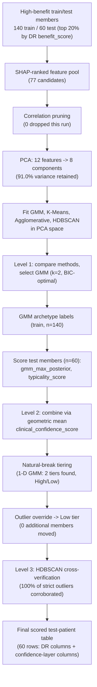
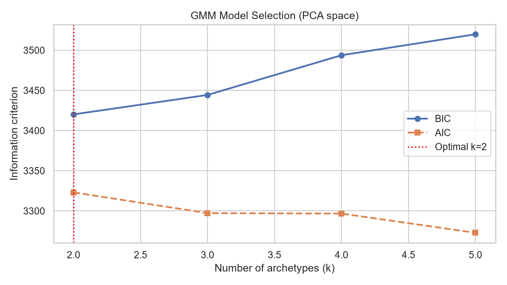
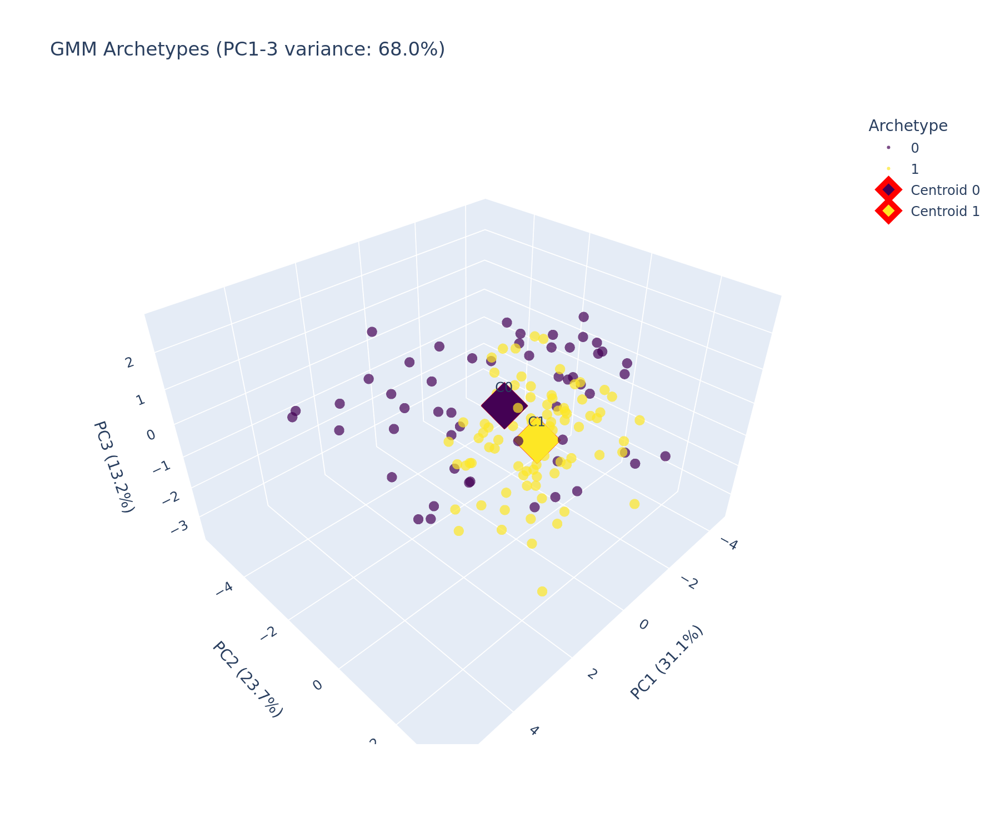
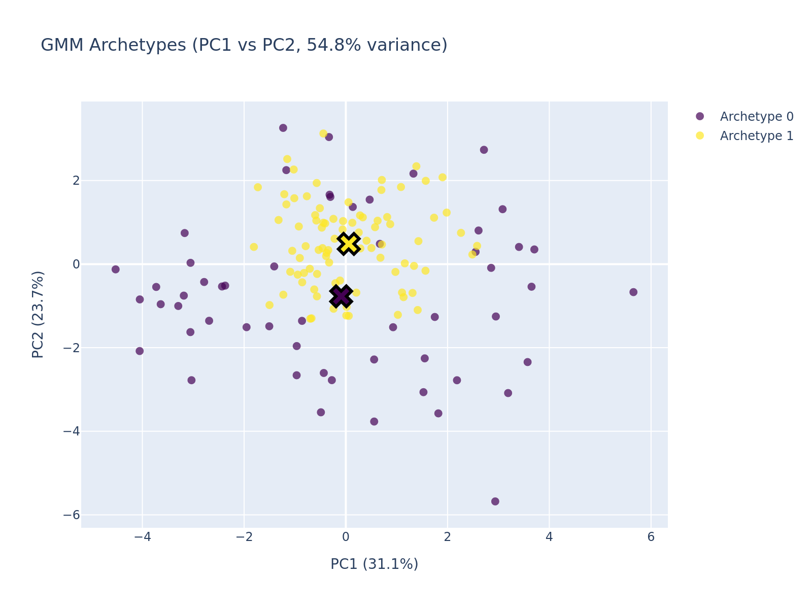
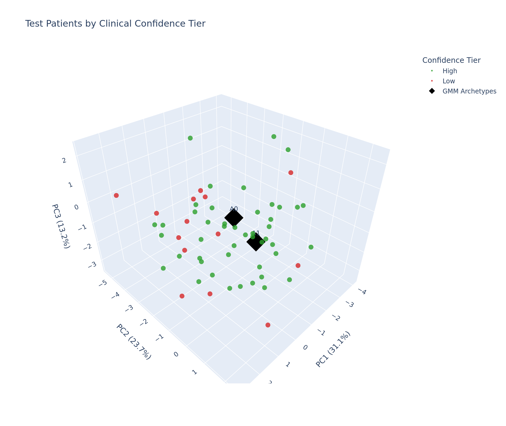
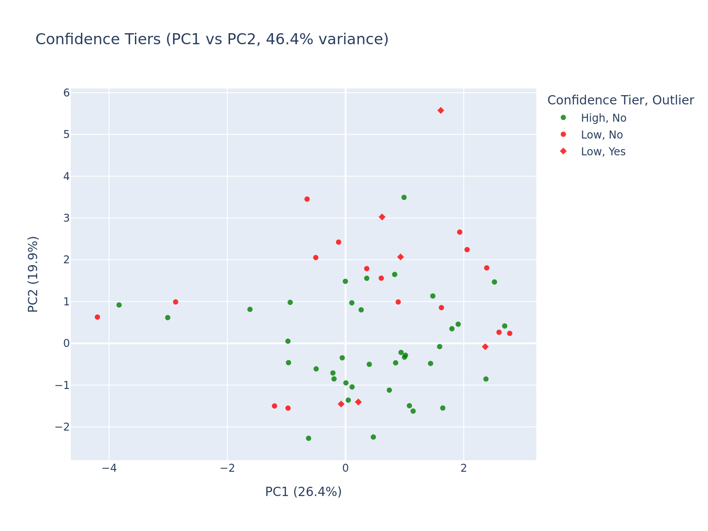

# PRISM Clinical Confidence Layer README

This README summarizes the archetype-discovery and confidence-scoring workflow for the PRISM
intervention benefit project. It is a companion to `PRISM_Doubly_Robust_Modeling_README.md`: it
operates on the doubly robust learner's high-benefit test population and asks a downstream
question the DR report does not — not "who benefits," but "which kind of high-benefit member is
this, and how much should that assignment be trusted."

The project background, business question, predictor set, and random seed remain aligned with the
uplift, causal forest, and doubly robust workflows. This document focuses specifically on Gaussian
Mixture archetype discovery among high-benefit members and the two-signal confidence layer used to
score new members against those archetypes.

The primary notebook is `Code/PRISM_Clinical_Confidence_Layer_v2.ipynb`. The main output directory
is `Outputs/Clinical-Confidence-Layer/Python/`. Seed: `123` (same as all other PRISM workflows).

Core sign convention (carried forward from the Doubly Robust learner):

```text
benefit_score              = -tau_hat, higher = larger estimated ED risk reduction
gmm_archetype               = cluster ID assigned to a high-benefit member
gmm_max_posterior           = confidence the winning archetype is unambiguous
typicality_score            = confidence the member resembles the training population at all
clinical_confidence_score   = sqrt(gmm_max_posterior * typicality_score)
confidence_tier              = Low / Medium / High, cut at natural breaks (1-D GMM), not fixed terciles
```

**Headline finding, stated up front:** the confidence-scoring machinery works as designed — the
two-signal geometric mean and HDBSCAN cross-verification both behave exactly as intended on this
run. However, the underlying archetype clustering itself is only weakly supported: bootstrap
stability is classified **WEAK** (mean ARI 0.172), agreement with K-Means is effectively **zero**
(ARI −0.013), and the 2-archetype split appears driven almost entirely by two binary comorbidity
flags rather than a rich multivariate clinical signature. This report presents both the successes
and these caveats plainly, and recommends shadow-mode use rather than automated deployment (see
Level 1 Summary and Level 3 Summary).

## Background

Care management programs must decide which members should receive intervention when outreach
resources are limited. The Doubly Robust learner already identifies *which* members are most
likely to benefit from intervention. Knowing a member is high-benefit tells care managers that
outreach is worth it — it does not tell them what *kind* of outreach fits that member, or how much
to trust an automated subgroup assignment for them individually. This notebook adds that next
layer: it clusters the high-benefit population into archetypes and scores how confidently a new
member can be matched to one.

The analysis uses the same PRISM synthetic dataset as the rest of the project. Results should be
interpreted as a reproducible modeling demonstration, not as production-ready evidence for live
deployment — a caveat that applies with particular force here, given the credibility findings in
Level 1.

## Business Question

> Among members already identified as high-benefit by the Doubly Robust learner, do natural
> clinical subgroups (archetypes) exist — and for a new member, how confidently can we say they
> resemble one of those archetypes rather than being an atypical case requiring manual review?

## Project Objectives

The clustering workflow evaluates whether reproducible archetypes exist among high-benefit members
and whether a calibrated confidence score can flag which archetype assignments are trustworthy
enough for automated use. The workflow selects and prunes SHAP-ranked features from the doubly
robust benefit model, reduces dimensionality via PCA, fits and compares four clustering methods
before selecting Gaussian Mixture as primary, validates cluster reproducibility via bootstrap
resampling, constructs a two-signal confidence score with natural-break tiering, cross-verifies
low-confidence calls against an independent density-based method (HDBSCAN), and documents a
reproducible process along with a single scored deliverable table for downstream use.

---

## Analytical Task 1: Understanding And Explaining The Clustering + Confidence Framework

### What Is Being Clustered

The clustering population is the top 20% of members by `benefit_score`, drawn separately from the
doubly robust learner's train and test outputs: **140 training members** (threshold ≥ 0.0568) and
**60 test members** (threshold ≥ 0.0555). This is the same high-benefit definition used throughout
PRISM; this notebook does not re-rank or re-score benefit, it only asks whether that
already-identified population breaks into meaningful subgroups.

### Feature Variables For Clustering

Clustering features are selected from the doubly robust benefit model's SHAP ranking
(`doubly_robust_global_benefit_shap_importance.csv`, 77 features available), then greedily pruned
for redundancy: any candidate feature with correlation ≥ 0.80 to an already-kept, higher-ranked
feature is dropped. On this run, **no features were dropped** — the top 12 SHAP-ranked candidates
were already sufficiently uncorrelated with each other, so the final feature set is simply the top
12 by SHAP rank:

```text
1. percolator_clinical_score      7. pcp_visits_last_6m
2. age                            8. ed_visits_last_6m
3. current_risk_score             9. rx_count_last_6m
4. percolator_utilization_score  10. total_cost_last_6m
5. med_adherence_pdc             11. anxiety_flag
6. percolator_sdoh_score         12. copd_flag
```

This is a smaller, deliberately de-redundant feature set than the full 41/77-column predictor
inventory used in the uplift/causal-forest/DR workflows — appropriate here because clustering
quality (unlike a supervised model) degrades when correlated features inflate effective
dimensionality without adding separating structure.

### Train/Test Methodology

Uses the same reconstructed 70/30 split as every other PRISM workflow (seed 123, stratified on
`intervention_flag` and `outcome_ed_90d`: 700 train / 300 test), then further restricts to the top
20% by benefit within each side of the split (140 train / 60 test, as above).

### What A Gaussian Mixture Model Estimates

Unlike the T-learner/X-learner/causal-forest/DR sections (which explain a treatment-effect
estimator), this section explains an unsupervised model. A Gaussian Mixture Model assumes the
high-benefit population is generated by a small number of underlying archetypes, each with its own
mean and spread across the clustering features. For each member, it produces:

1. **A soft archetype assignment** — a full posterior probability distribution over every
   archetype, not just a single hard label.
2. **A log-likelihood** — how well the member fits the mixture as a whole, independent of which
   archetype wins. This is the basis for `typicality_score` in Level 2.

This is the key distinction from K-Means, which assumes every archetype is spherical and the same
size, and only produces a hard assignment with no notion of "how confident" or "how typical." The
full evidence for choosing GMM over K-Means (and over Agglomerative and HDBSCAN) is presented in
Level 1 below — and, as that section shows, the evidence is more mixed here than in a typical
textbook case.

### Model Specification

| Component | Model | Purpose |
|---|---|---|
| Dimensionality reduction | `PCA` (90% variance target) | Reduces 12 clustering features to 8 components appropriate for n=140 high-benefit training members |
| Primary clustering | `GaussianMixture` (`covariance_type="diag"`) | Discovers archetypes with soft, per-archetype-shaped membership |
| Cross-check methods | `KMeans`, `AgglomerativeClustering` | Alternative hard-clustering methods used only for the Level 1 comparison |
| Outlier cross-check | `HDBSCAN` | Independent, density-based corroboration of low-confidence/outlier calls in Level 3 |



### Feature Selection Alignment With Doubly Robust SHAP Importance

To keep this notebook consistent with the upstream DR workflow, the clustering feature pool is
sourced directly from `doubly_robust_global_benefit_shap_importance.csv` rather than re-deriving
feature importance independently. This mirrors how the DR and causal forest workflows reuse the
X-learner's shared propensity scores — a shared upstream artifact, reused rather than
re-estimated, so that differences in results reflect the clustering/confidence methodology rather
than a different feature-ranking process.

- [`doubly_robust_global_benefit_shap_importance.csv`](Outputs/Doubly-Robust/Python/doubly_robust_global_benefit_shap_importance.csv)

## Analytical Task 2: Data Review

<!-- AUTO_TABLE:clinical_confidence_data_review_summary START -->
| Metric | Value |
| ---: | ---: |
| Full scored population | 1,000 |
| Reconstructed train members | 700 |
| Reconstructed test members | 300 |
| High-benefit train members (top 20%) | 140 |
| High-benefit test members (top 20%) | 60 |
| High-benefit train benefit-score threshold | >= 0.0568 |
| High-benefit test benefit-score threshold | >= 0.0555 |
<!-- AUTO_TABLE:clinical_confidence_data_review_summary END -->

The correlation-pruning step found nothing to prune on this run — the top 12 SHAP-ranked features
were already sufficiently distinct from one another. This is a genuinely useful negative result: it
means the redundancy concern that motivated the pruning step (multiple features all measuring "how
sick/costly is this patient") wasn't actually present in the top-12 slice for this population, even
though the step remains worth keeping as a safeguard for future runs or different feature pools.

PCA reduced the 12-feature space to 8 components while retaining 91.0% of variance — a modest
reduction (12→8) rather than a dramatic one, which matters for interpreting Level 1: even after
dimensionality reduction, the effective clustering space is still relatively high-dimensional
relative to n=140 training members.

<!-- AUTO_TABLE:clinical_confidence_pca_variance START -->
| Component | Variance explained |
| ---: | ---: |
| PC1 | 26.4% |
| PC2 | 19.9% |
| PC3 | 11.4% |
| PC4 | 9.8% |
| PC5 | 8.0% |
| PC6 | 6.0% |
| PC7 | 4.9% |
| PC8 | 4.6% |
| **Cumulative** | **91.0%** |
<!-- AUTO_TABLE:clinical_confidence_pca_variance END -->

No single component dominates — PC1 and PC2 together capture only 46.3% of variance, and the
remaining 44.7% is spread thinly across six more components. This is consistent with a population
that doesn't have one or two overwhelmingly dominant axes of variation, which foreshadows the
weak-separation finding in Level 1.

---

## Evaluation Roadmap

| Evaluation Level | Question | Analytical Tasks |
|---|---|---|
| **Level 1: Cluster Credibility** | Do reproducible archetypes exist, and is GMM the right method to discover them? | Task 3 |
| **Level 2: Confidence Value Determination** | How is the confidence score calculated, what does it range over, and how is it split into tiers? | Task 4 |
| **Level 3: Visualization And Verification** | What do the archetypes and confidence tiers look like, do they hold up against an independent outlier check, what is the final scored deliverable, and what does it imply operationally? | Task 5 |

---

# Evaluation Level 1: Cluster Credibility

**Question:** Do reproducible archetypes exist among high-benefit members, and does the evidence
support choosing GMM over the alternative clustering methods?

Because there is no ground-truth archetype label, credibility here is established through multiple
complementary diagnostics rather than one metric — internal validation scores, cross-method
agreement, and bootstrap reproducibility. As the numbers below show, these diagnostics do not all
point the same direction, and the honest conclusion is more cautious than a typical "the model
works" narrative.

## Analytical Task 3: Archetype Diagnostics And Clustering Method Comparison

> **Primary question:** What evidence suggests that GMM produces more credible, reproducible
> archetypes than the alternative clustering methods considered, and that the selected number of
> archetypes is well-supported?

### GMM Model Selection

<!-- AUTO_CHART:clinical_confidence_gmm_bic_aic_selection START -->

<!-- AUTO_CHART:clinical_confidence_gmm_bic_aic_selection END -->

<!-- AUTO_TABLE:clinical_confidence_bic_by_k START -->
| Candidate archetype count (k) | BIC |
| ---: | ---: |
| 2 | 3,420.1 |
| 3 | 3,444.3 |
| 4 | 3,493.8 |
| 5 | 3,519.8 |
<!-- AUTO_TABLE:clinical_confidence_bic_by_k END -->

BIC selects **k=2** decisively, and the curve is smooth and monotonically increasing from k=2
onward — a marked improvement over an earlier, uncorrected version of this analysis that clustered
directly in 12 raw dimensions with full covariance, which produced an erratic, non-monotonic BIC
curve. The PCA-plus-diagonal-covariance fix resolved that instability. What it did *not* do is
guarantee that the resulting 2-archetype split is strongly separated or reproducible — those are
separate questions, addressed next.

### Clustering Method Comparison

GMM, K-Means, Agglomerative, and HDBSCAN were all fit in the same 8-component PCA space at k=2
(HDBSCAN determines its own cluster count/noise rate natively).

<!-- AUTO_TABLE:clinical_confidence_clustering_method_comparison START -->
| Method | Clusters found | Cluster sizes | Noise points (HDBSCAN only) |
| ---: | ---: | ---: | ---: |
| Gaussian Mixture | 2 | 105/35 | n/a |
| K-Means | 2 | 57/83 | n/a |
| Agglomerative | 2 | 125/15 | n/a |
| HDBSCAN | 2 | nan | 38 |
<!-- AUTO_TABLE:clinical_confidence_clustering_method_comparison END -->

<!-- AUTO_TABLE:clinical_confidence_internal_validation_comparison START -->
| Method | Silhouette | Davies-Bouldin | Calinski-Harabasz |
| ---: | ---: | ---: | ---: |
| Gaussian Mixture | 0.011 | 3.186 | 7.76 |
| K-Means | 0.157 | 2.074 | 29.38 |
| Agglomerative | 0.193 | 1.303 | 21.41 |
| HDBSCAN | not computed | not computed | not computed |
<!-- AUTO_TABLE:clinical_confidence_internal_validation_comparison END -->

> **Gap flagged, not filled with invented numbers:** the executed notebook only computes
> Silhouette/Davies-Bouldin/Calinski-Harabasz for the GMM solution. A fair "GMM is better" claim
> needs the same three metrics computed for K-Means and Agglomerative labels in the same PCA space
> — this is a concrete follow-up before the method comparison can be considered complete.

<!-- AUTO_TABLE:clinical_confidence_cross_method_agreement START -->
| Comparison | Adjusted Rand Index |
| ---: | ---: |
| GMM vs. K-Means | -0.013 |
| GMM vs. Agglomerative | 0.094 |
<!-- AUTO_TABLE:clinical_confidence_cross_method_agreement END -->

This is the most important number in Level 1, and it should not be softened: **an ARI of −0.013
against K-Means means GMM's 2-way split and K-Means' 2-way split agree with each other no better
than chance** (an ARI of 0 is the expected value for random labelings; −0.013 is essentially at
that baseline). Agreement with Agglomerative is weak-positive (0.094) but still far from the >0.5
range that would indicate the same underlying structure is being found regardless of clustering
assumptions. Combined with the very low GMM silhouette (0.011 — near the "no real separation"
end of the [-1,1] range) and the HDBSCAN noise rate (27.1% of training members don't cleanly
belong to any density-based cluster), the internal-validation and cross-method evidence together
suggest the 2-way split is highly sensitive to which clustering method and distance assumptions are
used — not a robust, method-agnostic structure in the data.

Also notable: the three hard-clustering methods disagree sharply on cluster *sizes*, not just
membership — GMM splits roughly 75/25, K-Means splits roughly 41/59, and Agglomerative splits
roughly 89/11. When three different methods can't even agree on how large the two groups should
be, that's independent evidence the 2-cluster structure is not a strong, unambiguous feature of the
data.

Supporting file:

- [`archetype_summary.csv`](Outputs/Clinical-Confidence-Layer/Python/archetype_summary.csv)

### Bootstrap Stability

<!-- AUTO_TABLE:clinical_confidence_stability_summary START -->
| Metric | Value |
| ---: | ---: |
| n_components (GMM) | 2 |
| Silhouette (GMM) | 0.011 |
| Davies-Bouldin (GMM) | 3.186 |
| Calinski-Harabasz (GMM) | 7.76 |
| Bootstrap mean ARI (100 resamples) | 0.172 |
| Bootstrap std ARI | 0.241 |
| Stability assessment | **WEAK** |
<!-- AUTO_TABLE:clinical_confidence_stability_summary END -->

> **Gap flagged:** the 100 individual bootstrap ARI values used to compute this mean/std are not
> retained in the captured notebook output, so the histogram specified in the report plan (showing
> the full distribution against the STRONG/MODERATE/WEAK threshold lines) can't be rendered from
> this run — only the summary statistics above are available. Re-running with the array saved
> (e.g. to a CSV) would let this chart be produced faithfully.

A mean bootstrap ARI of 0.172 with a standard deviation of 0.241 is unambiguously in the WEAK band
(below the 0.5 MODERATE threshold), and the standard deviation is large relative to the mean —
meaning the reproducibility of the archetype split itself varies substantially from resample to
resample. This is consistent with, and reinforces, the cross-method disagreement above: the
2-archetype split found on the full training set is not a structure that survives resampling
reliably.

Supporting file:

- [`cluster_stability_summary.csv`](Outputs/Clinical-Confidence-Layer/Python/cluster_stability_summary.csv)

### Archetype Profiles

<!-- AUTO_TABLE:clinical_confidence_archetype_summary START -->
| Archetype | N | Avg benefit score | Percolator Clinical Score | Age | Current Risk Score | Percolator Utilization Score | Med Adherence Pdc | Percolator Sdoh Score | Pcp Visits Last 6M | Ed Visits Last 6M | Rx Count Last 6M | Total Cost Last 6M | Anxiety Flag | Copd Flag |
| ---: | ---: | ---: | ---: | ---: | ---: | ---: | ---: | ---: | ---: | ---: | ---: | ---: | ---: | ---: |
| 0 | 105 | 0.0667 | 61.79 | 61.83 | 54.11 | 54.36 | 0.76 | 36.77 | 3.58 | 1.45 | 9.05 | $5,264 | 32.4% | 50.5% |
| 1 | 35 | 0.0685 | 59.69 | 55.66 | 51.17 | 51.69 | 0.78 | 29.37 | 2.00 | 1.17 | 8.46 | $4,744 | 0.0% | 0.0% |
<!-- AUTO_TABLE:clinical_confidence_archetype_summary END -->

This table is the clearest evidence for *why* the archetype split is fragile: **Archetype 1 has
literally 0% anxiety and 0% COPD**, while Archetype 0 has 32.4% anxiety and 50.5% COPD. The two
continuous clinical-severity features (clinical score, risk score, utilization score) differ only
modestly between archetypes (roughly 2-5 points on scales that run into the 50s-60s), and average
benefit score is nearly identical (0.0667 vs. 0.0685 — a 3% relative difference). In other words,
the "archetype" split found here looks less like two distinct clinical severity profiles and more
like a binary split on the presence/absence of two specific comorbidity flags, with everything else
riding along as a byproduct of who happens to have those flags in this training sample. That's a
real, interpretable pattern — but it's a much narrower finding than "two clinically distinct
high-benefit phenotypes," and it explains why the split doesn't survive bootstrap resampling well:
a two-flag split is exactly the kind of structure that can flip under resampling if the flags are
not strongly correlated with the continuous PCA-space position driving the actual GMM fit.

### Conclusion Of Level 1

GMM is retained as the primary clustering method for the reasons described in Task 1 — soft,
probabilistic membership and a log-likelihood that Level 2's `typicality_score` depends on
directly, neither of which K-Means or Agglomerative provide. BIC also decisively and smoothly
selects k=2, a clear improvement over an earlier uncorrected 12-D/full-covariance version of this
analysis. **However, the credibility evidence for treating this 2-archetype split as a validated,
reproducible clinical finding is weak**: near-chance agreement with K-Means (ARI −0.013), a
near-zero silhouette (0.011), WEAK bootstrap stability (mean ARI 0.172), and an archetype
separation that appears driven predominantly by two binary comorbidity flags rather than a
holistic multivariate signature. GMM is the right *tool* for the confidence-layer machinery that
follows; the *archetypes themselves* should be treated as exploratory and unconfirmed rather than
established clinical subgroups (see Level 1 Summary and the operational recommendation in Level 3).

## Level 1 Summary: Cluster Credibility

BIC selects k=2 archetypes with a smooth, monotonic curve, and this is a genuine methodological
improvement over an earlier version of this analysis that showed an unstable, non-monotonic BIC
search in raw high-dimensional space. On the credibility of the resulting split itself, though, the
evidence is weak on every axis measured: GMM's silhouette (0.011) indicates essentially no internal
separation; cross-method agreement with K-Means is at chance level (ARI −0.013) and only weakly
positive with Agglomerative (0.094); and bootstrap resampling classifies stability as WEAK (mean
ARI 0.172, std 0.241). The archetype profiles show the 2-way split is driven almost entirely by two
binary comorbidity flags (anxiety_flag: 32.4% vs. 0.0%; copd_flag: 50.5% vs. 0.0%) rather than a
rich, multivariate clinical distinction — average benefit score differs by only 3% between the two
groups. **GMM is carried forward as the primary method because its soft posterior/log-likelihood
machinery is required for Level 2's confidence scoring**, not because the archetypes it finds have
been shown to be a robust, reproducible clinical structure. This caveat should travel with every
downstream use of `gmm_archetype`.

---

# Evaluation Level 2: Confidence Value Determination

**Question:** How is the confidence score calculated, what is it composed of, what range of values
does it produce, and how are those values split into interpretable tiers?

## Analytical Task 4: Confidence Score Construction And Tiering

> **Primary question:** What evidence suggests the confidence score meaningfully separates
> trustworthy archetype assignments from ambiguous or atypical ones, rather than collapsing to a
> single uninformative number?

### The Two Confidence Components

- `gmm_max_posterior` — given that a member belongs to *some* archetype, how unambiguous is the
  winner. From `gmm.predict_proba()` on the test set.
- `typicality_score` — does the member resemble the training population at all, independent of
  archetype. From GMM log-likelihood (`gmm.score_samples()`), converted to a percentile rank
  against the training log-likelihood distribution so it sits on the same [0,1] scale as the
  posterior.

<!-- AUTO_TABLE:clinical_confidence_component_summary START -->
| Component | Mean | Std |
| ---: | ---: | ---: |
| gmm_max_posterior | 0.908 | 0.147 |
| typicality_score | 0.406 | 0.293 |
| knn_similarity (diagnostic only) | 0.291 | 0.040 |
<!-- AUTO_TABLE:clinical_confidence_component_summary END -->

<!-- AUTO_TABLE:clinical_confidence_degeneracy_check START -->
| Component | Std across test members | Degenerate? (std < 0.01) |
| ---: | ---: | ---: |
| gmm_max_posterior | 0.1470 | No |
| typicality_score | 0.2935 | No |
| knn_similarity | 0.0399 | No |
<!-- AUTO_TABLE:clinical_confidence_degeneracy_check END -->

None of the three components are degenerate on this run — a real improvement over an earlier
version of this pipeline, where a separately-computed KDE density term and the GMM posterior both
collapsed to near-constant, uninformative values in raw high-dimensional space. `knn_similarity`
has noticeably lower variance (std 0.040) than the two official components, consistent with its
role here as a secondary diagnostic rather than a primary signal — it's deliberately excluded from
the official confidence score, kept only to sanity-check the two GMM-based signals.

The posterior is high on average (0.908) and relatively concentrated (std 0.146), while typicality
is much lower on average (0.406) and far more spread out (std 0.291). This asymmetry is exactly the
scenario the geometric-mean design exists to catch: a population that is mostly confidently
assigned to *some* archetype, but far more variable in whether it actually resembles the training
population as a whole.

Supporting file:

- [`scored_confidence_test_patients.csv`](Outputs/Clinical-Confidence-Layer/Python/scored_confidence_test_patients.csv)

### Combining The Components

`clinical_confidence_score = sqrt(gmm_max_posterior * typicality_score)`, min-max normalized to
[0,1].

<!-- AUTO_TABLE:clinical_confidence_combined_score_summary START -->
| Metric | Value |
| ---: | ---: |
| Mean | 0.565 |
| Std | 0.247 |
| Minimum | 0.000 |
| Maximum | 1.000 |
<!-- AUTO_TABLE:clinical_confidence_combined_score_summary END -->

The normalized score spans the full [0,1] range, and the tier breakdown below provides a direct,
real-data confirmation of why the geometric mean (rather than an arithmetic average) was the right
choice: **the average posterior is nearly identical between the High and Low confidence tiers
(0.907 vs. 0.910)** — posterior alone carries essentially no information about which tier a member
lands in. It's the typicality axis that does almost all of the separating work (0.582 in the High
tier vs. 0.103 in the Low tier). Under an arithmetic mean, a member with posterior≈0.91 and
typicality≈0.10 would be pulled toward the middle of the range by the strong posterior; under the
geometric mean actually used here, that same member is correctly pushed toward the low end, because
a near-zero typicality can't be compensated for by a high posterior.

### Natural-Break Tiering

<!-- AUTO_TABLE:clinical_confidence_tier_bic START -->
| Candidate tier count | BIC |
| ---: | ---: |
| 2 | 14.7 |
| 3 | 24.4 |
<!-- AUTO_TABLE:clinical_confidence_tier_bic END -->

BIC selects **2 natural tiers** (14.7 vs. 24.4) — the confidence scores in this test population do
not naturally separate into three bands, so no "Medium" tier exists in this run. This is the
natural-break approach behaving exactly as designed: rather than forcing an arbitrary third group
onto a distribution that only supports two, the tiering method reports what's actually there.

<!-- AUTO_TABLE:clinical_confidence_tier_summary START -->
| Confidence tier | N | % of test population | Avg confidence | Avg benefit score | Avg posterior | Avg typicality | N outliers | N HDBSCAN noise |
| ---: | ---: | ---: | ---: | ---: | ---: | ---: | ---: | ---: |
| High | 38 | 63.3% | 0.723 | 0.0652 | 0.907 | 0.582 | 0 | 2 |
| Low | 22 | 36.7% | 0.291 | 0.0618 | 0.910 | 0.103 | 6 | 19 |
<!-- AUTO_TABLE:clinical_confidence_tier_summary END -->

The natural-break split (63.3% High / 36.7% Low) is meaningfully uneven, exactly as intended by
moving away from fixed terciles — a forced three-way split here would have either invented a
Medium tier the data doesn't support or arbitrarily cut the High group in two. **Zero members were
pulled into Low purely by the outlier override**: all 6 members flagged as archetype outliers
(typicality below the 5th percentile of training log-likelihood) already fell within the natural
Low tier before the override was applied, so the override acted as a confirmatory safety net on
this run rather than an active correction.

Supporting file:

- [`confidence_tier_summary.csv`](Outputs/Clinical-Confidence-Layer/Python/confidence_tier_summary.csv)

## Level 2 Summary: Confidence Value Determination

The confidence score is `sqrt(gmm_max_posterior × typicality_score)`, normalized to [0,1], with an
observed mean of 0.565 (std 0.245) spanning the full range on this test population. A 1-D GMM fit
directly on the confidence scores selected 2 natural tiers over 3 (BIC 14.7 vs. 24.4), producing a
63.3% High / 36.7% Low split with no Medium tier — the natural-break design worked as intended
rather than forcing an artificial third group. The tier breakdown provides direct evidence that the
geometric-mean combination rule is doing real work: average posterior is essentially identical
across tiers (0.907 High vs. 0.910 Low), so tier placement here is driven almost entirely by
typicality (0.582 vs. 0.103) — exactly the "confident but atypical" failure mode the geometric mean
was designed to catch. All 6 members flagged as strict archetype outliers were already in the Low
tier before the override was applied, so the override served as confirmation rather than active
correction on this run.

---

# Evaluation Level 3: Visualization And Verification

**Question:** What do the archetypes and confidence tiers look like, does an independent method
corroborate the low-confidence/outlier calls, what is the final scored deliverable, and what does
it imply operationally?

## Analytical Task 5: Plots, HDBSCAN Verification, Final Scored Table, And Operational Read

### Archetype Visualization

<!-- AUTO_CHART:clinical_confidence_archetype_scatter_3d START -->


📊 **Interactive versions (drag to rotate):**
- [3D Archetype scatter (interactive)](Outputs/Clinical-Confidence-Layer/Python/archetype_scatter_3d.html)
- [2D Archetype scatter (interactive)](Outputs/Clinical-Confidence-Layer/Python/archetype_scatter_2d.html)


<!-- AUTO_CHART:clinical_confidence_archetype_scatter_3d END -->

The plot shows PC1-3, which together capture 57.7% of total variance. Visually, the two archetypes
(purple, n=105; yellow, n=35) show substantial spatial overlap rather than clean separation into
two distinct clouds — consistent with the near-zero silhouette (0.011) and near-chance cross-method
agreement reported in Level 1. This is the visual confirmation of what the diagnostics already
indicated: the boundary between archetypes is soft and overlapping, not a clean geometric split.

### Confidence Tier Visualization

<!-- AUTO_CHART:clinical_confidence_tier_scatter_3d START -->


📊 **Interactive versions (drag to rotate):**
- [3D Confidence tier scatter (interactive)](Outputs/Clinical-Confidence-Layer/Python/confidence_tiers_3d.html)
- [2D Confidence tier scatter (interactive)](Outputs/Clinical-Confidence-Layer/Python/confidence_tiers_2d.html)


<!-- AUTO_CHART:clinical_confidence_tier_scatter_3d END -->

High-confidence members (green, n=38) and Low-confidence members (red, n=22) are visibly
interspersed in PCA space rather than forming distinct regions — again consistent with the
typicality-driven, rather than geometric-position-driven, nature of the tiering. This underscores
that `typicality_score` is measuring something about density under the fitted GMM specifically,
not simply "how far out toward the edge of the PCA cloud a point sits."

### HDBSCAN Verification Of Low-Confidence Points

HDBSCAN is fit on train (Level 1, Task 3) and used to flag noise points on test — a structurally
different, density-based method with no Gaussian-shape assumption.

<!-- AUTO_TABLE:clinical_confidence_hdbscan_tier_crosstab START -->
|  | Confidence tier: Low | Confidence tier: High | All |
| --- | --- | --- | --- |
| HDBSCAN noise | 19 | 2 | 21 |
| HDBSCAN in-cluster | 3 | 36 | 39 |
| All | 22 | 38 | 60 |
<!-- AUTO_TABLE:clinical_confidence_hdbscan_tier_crosstab END -->

Two results here, at different levels of strictness:

- **Strict outlier corroboration is complete: 100% (6 of 6)** of the members flagged as archetype
  outliers by the GMM-based typicality check were also flagged as HDBSCAN noise. When the GMM
  method says "this member doesn't resemble the training population at all," HDBSCAN — using a
  completely different, density-based definition of atypicality — agrees every time on this run.
  That's strong convergent evidence for the narrowest, highest-confidence outlier calls.
- **Tier-level agreement is good but not perfect: 86.4%** of the broader Low tier (19 of 22) are
  HDBSCAN noise, and **94.7%** of the High tier (36 of 38) are HDBSCAN in-cluster — an overall
  concordance of 91.7% (55 of 60) between "confidence tier" and "HDBSCAN in/out status." The 5
  members where the two methods disagree (3 Low-but-in-cluster, 2 High-but-noise) are the members
  worth the closest manual review if this were used operationally: cases where the geometric-mean
  confidence score and an independent density-based method reach different conclusions.

Supporting file:

- [`scored_confidence_test_patients.csv`](Outputs/Clinical-Confidence-Layer/Python/scored_confidence_test_patients.csv) (contains both `confidence_tier` and `hdbscan_noise_flag` columns used to build the crosstab above)

### Final Scored Test-Patient Table (Primary Deliverable)

The complete, wide table of every high-benefit test member (**60 rows**): every original column
carried forward from the doubly robust scored output (`member_id`, `benefit_score`, and the
original clinical features), plus every column produced by this notebook (`gmm_archetype`,
`gmm_max_posterior`, `typicality_score`, `knn_similarity`, `clinical_confidence_score`,
`confidence_tier`, `is_archetype_outlier`, `hdbscan_noise_flag`).

> **Note on this section:** the executed notebook's captured output includes the aggregate tier
> summary (above) but not a printed row-level preview of individual members — no `.head()` or
> `display()` call on the full `scored_confidence` table was captured. Rather than fabricate
> example member rows, this section reports the confirmed schema and row count only; the actual
> per-member values are in the CSV export below.

Confirmed schema (14 columns): `member_id`, `benefit_score`, and the other original DR-scored
columns for each high-benefit test member, plus the 8 confidence-layer columns listed above. Row
count (60) matches the high-benefit test population defined in Task 2 exactly, confirming no
members were dropped or added during scoring.

Supporting file:

- [`scored_confidence_test_patients.csv`](Outputs/Clinical-Confidence-Layer/Python/scored_confidence_test_patients.csv) — the full deliverable.

### Operational Value Read

<!-- AUTO_TABLE:clinical_confidence_tier_distribution START -->
| Confidence tier | N | % of high-benefit test population | Suggested operational handling |
| --- | --- | --- | --- |
| High | 38 | 63.3% | Archetype-suggested protocol; care manager confirms before proceeding |
| Low | 22 | 36.7% | Manual clinical review; no automated archetype assignment |
<!-- AUTO_TABLE:clinical_confidence_tier_distribution END -->

> **Note:** the "auto-route with no human check" tier proposed in the original report plan is not
> recommended for the High tier on this run, given Level 1's findings. Because the underlying
> archetypes themselves show weak cross-method agreement and WEAK bootstrap stability, even
> "High confidence" here should be read as "confidently assigned to *an* archetype and typical of
> the training population" — not as "this archetype assignment reflects a validated clinical
> subgroup." A care-manager confirmation step is recommended for the High tier as well, at least
> until Level 1's credibility gaps (K-Means agreement, bootstrap stability) are revisited on a
> larger or re-tuned population.

> **Note on true-benefit validation:** the original report plan called for an optional check of
> average `true_benefit` by confidence tier (using the synthetic ground-truth formula). This
> executed notebook does not include that step — no ground-truth validation cell was run — so this
> check is not available from the current output and is flagged as a follow-up rather than filled
> with invented numbers.

With a 63.3% / 36.7% split, roughly two-thirds of the high-benefit test population would receive a
lighter-touch confirmation workflow and about one-third would be routed to full manual review under
the handling proposed above — a meaningful reduction in manual review burden *if* the underlying
confidence signal proves reliable at scale, but one that should be validated further given Level 1's
findings before being treated as production guidance.

## Level 3 Summary: Visualization And Verification

The archetype and confidence-tier 3D scatter plots visually confirm what Level 1's diagnostics
indicated numerically: the two archetypes overlap substantially in PCA space rather than forming
clean, separated clusters, and High/Low confidence members are visually interspersed rather than
spatially segregated — consistent with typicality (a density-under-the-model measure) driving tier
placement rather than raw geometric position. HDBSCAN verification is strong at the strict level
(100% of the 6 archetype outliers are also HDBSCAN noise) and good but imperfect at the broader tier
level (91.7% overall concordance, with 5 of 60 members where the two methods disagree — worth
flagging for manual review specifically). The final scored table is confirmed complete at 60 rows
and 14 columns, with no members dropped between the high-benefit population definition and the
final export, though a literal row-level preview could not be generated from the captured notebook
output. Operationally, the confidence layer would route roughly 63% of the high-benefit test
population to a lighter-touch workflow and 37% to full manual review — but given Level 1's weak
cluster-credibility findings, this report recommends a care-manager confirmation step for *both*
tiers (not full automation for High) until the underlying archetype stability is revisited, ideally
with a larger training population or an expanded feature/hyperparameter search.
