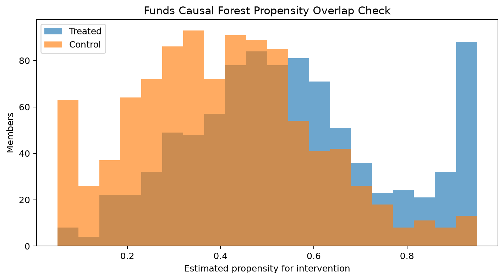
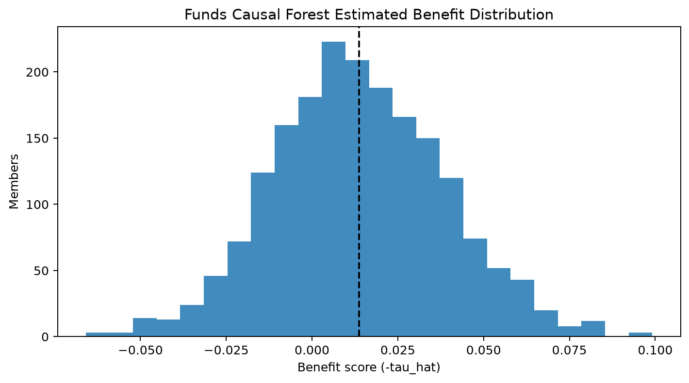
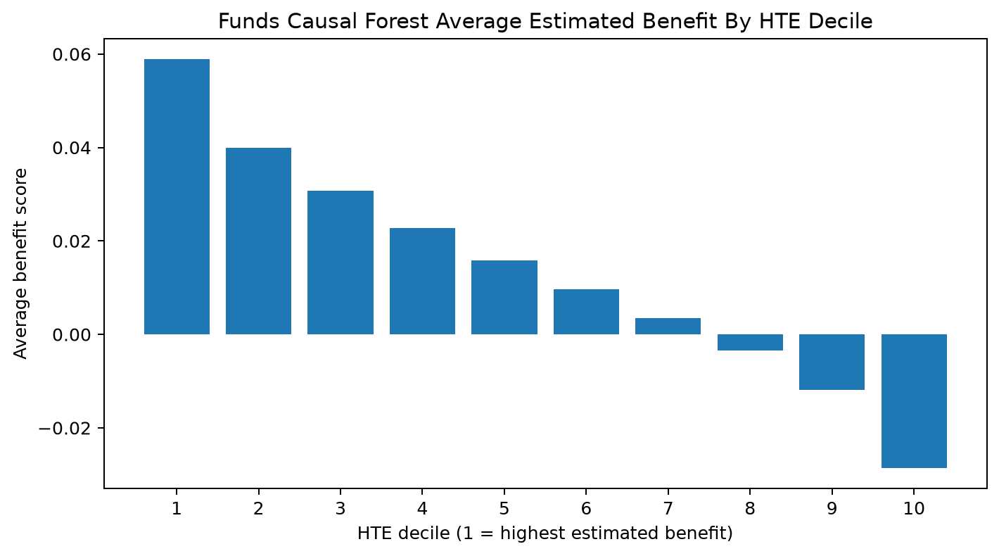
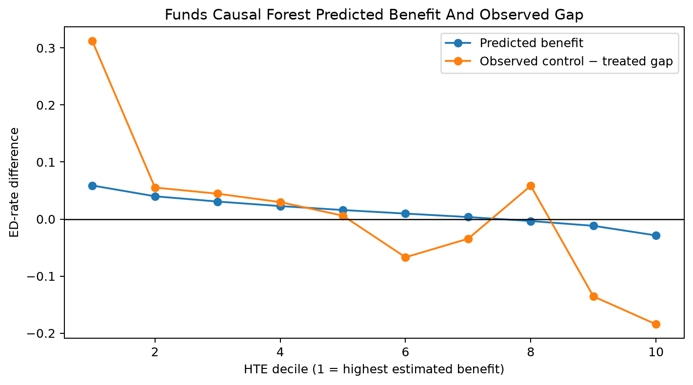
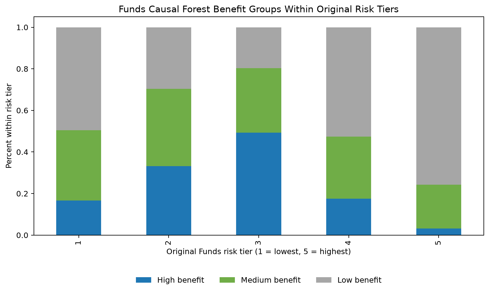
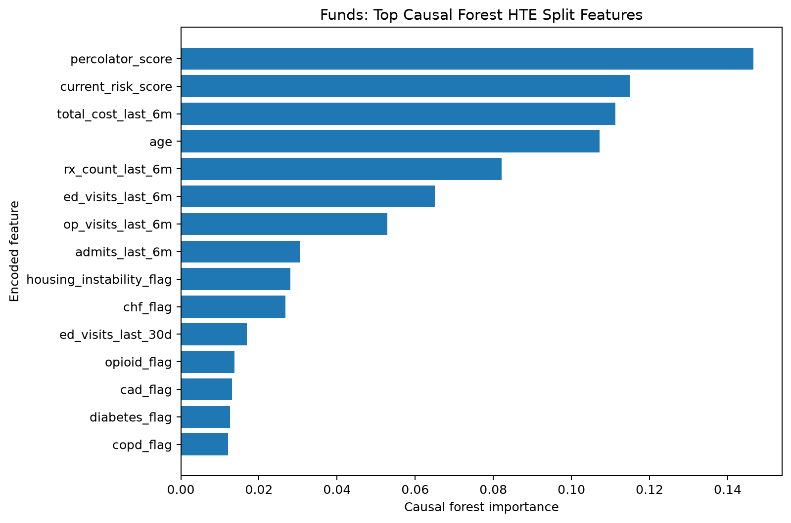
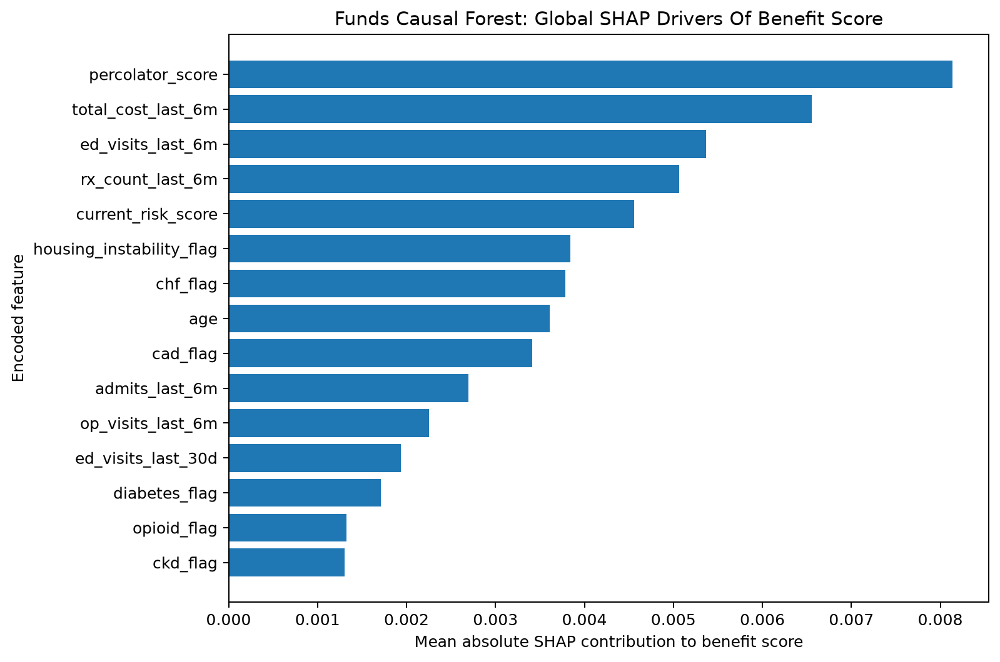
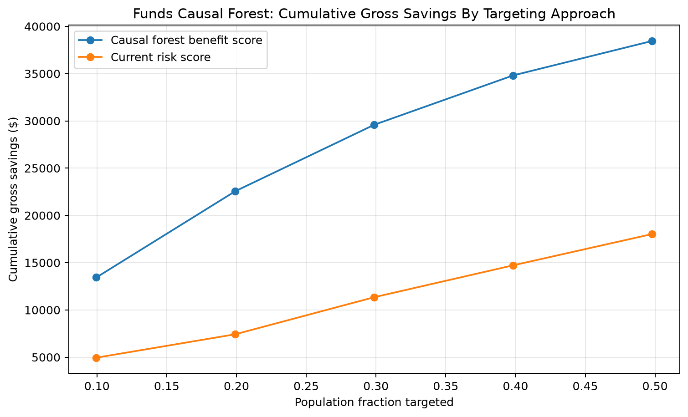
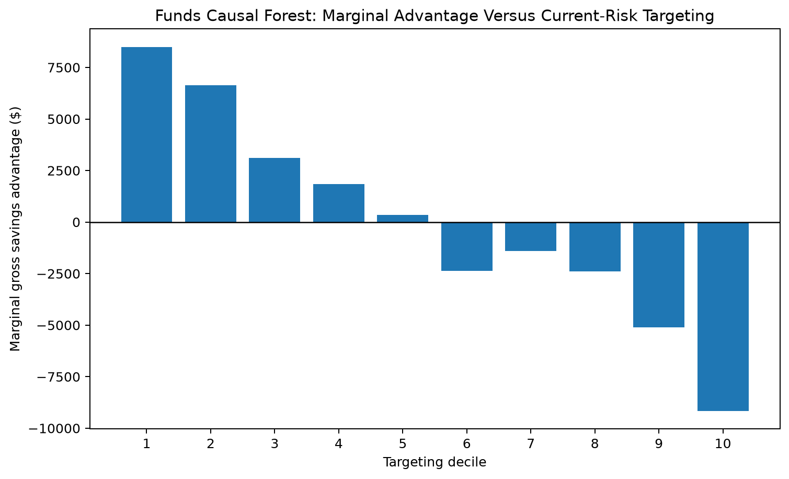

# PRISM Causal Forest Modeling — Funds Combined Report

This report summarizes the completed causal-forest workflow for the Funds Combined population. It follows the analytical order and evaluation structure of `PRISM_Causal_Forest_Modeling_README.md`, while applying the Funds-specific preprocessing established in `Code/Uplift Model Code_Funds_Combined.ipynb`.

The primary notebook is `Code/PRISM_Causal_Forest_Modeling_Funds_Workflow.ipynb`. The output directory is `Outputs/Causal-Forests_Funds/Python`.

## Background

Care-management targeting should distinguish baseline risk from impactability. A high-risk member may remain high risk even after intervention, while a lower-risk member may be more responsive. The causal forest estimates heterogeneous treatment effects (HTE): how the modeled effect of intervention on 90-day ED utilization varies across baseline member characteristics.

Funds Combined is observational and does not contain known individual counterfactual outcomes. The workflow therefore evaluates treatment overlap, uncertainty, stability across model specifications, held-out HTE separation, consistency with existing Funds uplift models, and operational targeting implications. None of these diagnostics alone proves member-level causality.

## Business Question

Which Funds Combined members are most likely to benefit from intervention through a reduction in 90-day emergency-department utilization, and does causal-forest ranking add useful information beyond baseline risk and the existing Funds uplift models?

## Project Objectives

- Reproduce the Funds treatment and outcome derivations exactly.
- Restrict modeling to the same leakage-safe baseline predictor allowlist.
- Estimate member-level heterogeneous treatment effects.
- Quantify overlap, uncertainty, ranking stability, and held-out separation.
- Compare causal-forest rankings with Funds XGBoost and fixed GLMNet T- and X-learners.
- Produce decision-ready decile, risk-tier, explainability, and savings outputs.

## Analytical Task 1: Understanding And Explaining The Causal Forest Framework

### Outcome Variable

`outcome_ed_90d` is converted to a binary ED-event indicator. Missing values are filled with zero before binarization, zero means no ED visit, and any positive count becomes one. This retained 222 rows whose outcome was originally missing.

### Treatment Variable

Treatment is derived jointly from normalized source `intervention_flag` and `OptOut_flag`:

- Treated: source intervention equals 1 and opt-out does not equal 1.
- Control: opt-out equals 1 and source intervention does not equal 1, including missing source intervention values.
- Contradictory: both signals equal 1.
- Unresolved: neither signal establishes treatment.

The current data contained 0 contradictory and 0 unresolved rows. Both raw source flags remain in audits and scored outputs but are excluded from all predictors.

### Predictor Variables

The final model uses 36 baseline predictors and 371 encoded columns. It retains demographics, coverage, clinical and behavioral-health flags, social-need indicators, baseline utilization, cost, medication measures, risk scores, original Funds risk tier, and the derived death indicator.

Post-treatment program and engagement fields, alternate outcomes, raw treatment sources, `member_id`, raw `date_of_death`, and `total_cost_6MO` are excluded. `total_cost_last_6m` remains because it is a distinct baseline measure. The zero-variance fields removed were `plan_type; program`.

Detailed inventory: [`causal_forest_predictor_inventory.csv`](Outputs/Causal-Forests_Funds/Python/causal_forest_predictor_inventory.csv)

### Train/Test Methodology

The workflow uses a 70/30 split with seed 123, stratified jointly by derived treatment and binary outcome. It produces 4,452 training rows and 1,908 test rows. Model selection occurs within an additional 80/20 split of the training data; the final test set is not used to choose hyperparameters.

Source `member_id` is not unique (2,514 duplicate observations). It is preserved as requested, while a unique `analysis_row_id` provides unambiguous row-level scoring and framework alignment.

### What A Causal Forest Estimates

For member covariates `X`, treatment `T`, and binary outcome `Y`, the model estimates:

```text
tau_hat(X) = E[Y | do(T=1), X] - E[Y | do(T=0), X]
benefit_score(X) = -tau_hat(X)
```

Negative `tau_hat` implies lower modeled ED risk under intervention. Positive `benefit_score` therefore represents estimated ED-risk reduction.

### Model Specification

- Estimator: `econml.dml.CausalForestDML`
- Outcome nuisance model: random-forest regression, 300 trees, minimum leaf 10
- Treatment nuisance model: fixed Funds elastic-net logistic specification (`l1_ratio=0.5`, `C=1.0`)
- Cross-fitting: five stratified folds
- Candidate causal forests: 400–800 trees, minimum leaf 5–20, unlimited or depth-8 trees
- Selection: 50% validation separation rank, 30% average rank-stability rank, 20% top-decile stability rank
- Final selected forest: 800 trees, minimum leaf 10, max depth None

Thread count was set to one for execution compatibility in the Windows sandbox; estimator definitions, hyperparameters, folds, and seed were unchanged.

### Propensity Alignment With Funds Uplift Models

The propensity model matches the fixed Funds uplift specification rather than the cross-validated PRP GLMNet propensity. The existing shared propensity file cannot safely be joined by `member_id` because the Funds source intentionally contains duplicates; the causal workflow therefore refits the identical fixed specification on the identical training split.

## Analytical Task 2: Data Review

| Metric | Value |
| :--- | ---: |
| Raw rows | 6,360 |
| Raw columns | 56 |
| Modeling members/rows | 6,360 |
| Duplicate member_id observations retained | 2,514 |
| Treated members | 3,030 |
| Control members | 3,330 |
| Treatment rate | 0.4764 |
| ED outcome events | 1,492 |
| Outcome prevalence | 0.2346 |
| Treated observed ED rate | 0.2314 |
| Control observed ED rate | 0.2375 |
| Missing outcomes filled with zero | 222 |
| Death-flag rows retained | 745 |
| Final predictors before one-hot encoding | 36 |
| Continuous/count numeric predictors | 10 |
| Binary indicator predictors | 21 |
| Multi-level categorical predictors | 5 |
| Model matrix columns after one-hot encoding | 371 |
| Train rows | 4,452 |
| Test rows | 1,908 |

Key review findings:

- All 6,360 resolved rows were retained.
- 1,492 members/rows had at least one ED event (23.5%).
- Treatment prevalence was 47.6%.
- 745 death-flag rows remained in the analysis; raw death dates were not modeled.
- Original Funds risk tiers 1–5 were preserved; missing or invalid values were left unassigned rather than reconstructed from current risk score.
- Executable leakage checks passed against both raw predictor names and encoded matrix columns.

Primary files:

- [`causal_forest_data_review_summary.csv`](Outputs/Causal-Forests_Funds/Python/causal_forest_data_review_summary.csv)
- [`causal_forest_preprocessing_audit_summary.csv`](Outputs/Causal-Forests_Funds/Python/causal_forest_preprocessing_audit_summary.csv)
- [`causal_forest_preprocessing_column_audit.csv`](Outputs/Causal-Forests_Funds/Python/causal_forest_preprocessing_column_audit.csv)

## Evaluation Roadmap

The report separates two questions:

1. **Treatment-effect credibility:** data support, overlap, uncertainty, model stability, held-out separation, and cross-framework consistency.
2. **Explainability and business value:** drivers, subgroup profiles, risk-tier segmentation, and the economics of benefit-based targeting.

# Evaluation Level 1: Treatment-Effect Credibility

## Analytical Task 3: Causal Forest Diagnostics And Estimation Credibility

### Cross-Fitting And Nuisance Models

Five-fold cross-fitting estimates outcome and treatment nuisance functions out of fold before final HTE fitting. This reduces reuse bias relative to fitting nuisance components and treatment effects on the same predictions, but it does not remove all risk of residual confounding in observational data.

### Event Counts

| Split | Group | N | ED events | No ED event | Event rate |
| :--- | :--- | ---: | ---: | ---: | ---: |
| Train | Treated | 2,121 | 491 | 1,630 | 23.1% |
| Train | Control | 2,331 | 554 | 1,777 | 23.8% |
| Test | Treated | 909 | 210 | 699 | 23.1% |
| Test | Control | 999 | 237 | 762 | 23.7% |

Both outcome classes appear within treatment group in both train and test partitions, supporting the requested cross-fitting and held-out diagnostics.

### Propensity And Overlap Checks

The treatment model AUC was 0.762 in training and 0.682 on test data. On the held-out set, 47 members were clipped to 0.05 and 52 were clipped to 0.95. These tails indicate some limited-overlap observations, but most scores remain inside the clipping boundaries.



Detailed file: [`causal_forest_propensity_summary.csv`](Outputs/Causal-Forests_Funds/Python/causal_forest_propensity_summary.csv)

### Uncertainty Assessment

The held-out mean tau standard error was 0.0367. Of 1,908 test rows:

- 51 had a 95% tau interval entirely below zero.
- 1,854 had an interval crossing zero.
- 3 had an interval entirely above zero.

The large crossing-zero count (97.2% of test rows) is the main caution against treating individual scores as certain causal facts. Ranking and subgroup summaries are more defensible uses than deterministic member-level claims.

Detailed file: [`causal_forest_uncertainty_summary.csv`](Outputs/Causal-Forests_Funds/Python/causal_forest_uncertainty_summary.csv)

### Model Selection

| Candidate | Trees | Min leaf | Max depth | Top-bottom gap | Avg Spearman | Top-decile Jaccard | Selection score | Selected |
| ---: | ---: | ---: | ---: | ---: | ---: | ---: | ---: | :---: |
| 2 | 800 | 10 | None | 0.0793 | 0.904 | 0.587 | 1.5 | Yes |
| 1 | 400 | 5 | None | 0.1164 | 0.805 | 0.447 | 2.5 | No |
| 4 | 800 | 10 | 8 | 0.0628 | 0.892 | 0.553 | 2.5 | No |
| 3 | 800 | 20 | None | 0.0584 | 0.851 | 0.473 | 3.5 | No |

Candidate 2 was selected because it provided the best combined stability/separation score. Candidate 1 produced the largest validation top-bottom gap, but its lower cross-candidate rank and top-decile stability made it less attractive for operational targeting.

## Analytical Task 4: Treatment Effect Analysis

### Treatment Effect Distribution

The mean held-out `tau_hat` was -1.38%, corresponding to mean predicted benefit of 1.38%. The median benefit was 1.28%; the 10th–90th percentile range was -1.67% to 4.62%.



Primary files:

- [`causal_forest_ate_summary.csv`](Outputs/Causal-Forests_Funds/Python/causal_forest_ate_summary.csv)
- [`causal_forest_effect_distribution_summary.csv`](Outputs/Causal-Forests_Funds/Python/causal_forest_effect_distribution_summary.csv)

### Synthetic True-Benefit Validation

**Not applicable.** Funds Combined does not include known counterfactual treatment effects. No synthetic formula was copied from the PRP demonstration data and no ground truth was fabricated. The explicit status is recorded in [`causal_forest_true_benefit_validation_summary.csv`](Outputs/Causal-Forests_Funds/Python/causal_forest_true_benefit_validation_summary.csv).

## Analytical Task 5: HTE Decile And High-Value Subgroup Analysis

| HTE decile | N | Avg benefit | Avg tau | Avg SE | Observed ED rate | Treated | Avg propensity | Avg current risk |
| ---: | ---: | ---: | ---: | ---: | ---: | ---: | ---: | ---: |
| 1 | 191 | 5.89% | -5.89% | 3.83% | 25.1% | 47.6% | 0.469 | 7.88 |
| 2 | 191 | 3.99% | -3.99% | 3.71% | 24.1% | 49.2% | 0.460 | 6.35 |
| 3 | 191 | 3.07% | -3.07% | 3.58% | 21.5% | 53.9% | 0.491 | 6.31 |
| 4 | 191 | 2.28% | -2.28% | 3.51% | 24.6% | 45.5% | 0.484 | 6.64 |
| 5 | 190 | 1.58% | -1.58% | 3.71% | 21.6% | 49.5% | 0.464 | 6.13 |
| 6 | 191 | 0.96% | -0.96% | 3.61% | 23.0% | 51.8% | 0.473 | 5.96 |
| 7 | 191 | 0.35% | -0.35% | 3.62% | 21.5% | 37.7% | 0.468 | 6.00 |
| 8 | 191 | -0.34% | 0.34% | 3.73% | 18.8% | 46.6% | 0.503 | 5.35 |
| 9 | 191 | -1.18% | 1.18% | 3.61% | 21.5% | 40.8% | 0.462 | 5.80 |
| 10 | 190 | -2.87% | 2.87% | 3.83% | 32.6% | 53.7% | 0.461 | 6.47 |

The average predicted benefit declines monotonically from 5.89% in decile 1 to -2.87% in decile 10. Deciles 8–10 have negative average predicted benefit, meaning the model does not support broad intervention of those groups under this specification.



### Observed Treatment/Outcome Gap By HTE Decile

| HTE decile | Treated N | Control N | Predicted benefit | Treated ED rate | Control ED rate | Observed gap |
| ---: | ---: | ---: | ---: | ---: | ---: | ---: |
| 1 | 91 | 100 | 5.89% | 8.8% | 40.0% | 31.21% |
| 2 | 94 | 97 | 3.99% | 21.3% | 26.8% | 5.53% |
| 3 | 103 | 88 | 3.07% | 19.4% | 23.9% | 4.45% |
| 4 | 87 | 104 | 2.28% | 23.0% | 26.0% | 2.97% |
| 5 | 94 | 96 | 1.58% | 21.3% | 21.9% | 0.60% |
| 6 | 99 | 92 | 0.96% | 26.3% | 19.6% | -6.70% |
| 7 | 72 | 119 | 0.35% | 23.6% | 20.2% | -3.44% |
| 8 | 89 | 102 | -0.34% | 15.7% | 21.6% | 5.84% |
| 9 | 78 | 113 | -1.18% | 29.5% | 15.9% | -13.56% |
| 10 | 102 | 88 | -2.87% | 41.2% | 22.7% | -18.45% |

The top decile had an observed control-minus-treated ED-rate gap of 31.21% versus average predicted benefit of 5.89%. This strong directional pattern is useful corroboration, but it is an unadjusted factual contrast and must not be interpreted as counterfactual validation.



### Risk Tier Versus Benefit Group

| Original risk tier | Members | High benefit | Medium benefit | Low benefit |
| ---: | ---: | ---: | ---: | ---: |
| 1 | 335 | 16.7% | 33.7% | 49.6% |
| 2 | 651 | 33.2% | 37.2% | 29.6% |
| 3 | 662 | 49.2% | 31.1% | 19.6% |
| 4 | 188 | 17.6% | 29.8% | 52.7% |
| 5 | 62 | 3.2% | 21.0% | 75.8% |

Benefit is not a relabeling of original risk tier. For example, 16.7% of tier-1 observations and 3.2% of tier-5 observations fall in the causal-forest high-benefit tercile. The relationship is non-monotonic and should be interpreted alongside overlap and uncertainty.



### Framework Consistency Check

| Benchmark | Role | N | Pearson | Spearman | Top-decile overlap | Top-20% overlap | Alignment |
| :--- | :--- | ---: | ---: | ---: | ---: | ---: | :--- |
| XGBoost T-Learner | Primary selected Funds uplift benchmark | 1,908 | 0.538 | 0.541 | 38.4% | 49.3% | validated full source row order |
| XGBoost X-Learner | Primary selected Funds uplift benchmark | 1,908 | 0.536 | 0.541 | 40.0% | 50.9% | validated reproduced test row order |
| GLMNet T-Learner | Fixed-specification sensitivity benchmark | 1,908 | 0.127 | 0.177 | 15.8% | 29.9% | validated full source row order |
| GLMNet X-Learner | Fixed-specification sensitivity benchmark | 1,908 | -0.006 | 0.003 | 9.5% | 21.8% | validated reproduced test row order |

The causal forest shows moderate agreement with the stronger XGBoost uplift models: Spearman correlations are 0.541 against the T-learner and 0.541 against the X-learner, with top-decile overlaps of 38.4% and 40.0%. Agreement with the fixed GLMNet variants is weak, matching the Funds uplift report's conclusion that those models have weaker factual outcome performance.

Because `member_id` is duplicated, comparisons were aligned by validated source-row order or reproduced test-row order—not by a false one-to-one member-ID merge.

### True-Benefit Top-Group Overlap

**Not applicable.** No known true-benefit ranking exists for Funds Combined.

## Level 1 Summary: Treatment-Effect Credibility

The causal forest produces clear held-out rank separation and moderate agreement with both XGBoost uplift frameworks. Treatment groups have adequate event counts, and most propensity scores are not at the clipping limits. However, 97.2% of individual treatment-effect intervals cross zero. The model is therefore best positioned as a challenger, ranking, and subgroup-discovery tool—not as proof that a specific member will benefit.

# Evaluation Level 2: Explainability And Business Value

## Analytical Task 6: Variable Importance And Explainability

### Forest Split Importance

| Rank | Encoded feature | Forest importance |
| ---: | :--- | ---: |
| 1 | percolator_score | 0.1466 |
| 2 | current_risk_score | 0.1149 |
| 3 | total_cost_last_6m | 0.1112 |
| 4 | age | 0.1073 |
| 5 | rx_count_last_6m | 0.0821 |
| 6 | ed_visits_last_6m | 0.0650 |
| 7 | op_visits_last_6m | 0.0528 |
| 8 | admits_last_6m | 0.0305 |
| 9 | housing_instability_flag | 0.0281 |
| 10 | chf_flag | 0.0268 |
| 11 | ed_visits_last_30d | 0.0169 |
| 12 | opioid_flag | 0.0138 |
| 13 | cad_flag | 0.0132 |
| 14 | diabetes_flag | 0.0127 |
| 15 | copd_flag | 0.0121 |



Split importance identifies features the forest uses to partition treatment-effect heterogeneity; it does not indicate direction and is not a causal attribution.

### SHAP Benefit-Score Contributions

Permutation SHAP was computed on a deterministic 100-row held-out sample with a 50-row training background. This bounds computation for the 371-column encoded design while leaving all fitting and scoring on the full prescribed samples.

| Rank | Encoded feature | Mean |SHAP| | Mean signed SHAP | % positive | Explained rows |
| ---: | :--- | ---: | ---: | ---: | ---: |
| 1 | percolator_score | 0.00814 | -0.00112 | 49.0% | 100 |
| 2 | total_cost_last_6m | 0.00655 | 0.00036 | 50.0% | 100 |
| 3 | ed_visits_last_6m | 0.00536 | -0.00012 | 58.0% | 100 |
| 4 | rx_count_last_6m | 0.00507 | -0.00026 | 61.0% | 100 |
| 5 | current_risk_score | 0.00456 | 0.00138 | 42.0% | 100 |
| 6 | housing_instability_flag | 0.00384 | 0.00150 | 31.0% | 100 |
| 7 | chf_flag | 0.00378 | -0.00016 | 31.0% | 100 |
| 8 | age | 0.00361 | -0.00048 | 37.0% | 100 |
| 9 | cad_flag | 0.00341 | -0.00024 | 52.0% | 100 |
| 10 | admits_last_6m | 0.00270 | 0.00039 | 66.0% | 100 |
| 11 | op_visits_last_6m | 0.00226 | 0.00031 | 64.0% | 100 |
| 12 | ed_visits_last_30d | 0.00194 | 0.00052 | 29.0% | 100 |
| 13 | diabetes_flag | 0.00171 | 0.00022 | 48.0% | 100 |
| 14 | opioid_flag | 0.00132 | -0.00020 | 58.0% | 100 |
| 15 | ckd_flag | 0.00130 | -0.00015 | 65.0% | 100 |



SHAP describes how features move this model's benefit prediction relative to its background expectation. It explains model behavior, not intervention mechanisms or clinical causation.

### Top-Decile Profile

| Feature | Top-decile mean/rate | Other-decile mean/rate | Difference |
| :--- | ---: | ---: | ---: |
| total_cost_last_6m | 31,177.725 | 25,485.038 | 5,692.687 |
| percolator_score | 729.822 | 706.406 | 23.416 |
| current_risk_score | 7.879 | 6.111 | 1.768 |
| rx_count_last_6m | 34.110 | 35.414 | -1.304 |
| ed_visits_last_6m | 0.408 | 1.003 | -0.595 |
| admits_last_6m | 0.288 | 0.598 | -0.310 |
| housing_instability_flag | 0.346 | 0.213 | 0.133 |
| transportation_barrier_flag | 0.314 | 0.234 | 0.081 |
| ed_visits_last_30d | 0.178 | 0.257 | -0.079 |
| food_insecurity_flag | 0.304 | 0.227 | 0.077 |
| bh_flag | 0.230 | 0.292 | -0.061 |
| death_within_90d_flag | 0.073 | 0.103 | -0.029 |
| financial_strain_flag | 0.298 | 0.277 | 0.021 |
| dual_elg | 0.984 | 0.970 | 0.015 |
| op_visits_last_6m | 6.880 | 6.874 | 0.005 |

The top decile has materially higher average baseline cost, percolator score, current risk score, and housing-instability prevalence than other deciles, but lower average prior six-month ED visits and admissions. That mixed pattern illustrates why impactability is not reducible to simple high-risk targeting.

### Known Synthetic Driver Alignment

**Not applicable.** Funds Combined has no synthetic data-generating mechanism or known true treatment-effect drivers.

## Analytical Task 7: Business Value Assessment

The business-value scenario uses the same assumptions as the Funds uplift work: $1,200 per avoided ED visit and $250 intervention cost per targeted member. Values are model-based scenario estimates, not booked savings.

### Causal Forest Benefit Targeting

| HTE decile | N | Avg benefit | Expected ED visits avoided | Gross savings | Intervention cost | Net savings | ROI |
| ---: | ---: | ---: | ---: | ---: | ---: | ---: | ---: |
| 1 | 191 | 5.89% | 11.24 | $13,493 | $47,750 | -$34,257 | -71.7% |
| 2 | 191 | 3.99% | 7.63 | $9,156 | $47,750 | -$38,594 | -80.8% |
| 3 | 191 | 3.07% | 5.86 | $7,036 | $47,750 | -$40,714 | -85.3% |
| 4 | 191 | 2.28% | 4.35 | $5,220 | $47,750 | -$42,530 | -89.1% |
| 5 | 190 | 1.58% | 3.01 | $3,613 | $47,500 | -$43,887 | -92.4% |
| 6 | 191 | 0.96% | 1.84 | $2,204 | $47,750 | -$45,546 | -95.4% |
| 7 | 191 | 0.35% | 0.67 | $808 | $47,750 | -$46,942 | -98.3% |
| 8 | 191 | -0.34% | -0.66 | -$789 | $47,750 | -$48,539 | -101.7% |
| 9 | 191 | -1.18% | -2.26 | -$2,709 | $47,750 | -$50,459 | -105.7% |
| 10 | 190 | -2.87% | -5.45 | -$6,537 | $47,500 | -$54,037 | -113.8% |

At current assumptions, every HTE decile has negative net savings because even the top-decile gross savings of $13,493 are below its $47,750 intervention cost. The top-decile ROI is -71.7%. This does not mean ranking is useless; it means the current cost/benefit assumptions do not support a positive financial return at full per-member intervention cost.

### Comparison With Current-Risk Targeting

| Targeting approach | Members | Population | Expected ED visits avoided | Gross savings |
| :--- | ---: | ---: | ---: | ---: |
| Causal forest benefit score | 950 | 49.8% | 32.05 | $38,456 |
| Current risk score | 950 | 49.8% | 15.02 | $18,028 |

At approximately 50% of the test population, causal-forest targeting yields $38,456 in modeled gross savings versus $18,028 for current-risk targeting, a modeled advantage of $20,428 before intervention costs.



The marginal advantage is positive through the fifth targeting decile and turns negative thereafter, consistent with limiting outreach to higher-benefit groups rather than expanding indiscriminately.



## Level 2 Summary: Explainability And Business Value

The model's main benefit drivers are baseline severity, cost, utilization, medication, and selected social/clinical factors. Causal-forest targeting ranks modeled benefit more efficiently than current-risk targeting in the upper half of the population, but the assumed $250 intervention cost exceeds modeled gross savings even in the top decile. Operational use should therefore focus on lower-cost interventions, narrower targeting, or prospective validation of larger realized effects.

## Client Perspective And Recommendation

Use the Funds causal forest as a **challenger and subgroup-discovery model**. It provides useful rank separation and moderate consistency with the stronger XGBoost uplift workflows, but individual uncertainty remains high and observational data cannot establish unmeasured-confounding robustness.

Recommended next steps:

1. Validate top-decile and top-tercile performance prospectively or in a randomized rollout.
2. Investigate limited-overlap cases and consider overlap trimming or weighting as a sensitivity analysis.
3. Calibrate intervention-cost scenarios and identify lower-cost outreach modalities.
4. Monitor subgroup stability, fairness, and drift before using scores in production.
5. Keep original risk tier and predicted benefit as separate operational dimensions.

## Reproducibility And Output Index

- Notebook: [`Code/PRISM_Causal_Forest_Modeling_Funds_Workflow.ipynb`](Code/PRISM_Causal_Forest_Modeling_Funds_Workflow.ipynb)
- Input: `DataSets/Funds_combined.csv`
- Output root: [`Outputs/Causal-Forests_Funds/Python`](Outputs/Causal-Forests_Funds/Python)
- Seed: `123`
- Executed environment: Python 3.13, econml 0.16.0
- Expected artifacts: 40
- Successfully generated artifacts: 40
- Missing artifacts: 0
- Leakage assertions: passed
- Synthetic true-benefit artifacts: explicit `not_applicable` status only; no fabricated ground truth

Complete machine-readable index: [`causal_forest_output_index.csv`](Outputs/Causal-Forests_Funds/Python/causal_forest_output_index.csv)

## Interpretation Guardrails

- `benefit_score` is an estimate, not an observed individual counterfactual.
- Unadjusted treated/control gaps are descriptive corroboration, not causal validation.
- SHAP and split importance explain the fitted model, not biological or program mechanisms.
- Financial values are assumption-based scenarios and exclude broader care costs and benefits.
- Duplicate `member_id` observations are retained by design; use `analysis_row_id` for row-level reconciliation.
