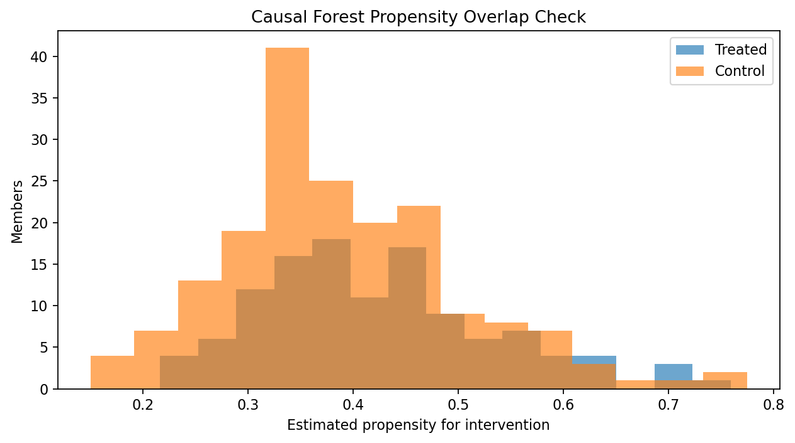
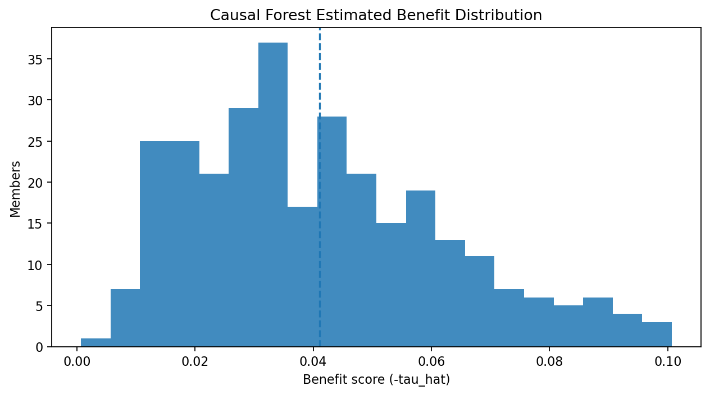
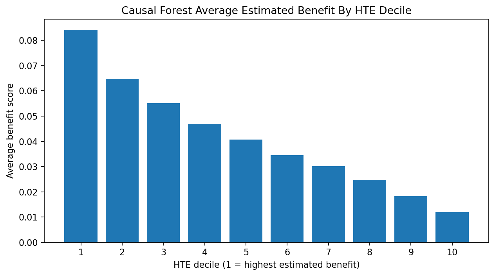
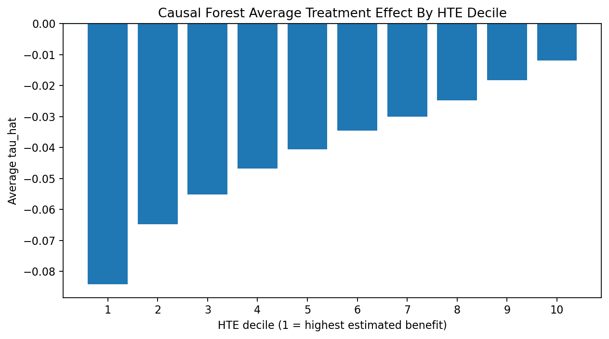
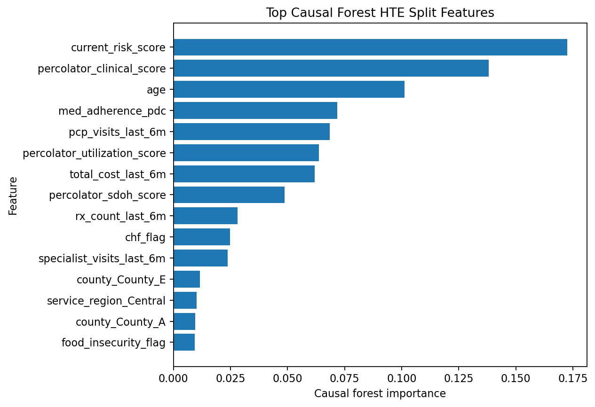

# PRISM Causal Forest Modeling README

This README summarizes the causal forest modeling workflow and results for the PRISM intervention benefit project. It is a companion to `PRISM_Intervention_Benefit_Modeling_README.md`, which documents the T-learner and X-learner uplift modeling workflow.

The project background, business question, outcome variable, treatment variable, predictor set, train/test logic, and random seed remain aligned with the uplift modeling workflow. This document focuses specifically on the causal forest model, how it estimates heterogeneous treatment effects, and how its member rankings compare with the selected uplift models.

The primary notebook is `Code/PRISM_Causal_Forest_Modeling_Workflow.ipynb`. The main output directory is `Outputs/Causal-Forests/Python`.

## Background

Care management programs must decide which members should receive intervention when outreach resources are limited. A common approach is to prioritize the highest-risk members, but high baseline risk does not always mean high intervention benefit. Some members may remain high risk even with intervention, while others may have risk that is meaningfully reduced by targeted care management.

This project evaluates whether treatment-effect modeling can estimate which members are most likely to benefit from care management intervention. The causal forest analysis extends the existing uplift work by estimating heterogeneous treatment effects directly. In this context, heterogeneous treatment effect means the intervention may not have the same expected effect for every member.

The analysis uses the PRISM synthetic dataset. Although the dataset is synthetic, it is structured to resemble variables and business use cases from a Medicaid care management population. Results should be interpreted as a reproducible modeling demonstration, not as production-ready evidence for live deployment.

## Business Question

The primary business question is:

> Which members are most likely to benefit from intervention in terms of reducing 90-day emergency department utilization, based on causal forest estimates of heterogeneous treatment effects?

The analysis also asks whether the causal forest identifies similar high-benefit members as the selected GLMNet T-learner and X-learner uplift models, whether causal forest provides useful subgroup discovery, and whether the estimated treatment effects are credible enough to support stakeholder discussion.

## Project Objectives

The causal forest workflow evaluates whether a direct heterogeneous treatment-effect model can support care management prioritization. The workflow estimates member-level treatment effects, ranks members by estimated intervention benefit, assigns high-benefit HTE deciles, evaluates overlap and uncertainty, compares causal forest rankings with uplift model rankings, provides partial explainability through variable importance, and documents a reproducible process that could later be validated on live client data.

## Analytical Task 1: Understanding And Explaining The Causal Forest Framework

### Outcome Variable

The outcome variable is `outcome_ed_90d`. It is a binary indicator for whether a member had emergency department utilization within 90 days. A value of 1 means the member had a 90-day ED outcome, and a value of 0 means the member did not.

### Treatment Variable

The treatment variable is `intervention_flag`. It indicates whether the member received the care management intervention. A value of 1 indicates intervention, and a value of 0 indicates no intervention/control.

### Predictor Variables

The causal forest notebook uses the same broad predictor categories as the uplift modeling workflow: demographics, clinical conditions, social determinants of health, utilization, pharmacy, and risk scores.

Example demographic predictors include `client_contract`, `service_region`, `program`, `case_manager_name`, `age`, `gender`, `dual_eligible`, `county`, `plan_type`, `language`, and `living_alone_flag`. Example clinical predictors include `diabetes_flag`, `chf_flag`, `copd_flag`, `asthma_flag`, `depression_flag`, `anxiety_flag`, `substance_use_flag`, `ckd_flag`, and `behavioral_health_risk_flag`. Example SDOH predictors include `food_insecurity_flag`, `housing_instability_flag`, `transportation_barrier_flag`, and `utilities_insecurity_flag`.

The notebook adds a stable `member_id` before splitting so member-level outputs can be compared across causal forest, T-learner, and X-learner files. `member_id` is used only for matching and output validation; it is excluded from the model predictors.

Supporting file:

- [`causal_forest_predictor_inventory.csv`](Outputs/Causal-Forests/Python/causal_forest_predictor_inventory.csv)

### Train/Test Methodology

The causal forest notebook uses the same train/test strategy as the uplift workflow:

```text
train_fraction = 0.70
seed = 123
stratify on intervention_flag and outcome_ed_90d
```

The stratified split matters because the ED outcome is rare and because treatment-effect estimation depends on having treated and untreated members represented in both training and test data.

### What A Causal Forest Estimates

A causal forest estimates a treatment effect for each member:

```text
tau_hat = estimated effect of intervention on outcome_ed_90d
```

Because `outcome_ed_90d` is an undesirable outcome, the sign convention is:

```text
tau_hat < 0 means intervention is estimated to reduce ED risk
tau_hat > 0 means intervention is estimated to increase ED risk
```

For business interpretation, the notebook converts this to a benefit score:

```text
benefit_score = -tau_hat
```

A higher `benefit_score` means the causal forest estimates a larger reduction in ED risk under intervention.

### How Causal Forest Differs From T-Learner And X-Learner

The T-learner trains separate treated and control outcome models, then subtracts counterfactual predictions. The X-learner imputes treatment-effect labels and trains second-stage treatment-effect models. Causal forest instead uses a forest-based heterogeneous treatment-effect model to estimate where treatment effects vary across members.

In plain language, causal forest does not simply compare all treated members against all untreated members. It builds local neighborhoods of members with similar baseline characteristics, compares treated versus untreated outcomes within those neighborhoods, and adjusts for treatment assignment patterns. This allows it to estimate which kinds of members appear more or less impactable.

### Propensity Alignment With Uplift Models

To strengthen comparability, the uplift notebook now writes a shared member-level propensity file:

- [`shared_propensity_scores.csv`](Outputs/Uplift/Python/X-Learner/shared_propensity_scores.csv)

The causal forest notebook reads this file and merges propensity scores by `member_id` using one-to-one validation. This ensures the same member receives the same propensity score across the X-learner and causal forest outputs when the uplift outputs have been regenerated.

The shared propensity model uses the same GLMNet-style specification as the X-learner workflow:

```text
StandardScaler()
LogisticRegressionCV()
elastic-net penalty
l1_ratios = [0.5]
ROC-AUC cross-validation
seed = 123
clipping to [0.05, 0.95]
```

## Analytical Task 2: Data Review

This section reviews the modeling population, treatment rate, outcome prevalence, and final model matrix size. These checks mirror the data review section in the uplift README.

<!-- AUTO_TABLE:causal_forest_data_review_summary START -->
| Metric | Value |
|---|---:|
| Total members | 1,000 |
| Treated members | 394 |
| Untreated/control members | 606 |
| Treatment rate | 39.4% |
| ED outcome events | 60 |
| Outcome prevalence | 6.0% |
| Treated observed ED rate | 4.1% |
| Control observed ED rate | 7.3% |
| Final predictors before one-hot encoding | 41 |
| Continuous/count numeric predictors | 14 |
| Binary indicator predictors | 18 |
| Multi-level categorical predictors | 9 |
<!-- AUTO_TABLE:causal_forest_data_review_summary END -->

Supporting file:

- [`causal_forest_data_review_summary.csv`](Outputs/Causal-Forests/Python/causal_forest_data_review_summary.csv)

## Analytical Task 3: Causal Forest Diagnostics And Estimation Credibility

In the uplift README, Analytical Task 3 evaluates factual outcome-model performance because the T-learner and X-learner depend on treated and control outcome models. Causal forest does not have the same report focus. Instead, this section evaluates whether treatment-effect estimation is credible enough to interpret.

The main diagnostics are event counts, propensity overlap, treatment-effect distribution, and uncertainty.

### Event Counts And Modeling Constraints

The first diagnostic is whether the train/test split has enough treated/control and event/non-event representation to support treatment-effect estimation.

<!-- AUTO_TABLE:causal_forest_event_count_summary START -->
| Split | Group | N | Positive ED events | Negative ED events | Event rate |
|---|---:|---:|---:|---:|---:|
| Train | Treated | 276 | 11 | 265 | 4.0% |
| Train | Control | 424 | 31 | 393 | 7.3% |
| Test | Treated | 118 | 5 | 113 | 4.2% |
| Test | Control | 182 | 13 | 169 | 7.1% |
<!-- AUTO_TABLE:causal_forest_event_count_summary END -->

Supporting file:

- [`causal_forest_event_count_summary.csv`](Outputs/Causal-Forests/Python/causal_forest_event_count_summary.csv)

### Propensity And Overlap Checks

The causal forest workflow uses the shared propensity scores from the uplift workflow when available. This allows the same member-level treatment-assignment estimate to be used across the X-learner and causal forest analysis.

Overlap matters because treatment-effect estimates are less reliable when similar members are not represented in both treatment groups. If certain types of members are almost always treated or almost never treated, then the model has limited evidence for estimating what would have happened under the opposite treatment condition.

<!-- AUTO_TABLE:causal_forest_propensity_summary START -->
| Metric | Value |
|---|---:|
| Propensity source | shared_propensity_scores_member_id_merge |
| Train treatment model AUC | 0.700 |
| Test treatment model AUC | 0.593 |
| Mean propensity | 0.403 |
| Min propensity | 0.150 |
| 5th percentile | 0.239 |
| Median propensity | 0.384 |
| 95th percentile | 0.605 |
| Max propensity | 0.774 |
| Members below 0.05 | 0 |
| Members above 0.95 | 0 |
<!-- AUTO_TABLE:causal_forest_propensity_summary END -->

<!-- AUTO_CHART:causal_forest_propensity_overlap START -->

<!-- AUTO_CHART:causal_forest_propensity_overlap END -->

Supporting file:

- [`causal_forest_propensity_summary.csv`](Outputs/Causal-Forests/Python/causal_forest_propensity_summary.csv)

### Treatment Effect Distribution

The treatment-effect distribution summarizes the range of estimated `tau_hat` and `benefit_score` values. This helps show whether the causal forest estimates meaningful heterogeneity or whether treatment effects are tightly clustered around a single average value.

<!-- AUTO_TABLE:causal_forest_ate_summary START -->
| Metric | Value |
|---|---:|
| Average `tau_hat` | -0.041 |
| Average `benefit_score` | 0.041 |
| Test members | 300 |
<!-- AUTO_TABLE:causal_forest_ate_summary END -->

<!-- AUTO_TABLE:causal_forest_effect_distribution_summary START -->
| Metric | `tau_hat` | `benefit_score` |
|---|---:|---:|
| Minimum | -0.101 | 0.001 |
| 10th percentile | -0.071 | 0.015 |
| 25th percentile | -0.056 | 0.025 |
| Median | -0.036 | 0.036 |
| Mean | -0.041 | 0.041 |
| 75th percentile | -0.025 | 0.056 |
| 90th percentile | -0.015 | 0.071 |
| Maximum | -0.001 | 0.101 |
| Standard deviation | 0.021 | 0.021 |
<!-- AUTO_TABLE:causal_forest_effect_distribution_summary END -->

<!-- AUTO_CHART:causal_forest_effect_distribution START -->

<!-- AUTO_CHART:causal_forest_effect_distribution END -->

Supporting files:

- [`causal_forest_ate_summary.csv`](Outputs/Causal-Forests/Python/causal_forest_ate_summary.csv)
- [`causal_forest_effect_distribution_summary.csv`](Outputs/Causal-Forests/Python/causal_forest_effect_distribution_summary.csv)

### Uncertainty Checks

When standard errors are available, the notebook summarizes uncertainty around member-level treatment-effect estimates. This is important because treatment-effect estimates can be noisy, especially with rare outcomes and small decile-level samples.

<!-- AUTO_TABLE:causal_forest_uncertainty_summary START -->
| Metric | Value |
|---|---:|
| Mean tau standard error | 0.026 |
| Median tau standard error | 0.024 |
| Members with tau CI entirely below zero | 87 |
| Members with tau CI crossing zero | 213 |
| Members with tau CI entirely above zero | 0 |
| Top HTE decile mean tau standard error | 0.038 |
<!-- AUTO_TABLE:causal_forest_uncertainty_summary END -->

Supporting file:

- [`causal_forest_uncertainty_summary.csv`](Outputs/Causal-Forests/Python/causal_forest_uncertainty_summary.csv)

## Analytical Task 4: Treatment Effect Analysis

Each test-set member receives:

```text
tau_hat
tau_se
benefit_score
hte_decile
```

The member-level examples below are intended to illustrate how causal forest separates high expected intervention benefit from baseline risk. The same conceptual interpretation used in the uplift README applies here: high risk does not necessarily mean high impactability.

<!-- AUTO_TABLE:causal_forest_top_benefit_examples START -->
| Member profile | Member ID | Actual outcome | Treatment flag | Current risk score | `tau_hat` | `tau_se` | Benefit score | HTE decile | Interpretation |
|---|---:|---:|---:|---:|---:|---:|---:|---:|---|
| Highest benefit | 620 | 0 | 0 | 60.5 | -0.101 | 0.044 | 0.101 | 1 | Strong outreach candidate based on estimated ED risk reduction. |
| Lowest benefit | 71 | 0 | 0 | 46.4 | -0.001 | 0.012 | 0.001 | 10 | Lowest priority by causal forest benefit score. |
| Low risk, high benefit | 238 | 0 | 1 | 41.0 | -0.077 | 0.029 | 0.077 | 1 | May be missed by risk-only targeting but appears impactable. |
<!-- AUTO_TABLE:causal_forest_top_benefit_examples END -->

Supporting files:

- [`causal_forest_scored_test_output.csv`](Outputs/Causal-Forests/Python/causal_forest_scored_test_output.csv)
- [`causal_forest_top_benefit_examples.csv`](Outputs/Causal-Forests/Python/causal_forest_top_benefit_examples.csv)

## Analytical Task 5: HTE Decile And High-Value Subgroup Analysis

Members are ranked by `benefit_score` and assigned to HTE deciles. Decile 1 is the highest estimated benefit group. This section is the causal forest equivalent of the uplift decile analysis in the main uplift README.

<!-- AUTO_TABLE:causal_forest_decile_summary START -->
| HTE decile | N | Avg `tau_hat` | Avg benefit score | Avg tau SE | Observed ED rate | Treatment pct | Avg propensity | Avg current risk |
|---:|---:|---:|---:|---:|---:|---:|---:|---:|
| 1 | 30 | -0.084 | 0.084 | 0.038 | 20.0% | 40.0% | 0.511 | 58.5 |
| 2 | 30 | -0.065 | 0.065 | 0.033 | 3.3% | 40.0% | 0.448 | 50.2 |
| 3 | 30 | -0.055 | 0.055 | 0.029 | 6.7% | 23.3% | 0.393 | 44.3 |
| 4 | 30 | -0.047 | 0.047 | 0.026 | 3.3% | 46.7% | 0.408 | 42.4 |
| 5 | 30 | -0.041 | 0.041 | 0.024 | 10.0% | 40.0% | 0.348 | 41.9 |
| 6 | 30 | -0.034 | 0.034 | 0.024 | 3.3% | 46.7% | 0.384 | 39.5 |
| 7 | 30 | -0.030 | 0.030 | 0.024 | 3.3% | 40.0% | 0.392 | 40.9 |
| 8 | 30 | -0.025 | 0.025 | 0.023 | 3.3% | 33.3% | 0.381 | 42.0 |
| 9 | 30 | -0.018 | 0.018 | 0.019 | 3.3% | 40.0% | 0.375 | 37.4 |
| 10 | 30 | -0.012 | 0.012 | 0.017 | 3.3% | 43.3% | 0.384 | 41.0 |
<!-- AUTO_TABLE:causal_forest_decile_summary END -->

The decile pattern shows a clear estimated benefit gradient. The average benefit score is 8.4 percentage points in HTE decile 1 compared with 1.2 percentage points in HTE decile 10.

<!-- AUTO_CHART:causal_forest_avg_benefit_by_decile START -->

<!-- AUTO_CHART:causal_forest_avg_benefit_by_decile END -->

<!-- AUTO_CHART:causal_forest_tau_by_decile START -->

<!-- AUTO_CHART:causal_forest_tau_by_decile END -->

Supporting file:

- [`causal_forest_decile_summary.csv`](Outputs/Causal-Forests/Python/causal_forest_decile_summary.csv)

### Framework Consistency Check

The main benchmark is the selected GLMNet uplift workflow, because the uplift README identified GLMNet as the stronger factual outcome-model family. XGBoost T-learner and XGBoost X-learner outputs are included as secondary sensitivity checks because they are flexible tree-based uplift alternatives, but they are not the primary benchmark carried forward in the uplift report.

The causal forest notebook compares against:

| Comparison | Benchmark role |
|---|---|
| Causal forest vs GLMNet T-learner | Primary selected uplift benchmark |
| Causal forest vs GLMNet X-learner | Primary selected uplift benchmark |
| Causal forest vs XGBoost T-learner | Secondary tree-based sensitivity check |
| Causal forest vs XGBoost X-learner | Secondary tree-based sensitivity check |
| Causal forest vs current risk score | Operational baseline context |

All model-to-model comparisons use `member_id` merges when the uplift outputs have been rerun with the member-id update.

<!-- AUTO_TABLE:causal_forest_vs_uplift_consistency_summary START -->
| Comparison | Role | N compared | Pearson corr | Spearman corr | Top decile overlap | Top 20% overlap |
|---|---|---:|---:|---:|---:|---:|
| Causal forest vs GLMNet T-learner | Primary selected uplift benchmark | 1,000 | 0.039 | 0.123 | 25.0% | 40.0% |
| Causal forest vs GLMNet X-learner | Primary selected uplift benchmark | 300 | 0.574 | 0.534 | 53.3% | 63.3% |
| Causal forest vs XGBoost T-learner | Secondary tree-based sensitivity check | 1,000 | 0.801 | 0.731 | 71.0% | 78.5% |
| Causal forest vs XGBoost X-learner | Secondary tree-based sensitivity check | 300 | 0.465 | 0.485 | 40.0% | 58.3% |
| Causal forest vs current risk score | Operational baseline context | 300 | 0.539 | 0.437 | 56.7% | 65.0% |
<!-- AUTO_TABLE:causal_forest_vs_uplift_consistency_summary END -->

The causal forest rankings are most aligned with the XGBoost T-learner and moderately aligned with the GLMNet X-learner. The weaker alignment with the GLMNet T-learner suggests that causal forest is not simply reproducing the primary uplift report's GLMNet T-learner ranking. This should be presented as a model-comparison finding rather than as a failure.

Supporting file:

- [`causal_forest_vs_uplift_consistency_summary.csv`](Outputs/Causal-Forests/Python/causal_forest_vs_uplift_consistency_summary.csv)

## Analytical Task 6: Variable Importance And Explainability

Causal forest variable importance is a partial explainability layer. It identifies features used by the model to split members into groups with different estimated treatment effects. It should not be interpreted as a definitive causal explanation of why the intervention works.

<!-- AUTO_TABLE:causal_forest_variable_importance START -->
| Rank | Feature | Importance |
|---:|---|---:|
| 1 | current_risk_score | 0.173 |
| 2 | percolator_clinical_score | 0.138 |
| 3 | age | 0.101 |
| 4 | med_adherence_pdc | 0.072 |
| 5 | pcp_visits_last_6m | 0.068 |
| 6 | percolator_utilization_score | 0.064 |
| 7 | total_cost_last_6m | 0.062 |
| 8 | percolator_sdoh_score | 0.049 |
| 9 | rx_count_last_6m | 0.028 |
| 10 | chf_flag | 0.025 |
<!-- AUTO_TABLE:causal_forest_variable_importance END -->

<!-- AUTO_CHART:causal_forest_variable_importance START -->

<!-- AUTO_CHART:causal_forest_variable_importance END -->

The top-decile profile compares members in HTE decile 1 against members in the other deciles. This helps translate variable importance into an operational subgroup description.

<!-- AUTO_TABLE:causal_forest_top_decile_profile START -->
| Feature | Top HTE decile | Other deciles | Difference |
|---|---:|---:|---:|
| total_cost_last_6m | 5,973.5 | 4,036.7 | 1,936.8 |
| percolator_clinical_score | 68.6 | 43.8 | 24.8 |
| current_risk_score | 58.5 | 42.2 | 16.4 |
| percolator_utilization_score | 56.1 | 44.4 | 11.7 |
| percolator_sdoh_score | 38.4 | 35.0 | 3.3 |
| ed_visits_last_6m | 1.6 | 0.8 | 0.7 |
| admits_last_6m | 0.7 | 0.3 | 0.4 |
| utilities_insecurity_flag | 26.7% | 17.0% | 9.6 pp |
| transportation_barrier_flag | 33.3% | 25.2% | 8.1 pp |
| food_insecurity_flag | 26.7% | 20.7% | 5.9 pp |
<!-- AUTO_TABLE:causal_forest_top_decile_profile END -->

The highest-benefit decile appears more clinically complex, more costly, and somewhat more socially vulnerable than the rest of the test sample.

Supporting files:

- [`causal_forest_variable_importance.csv`](Outputs/Causal-Forests/Python/causal_forest_variable_importance.csv)
- [`causal_forest_top_decile_profile.csv`](Outputs/Causal-Forests/Python/causal_forest_top_decile_profile.csv)

## Analytical Task 7: Business Value Assessment

The causal forest business value assessment is narrower than the ROI section in the uplift README. The current causal forest workflow does not simulate multiple alternative targeting policies or full ROI assumptions. Instead, it estimates potential targeting value by summarizing average benefit and cumulative expected ED reductions across HTE deciles.

<!-- AUTO_TABLE:causal_forest_targeting_summary START -->
| HTE decile | N | Avg benefit score | Observed ED rate | Treatment pct | Avg current risk | Cumulative members | Cumulative expected ED reductions |
|---:|---:|---:|---:|---:|---:|---:|---:|
| 1 | 30 | 0.084 | 20.0% | 40.0% | 58.5 | 30 | 2.53 |
| 2 | 30 | 0.065 | 3.3% | 40.0% | 50.2 | 60 | 4.47 |
| 3 | 30 | 0.055 | 6.7% | 23.3% | 44.3 | 90 | 6.12 |
| 4 | 30 | 0.047 | 3.3% | 46.7% | 42.4 | 120 | 7.53 |
| 5 | 30 | 0.041 | 10.0% | 40.0% | 41.9 | 150 | 8.74 |
| 6 | 30 | 0.034 | 3.3% | 46.7% | 39.5 | 180 | 9.78 |
| 7 | 30 | 0.030 | 3.3% | 40.0% | 40.9 | 210 | 10.68 |
| 8 | 30 | 0.025 | 3.3% | 33.3% | 42.0 | 240 | 11.42 |
| 9 | 30 | 0.018 | 3.3% | 40.0% | 37.4 | 270 | 11.97 |
| 10 | 30 | 0.012 | 3.3% | 43.3% | 41.0 | 300 | 12.32 |
<!-- AUTO_TABLE:causal_forest_targeting_summary END -->

Targeting only the top HTE decile would mean outreaching to 30 members with an expected 2.53 avoided ED events. Expanding to the top three HTE deciles would mean outreaching to 90 members with an expected 6.12 avoided ED events.

Supporting file:

- [`causal_forest_targeting_summary.csv`](Outputs/Causal-Forests/Python/causal_forest_targeting_summary.csv)

## Analytical Task 8: Client Perspective

From a Medicaid health plan executive perspective, the causal forest model should be presented as a challenger and subgroup-discovery framework rather than a production-ready replacement for the selected uplift model. Its main value is that it estimates heterogeneous treatment effects directly and can identify high-benefit member subgroups for care management review.

The most important operational question is not whether causal forest exactly matches the GLMNet T-learner or X-learner. It is whether causal forest provides a stable, explainable, and clinically plausible ranking that can improve outreach prioritization beyond baseline risk alone. In this run, causal forest produced a clear HTE decile gradient, identified a clinically plausible top-decile profile, and showed moderate-to-strong alignment with several uplift benchmarks.

Several limitations are central to interpretation. The dataset is synthetic. Treatment assignment may be confounded. ED outcomes are rare. Treatment-effect estimates can be noisy. Overlap may be limited for some subgroups. Variable importance is not a causal explanation. Live-data validation, prospective monitoring, and recalibration would be required before operational deployment.

## Recommendation

The causal forest model should initially be positioned as a challenger and subgroup-discovery model. The selected GLMNet T-learner and X-learner results remain the primary uplift benchmarks because GLMNet was selected in the uplift README based on stronger factual outcome-model performance. Causal forest should be compared primarily against those GLMNet uplift results, while XGBoost T-learner and XGBoost X-learner outputs should be treated as secondary tree-based sensitivity checks.

The current causal forest results are promising because the HTE deciles show a clear estimated-benefit gradient and the top-decile profile is clinically plausible. However, the uncertainty results show that many member-level confidence intervals cross zero. The best next step is to present causal forest as a complementary prioritization and validation framework rather than as the sole model for outreach decisions.

## Presentation Summary

A presentation based on these results can be organized around the business problem, why high risk is not always high benefit, how causal forest estimates HTE, data review, causal forest diagnostics, treatment-effect distribution, HTE decile findings, framework consistency against GLMNet and XGBoost uplift models, explainability, business value, limitations, and final recommendation.

The strongest slide story is:

1. The uplift workflow selected GLMNet as the primary benchmark.
2. Causal forest is a challenger framework for direct HTE estimation.
3. Shared `member_id` and shared propensity scores strengthen cross-model comparability.
4. Causal forest estimates an average ED-risk reduction of about 4.1 percentage points in the test set.
5. HTE decile 1 has an average benefit score of 8.4 percentage points, compared with 1.2 percentage points in decile 10.
6. Framework consistency checks show where causal forest agrees with GLMNet T/X learners, XGBoost sensitivity models, and current risk.

## Reproducibility

The analysis can be reproduced by opening `Code/PRISM_Causal_Forest_Modeling_Workflow.ipynb`, selecting an environment with `econml` installed, restarting the kernel, and running all cells in order.

Before running the causal forest notebook, rerun `Code/Uplift Model Code_rh06032026.ipynb` so the shared member-level propensity file is available:

```text
Outputs/Uplift/Python/X-Learner/shared_propensity_scores.csv
```

Key causal forest output files:

- [`causal_forest_data_review_summary.csv`](Outputs/Causal-Forests/Python/causal_forest_data_review_summary.csv)
- [`causal_forest_event_count_summary.csv`](Outputs/Causal-Forests/Python/causal_forest_event_count_summary.csv)
- [`causal_forest_propensity_summary.csv`](Outputs/Causal-Forests/Python/causal_forest_propensity_summary.csv)
- [`causal_forest_ate_summary.csv`](Outputs/Causal-Forests/Python/causal_forest_ate_summary.csv)
- [`causal_forest_effect_distribution_summary.csv`](Outputs/Causal-Forests/Python/causal_forest_effect_distribution_summary.csv)
- [`causal_forest_uncertainty_summary.csv`](Outputs/Causal-Forests/Python/causal_forest_uncertainty_summary.csv)
- [`causal_forest_decile_summary.csv`](Outputs/Causal-Forests/Python/causal_forest_decile_summary.csv)
- [`causal_forest_scored_output.csv`](Outputs/Causal-Forests/Python/causal_forest_scored_output.csv)
- [`causal_forest_scored_test_output.csv`](Outputs/Causal-Forests/Python/causal_forest_scored_test_output.csv)
- [`causal_forest_vs_uplift_consistency_summary.csv`](Outputs/Causal-Forests/Python/causal_forest_vs_uplift_consistency_summary.csv)
