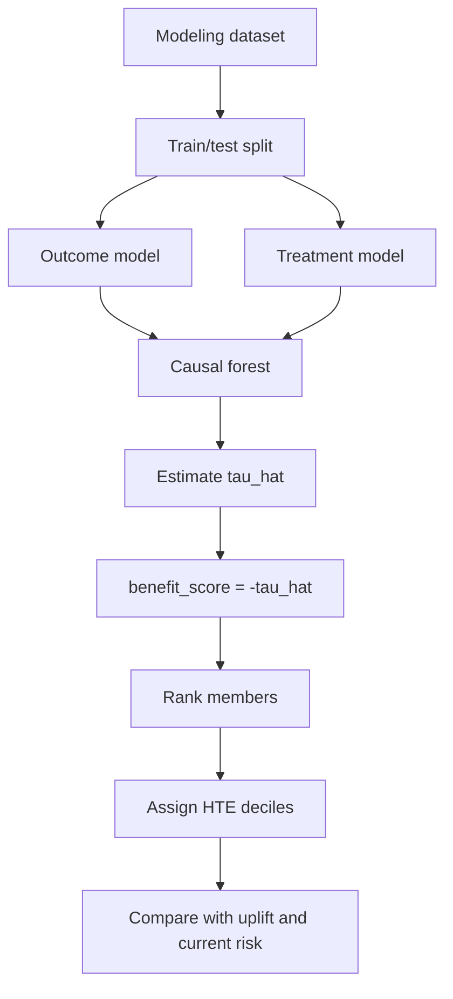
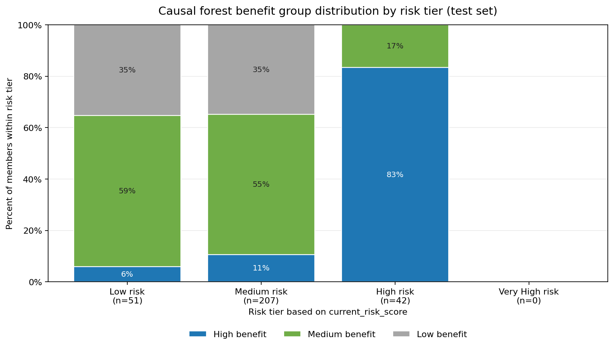
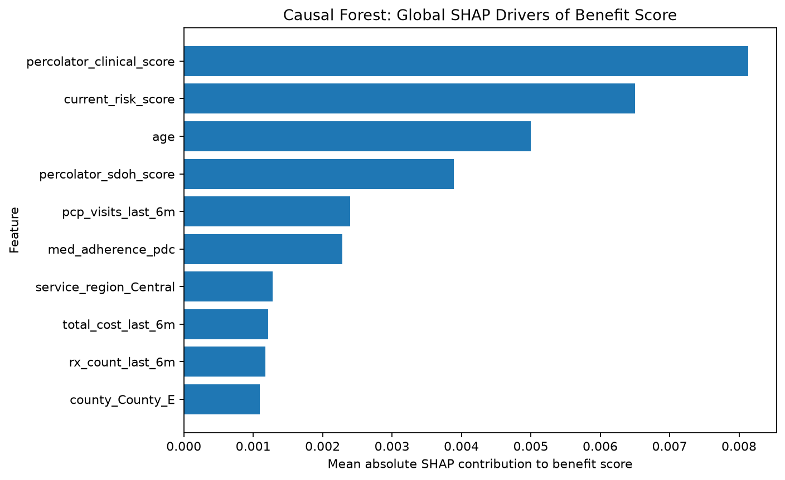
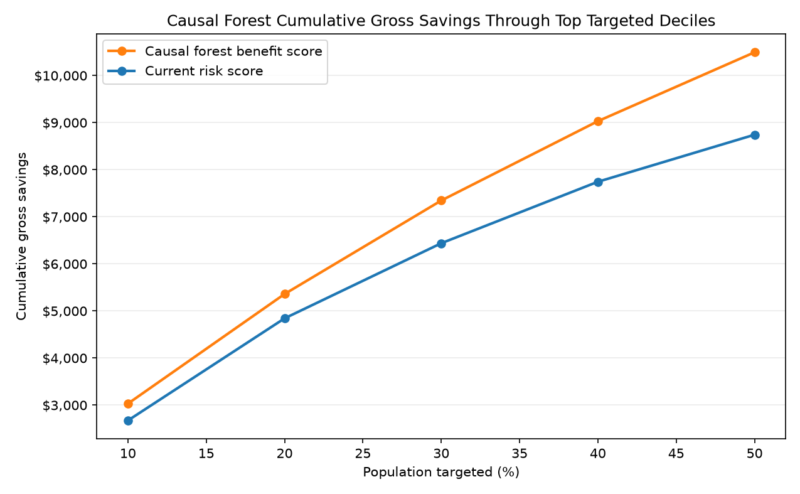
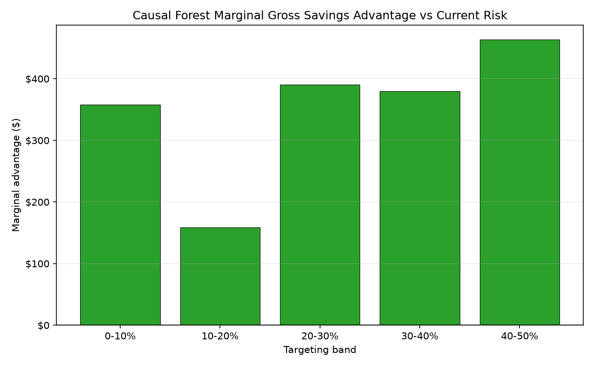

# PRISM Causal Forest Modeling README

This README summarizes the causal forest modeling workflow and results for the PRISM intervention benefit project. It is a companion to `PRISM_Intervention_Benefit_Modeling_README.md`, which documents the T-learner and X-learner uplift modeling workflow.

The project background, business question, outcome variable, treatment variable, predictor set, train/test logic, and random seed remain aligned with the uplift modeling workflow. This document focuses specifically on the causal forest model, how it estimates heterogeneous treatment effects, and how its member rankings compare with the selected uplift models.

The primary notebook is `Code/PRISM_Causal_Forest_Modeling_Workflow.ipynb`. The main output directory is `Outputs/Causal-Forests/Python`.

## Background

Care management programs must decide which members should receive intervention when outreach resources are limited. A common approach is to prioritize the highest-risk members, but high baseline risk does not always mean high intervention benefit. Some members may remain high risk even with intervention, while others may have risk that is meaningfully reduced by targeted care management.

This project evaluates whether treatment-effect modeling can estimate which members are most likely to benefit from care management intervention. The causal forest analysis extends the existing uplift work by estimating heterogeneous treatment effects directly. In this context, heterogeneous treatment effect means the intervention may not have the same expected effect for every member.

The analysis uses the PRISM synthetic dataset. Although the dataset is synthetic, it is structured to resemble variables and business use cases from a Medicaid care management population. Results should be interpreted as a reproducible modeling demonstration, not as production-ready evidence for live deployment.

## Business Question

The primary business question is:

> Which members are most likely to benefit from intervention in terms of reducing 90-day emergency department utilization, based on causal forest estimates of heterogeneous treatment effects?

The analysis also asks whether the causal forest identifies similar high-benefit members as the selected GLMNet T-learner and X-learner uplift models, whether causal forest provides useful subgroup discovery, and whether the estimated treatment effects are credible enough to support stakeholder discussion.

## Project Objectives

The causal forest workflow evaluates whether a direct heterogeneous treatment-effect model can support care management prioritization. The workflow estimates member-level treatment effects, ranks members by estimated intervention benefit, assigns high-benefit HTE deciles, evaluates overlap and uncertainty, compares causal forest rankings with uplift model rankings, provides partial explainability through variable importance, and documents a reproducible process that could later be validated on live client data.

## Analytical Task 1: Understanding And Explaining The Causal Forest Framework

### Outcome Variable

The outcome variable is `outcome_ed_90d`. It is a binary indicator for whether a member had emergency department utilization within 90 days. A value of 1 means the member had a 90-day ED outcome, and a value of 0 means the member did not.

### Treatment Variable

The treatment variable is `intervention_flag`. It indicates whether the member received the care management intervention. A value of 1 indicates intervention, and a value of 0 indicates no intervention/control.

### Predictor Variables

The causal forest uses the same predictor inventory as the uplift workflow. Predictors are organized into six categories:


- **Demographics**
- **Clinical conditions**
- **Social determinants of health (SDOH)**
- **Healthcare utilization**
- **Pharmacy**
- **Risk scores**

A complete variable inventory is provided in `causal_forest_predictor_inventory.csv`

Supporting file:

- [`causal_forest_predictor_inventory.csv`](Outputs/Causal-Forests/Python/causal_forest_predictor_inventory.csv)

### Train/Test Methodology

The causal forest notebook uses the same train/test strategy as the uplift workflow:

```text
train_fraction = 0.70
seed = 123
stratify on intervention_flag and outcome_ed_90d
```

The stratified split matters because the ED outcome is rare and because treatment-effect estimation depends on having treated and untreated members represented in both training and test data.

### What A Causal Forest Estimates

A causal forest estimates an individualized treatment effect (`tau_hat`) for each member:

```text
tau_hat = estimated effect of intervention on outcome_ed_90d
```

Because `outcome_ed_90d` is an undesirable outcome:

```text
tau_hat < 0  → intervention is estimated to reduce ED risk
tau_hat > 0  → intervention is estimated to increase ED risk
```

For business interpretation, treatment effects are converted to a benefit score:

```text
benefit_score = -tau_hat
```

Higher benefit scores indicate larger estimated reductions in ED risk under intervention.

### Model Specification

The causal forest is implemented using `econml.dml.CausalForestDML`, which estimates heterogeneous treatment effects directly rather than predicting separate treated and control outcomes.

The model combines two nuisance models with a final causal forest estimator:

| Component | Model | Purpose |
|---|---|---|
| Outcome model | `RandomForestRegressor` | Estimates baseline ED risk |
| Treatment model | `LogisticRegressionCV` (elastic net) | Estimates treatment propensity |
| Causal forest | `CausalForestDML` | Estimates member-level treatment effects (`tau_hat`) |

Unlike a standard random forest, which predicts an outcome, a causal forest estimates how intervention benefit varies across members.



### Propensity Alignment With Uplift Models

To improve comparability across models, the causal forest reuses the member-level propensity scores generated by the X-learner workflow.

The uplift notebook writes a shared propensity file:

- [`shared_propensity_scores.csv`](Outputs/Uplift/Python/X-Learner/shared_propensity_scores.csv)

The causal forest notebook merges these scores by `member_id`, ensuring that both workflows use identical propensity estimates. This allows differences between the uplift and causal forest results to reflect the treatment-effect models rather than differences in propensity estimation.

The shared propensity model uses the same GLMNet-style specification as the X-learner workflow:

```text
StandardScaler()
LogisticRegressionCV()
elastic-net penalty
l1_ratios = [0.5]
ROC-AUC cross-validation
seed = 123
clipping to [0.05, 0.95]
```

## Analytical Task 2: Data Review

This section reviews the modeling population, treatment rate, outcome prevalence, and final model matrix size. These checks mirror the data review section in the uplift README.

<!-- AUTO_TABLE:causal_forest_data_review_summary START -->
| Metric | Value |
|---|---:|
| Total members | 1,000 |
| Treated members | 394 |
| Untreated/control members | 606 |
| Treatment rate | 39.4% |
| ED outcome events | 60 |
| Outcome prevalence | 6.0% |
| Treated observed ED rate | 4.1% |
| Control observed ED rate | 7.3% |
| Final predictors before one-hot encoding | 41 |
| Continuous/count numeric predictors | 14 |
| Binary indicator predictors | 18 |
| Multi-level categorical predictors | 9 |
<!-- AUTO_TABLE:causal_forest_data_review_summary END -->

Supporting file:

- [`causal_forest_data_review_summary.csv`](Outputs/Causal-Forests/Python/causal_forest_data_review_summary.csv)

---

## Evaluation Roadmap

The remaining analyses are organized into two evaluation stages that build upon one another.

| Evaluation Level | Question | Analytical Tasks |
|---|---|---|
| **Level 1: Treatment-Effect Credibility** | Are the estimated treatment effects sufficiently credible for interpretation and member prioritization? | Tasks 3–5 |
| **Level 2: Explainability And Business Value** | Can the estimated treatment effects be explained and translated into improved targeting decisions? | Tasks 6–7 |

---

# Evaluation Level 1: Treatment-Effect Credibility

**Question:** Are the estimated treatment effects sufficiently credible for interpretation and member prioritization?

The first stage of the evaluation assesses the credibility of the causal forest treatment-effect estimates. Because individual treatment effects cannot be directly observed, credibility is established through multiple complementary analyses rather than a single performance metric. These tasks evaluate the quality of the model diagnostics, agreement with the known synthetic treatment effects, and whether the estimated treatment effects produce meaningful member rankings and high-benefit subgroups.

---

## Analytical Task 3: Causal Forest Diagnostics And Estimation Credibility

Unlike the uplift workflow, which first evaluates factual outcome prediction, the causal forest workflow focuses on whether the estimated treatment effects are sufficiently credible for interpretation. Because each member is only observed under one treatment condition, individual treatment effects cannot be directly verified. Instead, credibility is assessed using several complementary diagnostics.

The primary question for this section is:

> **What evidence suggests that the estimated treatment effects are reliable enough for exploratory prioritization and subgroup discovery?**

The diagnostics below evaluate the modeling data, treatment-group overlap, estimation uncertainty, and consistency of the treatment-effect estimates.

### Cross-Fitting And Nuisance Models

The causal forest uses a double machine learning framework that separately models baseline ED risk and treatment assignment before estimating heterogeneous treatment effects. Cross-fitting reduces overfitting by estimating these nuisance models on separate folds from those used for treatment-effect estimation.

Although this does not eliminate confounding, it provides a stronger framework than a simple treated-versus-control comparison. The credibility of the estimated treatment effects ultimately depends on adequate treatment overlap, sufficient outcome events, and reasonable estimation uncertainty.


### Event Counts

Treatment-effect estimation is more challenging than outcome prediction because only one potential outcome is observed for each member. Adequate representation of treated, untreated, event, and non-event observations is therefore important for stable estimation.

<!-- AUTO_TABLE:causal_forest_event_count_summary START -->
| Split | Group | N | Positive ED events | Negative ED events | Event rate |
|---|---:|---:|---:|---:|---:|
| Train | Treated | 276 | 11 | 265 | 4.0% |
| Train | Control | 424 | 31 | 393 | 7.3% |
| Test | Treated | 118 | 5 | 113 | 4.2% |
| Test | Control | 182 | 13 | 169 | 7.1% |
<!-- AUTO_TABLE:causal_forest_event_count_summary END -->

Supporting file:

- [`causal_forest_event_count_summary.csv`](Outputs/Causal-Forests/Python/causal_forest_event_count_summary.csv)

### Propensity And Overlap Checks

Reliable treatment-effect estimation requires overlap between treated and untreated members with similar baseline characteristics. To ensure comparability with the uplift analysis, the causal forest reuses the shared member-level propensity scores generated by the X-learner workflow.

The summary below shows the propensity-score distribution and confirms that no observations required extreme clipping.


<!-- AUTO_TABLE:causal_forest_propensity_summary START -->
| Metric | Value |
|---|---:|
| Propensity source | shared_propensity_scores_member_id_merge |
| Train treatment model AUC | 0.700 |
| Test treatment model AUC | 0.593 |
| Mean propensity | 0.403 |
| Min propensity | 0.150 |
| 5th percentile | 0.239 |
| Median propensity | 0.384 |
| 95th percentile | 0.605 |
| Max propensity | 0.774 |
| Members below 0.05 | 0 |
| Members above 0.95 | 0 |
<!-- AUTO_TABLE:causal_forest_propensity_summary END -->

<!-- AUTO_CHART:causal_forest_propensity_overlap START -->

<!-- AUTO_CHART:causal_forest_propensity_overlap END -->

Supporting file:

- [`causal_forest_propensity_summary.csv`](Outputs/Causal-Forests/Python/causal_forest_propensity_summary.csv)

### Uncertainty Assessment

Because individual treatment effects are inherently difficult to estimate, the notebook summarizes standard errors and confidence intervals for the estimated treatment effects. These results should be interpreted primarily as evidence for ranking members and identifying high-benefit subgroups rather than as precise individual treatment-effect estimates.

<!-- AUTO_TABLE:causal_forest_uncertainty_summary START -->
| Metric | Value |
|---|---:|
| Mean tau standard error | 0.026 |
| Median tau standard error | 0.024 |
| Members with tau CI entirely below zero | 87 |
| Members with tau CI crossing zero | 213 |
| Members with tau CI entirely above zero | 0 |
| Top HTE decile mean tau standard error | 0.038 |
<!-- AUTO_TABLE:causal_forest_uncertainty_summary END -->

Supporting file:

- [`causal_forest_uncertainty_summary.csv`](Outputs/Causal-Forests/Python/causal_forest_uncertainty_summary.csv)

### Model Selection

Candidate causal forest specifications were evaluated using validation-set benefit separation and ranking stability (see Analytical Task 1 for tuning methodology). The selected model used:

| Parameter | Selected value |
|---|---|
| Trees | 800 |
| Minimum leaf size | 10 |
| Maximum depth | None |

This configuration provided the best balance between HTE decile separation and stable member rankings across candidate models.

Supporting outputs:

- `causal_forest_hyperparameter_tuning_summary.csv`
- `causal_forest_hyperparameter_stability_pairs.csv`

## Analytical Task 4: Treatment Effect Analysis

### Treatment Effect Distribution

The treatment-effect distribution is shown using `benefit_score`, where `benefit_score = -tau_hat`. Higher benefit scores indicate larger estimated ED risk reductions from intervention. This keeps the table focused on the business interpretation while preserving the causal forest sign convention explained earlier.

<!-- AUTO_TABLE:causal_forest_ate_summary START -->
| Metric | Value |
|---|---:|
| Average benefit score | 0.041 |
| Test members | 300 |
<!-- AUTO_TABLE:causal_forest_ate_summary END -->

<!-- AUTO_TABLE:causal_forest_effect_distribution_summary START -->
| Metric | Benefit score |
|---|---:|
| Minimum | 0.001 |
| 10th percentile | 0.015 |
| 25th percentile | 0.025 |
| Median | 0.036 |
| Mean | 0.041 |
| 75th percentile | 0.056 |
| 90th percentile | 0.071 |
| Maximum | 0.101 |
| Standard deviation | 0.021 |
<!-- AUTO_TABLE:causal_forest_effect_distribution_summary END -->

<!-- AUTO_CHART:causal_forest_effect_distribution START -->

<!-- AUTO_CHART:causal_forest_effect_distribution END -->

Supporting files:

- [`causal_forest_ate_summary.csv`](Outputs/Causal-Forests/Python/causal_forest_ate_summary.csv)
- [`causal_forest_effect_distribution_summary.csv`](Outputs/Causal-Forests/Python/causal_forest_effect_distribution_summary.csv)

### Synthetic True-Benefit Validation

Because this project uses synthetic data, the known treatment-benefit formula can be used to validate treatment-effect estimates directly. The synthetic true benefit is:

```text
true_benefit =
    0.020
  + 0.018 * ed_visits_last_6m
  + 0.015 * admits_last_6m
  + 0.018 * food_insecurity_flag
  + 0.014 * transportation_barrier_flag
  + 0.012 * behavioral_health_risk_flag
  + 0.0006 * max(current_risk_score - 50, 0)
```

This validation uses the same 300 held-out test members scored by the causal forest. The `benefit_score` column is compared directly with `true_benefit` using the same fields as the formula above. The goal is to evaluate whether causal forest estimates the size and member-level pattern of treatment benefit, not just whether it predicts factual ED risk.

<!-- AUTO_TABLE:causal_forest_true_benefit_validation START -->
| Model | N | Mean predicted benefit | Mean true benefit | Bias | MAE | RMSE | Pearson corr | Spearman corr |
|---|---:|---:|---:|---:|---:|---:|---:|---:|
| Causal forest | 300 | 0.041 | 0.055 | -0.014 | 0.025 | 0.032 | 0.327 | 0.268 |
<!-- AUTO_TABLE:causal_forest_true_benefit_validation END -->

The causal forest underestimates the average true synthetic benefit by 0.014 benefit points. Its MAE is 0.025 and RMSE is 0.032, while both Pearson and Spearman correlations are positive. This indicates that the causal forest ranking recovers a meaningful portion of the synthetic member-level benefit pattern, although the estimates are not equal to the known formula and should still be interpreted as noisy exploratory treatment-effect estimates.

Analytical Task 5 extends this member-level idea to population segments by comparing HTE deciles and risk tiers against model-relative benefit groups.

Supporting files:

- [`causal_forest_true_benefit_validation_summary.csv`](Outputs/Causal-Forests/Python/causal_forest_true_benefit_validation_summary.csv)
- [`causal_forest_scored_test_output.csv`](Outputs/Causal-Forests/Python/causal_forest_scored_test_output.csv)

## Analytical Task 5: HTE Decile And High-Value Subgroup Analysis

Members are ranked by `benefit_score` and assigned to HTE deciles. Decile 1 is the highest estimated benefit group. This section is the causal forest equivalent of the uplift decile analysis in the main uplift README.

<!-- AUTO_TABLE:causal_forest_decile_summary START -->
| HTE decile | N | Avg `tau_hat` | Avg benefit score | Avg tau SE | Observed ED rate | Treatment pct | Avg propensity | Avg current risk |
|---:|---:|---:|---:|---:|---:|---:|---:|---:|
| 1 | 30 | -0.084 | 0.084 | 0.038 | 20.0% | 40.0% | 0.511 | 58.5 |
| 2 | 30 | -0.065 | 0.065 | 0.033 | 3.3% | 40.0% | 0.448 | 50.2 |
| 3 | 30 | -0.055 | 0.055 | 0.029 | 6.7% | 23.3% | 0.393 | 44.3 |
| 4 | 30 | -0.047 | 0.047 | 0.026 | 3.3% | 46.7% | 0.408 | 42.4 |
| 5 | 30 | -0.041 | 0.041 | 0.024 | 10.0% | 40.0% | 0.348 | 41.9 |
| 6 | 30 | -0.034 | 0.034 | 0.024 | 3.3% | 46.7% | 0.384 | 39.5 |
| 7 | 30 | -0.030 | 0.030 | 0.024 | 3.3% | 40.0% | 0.392 | 40.9 |
| 8 | 30 | -0.025 | 0.025 | 0.023 | 3.3% | 33.3% | 0.381 | 42.0 |
| 9 | 30 | -0.018 | 0.018 | 0.019 | 3.3% | 40.0% | 0.375 | 37.4 |
| 10 | 30 | -0.012 | 0.012 | 0.017 | 3.3% | 43.3% | 0.384 | 41.0 |
<!-- AUTO_TABLE:causal_forest_decile_summary END -->

The decile pattern shows a clear estimated benefit gradient. The average benefit score is 8.4 percentage points in HTE decile 1 compared with 1.2 percentage points in HTE decile 10.

<!-- AUTO_CHART:causal_forest_avg_benefit_by_decile START -->

<!-- AUTO_CHART:causal_forest_avg_benefit_by_decile END -->

### Risk Tier Versus Benefit Group

The chart below compares baseline risk tier against model-relative causal forest benefit group. Benefit groups are based on HTE deciles rather than fixed absolute ED-risk-reduction thresholds, because the observed estimated benefits in this dataset are smaller than the idealized synthetic-data specification.

| Benefit group | Definition |
|---|---|
| High benefit | HTE deciles 1-2, top 20% by estimated benefit |
| Medium benefit | HTE deciles 3-7, middle 50% by estimated benefit |
| Low benefit | HTE deciles 8-10, bottom 30% by estimated benefit |

Risk tiers are based on `current_risk_score`: Low `<35`, Medium `35` to `<55`, High `55` to `<75`, and Very High `>=75`.

<!-- AUTO_CHART:causal_forest_risk_tier_by_benefit_group START -->

<!-- AUTO_CHART:causal_forest_risk_tier_by_benefit_group END -->

The causal forest places most High risk test members in the high-benefit group, while Low and Medium risk members are more concentrated in the medium- and low-benefit groups. No Very High members appear in the held-out test set for this run. This does not mean risk tier alone determines benefit, but it shows that the causal forest's high-benefit ranking is strongly associated with the High risk segment in the current test set.

Supporting file:

- [`causal_forest_decile_summary.csv`](Outputs/Causal-Forests/Python/causal_forest_decile_summary.csv)
- [`causal_forest_risk_tier_benefit_group_summary.csv`](Outputs/Causal-Forests/Python/causal_forest_risk_tier_benefit_group_summary.csv)

### Framework Consistency Check

The main benchmark is the selected GLMNet uplift workflow, because the uplift README identified GLMNet as the stronger factual outcome-model family.

The consistency summary below compares causal forest `tau_hat` rankings against the selected GLMNet uplift benchmarks on the held-out test set. Correlations are member-level rank comparisons, and top-decile overlap shows how many members appear in both high-benefit groups. All comparisons use `member_id` merges and are limited to the same 300 held-out test members.

<!-- AUTO_TABLE:causal_forest_vs_uplift_consistency_summary START -->
| Model | Pearson benefit score corr | Spearman benefit score corr | Top decile overlap |
| ---: | ---: | ---: | ---: |
| Causal forest vs GLMNet T-learner | -0.014 | 0.041 | 20.0% |
| Causal forest vs GLMNet X-learner | 0.574 | 0.534 | 53.3% |
<!-- AUTO_TABLE:causal_forest_vs_uplift_consistency_summary END -->

On the held-out test set, the causal forest ranking shows moderate alignment with the GLMNet X-learner and weak alignment with the GLMNet T-learner. The weak alignment with the GLMNet T-learner suggests that causal forest is not simply reproducing the primary uplift report's GLMNet T-learner ranking. This should be presented as a model-comparison finding rather than as a failure.

Supporting file:

- [`causal_forest_vs_uplift_consistency_summary.csv`](Outputs/Causal-Forests/Python/causal_forest_vs_uplift_consistency_summary.csv)

### True-Benefit Top-Group Overlap

Because the synthetic true-benefit formula is known, the causal forest's highest-benefit groups can be compared against the true highest-benefit groups. The top 10% overlap is the strictest targeting check, while the top 20% overlap aligns with the project definition of **High benefit** as HTE deciles 1-2.

<!-- AUTO_TABLE:causal_forest_true_benefit_decile_overlap START -->
| Model | Test members | Top 10% overlap | Top 20% overlap |
|---|---:|---:|---:|
| Causal forest | 300 | 9 of 30 (30.0%) | 25 of 60 (41.7%) |
<!-- AUTO_TABLE:causal_forest_true_benefit_decile_overlap END -->

The causal forest recovers 30.0% of the true top-decile benefit members in the strictest top 10% check and 41.7% of the true top-20% benefit group. This is meaningfully stronger than the GLMNet T-learner (6.7%) and broadly comparable to the GLMNet X-learner (46.7%), suggesting the causal forest identifies a similar high-benefit population as the selected uplift benchmark.

## Level 1 Summary: Treatment-Effect Credibility

The causal forest produces treatment-effect estimates that are credible enough to support exploratory prioritization and benchmarking against the uplift models. Three lines of evidence support this conclusion.

First, the estimation environment is adequate. Propensity scores range from 0.15 to 0.77 with zero members requiring extreme clipping, test treatment-model AUC is a modest 0.593 (limiting concern about deterministic treatment assignment), and 5-fold cross-fitting controls nuisance-model overfitting.

Second, the causal forest recovers a meaningful portion of the known synthetic treatment-effect signal. It achieves a Pearson correlation of 0.327 and Spearman correlation of 0.268 with true benefit — weaker than the GLMNet X-learner (Pearson 0.391, Spearman 0.168) but directionally positive and substantially stronger than the GLMNet T-learner (Pearson −0.467, Spearman −0.368). It produces a clear HTE decile gradient from 8.4 pp in decile 1 to 1.2 pp in decile 10, and 87 of 300 test members have confidence intervals entirely below zero for `tau_hat`.

Third, the causal forest's top-benefit targeting aligns more closely with the X-learner than with the T-learner. It shares 53.3% top-decile overlap and 0.534 Spearman correlation with the GLMNet X-learner, compared with only 20.0% overlap and 0.041 Spearman with the GLMNet T-learner. On the true-benefit targeting check, the causal forest recovers 30.0% of the true top-decile members (top 10%) and 41.7% of the true top-20% group — meaningfully stronger than the GLMNet T-learner (6.7% at both thresholds) and broadly comparable to the GLMNet X-learner (46.7% top-10%, 48.3% top-20%).

The main limitation is estimation uncertainty: 213 of 300 members have confidence intervals crossing zero. The estimates should be interpreted as directional rankings rather than precise individual-level treatment effects.

---
# Evaluation Level 2: Explainability And Business Value

**Question:** Can the estimated treatment effects be explained and translated into improved targeting decisions?

Once the treatment-effect estimates have been shown to be sufficiently credible, the second stage of the evaluation focuses on their practical value. This stage examines which member characteristics drive the estimated treatment effects, how well those findings align with the known synthetic treatment-benefit formula, and whether prioritizing members by predicted benefit improves care management targeting compared with traditional risk-based approaches. The goal is to determine whether the causal forest provides interpretable insights and actionable recommendations that could support operational decision making.

---
## Analytical Task 6: Variable Importance And Explainability

Causal forest variable importance is a partial explainability layer. It identifies features used by the model to split members into groups with different estimated treatment effects. It should not be interpreted as a definitive causal explanation of why the intervention works.

<!-- AUTO_TABLE:causal_forest_variable_importance START -->
| Rank | Feature | Importance |
|---:|---|---:|
| 1 | current_risk_score | 0.173 |
| 2 | percolator_clinical_score | 0.138 |
| 3 | age | 0.101 |
| 4 | med_adherence_pdc | 0.072 |
| 5 | pcp_visits_last_6m | 0.068 |
| 6 | percolator_utilization_score | 0.064 |
| 7 | total_cost_last_6m | 0.062 |
| 8 | percolator_sdoh_score | 0.049 |
| 9 | rx_count_last_6m | 0.028 |
| 10 | chf_flag | 0.025 |
<!-- AUTO_TABLE:causal_forest_variable_importance END -->

<!-- AUTO_CHART:causal_forest_variable_importance START -->

<!-- AUTO_CHART:causal_forest_variable_importance END -->

Supporting files:

- [`causal_forest_variable_importance.csv`](Outputs/Causal-Forests/Python/causal_forest_variable_importance.csv)

### SHAP Benefit-Score Contributions

The standard variable importance above measures how much each feature contributes to heterogeneity in treatment effects, but it does not indicate whether higher feature values push benefit up or down. This section uses permutation SHAP on the causal forest `benefit_score = -tau_hat` function to decompose member-level benefit predictions into per-feature signed contributions. Mean absolute SHAP ranks global importance, while mean signed SHAP shows average contribution direction.

**Top 10 benefit drivers by magnitude (mean absolute contribution):**

<!-- AUTO_TABLE:causal_forest_shap_importance START -->
| Rank | Feature | Mean abs SHAP |
|---:|---|---:|
| 1 | percolator_clinical_score | 0.0081 |
| 2 | current_risk_score | 0.0065 |
| 3 | age | 0.0050 |
| 4 | percolator_sdoh_score | 0.0039 |
| 5 | pcp_visits_last_6m | 0.0024 |
| 6 | med_adherence_pdc | 0.0023 |
| 7 | service_region_Central | 0.0013 |
| 8 | total_cost_last_6m | 0.0012 |
| 9 | rx_count_last_6m | 0.0012 |
| 10 | county_County_E | 0.0011 |
<!-- AUTO_TABLE:causal_forest_shap_importance END -->

**Signed SHAP direction table:**

<!-- AUTO_TABLE:causal_forest_shap_signed START -->
| Direction | Feature | Mean signed contribution |
|---|---|---:|
| Increase predicted benefit | current_risk_score | 0.0009 |
| Increase predicted benefit | total_cost_last_6m | 0.0005 |
| Increase predicted benefit | percolator_clinical_score | 0.0004 |
| Increase predicted benefit | rx_count_last_6m | 0.0003 |
| Increase predicted benefit | specialist_visits_last_6m | 0.0003 |
| Decrease predicted benefit | pcp_visits_last_6m | -0.0003 |
| Decrease predicted benefit | percolator_sdoh_score | -0.0003 |
| Decrease predicted benefit | med_adherence_pdc | -0.0002 |
| Decrease predicted benefit | county_County_E | -0.0001 |
| Decrease predicted benefit | percolator_utilization_score | -0.0001 |
<!-- AUTO_TABLE:causal_forest_shap_signed END -->

<!-- AUTO_CHART:causal_forest_global_benefit_shap START -->

<!-- AUTO_CHART:causal_forest_global_benefit_shap END -->

Members with higher clinical complexity scores and current risk scores tend to have SHAP contributions that increase predicted benefit, while members with more primary care visits and higher SDOH scores tend to have contributions that decrease predicted benefit. The signed direction table complements the unsigned variable importance by showing which features push the causal forest benefit estimate higher or lower on average.

Supporting files:

- [`causal_forest_global_benefit_shap_importance.csv`](Outputs/Causal-Forests/Python/causal_forest_global_benefit_shap_importance.csv)
- [`causal_forest_member_benefit_shap_values.csv`](Outputs/Causal-Forests/Python/causal_forest_member_benefit_shap_values.csv)

### Known Synthetic Driver Alignment

Because the synthetic true-benefit formula is known, the model's explainability outputs can be compared against the six true drivers of treatment benefit. The table below checks how many of the six known drivers appear in each method's top-10 feature list.

The six true benefit drivers are: `ed_visits_last_6m`, `admits_last_6m`, `food_insecurity_flag`, `transportation_barrier_flag`, `behavioral_health_risk_flag`, and `current_risk_score`.

<!-- AUTO_TABLE:causal_forest_known_driver_alignment START -->
| Model | Explainability method | True drivers recovered in top 10 | Recovered true drivers |
|---|---|---:|---|
| Causal forest | Variable importance | 1 of 6 | `current_risk_score` |
| Causal forest | SHAP benefit contribution | 1 of 6 | `current_risk_score` |
<!-- AUTO_TABLE:causal_forest_known_driver_alignment END -->

Both methods identify `current_risk_score` as a top-10 driver, which is in the true formula. The remaining five true drivers (`ed_visits_last_6m`, `admits_last_6m`, `food_insecurity_flag`, `transportation_barrier_flag`, `behavioral_health_risk_flag`) do not appear in the top 10 for either method. This is consistent with the causal forest having moderate but imperfect Spearman correlation (0.27) with true benefit, and suggests the model is partially detecting the risk-score channel of the benefit formula but not the utilization and social determinant channels as strongly as the composite risk scores.

The table below provides a more granular check: for each true driver, the member-level SHAP contribution for that feature is compared against the member-level true contribution from the known formula using Spearman correlation. A positive Spearman correlation above 0.1 indicates the causal forest SHAP correctly recovers the direction of that driver's contribution to benefit.

<!-- AUTO_TABLE:causal_forest_true_driver_shap_spearman START -->
| Feature | True contribution formula | Mean true contribution | Causal forest SHAP Spearman | Direction recovered? |
|---|---|---:|---:|---|
| `ed_visits_last_6m` | `0.018 * ed_visits_last_6m` | 0.0163 | 0.830 | Yes |
| `admits_last_6m` | `0.015 * admits_last_6m` | 0.0053 | 0.596 | Yes |
| `food_insecurity_flag` | `0.018 * food_insecurity_flag` | 0.0038 | -0.557 | No |
| `transportation_barrier_flag` | `0.014 * transportation_barrier_flag` | 0.0036 | 0.689 | Yes |
| `behavioral_health_risk_flag` | `0.012 * behavioral_health_risk_flag` | 0.0046 | -0.789 | No |
| `current_risk_score` | `0.0006 * max(current_risk_score - 50, 0)` | 0.0010 | 0.750 | Yes |
<!-- AUTO_TABLE:causal_forest_true_driver_shap_spearman END -->

The causal forest SHAP correctly recovers the direction of 4 out of 6 true drivers. The two strongest utilization-based drivers (`ed_visits_last_6m` and `admits_last_6m`) and the risk-score driver have high positive Spearman correlations (0.60–0.83), and `transportation_barrier_flag` is also well recovered (0.69). The causal forest reverses the direction for `food_insecurity_flag` and `behavioral_health_risk_flag`, suggesting the model conflates those binary SDOH/clinical flags with correlated features that have opposite relationships with the estimated treatment effect.

## Analytical Task 7: Business Value Assessment

The business value analysis estimates how much gross savings would be captured when members are targeted by predicted causal forest benefit versus the prior-style approach of targeting members strictly by highest `current_risk_score`. The main visual is a cumulative targeting chart: top 10%, top 20%, top 30%, and so on. This makes the comparison easier to interpret because it answers the operational question: if outreach capacity is limited, which ranking method captures more estimated savings first?

The current calculation assumes:

```text
expected_ed_rate_reduction = avg_benefit_score
expected_ed_visits_avoided = n * expected_ed_rate_reduction
gross_savings = expected_ed_visits_avoided * cost_per_ed_visit
intervention_cost = n * cost_per_intervention
net_savings = gross_savings - intervention_cost
roi = net_savings / intervention_cost
```

The current cost assumptions are $1,200 per ED visit and $250 per intervention. The primary comparison below focuses on gross savings because the goal is to compare targeting quality before layering in intervention-cost assumptions.

### Causal Forest Benefit Targeting

<!-- AUTO_TABLE:causal_forest_targeting_comparison START -->
| Targeted group | Members targeted | Uplift gross savings | Current-risk gross savings | Uplift advantage | Uplift ED visits avoided | Current-risk ED visits avoided |
|---|---:|---:|---:|---:|---:|---:|
| Top 10% | 30 | $3,030.57 | $2,672.59 | $357.98 | 2.5255 | 2.2272 |
| Top 20% | 60 | $5,358.93 | $4,841.90 | $517.03 | 4.4658 | 4.0349 |
| Top 30% | 90 | $7,344.29 | $6,437.13 | $907.15 | 6.1202 | 5.3643 |
| Top 40% | 120 | $9,030.23 | $7,743.29 | $1,286.94 | 7.5252 | 6.4527 |
| Top 50% | 150 | $10,492.84 | $8,742.11 | $1,750.73 | 8.7440 | 7.2851 |
<!-- AUTO_TABLE:causal_forest_targeting_comparison END -->

This view compares two targeting policies on the same held-out test population: ranking members by causal forest predicted benefit versus ranking members by current risk score. Through the top 30% of targeted members, causal forest benefit targeting captures $7,344.29 in estimated gross savings, compared with $6,437.13 from current-risk targeting, an advantage of $907.15. Gross savings are estimated from the causal forest predicted benefit score, so this is a targeting-policy comparison rather than a claim of realized savings.

<!-- AUTO_CHART:causal_forest_roi_by_decile START -->

<!-- AUTO_CHART:causal_forest_roi_by_decile END -->

The chart below compares the additional gross savings from each causal forest targeting band against the additional gross savings from selecting the same number of members by current risk. Positive bars (blue) mean benefit-based targeting adds more estimated value than the current-risk approach for that band; negative bars (red) mean the current-risk approach adds more estimated value for that band. In this run, the causal forest has positive marginal advantage through the top 60%, then turns negative in the 60-70% through 90-100% bands.

<!-- AUTO_CHART:causal_forest_marginal_advantage START -->

<!-- AUTO_CHART:causal_forest_marginal_advantage END -->

These estimates compare targeting strategies rather than realized financial outcomes. Actual savings would depend on intervention effectiveness, cost assumptions, and validation using live production data. Overall, the causal forest suggests that prioritizing members by predicted treatment benefit may capture greater estimated value than targeting members by baseline risk alone on this synthetic dataset.

Supporting file:

- [`causal_forest_targeting_summary.csv`](Outputs/Causal-Forests/Python/causal_forest_targeting_summary.csv)

## Level 2 Summary: Explainability and Business Value

The causal forest provides a partial but informative explainability layer and demonstrates a consistent business-value advantage over risk-based targeting.

On explainability, variable importance and SHAP benefit-score decomposition converge on the same key drivers: `percolator_clinical_score` (SHAP mean abs 0.0081), `current_risk_score` (0.0065), and `age` (0.0050) are the top three features by both methods. Signed SHAP contributions show that higher clinical complexity and risk scores push benefit estimates upward, while higher PCP visits and SDOH scores push them downward. However, only 1 of 6 true synthetic drivers (`current_risk_score`) appears in the top 10 for either method, indicating the model primarily detects the risk-score channel rather than the underlying utilization and SDOH drivers directly. The member-level SHAP Spearman alignment check reveals a more nuanced picture: 4 of 6 true drivers have positive rank alignment with their SHAP contributions (Spearman 0.60–0.83 for `ed_visits_last_6m`, `admits_last_6m`, `transportation_barrier_flag`, and `current_risk_score`), while `food_insecurity_flag` and `behavioral_health_risk_flag` show reversed direction — consistent with these signals being partially captured through correlated composite risk scores.

On business value, causal forest benefit-based targeting outperforms current-risk targeting at every evaluated threshold. Through the top 30% of targeted members, benefit targeting captures $7,344 in estimated gross savings versus $6,437 from risk targeting — an advantage of $907. The marginal advantage remains positive through the top 60% of the population ($358–$464 per 10% band) before turning negative in the 60-100% bands, confirming that the causal forest's value is concentrated in the higher-benefit population segments where outreach capacity is most constrained.

Compared with the GLMNet uplift models, the causal forest's business-value advantage at top-30% ($907) is comparable to the GLMNet T-learner ($899) and exceeds it slightly, while the GLMNet X-learner captures $731 at the same threshold. This positions the causal forest as competitive with or modestly stronger than both GLMNet frameworks for targeting-policy value in this synthetic run, despite using a fundamentally different estimation approach.