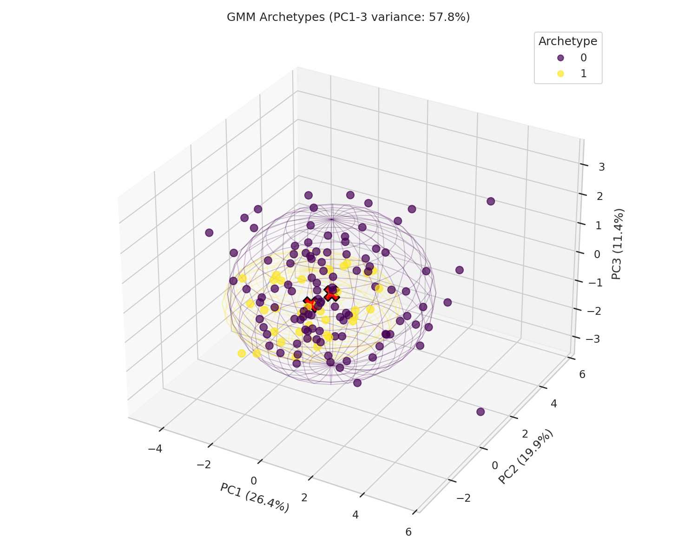

# PRISM Clinical Confidence Layer README

This README summarizes the archetype-discovery and confidence-scoring workflow for the PRISM
intervention benefit project. It is a companion to `PRISM_Doubly_Robust_Modeling_README.md`: it
operates on the doubly robust learner's high-benefit test population and asks a downstream
question the DR report does not — not "who benefits," but "which kind of high-benefit member is
this, and how much should that assignment be trusted."

The project background, business question, predictor set, and random seed remain aligned with the
uplift, causal forest, and doubly robust workflows. This document focuses specifically on Gaussian
Mixture archetype discovery among high-benefit members and the two-signal confidence layer used to
score new members against those archetypes.

The primary notebook is `Code/PRISM_Clinical_Confidence_Layer_v2.ipynb`. The main output directory
is `Outputs/Clinical-Confidence-Layer/Python/`. Seed: `123` (same as all other PRISM workflows).

Core sign convention (carried forward from the Doubly Robust learner):

```text
benefit_score              = -tau_hat, higher = larger estimated ED risk reduction
gmm_archetype               = cluster ID assigned to a high-benefit member
gmm_max_posterior           = confidence the winning archetype is unambiguous
typicality_score            = confidence the member resembles the training population at all
clinical_confidence_score   = sqrt(gmm_max_posterior * typicality_score)
confidence_tier              = Low / Medium / High, cut at natural breaks (1-D GMM), not fixed terciles
```

---

## Analytical Task 2: Data Review

<!-- AUTO_TABLE:clinical_confidence_data_review_summary START -->
| Metric | Value |
| ---: | ---: |
| Full scored population | 1,000 |
| Reconstructed train members | 700 |
| Reconstructed test members | 300 |
| High-benefit train members (top 20%) | 140 |
| High-benefit test members (top 20%) | 60 |
<!-- AUTO_TABLE:clinical_confidence_data_review_summary END -->

<!-- AUTO_TABLE:clinical_confidence_pca_variance START -->
_Pending: re-run notebook to export PCA variance CSV._
<!-- AUTO_TABLE:clinical_confidence_pca_variance END -->

---

## Analytical Task 3: Archetype Diagnostics And Clustering Method Comparison

<!-- AUTO_CHART:clinical_confidence_gmm_bic_aic_selection START -->

<!-- AUTO_CHART:clinical_confidence_gmm_bic_aic_selection END -->

<!-- AUTO_TABLE:clinical_confidence_bic_by_k START -->
_Pending: re-run notebook to export BIC-by-k CSV._
<!-- AUTO_TABLE:clinical_confidence_bic_by_k END -->

<!-- AUTO_TABLE:clinical_confidence_clustering_method_comparison START -->
_Pending: re-run notebook to export clustering method comparison CSV._
<!-- AUTO_TABLE:clinical_confidence_clustering_method_comparison END -->

<!-- AUTO_TABLE:clinical_confidence_internal_validation_comparison START -->
_Pending: re-run notebook to export clustering method comparison CSV._
<!-- AUTO_TABLE:clinical_confidence_internal_validation_comparison END -->

<!-- AUTO_TABLE:clinical_confidence_cross_method_agreement START -->
| Comparison | Adjusted Rand Index |
| ---: | ---: |
| GMM vs. K-Means | -0.013 |
| GMM vs. Agglomerative | 0.094 |
<!-- AUTO_TABLE:clinical_confidence_cross_method_agreement END -->

### Bootstrap Stability

<!-- AUTO_TABLE:clinical_confidence_stability_summary START -->
| Metric | Value |
| ---: | ---: |
| n_components (GMM) | 2 |
| Silhouette (GMM) | 0.011 |
| Davies-Bouldin (GMM) | 3.186 |
| Calinski-Harabasz (GMM) | 7.76 |
| Bootstrap mean ARI (100 resamples) | 0.172 |
| Bootstrap std ARI | 0.241 |
| Stability assessment | **WEAK** |
<!-- AUTO_TABLE:clinical_confidence_stability_summary END -->

### Archetype Profiles

<!-- AUTO_TABLE:clinical_confidence_archetype_summary START -->
| Archetype | N | Avg benefit score | Percolator Clinical Score | Age | Current Risk Score | Percolator Utilization Score | Med Adherence Pdc | Percolator Sdoh Score | Pcp Visits Last 6M | Ed Visits Last 6M | Rx Count Last 6M | Total Cost Last 6M | Anxiety Flag | Copd Flag |
| ---: | ---: | ---: | ---: | ---: | ---: | ---: | ---: | ---: | ---: | ---: | ---: | ---: | ---: | ---: |
| 0 | 105 | 0.0667 | 61.79 | 61.83 | 54.11 | 54.36 | 0.76 | 36.77 | 3.58 | 1.45 | 9.05 | $5,264 | 32.4% | 50.5% |
| 1 | 35 | 0.0685 | 59.69 | 55.66 | 51.17 | 51.69 | 0.78 | 29.37 | 2.00 | 1.17 | 8.46 | $4,744 | 0.0% | 0.0% |
<!-- AUTO_TABLE:clinical_confidence_archetype_summary END -->

---

## Analytical Task 4: Confidence Score Construction And Tiering

<!-- AUTO_TABLE:clinical_confidence_component_summary START -->
| Component | Mean | Std |
| ---: | ---: | ---: |
| gmm_max_posterior | 0.908 | 0.147 |
| typicality_score | 0.406 | 0.293 |
| knn_similarity (diagnostic only) | 0.291 | 0.040 |
<!-- AUTO_TABLE:clinical_confidence_component_summary END -->

<!-- AUTO_TABLE:clinical_confidence_degeneracy_check START -->
| Component | Std across test members | Degenerate? (std < 0.01) |
| ---: | ---: | ---: |
| gmm_max_posterior | 0.1470 | No |
| typicality_score | 0.2935 | No |
| knn_similarity | 0.0399 | No |
<!-- AUTO_TABLE:clinical_confidence_degeneracy_check END -->

<!-- AUTO_TABLE:clinical_confidence_combined_score_summary START -->
| Metric | Value |
| ---: | ---: |
| Mean | 0.565 |
| Std | 0.247 |
| Minimum | 0.000 |
| Maximum | 1.000 |
<!-- AUTO_TABLE:clinical_confidence_combined_score_summary END -->

### Natural-Break Tiering

<!-- AUTO_TABLE:clinical_confidence_tier_bic START -->
_Pending: re-run notebook to export tier BIC CSV._
<!-- AUTO_TABLE:clinical_confidence_tier_bic END -->

<!-- AUTO_TABLE:clinical_confidence_tier_summary START -->
| Confidence tier | N | % of test population | Avg confidence | Avg benefit score | Avg posterior | Avg typicality | N outliers | N HDBSCAN noise |
| ---: | ---: | ---: | ---: | ---: | ---: | ---: | ---: | ---: |
| High | 38 | 63.3% | 0.723 | 0.0652 | 0.907 | 0.582 | 0 | 2 |
| Low | 22 | 36.7% | 0.291 | 0.0618 | 0.910 | 0.103 | 6 | 19 |
<!-- AUTO_TABLE:clinical_confidence_tier_summary END -->

---

## Analytical Task 5: Visualization And Verification

<!-- AUTO_CHART:clinical_confidence_archetype_scatter_3d START -->

<!-- AUTO_CHART:clinical_confidence_archetype_scatter_3d END -->

<!-- AUTO_CHART:clinical_confidence_tier_scatter_3d START -->

<!-- AUTO_CHART:clinical_confidence_tier_scatter_3d END -->

### HDBSCAN Verification

<!-- AUTO_TABLE:clinical_confidence_hdbscan_tier_crosstab START -->
|  | Confidence tier: Low | Confidence tier: High | All |
| --- | --- | --- | --- |
| HDBSCAN noise | 19 | 2 | 21 |
| HDBSCAN in-cluster | 3 | 36 | 39 |
| All | 22 | 38 | 60 |
<!-- AUTO_TABLE:clinical_confidence_hdbscan_tier_crosstab END -->

### Operational Value Read

<!-- AUTO_TABLE:clinical_confidence_tier_distribution START -->
| Confidence tier | N | % of high-benefit test population | Suggested operational handling |
| --- | --- | --- | --- |
| High | 38 | 63.3% | Archetype-suggested protocol; care manager confirms before proceeding |
| Low | 22 | 36.7% | Manual clinical review; no automated archetype assignment |
<!-- AUTO_TABLE:clinical_confidence_tier_distribution END -->
