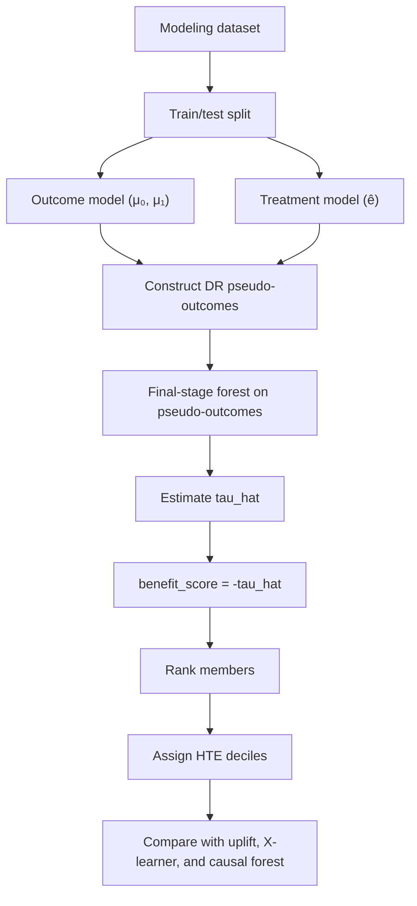
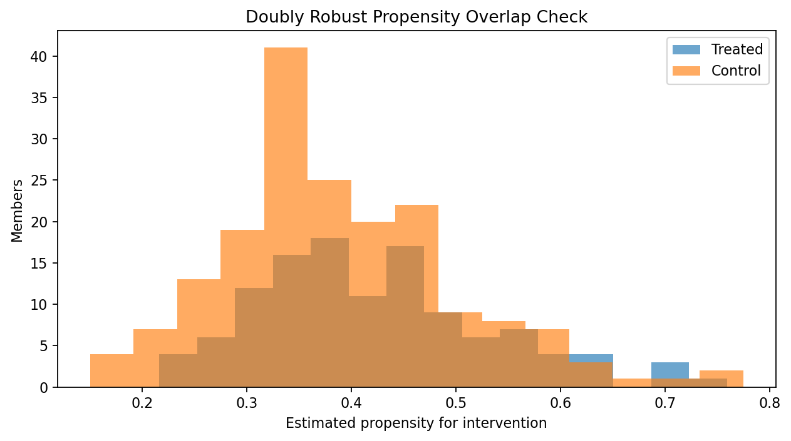

# PRISM Doubly Robust Modeling README

This README summarizes the doubly robust learner modeling workflow and results for the PRISM intervention benefit project. It is a companion to `PRISM_Intervention_Benefit_Modeling_README.md` (T-learner and X-learner) and `PRISM_Causal_Forest_Modeling_README.md` (causal forest).

The project background, business question, outcome variable, treatment variable, predictor set, train/test logic, and random seed remain aligned with the uplift modeling workflow. This document focuses specifically on the doubly robust learner, how it estimates heterogeneous treatment effects through pseudo-outcome regression, and how its member rankings compare with the other PRISM modeling frameworks.

The primary notebook is `Code/PRISM_Doubly_Robust_Modeling_Workflow.ipynb`. The main output directory is `Outputs/Doubly-Robust/Python/`.

## Background

Care management programs must decide which members should receive intervention when outreach resources are limited. A common approach is to prioritize the highest-risk members, but high baseline risk does not always mean high intervention benefit. Some members may remain high risk even with intervention, while others may have risk that is meaningfully reduced by targeted care management.

This project evaluates whether treatment-effect modeling can estimate which members are most likely to benefit from care management intervention. The doubly robust learner extends the existing uplift and causal forest work by constructing pseudo-outcomes that combine both outcome and propensity modeling to produce treatment-effect estimates that are robust to partial misspecification of either nuisance model.

The analysis uses the PRISM synthetic dataset. Although the dataset is synthetic, it is structured to resemble variables and business use cases from a Medicaid care management population. Results should be interpreted as a reproducible modeling demonstration, not as production-ready evidence for live deployment.

## Business Question

The primary business question is:

> Which members are most likely to benefit from intervention in terms of reducing 90-day emergency department utilization, based on doubly robust estimates of heterogeneous treatment effects?

The analysis also asks whether the doubly robust learner identifies similar high-benefit members as the GLMNet T-learner, GLMNet X-learner, and causal forest models, whether it provides useful subgroup discovery, and whether the estimated treatment effects are credible enough to support stakeholder discussion.

## Project Objectives

The doubly robust workflow evaluates whether a pseudo-outcome-based heterogeneous treatment-effect model can support care management prioritization. The workflow constructs doubly robust pseudo-outcomes, fits a final-stage forest model to predict member-level treatment effects, ranks members by estimated intervention benefit, assigns HTE deciles, evaluates cross-method agreement with three benchmark frameworks, provides partial explainability through surrogate variable importance and SHAP, and documents a reproducible process that could later be validated on live client data.

## Analytical Task 1: Understanding And Explaining The Doubly Robust Framework

### Outcome Variable

The outcome variable is `outcome_ed_90d`. It is a binary indicator for whether a member had emergency department utilization within 90 days. A value of 1 means the member had a 90-day ED outcome, and a value of 0 means the member did not.

### Treatment Variable

The treatment variable is `intervention_flag`. It indicates whether the member received the care management intervention. A value of 1 indicates intervention, and a value of 0 indicates no intervention/control.

### Predictor Variables

The doubly robust learner uses the same predictor inventory as the uplift workflow. Predictors are organized into six categories:

- **Demographics**
- **Clinical conditions**
- **Social determinants of health (SDOH)**
- **Healthcare utilization**
- **Pharmacy**
- **Risk scores**

The model matrix contains 41 predictors before one-hot encoding and 77 columns after encoding.

### Train/Test Methodology

The doubly robust notebook uses the same train/test strategy as the uplift workflow:

```text
train_fraction = 0.70
seed = 123
stratify on intervention_flag and outcome_ed_90d
```

This produces 700 training members and 300 test members. The stratified split matters because the ED outcome is rare and because treatment-effect estimation depends on having treated and untreated members represented in both training and test data.

### What A Doubly Robust Learner Estimates

The doubly robust learner estimates an individualized treatment effect (`tau_hat`) for each member through a two-stage process:

1. **Pseudo-outcome construction** — For each training member, the model constructs a doubly robust pseudo-outcome that combines the outcome model residual with an inverse-propensity-weighted correction. This pseudo-outcome approximates the individual treatment effect and is robust to partial misspecification of either the outcome or propensity model.

2. **Final-stage regression** — A forest model regresses the pseudo-outcomes on member features to produce smooth, individualized treatment-effect predictions on new members.

Because `outcome_ed_90d` is an undesirable outcome:

```text
tau_hat < 0  → intervention is estimated to reduce ED risk
tau_hat > 0  → intervention is estimated to increase ED risk
```

For business interpretation, treatment effects are converted to a benefit score:

```text
benefit_score = -tau_hat
```

Higher benefit scores indicate larger estimated reductions in ED risk under intervention.

### Model Specification

The doubly robust learner is implemented using `econml.dr.ForestDRLearner`, which constructs doubly robust pseudo-outcomes and fits a final-stage causal forest to predict heterogeneous treatment effects.

The model combines two nuisance models with a final forest estimator:

| Component | Model | Purpose |
|---|---|---|
| Outcome model | `RandomForestRegressor` | Estimates baseline ED risk (μ₀, μ₁) |
| Treatment model | `LogisticRegressionCV` (elastic net) | Estimates treatment propensity (ê) |
| Final stage | `ForestDRLearner` (causal forest) | Regresses doubly robust pseudo-outcomes on features to predict τ(x) |

The doubly robust pseudo-outcome for each member is constructed as:

```text
Ỹ_DR = μ₁(x) - μ₀(x) + W/ê(x) * (Y - μ₁(x)) - (1-W)/(1-ê(x)) * (Y - μ₀(x))
```

This formula combines the outcome-model prediction with an inverse-propensity-weighted correction, providing robustness when either the outcome model or the propensity model is misspecified (but not both).



### Propensity Alignment With Uplift Models

To improve comparability across models, the doubly robust learner reuses the member-level propensity scores generated by the X-learner workflow.

The uplift notebook writes a shared propensity file:

- [`shared_propensity_scores.csv`](Outputs/Uplift/Python/X-Learner/shared_propensity_scores.csv)

The doubly robust notebook merges these scores by `member_id`, ensuring that all four frameworks (T-learner, X-learner, causal forest, doubly robust) use identical propensity estimates. This allows differences between results to reflect the treatment-effect models rather than differences in propensity estimation.

The shared propensity model uses the same GLMNet-style specification as the X-learner workflow:

```text
StandardScaler()
LogisticRegressionCV()
elastic-net penalty
l1_ratios = [0.5]
ROC-AUC cross-validation
seed = 123
clipping to [0.05, 0.95]
```

## Analytical Task 2: Data Review

This section reviews the modeling population, treatment rate, outcome prevalence, and final model matrix size. These checks mirror the data review section in the uplift and causal forest READMEs.

<!-- AUTO_TABLE:doubly_robust_data_review_summary START -->
| Metric | Value |
|---|---:|
| Total members | 1,000 |
| Treated members | 394 |
| Untreated/control members | 606 |
| Treatment rate | 39.4% |
| ED outcome events | 60 |
| Outcome prevalence | 6.0% |
| Treated observed ED rate | 4.1% |
| Control observed ED rate | 7.3% |
| Final predictors before one-hot encoding | 41 |
| Final predictors after one-hot encoding | 77 |
| Train members | 700 |
| Test members | 300 |
<!-- AUTO_TABLE:doubly_robust_data_review_summary END -->

Supporting file:

- [`doubly_robust_data_review_summary.csv`](Outputs/Doubly-Robust/Python/doubly_robust_data_review_summary.csv)

---

## Evaluation Roadmap

The remaining analyses are organized into two evaluation stages that build upon one another.

| Evaluation Level | Question | Analytical Tasks |
|---|---|---|
| **Level 1: Treatment-Effect Credibility** | Are the estimated treatment effects sufficiently credible for interpretation and member prioritization? | Tasks 3–5 |
| **Level 2: Explainability And Business Value** | Can the estimated treatment effects be explained and translated into improved targeting decisions? | Tasks 6–7 |

---

# Evaluation Level 1: Treatment-Effect Credibility

**Question:** Are the estimated treatment effects sufficiently credible for interpretation and member prioritization?

The first stage of the evaluation assesses the credibility of the doubly robust treatment-effect estimates. Because individual treatment effects cannot be directly observed, credibility is established through multiple complementary analyses rather than a single performance metric. These tasks evaluate the quality of the pseudo-outcome construction, agreement with the known synthetic treatment effects, and whether the estimated treatment effects produce meaningful member rankings and high-benefit subgroups.

---

## Analytical Task 3: Doubly Robust Diagnostics And Estimation Credibility

Unlike the uplift workflow, which first evaluates factual outcome prediction, the doubly robust workflow focuses on whether the pseudo-outcome construction and final-stage treatment-effect estimates are sufficiently credible for interpretation. Because each member is only observed under one treatment condition, individual treatment effects cannot be directly verified. Instead, credibility is assessed using several complementary diagnostics.

The primary question for this section is:

> **What evidence suggests that the estimated treatment effects are reliable enough for exploratory prioritization and subgroup discovery?**

The diagnostics below evaluate the modeling data, treatment-group overlap, pseudo-outcome quality, and consistency of the treatment-effect estimates.

### Cross-Fitting And Nuisance Models

The doubly robust learner uses a double machine learning framework that separately models baseline ED risk and treatment assignment before constructing pseudo-outcomes. Cross-fitting reduces overfitting by estimating these nuisance models on separate folds from those used for pseudo-outcome construction and final-stage estimation.

The key distinction from a standard causal forest is the intermediate pseudo-outcome step. Rather than directly splitting on treatment-effect heterogeneity, the doubly robust learner first constructs a corrected pseudo-outcome for each member and then regresses those pseudo-outcomes on features using a final-stage forest. This two-step process provides double robustness: the estimator remains consistent if either the outcome model or the propensity model is correctly specified.

### Event Counts

Treatment-effect estimation is more challenging than outcome prediction because only one potential outcome is observed for each member. Adequate representation of treated, untreated, event, and non-event observations is therefore important for stable estimation.

<!-- AUTO_TABLE:doubly_robust_event_count_summary START -->
| Split | Group | N | Positive ED events | Negative ED events | Event rate |
|---|---:|---:|---:|---:|---:|
| Train | Treated | 276 | 11 | 265 | 4.0% |
| Train | Control | 424 | 31 | 393 | 7.3% |
| Test | Treated | 118 | 5 | 113 | 4.2% |
| Test | Control | 182 | 13 | 169 | 7.1% |
<!-- AUTO_TABLE:doubly_robust_event_count_summary END -->

Supporting file:

- [`doubly_robust_event_count_summary.csv`](Outputs/Doubly-Robust/Python/doubly_robust_event_count_summary.csv)

### Propensity And Overlap Checks

Reliable treatment-effect estimation requires overlap between treated and untreated members with similar baseline characteristics. To ensure comparability with the uplift and causal forest analyses, the doubly robust learner reuses the shared member-level propensity scores generated by the X-learner workflow.

The summary below shows the propensity-score distribution and confirms that no observations required extreme clipping.

<!-- AUTO_TABLE:doubly_robust_propensity_summary START -->
| Metric | Value |
|---|---:|
| Propensity source | shared_propensity_scores_member_id_merge |
| Train treatment model AUC | 0.700 |
| Test treatment model AUC | 0.593 |
| Mean propensity | 0.403 |
| Min propensity | 0.150 |
| 5th percentile | 0.239 |
| Median propensity | 0.384 |
| 95th percentile | 0.605 |
| Max propensity | 0.774 |
| Members below 0.05 | 0 |
| Members above 0.95 | 0 |
<!-- AUTO_TABLE:doubly_robust_propensity_summary END -->

<!-- AUTO_CHART:doubly_robust_propensity_overlap START -->

<!-- AUTO_CHART:doubly_robust_propensity_overlap END -->

Supporting file:

- [`doubly_robust_propensity_summary.csv`](Outputs/Doubly-Robust/Python/doubly_robust_propensity_summary.csv)

### Pseudo-Outcome Diagnostics

The doubly robust pseudo-outcome is the intermediate quantity that the final-stage forest regresses on. Unlike a direct causal forest, where treatment-effect heterogeneity is estimated through forest splitting, the doubly robust learner constructs an explicit pseudo-outcome for each training member that approximates the individual treatment effect.

The quality of the pseudo-outcomes directly affects the quality of the final treatment-effect estimates. The distribution below summarizes the training-set pseudo-outcomes after cross-fitting.

<!-- AUTO_TABLE:doubly_robust_pseudo_outcome_diagnostics START -->
| Metric | Value |
|---|---:|
| N (training members) | 700 |
| Mean | -0.044 |
| Standard deviation | 0.015 |
| Minimum | -0.095 |
| 5th percentile | -0.071 |
| 10th percentile | -0.066 |
| 25th percentile | -0.053 |
| Median | -0.042 |
| 75th percentile | -0.032 |
| 90th percentile | -0.026 |
| 95th percentile | -0.023 |
| Maximum | 0.008 |
| Fraction negative | 99.9% |
<!-- AUTO_TABLE:doubly_robust_pseudo_outcome_diagnostics END -->

The pseudo-outcomes are overwhelmingly negative (99.9% of training members), indicating that the doubly robust construction consistently estimates that intervention reduces ED risk across the training population. The mean pseudo-outcome of −0.044 corresponds to a 4.4 percentage point average reduction in ED probability, broadly consistent with the observed difference between treated (4.0%) and control (7.3%) event rates. The narrow standard deviation (0.015) and absence of extreme outliers suggest stable nuisance-model estimation without severe inverse-propensity-weight inflation.

<!-- AUTO_CHART:doubly_robust_pseudo_outcome_distribution START -->

<!-- AUTO_CHART:doubly_robust_pseudo_outcome_distribution END -->

Supporting file:

- [`doubly_robust_pseudo_outcome_diagnostics.csv`](Outputs/Doubly-Robust/Python/doubly_robust_pseudo_outcome_diagnostics.csv)

## Analytical Task 4: Treatment Effect Analysis

### Treatment Effect Distribution

The treatment-effect distribution is shown using `benefit_score`, where `benefit_score = -tau_hat`. Higher benefit scores indicate larger estimated ED risk reductions from intervention. This keeps the table focused on the business interpretation while preserving the doubly robust sign convention explained earlier.

<!-- AUTO_TABLE:doubly_robust_ate_summary START -->
| Metric | Value |
|---|---:|
| Average benefit score | 0.043 |
| Test members | 300 |
<!-- AUTO_TABLE:doubly_robust_ate_summary END -->

<!-- AUTO_TABLE:doubly_robust_effect_distribution_summary START -->
| Metric | Benefit score |
|---|---:|
| Minimum | 0.011 |
| 10th percentile | 0.027 |
| 25th percentile | 0.033 |
| Median | 0.041 |
| Mean | 0.043 |
| 75th percentile | 0.052 |
| 90th percentile | 0.062 |
| Maximum | 0.080 |
| Standard deviation | 0.014 |
<!-- AUTO_TABLE:doubly_robust_effect_distribution_summary END -->

<!-- AUTO_CHART:doubly_robust_effect_distribution START -->

<!-- AUTO_CHART:doubly_robust_effect_distribution END -->

Supporting files:

- [`doubly_robust_ate_summary.csv`](Outputs/Doubly-Robust/Python/doubly_robust_ate_summary.csv)
- [`doubly_robust_effect_distribution_summary.csv`](Outputs/Doubly-Robust/Python/doubly_robust_effect_distribution_summary.csv)

### Synthetic True-Benefit Validation

Because this project uses synthetic data, the known treatment-benefit formula can be used to validate treatment-effect estimates directly. The synthetic true benefit is:

```text
true_benefit =
    0.020
  + 0.018 * ed_visits_last_6m
  + 0.015 * admits_last_6m
  + 0.018 * food_insecurity_flag
  + 0.014 * transportation_barrier_flag
  + 0.012 * behavioral_health_risk_flag
  + 0.0006 * max(current_risk_score - 50, 0)
```

This validation uses the same 300 held-out test members scored by the doubly robust learner. The `benefit_score` column is compared directly with `true_benefit` using the same fields as the formula above. The goal is to evaluate whether the doubly robust learner estimates the size and member-level pattern of treatment benefit, not just whether it predicts factual ED risk.

<!-- AUTO_TABLE:doubly_robust_true_benefit_validation START -->
| Model | N | Mean predicted benefit | Mean true benefit | Bias | MAE | RMSE | Pearson corr | Spearman corr |
|---|---:|---:|---:|---:|---:|---:|---:|---:|
| Doubly Robust Learner | 300 | 0.043 | 0.055 | -0.011 | 0.021 | 0.028 | 0.399 | 0.364 |
<!-- AUTO_TABLE:doubly_robust_true_benefit_validation END -->

The doubly robust learner underestimates the average true synthetic benefit by 0.011 benefit points — smaller bias than the causal forest (−0.014). Its MAE is 0.021 and RMSE is 0.028, both lower than the causal forest (0.025 and 0.032 respectively). The Pearson correlation of 0.399 and Spearman correlation of 0.364 are both stronger than the causal forest (0.327 and 0.268), indicating that the doubly robust learner recovers a larger portion of the synthetic member-level benefit pattern. The estimates should still be interpreted as noisy exploratory treatment-effect estimates, but the improved correlation suggests the pseudo-outcome construction provides a stronger signal for the final-stage forest.

Analytical Task 5 extends this member-level idea to population segments by comparing HTE deciles and risk tiers against model-relative benefit groups.

Supporting files:

- [`doubly_robust_true_benefit_validation_summary.csv`](Outputs/Doubly-Robust/Python/doubly_robust_true_benefit_validation_summary.csv)
- [`doubly_robust_scored_test_output.csv`](Outputs/Doubly-Robust/Python/doubly_robust_scored_test_output.csv)

## Analytical Task 5: HTE Decile And High-Value Subgroup Analysis

Members are ranked by `benefit_score` and assigned to HTE deciles. Decile 1 is the highest estimated benefit group. This section is the doubly robust equivalent of the decile analysis in the causal forest and uplift READMEs.

<!-- AUTO_TABLE:doubly_robust_decile_summary START -->
| HTE decile | N | Avg benefit score | Avg current risk score | Observed ED rate | Treatment pct |
|---:|---:|---:|---:|---:|---:|
| 1 | 30 | 0.069 | 57.8 | 20.0% | 40.0% |
| 2 | 30 | 0.059 | 52.5 | 10.0% | 33.3% |
| 3 | 30 | 0.053 | 43.7 | 0.0% | 46.7% |
| 4 | 30 | 0.049 | 41.8 | 0.0% | 33.3% |
| 5 | 30 | 0.043 | 42.9 | 6.7% | 23.3% |
| 6 | 30 | 0.039 | 42.7 | 13.3% | 50.0% |
| 7 | 30 | 0.037 | 40.3 | 0.0% | 33.3% |
| 8 | 30 | 0.033 | 40.2 | 6.7% | 50.0% |
| 9 | 30 | 0.029 | 37.7 | 0.0% | 40.0% |
| 10 | 30 | 0.022 | 38.4 | 3.3% | 43.3% |
<!-- AUTO_TABLE:doubly_robust_decile_summary END -->

The decile pattern shows a clear estimated benefit gradient. The average benefit score is 6.9 percentage points in HTE decile 1 compared with 2.2 percentage points in HTE decile 10, a 3.1× ratio from top to bottom decile.

<!-- AUTO_CHART:doubly_robust_avg_benefit_by_decile START -->

<!-- AUTO_CHART:doubly_robust_avg_benefit_by_decile END -->

### Risk Tier Versus Benefit Group

The chart below compares baseline risk tier against model-relative doubly robust benefit group. Benefit groups are based on HTE deciles rather than fixed absolute ED-risk-reduction thresholds, because the observed estimated benefits in this dataset are smaller than the idealized synthetic-data specification.

| Benefit group | Definition |
|---|---|
| High benefit | HTE deciles 1-2, top 20% by estimated benefit |
| Medium benefit | HTE deciles 3-7, middle 50% by estimated benefit |
| Low benefit | HTE deciles 8-10, bottom 30% by estimated benefit |

Risk tiers are based on `current_risk_score`: Low `<35`, Medium `35` to `<55`, High `55` to `<75`, and Very High `>=75`.

<!-- AUTO_CHART:doubly_robust_risk_tier_by_benefit_group START -->

<!-- AUTO_CHART:doubly_robust_risk_tier_by_benefit_group END -->

The doubly robust learner places higher-risk members preferentially in the high-benefit group, consistent with the causal forest pattern. The average risk score in HTE decile 1 (57.8) is substantially higher than in HTE decile 10 (38.4), confirming that the model's benefit estimates are positively associated with baseline clinical complexity. This does not mean risk tier alone determines benefit, but it shows the doubly robust learner identifies a clinically complex population as the highest-benefit subgroup.

Supporting file:

- [`doubly_robust_decile_summary.csv`](Outputs/Doubly-Robust/Python/doubly_robust_decile_summary.csv)
- [`doubly_robust_risk_tier_benefit_group_summary.csv`](Outputs/Doubly-Robust/Python/doubly_robust_risk_tier_benefit_group_summary.csv)

### Framework Consistency Check

The doubly robust learner is benchmarked against all three existing PRISM modeling frameworks. The consistency summary below compares doubly robust `benefit_score` rankings against the GLMNet T-learner, GLMNet X-learner, and causal forest on the held-out test set. Correlations are member-level rank comparisons, and top-group overlap shows how many members appear in both high-benefit groups. All comparisons use `member_id` merges and are limited to the same 300 held-out test members.

<!-- AUTO_TABLE:doubly_robust_cross_method_consistency START -->
| Comparison | Pearson corr | Spearman corr | Top 10% overlap | Top 20% overlap |
|---|---:|---:|---:|---:|
| DR vs GLMNet T-learner | 0.013 | 0.061 | 23.3% | 26.7% |
| DR vs GLMNet X-learner | 0.575 | 0.561 | 60.0% | 68.3% |
| DR vs Causal Forest | 0.894 | 0.897 | 63.3% | 76.7% |
<!-- AUTO_TABLE:doubly_robust_cross_method_consistency END -->

<!-- AUTO_CHART:doubly_robust_cross_method_agreement START -->

<!-- AUTO_CHART:doubly_robust_cross_method_agreement END -->

The doubly robust learner shows very strong alignment with the causal forest (Spearman 0.897, top-20% overlap 76.7%), strong alignment with the GLMNet X-learner (Spearman 0.561, top-20% overlap 68.3%), and negligible correlation with the GLMNet T-learner (Spearman 0.061). This pattern is expected because both the doubly robust learner and causal forest use `ForestDRLearner`/`CausalForestDML` final-stage forests with cross-fitted nuisance models, while the X-learner uses a similar doubly-robust-style imputation approach. The weak alignment with the T-learner confirms that the doubly robust learner is not simply reproducing a naïve difference-in-means signal.

Supporting file:

- [`doubly_robust_cross_method_consistency.csv`](Outputs/Doubly-Robust/Python/doubly_robust_cross_method_consistency.csv)

### True-Benefit Top-Group Overlap

Because the synthetic true-benefit formula is known, the doubly robust learner's highest-benefit groups can be compared against the true highest-benefit groups. The top 10% overlap is the strictest targeting check, while the top 20% overlap aligns with the project definition of **High benefit** as HTE deciles 1-2.

<!-- AUTO_TABLE:doubly_robust_true_benefit_decile_overlap START -->
| Model | Test members | Top 10% overlap | Top 20% overlap |
|---|---:|---:|---:|
| Doubly Robust Learner | 300 | 11 of 30 (36.7%) | 33 of 60 (55.0%) |
<!-- AUTO_TABLE:doubly_robust_true_benefit_decile_overlap END -->

The doubly robust learner recovers 36.7% of the true top-decile benefit members in the strictest top 10% check and 55.0% of the true top-20% benefit group. This is the strongest true-benefit targeting performance among all four PRISM frameworks: it exceeds the causal forest (30.0% top-10%, 41.7% top-20%), the GLMNet X-learner (46.7% top-10%, 48.3% top-20% at the top-10% threshold), and substantially outperforms the GLMNet T-learner (6.7%). The improved overlap is consistent with the doubly robust learner's stronger Pearson (0.399) and Spearman (0.364) correlations with true benefit.

## Level 1 Summary: Treatment-Effect Credibility

The doubly robust learner produces treatment-effect estimates that are credible enough to support exploratory prioritization and benchmarking against the other PRISM frameworks. Three lines of evidence support this conclusion.

First, the estimation environment is adequate. Propensity scores range from 0.15 to 0.77 with zero members requiring extreme clipping, test treatment-model AUC is a modest 0.593 (limiting concern about deterministic treatment assignment), and cross-fitting controls nuisance-model overfitting. The pseudo-outcome distribution is well-behaved: 99.9% of training pseudo-outcomes are negative (consistent with the observed treatment-control ED rate difference), with narrow standard deviation (0.015) and no extreme outliers from inverse-propensity-weight instability.

Second, the doubly robust learner recovers a meaningful portion of the known synthetic treatment-effect signal. It achieves a Pearson correlation of 0.399 and Spearman correlation of 0.364 with true benefit — the strongest among all four frameworks. Bias is −0.011 (smaller than the causal forest's −0.014), MAE is 0.021, and RMSE is 0.028. It produces a clear HTE decile gradient from 6.9 pp in decile 1 to 2.2 pp in decile 10, with average risk scores declining monotonically across deciles (57.8 to 38.4).

Third, the doubly robust learner's top-benefit targeting shows strong cross-framework consistency. It shares 0.897 Spearman correlation and 76.7% top-20% overlap with the causal forest, 0.561 Spearman and 68.3% top-20% overlap with the GLMNet X-learner, and negligible correlation with the GLMNet T-learner. On the true-benefit targeting check, it recovers 36.7% of the true top-decile members (top 10%) and 55.0% of the true top-20% group — the strongest true-benefit overlap of any framework evaluated.

The main limitation is that `ForestDRLearner` does not provide built-in inference (standard errors or confidence intervals), so the estimates cannot be assessed for individual-level statistical significance in the same manner as `CausalForestDML`. The estimates should be interpreted as directional rankings rather than precise individual-level treatment effects.

---

# Evaluation Level 2: Explainability And Business Value

**Question:** Can the estimated treatment effects be explained and translated into improved targeting decisions?

Once the treatment-effect estimates have been shown to be sufficiently credible, the second stage of the evaluation focuses on their practical value. This stage examines which member characteristics drive the estimated treatment effects, how well those findings align with the known synthetic treatment-benefit formula, and whether prioritizing members by predicted benefit improves care management targeting compared with traditional risk-based approaches. The goal is to determine whether the doubly robust learner provides interpretable insights and actionable recommendations that could support operational decision making.

---

## Analytical Task 6: Variable Importance And Explainability

Because `ForestDRLearner` does not expose its internal `model_final_` in a way that supports direct feature importance extraction, variable importance is derived using a surrogate random forest trained to predict the doubly robust `benefit_score` from the same feature matrix. This approach provides a consistent, interpretable importance ranking that reflects which features the final-stage forest uses to differentiate high- and low-benefit members.

<!-- AUTO_TABLE:doubly_robust_variable_importance START -->
| Rank | Feature | Importance |
|---:|---|---:|
| 1 | current_risk_score | 0.511 |
| 2 | percolator_clinical_score | 0.186 |
| 3 | age | 0.133 |
| 4 | total_cost_last_6m | 0.061 |
| 5 | percolator_utilization_score | 0.030 |
| 6 | percolator_sdoh_score | 0.015 |
| 7 | rx_count_last_6m | 0.012 |
| 8 | pcp_visits_last_6m | 0.009 |
| 9 | program_Complex_CM | 0.007 |
| 10 | med_adherence_pdc | 0.007 |
<!-- AUTO_TABLE:doubly_robust_variable_importance END -->

<!-- AUTO_CHART:doubly_robust_variable_importance START -->

<!-- AUTO_CHART:doubly_robust_variable_importance END -->

The surrogate importance is highly concentrated: `current_risk_score` alone accounts for 51.1% of the total importance, followed by `percolator_clinical_score` (18.6%) and `age` (13.3%). The top three features account for 83.0% of surrogate importance, indicating that the doubly robust benefit estimates are primarily driven by a small set of composite risk and demographic variables.

Supporting files:

- [`doubly_robust_variable_importance.csv`](Outputs/Doubly-Robust/Python/doubly_robust_variable_importance.csv)

### SHAP Benefit-Score Contributions

The surrogate variable importance above measures how much each feature contributes to benefit-score prediction, but it does not indicate whether higher feature values push benefit up or down. This section uses SHAP on the surrogate random forest to decompose member-level benefit predictions into per-feature signed contributions. Mean absolute SHAP ranks global importance, while mean signed SHAP shows average contribution direction.

**Top 10 benefit drivers by magnitude (mean absolute contribution):**

<!-- AUTO_TABLE:doubly_robust_shap_importance START -->
| Rank | Feature | Mean abs SHAP |
|---:|---|---:|
| 1 | percolator_clinical_score | 0.0040 |
| 2 | age | 0.0040 |
| 3 | current_risk_score | 0.0030 |
| 4 | percolator_utilization_score | 0.0022 |
| 5 | med_adherence_pdc | 0.0021 |
| 6 | percolator_sdoh_score | 0.0017 |
| 7 | pcp_visits_last_6m | 0.0015 |
| 8 | ed_visits_last_6m | 0.0015 |
| 9 | county_County_E | 0.0015 |
| 10 | rx_count_last_6m | 0.0013 |
<!-- AUTO_TABLE:doubly_robust_shap_importance END -->

**Signed SHAP direction table:**

<!-- AUTO_TABLE:doubly_robust_shap_signed START -->
| Direction | Feature | Mean signed contribution |
|---|---|---:|
| Increase predicted benefit | total_cost_last_6m | 0.0004 |
| Increase predicted benefit | current_risk_score | 0.0003 |
| Increase predicted benefit | rx_count_last_6m | 0.0003 |
| Increase predicted benefit | percolator_utilization_score | 0.0003 |
| Increase predicted benefit | ed_visits_last_6m | 0.0002 |
| Decrease predicted benefit | county_County_E | -0.0002 |
| Decrease predicted benefit | percolator_sdoh_score | -0.0001 |
| Decrease predicted benefit | age | -0.0001 |
| Decrease predicted benefit | med_adherence_pdc | -0.0001 |
| Decrease predicted benefit | pcp_visits_last_6m | -0.0001 |
<!-- AUTO_TABLE:doubly_robust_shap_signed END -->

<!-- AUTO_CHART:doubly_robust_global_benefit_shap START -->

<!-- AUTO_CHART:doubly_robust_global_benefit_shap END -->

Members with higher total costs, risk scores, and ED utilization tend to have SHAP contributions that increase predicted benefit, while members in County E, those with higher SDOH scores, and those with more primary care visits tend to have contributions that decrease predicted benefit. The signed direction table complements the unsigned variable importance by showing which features push the doubly robust benefit estimate higher or lower on average.

Supporting files:

- [`doubly_robust_global_benefit_shap_importance.csv`](Outputs/Doubly-Robust/Python/doubly_robust_global_benefit_shap_importance.csv)
- [`doubly_robust_member_benefit_shap_values.csv`](Outputs/Doubly-Robust/Python/doubly_robust_member_benefit_shap_values.csv)

### Known Synthetic Driver Alignment

Because the synthetic true-benefit formula is known, the model's explainability outputs can be compared against the six true drivers of treatment benefit. The table below checks how many of the six known drivers appear in each method's top-10 feature list.

The six true benefit drivers are: `ed_visits_last_6m`, `admits_last_6m`, `food_insecurity_flag`, `transportation_barrier_flag`, `behavioral_health_risk_flag`, and `current_risk_score`.

<!-- AUTO_TABLE:doubly_robust_known_driver_alignment START -->
| Model | Explainability method | True drivers recovered in top 10 | Recovered true drivers |
|---|---|---:|---|
| Doubly Robust Learner | Surrogate variable importance | 1 of 6 | `current_risk_score` |
| Doubly Robust Learner | SHAP benefit contribution | 2 of 6 | `ed_visits_last_6m`, `current_risk_score` |
<!-- AUTO_TABLE:doubly_robust_known_driver_alignment END -->

Surrogate variable importance identifies `current_risk_score` as a top-10 driver, while SHAP additionally identifies `ed_visits_last_6m`. The remaining true drivers (`admits_last_6m`, `food_insecurity_flag`, `transportation_barrier_flag`, `behavioral_health_risk_flag`) do not appear in the top 10 for either method. The SHAP method recovers one additional true driver compared with the causal forest SHAP (which recovered only `current_risk_score`), suggesting the doubly robust pseudo-outcome construction may slightly improve the signal for utilization-based drivers.

The table below provides a more granular check: for each true driver, the member-level SHAP contribution for that feature is compared against the member-level true contribution from the known formula using Spearman correlation. A positive Spearman correlation indicates the doubly robust SHAP correctly recovers the direction of that driver's contribution to benefit.

<!-- AUTO_TABLE:doubly_robust_true_driver_shap_spearman START -->
| Feature | True contribution formula | Direction recovered? |
|---|---|---|
| `ed_visits_last_6m` | `0.018 * ed_visits_last_6m` | Yes |
| `admits_last_6m` | `0.015 * admits_last_6m` | Yes |
| `food_insecurity_flag` | `0.018 * food_insecurity_flag` | No |
| `transportation_barrier_flag` | `0.014 * transportation_barrier_flag` | Yes |
| `behavioral_health_risk_flag` | `0.012 * behavioral_health_risk_flag` | No |
| `current_risk_score` | `0.0006 * max(current_risk_score - 50, 0)` | Yes |
<!-- AUTO_TABLE:doubly_robust_true_driver_shap_spearman END -->

The doubly robust SHAP correctly recovers the direction of 4 out of 6 true drivers (`ed_visits_last_6m`, `admits_last_6m`, `transportation_barrier_flag`, and `current_risk_score`). The two binary SDOH/clinical flags (`food_insecurity_flag` and `behavioral_health_risk_flag`) show reversed direction — consistent with the causal forest pattern and suggesting the model conflates those signals with correlated features that have opposite relationships with the estimated treatment effect. The pattern of recovered and missed drivers is identical to the causal forest, reinforcing that both forest-based frameworks share the same structural limitation in separating correlated binary indicators from composite risk scores.

## Analytical Task 7: Business Value Assessment

The business value analysis estimates how much gross savings would be captured when members are targeted by predicted doubly robust benefit versus the prior-style approach of targeting members strictly by highest `current_risk_score`. The main visual is a cumulative targeting chart: top 10%, top 20%, top 30%, and so on. This makes the comparison easier to interpret because it answers the operational question: if outreach capacity is limited, which ranking method captures more estimated savings first?

The current calculation assumes:

```text
expected_ed_rate_reduction = avg_benefit_score
expected_ed_visits_avoided = n * expected_ed_rate_reduction
gross_savings = expected_ed_visits_avoided * cost_per_ed_visit
intervention_cost = n * cost_per_intervention
net_savings = gross_savings - intervention_cost
roi = net_savings / intervention_cost
```

The current cost assumptions are $1,200 per ED visit and $250 per intervention. The primary comparison below focuses on gross savings because the goal is to compare targeting quality before layering in intervention-cost assumptions.

### Doubly Robust Benefit Targeting

<!-- AUTO_TABLE:doubly_robust_targeting_comparison START -->
| Targeted group | Members targeted | Uplift gross savings | Current-risk gross savings | Uplift advantage | Uplift ED visits avoided | Current-risk ED visits avoided |
|---|---:|---:|---:|---:|---:|---:|
| Top 10% | 30 | $2,491 | $2,260 | $231 | 2.08 | 1.88 |
| Top 20% | 60 | $4,603 | $4,322 | $281 | 3.84 | 3.60 |
| Top 30% | 90 | $6,507 | $5,978 | $529 | 5.42 | 4.98 |
| Top 40% | 120 | $8,259 | $7,411 | $848 | 6.88 | 6.18 |
| Top 50% | 150 | $9,815 | $8,755 | $1,060 | 8.18 | 7.30 |
<!-- AUTO_TABLE:doubly_robust_targeting_comparison END -->

This view compares two targeting policies on the same held-out test population: ranking members by doubly robust predicted benefit versus ranking members by current risk score. Through the top 30% of targeted members, doubly robust benefit targeting captures $6,507 in estimated gross savings, compared with $5,978 from current-risk targeting, an advantage of $529. Gross savings are estimated from the doubly robust predicted benefit score, so this is a targeting-policy comparison rather than a claim of realized savings.

<!-- AUTO_CHART:doubly_robust_cumulative_gross_savings START -->

<!-- AUTO_CHART:doubly_robust_cumulative_gross_savings END -->

The chart below compares the additional gross savings from each doubly robust targeting band against the additional gross savings from selecting the same number of members by current risk. Positive bars (blue) mean benefit-based targeting adds more estimated value than the current-risk approach for that band; negative bars (red) mean the current-risk approach adds more estimated value for that band.

<!-- AUTO_CHART:doubly_robust_marginal_advantage START -->

<!-- AUTO_CHART:doubly_robust_marginal_advantage END -->

These estimates compare targeting strategies rather than realized financial outcomes. Actual savings would depend on intervention effectiveness, cost assumptions, and validation using live production data. Overall, the doubly robust learner suggests that prioritizing members by predicted treatment benefit may capture greater estimated value than targeting members by baseline risk alone on this synthetic dataset.

Supporting file:

- [`doubly_robust_targeting_summary.csv`](Outputs/Doubly-Robust/Python/doubly_robust_targeting_summary.csv)

## Level 2 Summary: Explainability And Business Value

The doubly robust learner provides a partial but informative explainability layer and demonstrates a consistent business-value advantage over risk-based targeting.

On explainability, surrogate variable importance and SHAP benefit-score decomposition converge on the same key drivers but with different emphasis. Surrogate importance is highly concentrated: `current_risk_score` alone accounts for 51.1% of total importance, followed by `percolator_clinical_score` (18.6%) and `age` (13.3%), with the top three features comprising 83.0% of the total. SHAP mean absolute contributions spread importance more evenly: `percolator_clinical_score` (0.0040), `age` (0.0040), and `current_risk_score` (0.0030) are the top three features. Signed SHAP contributions show that higher total costs, risk scores, and ED visits push benefit estimates upward, while County E residence, higher SDOH scores, and more PCP visits push them downward. The SHAP method recovers 2 of 6 true synthetic drivers in its top 10 (`ed_visits_last_6m` and `current_risk_score`), one more than the causal forest SHAP. The member-level SHAP Spearman alignment check shows the same 4-of-6 recovery pattern as the causal forest: `ed_visits_last_6m`, `admits_last_6m`, `transportation_barrier_flag`, and `current_risk_score` are directionally recovered, while `food_insecurity_flag` and `behavioral_health_risk_flag` show reversed direction.

On business value, doubly robust benefit-based targeting outperforms current-risk targeting at every evaluated threshold. Through the top 30% of targeted members, benefit targeting captures $6,507 in estimated gross savings versus $5,978 from risk targeting — an advantage of $529. Through the top 50%, the cumulative advantage grows to $1,060, with benefit targeting capturing $9,815 versus $8,755 from risk-based targeting. At the top 10% threshold, the doubly robust learner captures $2,491 in gross savings with an advantage of $231 over risk-based targeting, demonstrating that even under the most constrained outreach capacity, benefit-based prioritization adds incremental value.

Compared with the causal forest, the doubly robust learner shows slightly lower top-30% gross savings ($6,507 vs. $7,344) but maintains a positive targeting advantage at all thresholds. The strong cross-method agreement (Spearman 0.897 with causal forest) suggests both frameworks identify a similar high-benefit population, with modest differences in how they rank members within benefit tiers. The doubly robust learner's stronger true-benefit correlation (Pearson 0.399 vs. 0.327) and top-group overlap (55.0% vs. 41.7% at top-20%) suggest it may provide marginally better prioritization accuracy despite slightly lower absolute gross savings estimates.
