# PRISM Intervention Benefit Modeling Funds Report Draft

This report draft summarizes the current results from the PRISM intervention benefit modeling workflow applied to the Funds Combined population. It follows the same order, format, and evaluation structure as the PRP report and uses the outputs generated by `Code/Uplift Model Code_Funds_Combined.ipynb`.

The main output directory is `Outputs/Uplift_Funds/Python`. T-learner outputs are saved in `Outputs/Uplift_Funds/Python/T-Learner`, with separate `GLMNet` and `XGBoost` folders. X-learner outputs are saved in `Outputs/Uplift_Funds/Python/X-Learner`, also with separate `GLMNet` and `XGBoost` folders. Evaluation Level 2 emphasizes XGBoost because it materially outperformed the fixed-specification GLMNet models in factual outcome validation.

## Background

Care management programs must decide which members should receive intervention when outreach resources are limited. A common approach is to prioritize the highest-risk members, but high baseline risk does not always mean high intervention benefit. Some members may remain high risk even with intervention, while others may have risk that is meaningfully reduced by targeted care management.

This project evaluates an intervention benefit, or uplift, modeling framework to estimate the expected effect of intervention on future 90-day emergency department utilization. The goal is to identify members who are most likely to benefit from care management, not just members who are most likely to have an ED visit.

The analysis uses `Funds_combined.csv`, which contains 6,360 intervention and comparison-group observations. Unlike the PRP synthetic dataset, Funds Combined does not include known counterfactual treatment-effect ground truth. The results therefore describe model performance, observed outcome patterns, and model-estimated targeting value; they do not establish that intervention caused the estimated differences.

## Business Question

The primary business question is:

> Which members are most likely to benefit from intervention in terms of reducing 90-day ED utilization?

The analysis also addresses what factors drive future ED utilization, what factors appear to influence expected intervention benefit, how care management resources could be prioritized using model results, and what estimated business value could be generated through targeted intervention.

## Project Objectives

The project evaluates whether uplift modeling can support care management prioritization. The workflow explains the modeling framework for both technical and non-technical audiences, evaluates model performance, compares practical business usefulness, interprets model outputs, identifies limitations, and documents a reproducible process that could later be applied to live client data.

## Analytical Task 1: Understanding the Modeling Framework

This project evaluates a causal machine learning framework for estimating which members are most likely to benefit from care management intervention. Rather than predicting only future emergency department (ED) utilization, the framework estimates the expected benefit of intervention for each member. Different causal modeling approaches estimate this benefit in different ways. Some estimate potential outcomes under treatment and control, while others estimate treatment effects directly.

### Outcome Variable

The outcome variable is `outcome_ed_90d`, a binary indicator of whether a member experienced an emergency department visit within 90 days.

- **1** = Member had a 90-day ED visit
- **0** = Member did not have a 90-day ED visit

### Treatment Variable

The analysis treatment variable is `intervention_flag`, derived jointly from the source intervention and opt-out flags.

- **1** = Source intervention flag indicates intervention and the opt-out flag does not contradict it
- **0** = Opt-out flag identifies the comparison/control group and the intervention flag does not contradict it

All 6,360 records had a resolvable treatment assignment; no contradictory or unresolved treatment rows were found.

### Predictor Variables

The model uses predictors available before intervention that may influence future ED utilization or the expected benefit of care management. Predictors are organized into six categories:

- **Demographics**
- **Clinical conditions**
- **Social determinants of health (SDOH)**
- **Healthcare utilization**
- **Pharmacy**
- **Risk scores**

The final Funds model includes **36 predictors** before one-hot encoding, consisting of **10 continuous/count variables**, **21 binary indicator variables**, and **5 multi-level categorical variables**. After one-hot encoding, the modeling matrix contains **371 features**. Post-treatment program, engagement, intervention, alternate outcome, and cost variables are excluded. Members with a recorded death remain included through `death_within_90d_flag`; the raw death date is excluded.

Complete variable definitions and descriptive summaries are provided in:

- [`predictor_data_dictionary.csv`](Outputs/Uplift_Funds/Python/Predictor_Distributions/predictor_data_dictionary.csv)
- [`numeric_predictor_summary.csv`](Outputs/Uplift_Funds/Python/Predictor_Distributions/numeric_predictor_summary.csv)
- [`categorical_predictor_summary.csv`](Outputs/Uplift_Funds/Python/Predictor_Distributions/categorical_predictor_summary.csv)

### Overall Modeling Workflow

The dataset is divided into stratified training and test sets. XGBoost models are tuned with cross-validation within the training data, while GLMNet models use the fixed elastic-net specification requested for runtime efficiency. All models are evaluated on a held-out test set. Treatment-effect estimates are then used to rank members according to their predicted intervention benefit.

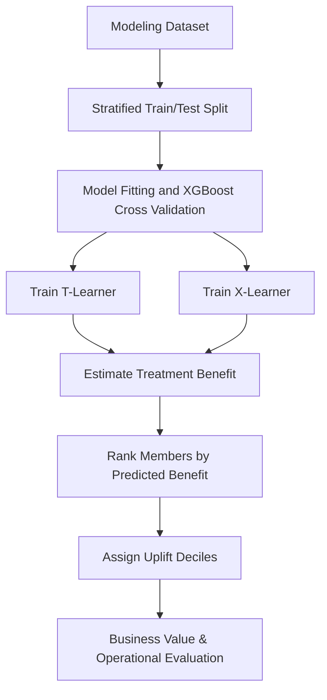

### Treatment-Effect Frameworks

Two causal treatment-effect frameworks are evaluated in this project.

#### T-Learner

The T-learner estimates treatment benefit by training separate outcome models for treated and untreated members. Each member receives predicted ED risk under both scenarios, and the treatment benefit is calculated as the difference between the two predicted risks.

```text
benefit_score = predicted ED risk if untreated − predicted ED risk if treated
```

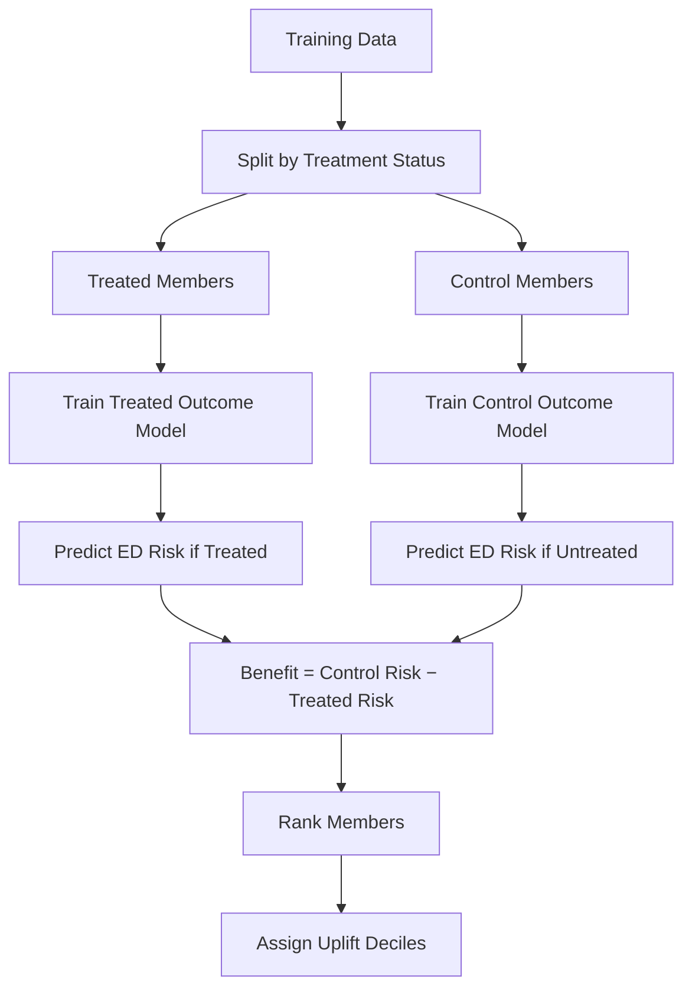

#### X-Learner

The X-learner estimates treatment benefit by first constructing counterfactual outcomes and then learning treatment effects directly. A propensity model combines information from treated and untreated members to produce a final treatment-effect estimate.

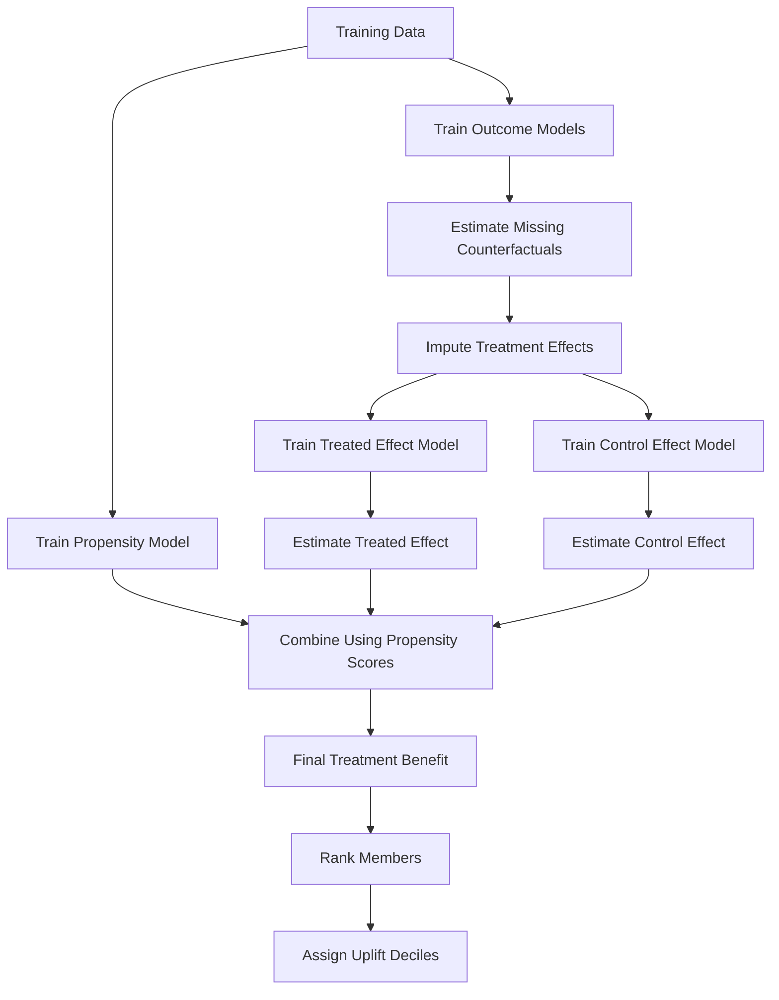

The T-learner provides a direct estimate of intervention benefit by comparing predicted risks under treatment and control. The X-learner provides an independent estimate of treatment effect and is used to evaluate whether the member rankings produced by the T-learner are consistent across causal modeling frameworks.

### Modeling Techniques

Two predictive modeling techniques are evaluated within each treatment-effect framework:

- **GLMNet** – a fixed elastic-net regularized logistic regression comparison model (`l1_ratio = 0.5`, `lambda = 1.0`) fitted without hyperparameter search.
- **XGBoost** – a gradient-boosted decision tree approach capable of modeling nonlinear relationships and feature interactions.

Comparing both modeling techniques helps evaluate whether treatment-benefit rankings are consistent across different predictive models.

## Analytical Task 2: Data Review

The Funds Combined modeling dataset contains 6,360 observations. Of these, 3,030 are treated and 3,330 are comparison/control observations, giving an overall treatment rate of 47.6%. The binary 90-day ED outcome contains 1,492 positive observations, for an overall prevalence of 23.5%. Missing `outcome_ed_90d` values were set to zero and all positive counts were converted to one.

The observed ED rate is 23.1% among treated observations and 23.8% among controls. The unadjusted difference is small and directionally favors intervention, but it is not interpreted as a causal effect because treatment assignment may be confounded by baseline member characteristics.

<!-- AUTO_TABLE:data_review_summary START -->
| Metric | Current value |
| ---: | ---: |
| Total observations | 6,360 |
| Treated observations | 3,030 |
| Untreated/control observations | 3,330 |
| Treatment rate | 47.6% |
| ED outcome events | 1,492 |
| Outcome prevalence | 23.5% |
| Treated observed ED rate | 23.1% |
| Control observed ED rate | 23.8% |
| Final predictors before one-hot encoding | 36 |
| Continuous/count numeric predictors | 10 |
| Binary indicator predictors | 21 |
| Multi-level categorical predictors | 5 |
| Model matrix columns after one-hot encoding | 371 |
<!-- AUTO_TABLE:data_review_summary END -->

The preprocessing audit retained 2,514 duplicate member-ID observations as separate source observations, filled 222 missing outcomes with zero, retained 745 death-flag observations, and removed `plan_type` and `program` as zero-variance predictors. These design choices should be considered when interpreting member-level results, particularly where repeated member IDs occur.

### Risk Tier Definition

`risk_tier` is preserved from the original Funds Combined assignment. It is not recalculated from `current_risk_score`. Tier 1 means lowest risk and Tier 5 means highest risk.

<!-- AUTO_TABLE:risk_tier_thresholds START -->
| Risk tier | Interpretation | Source rule |
|---:|---|---|
| 1 | Lowest risk | Original Funds Combined assignment |
| 2 | Tier 2 | Original Funds Combined assignment |
| 3 | Tier 3 | Original Funds Combined assignment |
| 4 | Tier 4 | Original Funds Combined assignment |
| 5 | Highest risk | Original Funds Combined assignment |
<!-- AUTO_TABLE:risk_tier_thresholds END -->

Among the 6,314 observations with valid tiers 1–5, the population is concentrated in Tiers 2 and 3. The 34 missing and 12 out-of-range source values are retained as unassigned for modeling but excluded from the five-tier population denominator.

<!-- AUTO_TABLE:risk_tier_population_summary START -->
| Risk tier | Members | Percent of valid-tier population | Current risk score range | Avg current risk score |
|---|---:|---:|---:|---:|
| 1 (lowest) | 1,132 | 17.9% | 0.0 to 5.3 | 2.6 |
| 2 | 2,139 | 33.9% | 0.8 to 21.0 | 5.2 |
| 3 | 2,136 | 33.8% | 0.8 to 28.6 | 7.6 |
| 4 | 673 | 10.7% | 2.2 to 27.3 | 10.1 |
| 5 (highest) | 234 | 3.7% | 2.1 to 27.4 | 12.8 |
<!-- AUTO_TABLE:risk_tier_population_summary END -->

<!-- AUTO_CHART:risk_tier_distribution START -->
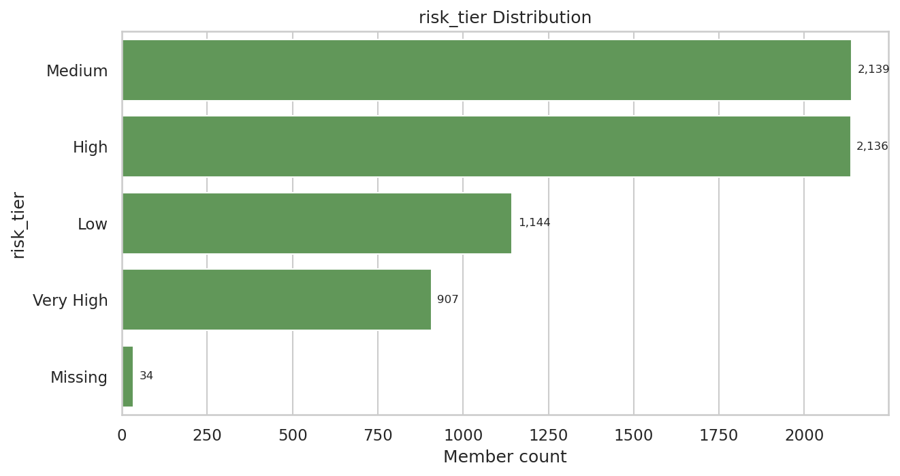
<!-- AUTO_CHART:risk_tier_distribution END -->

Supporting file:

- [`data_review_summary.csv`](Outputs/Uplift_Funds/Python/data_review_summary.csv)
- [`risk_tier_thresholds.csv`](Outputs/Uplift_Funds/Python/risk_tier_thresholds.csv)
- [`risk_tier_population_summary.csv`](Outputs/Uplift_Funds/Python/risk_tier_population_summary.csv)

---

## Evaluation Roadmap

The remaining analyses are organized into three evaluation stages that build upon one another.

| Evaluation Level | Question | Analytical Tasks |
|---|---|---|
| **Level 1: Outcome Model Validation** | Can the models accurately predict factual ED risk? | Task 3 |
| **Level 2: Uplift Model Validation** | Do the models produce credible treatment-effect estimates? | Tasks 4–5 |
| **Level 3: Operational Evaluation** | Does uplift targeting improve decision making and business value? | Tasks 6–7 |

---

# Evaluation Level 1: Outcome Model Validation

**Question:** Can the models accurately predict factual ED risk?

The first stage of the evaluation focuses on validating the factual outcome models. Before interpreting treatment effects, the underlying treated and control outcome models should demonstrate reasonable predictive performance.

---

## Analytical Task 3: Model Performance

Before estimating treatment effects, the factual outcome models should demonstrate reasonable predictive performance. This section evaluates the treated and control outcome models using discrimination, calibration, and prediction-quality metrics. Because the treatment-effect estimates produced by both the T-learner and X-learner depend on these factual outcome models, their performance provides the foundation for the remaining analyses.

XGBoost was tuned using five-fold cross-validation within the training data. GLMNet was fitted once per arm using the fixed elastic-net specification requested for this Funds analysis. The results below focus on held-out test performance.

### Event Counts And Modeling Constraints

The Funds dataset provides substantially more positive ED events than the PRP demonstration, including more than 200 events in each factual test arm. This supports more stable factual evaluation, although causal interpretation remains limited by observational treatment assignment and the absence of counterfactual outcomes.

<!-- AUTO_TABLE:factual_event_counts START -->
| Split | Group | N | Positive ED events | Negative ED events | Event rate |
| ---: | ---: | ---: | ---: | ---: | ---: |
| Train | Treated | 2,121 | 491 | 1,630 | 23.1% |
| Train | Control | 2,331 | 554 | 1,777 | 23.8% |
| Test | Treated | 909 | 210 | 699 | 23.1% |
| Test | Control | 999 | 237 | 762 | 23.7% |
<!-- AUTO_TABLE:factual_event_counts END -->

The event counts are sufficient for held-out discrimination and calibration summaries, but they do not remove confounding or make individual treatment effects directly observable.

### Discrimination Performance

Discrimination was evaluated using the area under the receiver operating characteristic curve (AUC) within the factual treatment groups.

<!-- AUTO_TABLE:model_performance_summary START -->
| Model | Treated CV AUC | Control CV AUC | Treated test AUC | Control test AUC |
| ---: | ---: | ---: | ---: | ---: |
| XGBoost | 0.8161 | 0.7933 | 0.8381 | 0.8036 |
| GLMNet | Not tuned | Not tuned | 0.7068 | 0.6888 |
<!-- AUTO_TABLE:model_performance_summary END -->

XGBoost demonstrates materially stronger held-out discrimination in both factual arms. Its average test AUC is 0.821, compared with 0.698 for GLMNet. This is the primary reason Evaluation Level 2 uses the XGBoost T-learner and XGBoost X-learner.

### Factual Discrimination And Prediction Separation

The table below complements AUC by comparing predicted probabilities between members who experienced an ED event and those who did not. A useful outcome model should assign higher predicted risk to members with observed ED events.

<!-- AUTO_TABLE:factual_prediction_separation START -->
| Model | Group | Positive events | Negative events | AUC | Avg pred for ED=1 | Avg pred for ED=0 | Avg difference | Median pred for ED=1 | Median pred for ED=0 |
| ---: | ---: | ---: | ---: | ---: | ---: | ---: | ---: | ---: | ---: |
| XGBoost | Treated | 210 | 699 | 0.8381 | 0.4252 | 0.1553 | 0.2699 | 0.4284 | 0.0849 |
| XGBoost | Control | 237 | 762 | 0.8036 | 0.4311 | 0.1630 | 0.2681 | 0.4359 | 0.0923 |
| GLMNet | Treated | 210 | 699 | 0.7068 | 0.3438 | 0.1938 | 0.1500 | 0.2970 | 0.1337 |
| GLMNet | Control | 237 | 762 | 0.6888 | 0.3452 | 0.2185 | 0.1267 | 0.2867 | 0.1560 |
<!-- AUTO_TABLE:factual_prediction_separation END -->

Both model families assign higher predicted probabilities to ED-positive members, but XGBoost produces substantially larger separation in both arms: approximately 27.0 percentage points for treated members and 26.8 points for controls.

### Brier Score And Calibration

Model calibration was evaluated using the Brier score and calibration error. Lower values indicate better agreement between predicted probabilities and observed outcomes.

Brier score:

```text
Brier score = (1 / n) * sum((outcome_i - predicted_probability_i)^2)
```

Calibration error:

```text
Calibration error = sum((n_bin / n_total) * abs(observed_ED_rate_bin - average_predicted_ED_rate_bin))
```

<!-- AUTO_TABLE:brier_calibration_summary START -->
| Model | Treated Brier | Control Brier | Treated calibration error | Control calibration error |
| ---: | ---: | ---: | ---: | ---: |
| XGBoost | 0.1301 | 0.1396 | 0.0398 | 0.0432 |
| GLMNet | 0.1698 | 0.1831 | 0.0629 | 0.0778 |
<!-- AUTO_TABLE:brier_calibration_summary END -->

XGBoost achieves lower Brier scores and lower weighted calibration error in both factual groups, indicating more accurate and better-calibrated probabilities than the fixed GLMNet comparison.

<!-- AUTO_CHART:xgboost_calibration_plot START -->
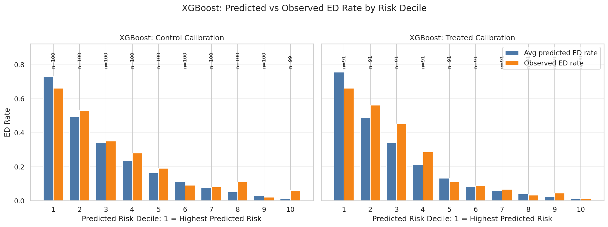
<!-- AUTO_CHART:xgboost_calibration_plot END -->

### Factual Prediction Range And Rare-Outcome Interpretation

The table below summarizes the distribution of predicted probabilities within the factual evaluation groups.

<!-- AUTO_TABLE:factual_prediction_ranges START -->
| Model | Group | Min | P10 | Median | Mean | P90 | Max |
| ---: | ---: | ---: | ---: | ---: | ---: | ---: | ---: |
| XGBoost | Treated | 0.0030 | 0.0238 | 0.1179 | 0.2176 | 0.5585 | 0.9521 |
| XGBoost | Control | 0.0010 | 0.0165 | 0.1310 | 0.2266 | 0.6203 | 0.9075 |
| GLMNet | Treated | 0.0017 | 0.0278 | 0.1598 | 0.2284 | 0.5518 | 0.9933 |
| GLMNet | Control | 0.0002 | 0.0300 | 0.1893 | 0.2485 | 0.5518 | 0.9968 |
<!-- AUTO_TABLE:factual_prediction_ranges END -->

Predictions span a broad range because the Funds outcome prevalence is 23.5% and baseline utilization varies meaningfully. XGBoost's strong event/non-event separation shows that its higher predictions generally correspond to higher observed factual risk.

### Model Performance Takeaway

On Funds Combined, XGBoost is the stronger factual outcome model across discrimination, Brier score, calibration error, and event/non-event prediction separation. It is therefore the preferred model family for the treatment-effect analyses that follow. This is a model-selection conclusion, not evidence that the modeled intervention effect is causal.

Supporting files:

- [`model_evaluation_summary.csv`](Outputs/Uplift_Funds/Python/model_evaluation_summary.csv)
- [`factual_event_count_summary.csv`](Outputs/Uplift_Funds/Python/factual_event_count_summary.csv)
- [`factual_prediction_separation.csv`](Outputs/Uplift_Funds/Python/factual_prediction_separation.csv)
- [`factual_prediction_ranges.csv`](Outputs/Uplift_Funds/Python/factual_prediction_ranges.csv)
- [`XGBoost/model_brier_scores.csv`](Outputs/Uplift_Funds/Python/T-Learner/XGBoost/model_brier_scores.csv)
- [`GLMNet/model_brier_scores.csv`](Outputs/Uplift_Funds/Python/T-Learner/GLMNet/model_brier_scores.csv)
- [`XGBoost/calibration_summary.csv`](Outputs/Uplift_Funds/Python/T-Learner/XGBoost/calibration_summary.csv)
- [`GLMNet/calibration_summary.csv`](Outputs/Uplift_Funds/Python/T-Learner/GLMNet/calibration_summary.csv)

## Level 1 Summary: Outcome Model Validation

XGBoost is the stronger factual outcome model across every evaluated metric. On the held-out test set, it achieves treated and control AUCs of 0.838 and 0.804, versus 0.707 and 0.689 for GLMNet. XGBoost also produces lower Brier scores (0.130 treated and 0.140 control) and lower calibration errors (0.040 and 0.043). Event/non-event probability separation is roughly twice as large for XGBoost as for GLMNet in both arms.

The test set contains 210 treated-arm events and 237 control-arm events, providing a stronger evaluation base than the PRP demonstration. The remaining limitation is causal identification: counterfactual outcomes are not observed and treatment is not known to be randomized. Nevertheless, the consistent predictive advantage supports selecting XGBoost for both the T-learner and X-learner analyses in Evaluation Level 2.

---

# Evaluation Level 2: Uplift Model Validation

**Question:** Do the models produce credible treatment-effect estimates?

Having established that XGBoost provides the stronger factual outcome models, the next stage evaluates the XGBoost T-learner and XGBoost X-learner treatment-effect estimates and member prioritization.

---

## Analytical Task 4: Treatment Effect Analysis

This section applies the XGBoost T-learner to estimate member-level treatment benefit. Each observation receives predicted ED risk under treatment and control, and the difference defines the benefit score.

```text
benefit_score = pred_ed_if_control - pred_ed_if_treated
```

A higher score indicates a larger modeled reduction in 90-day ED-event probability under intervention. A negative score means the treated prediction is higher than the control prediction and is used as a low-priority signal, not as proof that intervention causes harm.

<!-- AUTO_TABLE:top_benefit_examples START -->
| Member profile | Actual outcome | Treatment flag | Predicted ED if treated | Predicted ED if control | Benefit score | Uplift decile | Outreach interpretation |
| --- | ---: | ---: | ---: | ---: | ---: | ---: | --- |
| Highest benefit | 1 | 0 | 0.0383 | 0.9125 | 0.8741 | 1 | Strong outreach candidate because modeled ED risk is much lower under treatment. |
| High risk, low benefit | 1 | 1 | 0.9521 | 0.6769 | -0.2752 | 10 | High predicted factual risk, but intervention is not predicted to reduce that risk. |
| Low control risk, low benefit | 1 | 1 | 0.6550 | 0.0031 | -0.6519 | 10 | Low modeled control risk and negative modeled benefit make this a low uplift priority. |
| Sleeping dog / lowest benefit | 1 | 1 | 0.8219 | 0.0041 | -0.8177 | 10 | Lowest-priority signal because treated predicted risk exceeds control predicted risk. |
<!-- AUTO_TABLE:top_benefit_examples END -->

These examples show why uplift modeling differs from traditional risk prediction. A high-risk member may remain high risk under both scenarios or have little predicted improvement, while a member with moderate baseline risk may have a larger modeled reduction. The operational ranking is therefore based on expected intervention benefit rather than risk alone.

Across the held-out test set, the XGBoost T-learner's top decile contains 191 observations and has an average predicted benefit of 0.443. The observed control-minus-treated ED-rate gap in that decile is 0.337, with a 95% confidence interval from 0.137 to 0.508. The average predicted benefit falls inside that interval, which provides useful directional validation while not proving individual causal effects.

### Synthetic True-Benefit Validation

Synthetic true-benefit validation is not applicable to Funds Combined. Unlike the PRP dataset, Funds Combined does not provide a known treatment-effect formula or both potential outcomes for each member. Bias, MAE, RMSE, correlation with true benefit, and true-top-group recovery cannot be calculated without fabricating counterfactual ground truth.

The available validation therefore relies on held-out factual prediction, calibration, observed treated-versus-control gaps within uplift groups, uncertainty intervals, monotonic decile behavior, and agreement between independent T-learner and X-learner rankings.

Supporting files:

- [`XGBoost/uplift_scored_output.csv`](Outputs/Uplift_Funds/Python/T-Learner/XGBoost/uplift_scored_output.csv)
- [`XGBoost/top_benefit_decile_summary.csv`](Outputs/Uplift_Funds/Python/T-Learner/XGBoost/top_benefit_decile_summary.csv)
- [`XGBoost/uplift_observed_gap_by_decile.csv`](Outputs/Uplift_Funds/Python/T-Learner/XGBoost/uplift_observed_gap_by_decile.csv)
- [`Output parity manifest`](Outputs/Uplift_Funds/Python/output_parity_manifest.csv)

## Analytical Task 5: Uplift Decile Analysis

Observations are ranked by predicted treatment benefit and divided into ten uplift deciles, where Decile 1 represents the highest predicted benefit. This section compares the XGBoost T-learner and XGBoost X-learner rankings.

<!-- AUTO_TABLE:xgboost_t_vs_x_decile_summary START -->

**XGBoost T-learner deciles**

| Uplift decile | N | Avg benefit | Observed ED rate | Pred ED if treated | Pred ED if control | Treatment pct |
|---:|---:|---:|---:|---:|---:|---:|
| 1 | 191 | 0.4430 | 0.4660 | 0.1709 | 0.6139 | 39.8% |
| 2 | 191 | 0.2061 | 0.3455 | 0.2152 | 0.4213 | 42.9% |
| 3 | 191 | 0.1051 | 0.1780 | 0.1667 | 0.2718 | 52.9% |
| 4 | 191 | 0.0444 | 0.1152 | 0.1020 | 0.1465 | 50.3% |
| 5 | 190 | 0.0089 | 0.1158 | 0.1116 | 0.1205 | 46.3% |
| 6 | 191 | -0.0128 | 0.1047 | 0.0922 | 0.0794 | 49.7% |
| 7 | 191 | -0.0369 | 0.1047 | 0.1155 | 0.0786 | 50.8% |
| 8 | 191 | -0.0733 | 0.1571 | 0.2088 | 0.1355 | 40.8% |
| 9 | 191 | -0.1527 | 0.2984 | 0.3491 | 0.1964 | 49.2% |
| 10 | 190 | -0.3609 | 0.4579 | 0.5341 | 0.1732 | 53.7% |

**XGBoost X-learner deciles**

| Uplift decile | N | Avg benefit | Observed ED rate | Outcome-model ED if treated | Outcome-model ED if control | Treatment pct |
|---:|---:|---:|---:|---:|---:|---:|
| 1 | 191 | 0.1773 | 0.3089 | 0.1611 | 0.4411 | 48.2% |
| 2 | 191 | 0.0888 | 0.2251 | 0.1310 | 0.2497 | 48.7% |
| 3 | 191 | 0.0608 | 0.2251 | 0.1732 | 0.2611 | 52.4% |
| 4 | 191 | 0.0399 | 0.1518 | 0.1671 | 0.2154 | 46.6% |
| 5 | 190 | 0.0216 | 0.2474 | 0.1543 | 0.1801 | 45.8% |
| 6 | 191 | 0.0058 | 0.2356 | 0.1786 | 0.1894 | 49.7% |
| 7 | 191 | -0.0124 | 0.1466 | 0.1724 | 0.1501 | 49.2% |
| 8 | 191 | -0.0312 | 0.1937 | 0.2170 | 0.1626 | 44.0% |
| 9 | 191 | -0.0584 | 0.3037 | 0.3032 | 0.1789 | 42.9% |
| 10 | 190 | -0.1237 | 0.3053 | 0.4077 | 0.2089 | 48.9% |

_Note: T-learner benefit is the direct difference between control and treated outcome-model predictions. X-learner benefit is the propensity-weighted estimate from the second-stage effect models; its treated/control outcome-model columns provide risk context._

<!-- AUTO_TABLE:xgboost_t_vs_x_decile_summary END -->

<!-- AUTO_CHART:xgboost_t_vs_x_avg_benefit_charts START -->
| XGBoost T-learner | XGBoost X-learner |
|---|---|
| 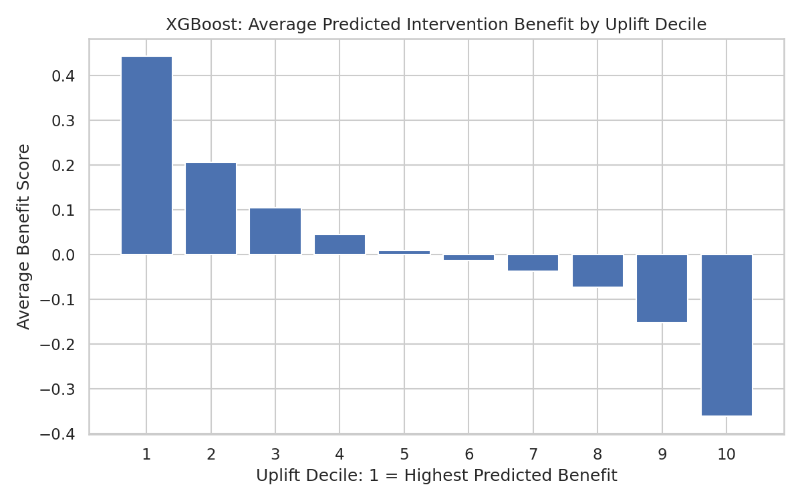 | 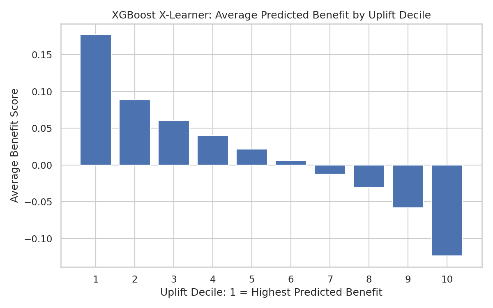 |
<!-- AUTO_CHART:xgboost_t_vs_x_avg_benefit_charts END -->

The T-learner shows a strong ordered gradient from 0.443 in Decile 1 to -0.361 in Decile 10. Its predicted-benefit and observed-gap ranks have a Spearman correlation of 0.952 across deciles, and the mean absolute predicted-versus-observed gap is 0.040. The observed gap changes from +0.337 in Decile 1 to -0.408 in Decile 10, supporting the ranking's direction at the group level.

### Risk Tier Versus Benefit Group

Benefit groups are model-relative terciles, assigned directly from each model's predicted benefit ranking:

| Benefit group | Definition |
|---|---|
| High benefit | Predicted-benefit tercile (top third) |
| Medium benefit | Predicted-benefit tercile (middle third) |
| Low benefit | Predicted-benefit tercile (bottom third) |

Funds risk tiers are the original ordered assignments from 1 (lowest) through 5 (highest); they are not derived from `current_risk_score`.

<!-- AUTO_CHART:risk_tier_by_benefit_group START -->
| XGBoost T-learner | XGBoost X-learner |
|---|---|
| 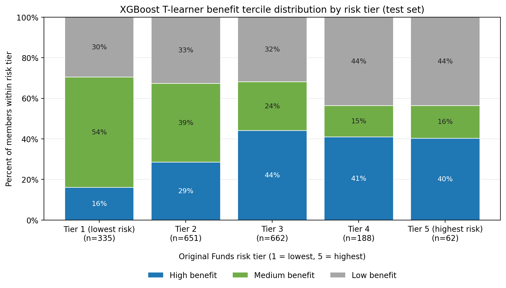 | 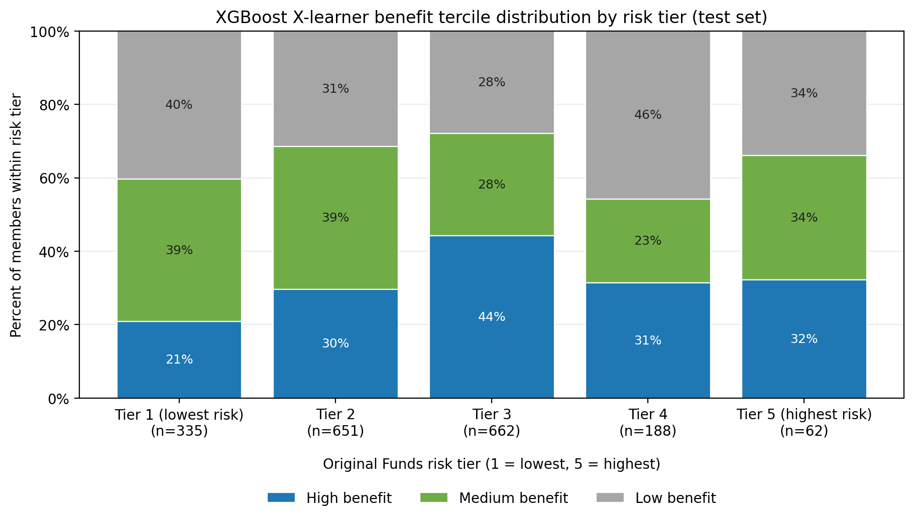 |
<!-- AUTO_CHART:risk_tier_by_benefit_group END -->

Risk and predicted benefit are related but not equivalent. For example, the X-learner assigns 9.9% of Tier 1 observations to the high-benefit group versus 29.5% of Tier 3 and 25.8% of Tier 5. The non-monotonic pattern shows why a benefit model adds information beyond risk tier alone.

### Framework Consistency

<!-- AUTO_TABLE:xgboost_xlearner_consistency_summary START -->
| Model | Pearson benefit score corr | Spearman benefit score corr | Top decile overlap | T-learner mean benefit | X-learner mean benefit |
|---|---:|---:|---:|---:|---:|
| XGBoost | 0.6213 | 0.6182 | 43.5% | 0.0173 | 0.0169 |
<!-- AUTO_TABLE:xgboost_xlearner_consistency_summary END -->

The moderate score correlations and 43.5% top-decile overlap indicate meaningful agreement without redundancy. The frameworks produce nearly identical population-average benefit but do not rank every member the same way, so their agreement is evidence of robustness rather than proof of correctness.

### True-Benefit Top-Group Overlap

True-benefit top-group overlap cannot be calculated for Funds Combined because no known counterfactual benefit ranking exists. The closest available comparison is cross-framework overlap: 43.5% of the XGBoost T-learner's top-decile observations are also in the XGBoost X-learner top decile.

Supporting files:

- [`XGBoost T-learner uplift deciles`](Outputs/Uplift_Funds/Python/T-Learner/XGBoost/uplift_decile_summary.csv)
- [`XGBoost X-learner uplift deciles`](Outputs/Uplift_Funds/Python/X-Learner/XGBoost/xlearner_decile_summary.csv)
- [`XGBoost T-learner risk-tier summary`](Outputs/Uplift_Funds/Python/T-Learner/XGBoost/tlearner_risk_tier_benefit_group_summary.csv)
- [`XGBoost X-learner risk-tier summary`](Outputs/Uplift_Funds/Python/X-Learner/XGBoost/xlearner_risk_tier_benefit_group_summary.csv)
- [`X-learner consistency summary`](Outputs/Uplift_Funds/Python/X-Learner/xlearner_vs_tlearner_consistency_summary.csv)

## Level 2 Summary: Uplift Model Validation

The XGBoost T-learner and XGBoost X-learner provide directionally credible but not causally proven treatment-benefit rankings. The T-learner has a pronounced decile gradient, strong agreement between predicted benefit and observed group-level gaps (Spearman 0.952), and a top-decile predicted benefit that falls within the observed-gap confidence interval. The X-learner produces a smoother, narrower benefit range and independently agrees with the T-learner at a moderate level.

The T-learner's Decile 1 average benefit is 0.443 versus -0.361 in Decile 10. The X-learner ranges from 0.177 to -0.124. Their mean predicted benefits are almost identical (0.0173 and 0.0169), their member-level Spearman correlation is 0.618, and top-decile overlap is 43.5%. This triangulation supports using the highest-ranked groups for operational evaluation, subject to prospective validation.

The evidence is materially stronger than the fixed GLMNet alternative, whose average factual test AUC is 0.698 and whose top-decile predicted benefit falls outside its observed-gap confidence interval. However, Funds Combined has no known true-benefit formula. The XGBoost rankings should therefore be treated as prioritization hypotheses to validate prospectively, not as individualized causal effects.

---

# Evaluation Level 3: Operational Evaluation

**Question:** Does uplift modeling improve decision making and business value?

The final stage evaluates whether the XGBoost treatment-effect estimates are interpretable and whether they support operational decisions through explainability and business-value assessment.

---

## Analytical Task 6: Variable Importance and Explainability

This section examines which baseline member characteristics are associated with predicted treatment benefit. Because Funds Combined does not provide known causal ground truth, feature importance is interpreted as an explanation of the fitted models—not proof that a feature causes intervention benefit.

Three complementary perspectives are used:

| Level | Question answered |
|---|---|
| Risk drivers | Which variables are most associated with predicted ED utilization? |
| Benefit drivers | Which variables contribute most to predicted treatment benefit? |
| Cross-framework comparison | Do the T-learner and X-learner surface similar patterns? |

### Risk Drivers

Before interpreting benefit drivers, it is useful to distinguish ED-risk drivers from treatment-benefit drivers. The XGBoost factual outcome models identify the following leading TreeSHAP risk terms:

| Group | Top current drivers |
|---|---|
| Treated model | `ed_visits_last_6m`, `total_cost_last_6m`, `age`, `percolator_score`, `housing_instability_flag` |
| Control model | `ed_visits_last_6m`, `total_cost_last_6m`, `percolator_score`, `age`, `cad_flag` |

Recent ED utilization is the strongest factual-risk driver in both arms. Cost, age, and Percolator risk also recur, suggesting stable baseline-risk signal. These findings should not automatically be interpreted as drivers of intervention benefit.

### Explainability Approaches

For XGBoost, TreeSHAP is used for the treated and control factual models, the T-learner benefit contrast, and the X-learner effect models.

| Method | Approach | What it answers | Advantage | Main limitation |
|---|---|---|---|---|
| Factual-model TreeSHAP | Attributes each treated/control outcome-model prediction to features. | What drives predicted ED risk in each factual arm? | Exact tree-model decomposition. | Risk importance is not treatment-benefit importance. |
| T-learner benefit SHAP | Contrasts control- and treated-model SHAP contributions. | What drives the modeled treated-versus-control contrast? | Directly reflects the two XGBoost outcome models. | Raw-margin contributions are not themselves probability differences. |
| X-learner weighted TreeSHAP | Propensity-weights SHAP values from treated/control effect models. | What drives the final X-learner benefit estimate? | Explains the second-stage treatment-effect model. | Explains the fitted model, not an identified causal mechanism. |

### Coefficient-Based Benefit Contributions

Coefficient-based benefit contributions are not applicable to XGBoost because boosted trees do not have a single linear coefficient vector. The corresponding PRP section is retained for structural parity, but the Funds report uses TreeSHAP—the model-appropriate explanation method—instead of presenting artificial coefficients.

### SHAP Benefit-Score Contributions

For the XGBoost T-learner, SHAP explains the contrast between the control and treated outcome models:

```text
benefit_score(X) = pred_ed_if_control(X) - pred_ed_if_treated(X)
```

For the XGBoost X-learner, weighted TreeSHAP explains:

```text
benefit_score(X) = (1 - propensity(X)) * tau_treated(X)
                 + propensity(X) * tau_control(X)
```

Mean absolute SHAP ranks global importance. Mean signed SHAP indicates the average direction of the fitted contribution. Correlated features can share or absorb attribution, so both measures should be treated as model evidence.

<!-- AUTO_TABLE:xgboost_benefit_shap_magnitude START -->
<table><tr>
<td valign="top" width="50%"><strong>XGBoost T-learner</strong>
<table><thead><tr><th>Feature</th><th>Mean absolute benefit SHAP</th></tr></thead><tbody>
<tr><td><code>percolator_score</code></td><td>0.3497</td></tr>
<tr><td><code>total_cost_last_6m</code></td><td>0.3296</td></tr>
<tr><td><code>current_risk_score</code></td><td>0.2478</td></tr>
<tr><td><code>rx_count_last_6m</code></td><td>0.2253</td></tr>
<tr><td><code>age</code></td><td>0.2129</td></tr>
</tbody></table></td>
<td valign="top" width="50%"><strong>XGBoost X-learner</strong>
<table><thead><tr><th>Feature</th><th>Mean absolute benefit SHAP</th></tr></thead><tbody>
<tr><td><code>percolator_score</code></td><td>0.0220</td></tr>
<tr><td><code>total_cost_last_6m</code></td><td>0.0205</td></tr>
<tr><td><code>housing_instability_flag</code></td><td>0.0184</td></tr>
<tr><td><code>admits_last_6m</code></td><td>0.0135</td></tr>
<tr><td><code>ed_visits_last_6m</code></td><td>0.0129</td></tr>
</tbody></table></td>
</tr></table>
<!-- AUTO_TABLE:xgboost_benefit_shap_magnitude END -->

The current top signed contributions are:

<!-- AUTO_TABLE:xgboost_benefit_shap_signed START -->
<table><tr>
<td valign="top" width="50%"><strong>XGBoost T-learner</strong>
<table><thead><tr><th>Direction</th><th>Feature</th><th>Mean signed SHAP</th></tr></thead><tbody>
<tr><td>Increase benefit</td><td><code>ed_visits_last_6m</code></td><td>0.0267</td></tr>
<tr><td>Increase benefit</td><td><code>housing_instability_flag</code></td><td>0.0253</td></tr>
<tr><td>Increase benefit</td><td><code>admits_last_6m</code></td><td>0.0245</td></tr>
<tr><td>Decrease benefit</td><td><code>current_risk_score</code></td><td>-0.0388</td></tr>
<tr><td>Decrease benefit</td><td><code>cad_flag</code></td><td>-0.0332</td></tr>
</tbody></table></td>
<td valign="top" width="50%"><strong>XGBoost X-learner</strong>
<table><thead><tr><th>Direction</th><th>Feature</th><th>Mean signed SHAP</th></tr></thead><tbody>
<tr><td>Increase benefit</td><td><code>percolator_score</code></td><td>0.0014</td></tr>
<tr><td>Increase benefit</td><td><code>total_cost_last_6m</code></td><td>0.0012</td></tr>
<tr><td>Increase benefit</td><td><code>rx_count_last_6m</code></td><td>0.0010</td></tr>
<tr><td>Decrease benefit</td><td><code>current_risk_score</code></td><td>-0.0011</td></tr>
<tr><td>Decrease benefit</td><td><code>ed_visits_last_6m</code></td><td>-0.0009</td></tr>
</tbody></table></td>
</tr></table>
<!-- AUTO_TABLE:xgboost_benefit_shap_signed END -->

<!-- AUTO_CHART:xgboost_benefit_shap_driver_charts START -->
| XGBoost T-learner SHAP | XGBoost X-learner SHAP |
|---|---|
| 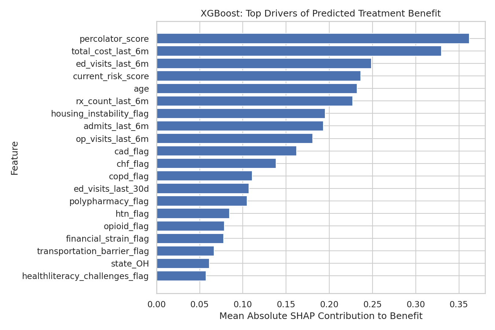 | 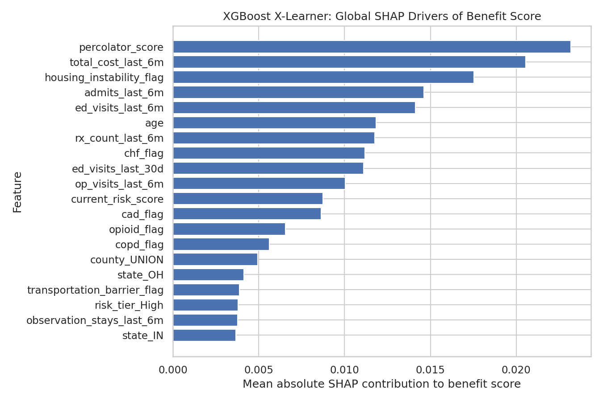 |
<!-- AUTO_CHART:xgboost_benefit_shap_driver_charts END -->

The two frameworks agree that `percolator_score` and `total_cost_last_6m` are major global benefit features. They also surface utilization, admissions, medication burden, and housing instability. Direction differs for some terms—especially recent ED utilization and current risk—which reinforces that explanation depends on the causal learner and should not be reduced to a single universal driver list.

### Known Synthetic Driver Alignment

Known-driver recovery and member-level alignment cannot be evaluated for Funds Combined because the dataset has no known synthetic treatment-effect formula. No true-driver counts, direction-recovery claims, or SHAP-to-true-contribution correlations are reported. Prospective intervention outcomes, sensitivity analyses, and external clinical review are needed before these explanations are used as evidence of causal mechanisms.

Supporting files:

- [`XGBoost factual-model SHAP importance`](Outputs/Uplift_Funds/Python/T-Learner/XGBoost/shap_importance_treated_control_models.csv)
- [`XGBoost T-learner benefit SHAP importance`](Outputs/Uplift_Funds/Python/T-Learner/XGBoost/shap_importance_benefit_score.csv)
- [`XGBoost treated-model SHAP chart`](Outputs/Uplift_Funds/Python/T-Learner/XGBoost/dashboard_shap_treated_model.png)
- [`XGBoost control-model SHAP chart`](Outputs/Uplift_Funds/Python/T-Learner/XGBoost/dashboard_shap_control_model.png)
- [`XGBoost T-learner benefit SHAP chart`](Outputs/Uplift_Funds/Python/T-Learner/XGBoost/dashboard_shap_benefit_score.png)
- [`XGBoost X-learner benefit-driver importance`](Outputs/Uplift_Funds/Python/X-Learner/XGBoost/xlearner_benefit_driver_importance.csv)
- [`XGBoost X-learner member SHAP values`](Outputs/Uplift_Funds/Python/X-Learner/XGBoost/xgboost_xlearner_member_benefit_shap_values.csv)
- [`XGBoost X-learner SHAP reconciliation`](Outputs/Uplift_Funds/Python/X-Learner/XGBoost/xgboost_xlearner_global_benefit_shap_reconciliation.csv)

## Analytical Task 7: Business Value Assessment

This section compares benefit-based targeting with traditional current-risk targeting using the same calculation structure as the PRP report:

```text
expected_ed_rate_reduction = avg_benefit_score
expected_ed_visits_avoided = n * expected_ed_rate_reduction
gross_savings = expected_ed_visits_avoided * cost_per_ed_visit
intervention_cost = n * cost_per_intervention
net_savings = gross_savings - intervention_cost
roi = net_savings / intervention_cost
```

The analysis assumes **$1,200 per ED visit** and **$250 per intervention**. All values are model-based scenarios, not realized savings.

### XGBoost T-Learner Targeting

<!-- AUTO_TABLE:xgboost_tlearner_roi_summary START -->
| Targeted group | Members targeted | Uplift gross savings | Current-risk gross savings | Uplift advantage |
|---|---:|---:|---:|---:|
| Top 10% | 190 | $101,201 | $9,879 | $91,322 |
| Top 20% | 380 | $148,422 | $5,885 | $142,537 |
| Top 30% | 570 | $172,626 | $6,589 | $166,037 |
| Top 40% | 760 | $182,935 | $5,070 | $177,865 |
| Top 50% | 950 | $185,107 | $13,538 | $171,569 |
<!-- AUTO_TABLE:xgboost_tlearner_roi_summary END -->

At the model's native uplift-decile grouping, Decile 1 contains 191 observations, estimates 84.6 avoided ED events and $101,536 in gross savings, and yields estimated net savings of $53,786 after intervention cost (ROI 1.13). Later deciles have much smaller or negative benefit, making the model operationally useful primarily for focused targeting.

<!-- AUTO_CHART:xgboost_tlearner_roi START -->
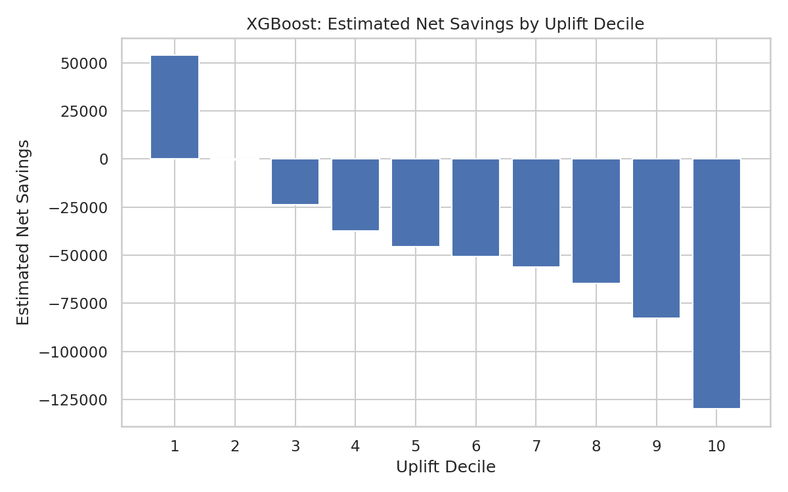
<!-- AUTO_CHART:xgboost_tlearner_roi END -->

### XGBoost X-Learner Targeting

<!-- AUTO_TABLE:xgboost_xlearner_roi_summary START -->
| Targeted group | Members targeted | X-learner gross savings | Current-risk gross savings | X-learner advantage |
|---|---:|---:|---:|---:|
| Top 10% | 190 | $40,503 | $9,641 | $30,862 |
| Top 20% | 380 | $60,801 | $8,917 | $51,883 |
| Top 30% | 570 | $74,736 | $12,809 | $61,927 |
| Top 40% | 760 | $83,907 | $15,938 | $67,969 |
| Top 50% | 950 | $88,910 | $19,772 | $69,139 |
<!-- AUTO_TABLE:xgboost_xlearner_roi_summary END -->

The X-learner also strongly favors benefit-based targeting over current-risk ranking. Through the top 50%, it estimates $88,910 in cumulative gross savings versus $19,772 under the current-risk ordering. Its benefit estimates are more conservative than the T-learner's, and the $250 intervention-cost assumption produces negative net savings within each individual X-learner decile. This distinction between gross targeting advantage and net ROI is important for decision making.

<!-- AUTO_CHART:xgboost_xlearner_roi START -->
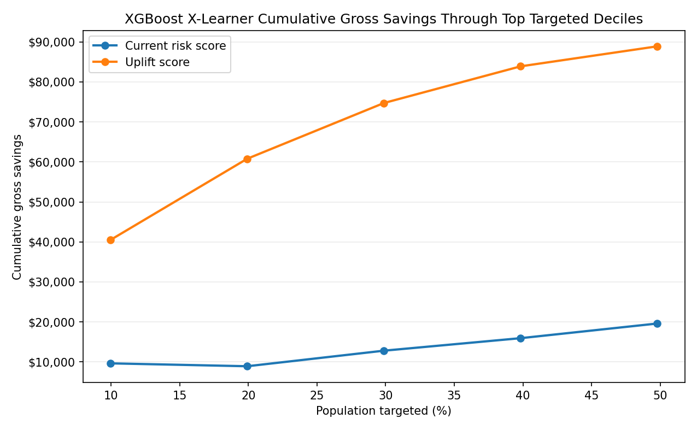
<!-- AUTO_CHART:xgboost_xlearner_roi END -->

The X-learner's marginal advantage over current-risk targeting remains positive through the fifth targeting band and becomes negative after the top 50%. This indicates that broad expansion beyond the highest-benefit half of the test population dilutes modeled value.

<!-- AUTO_CHART:xgboost_xlearner_marginal_advantage START -->
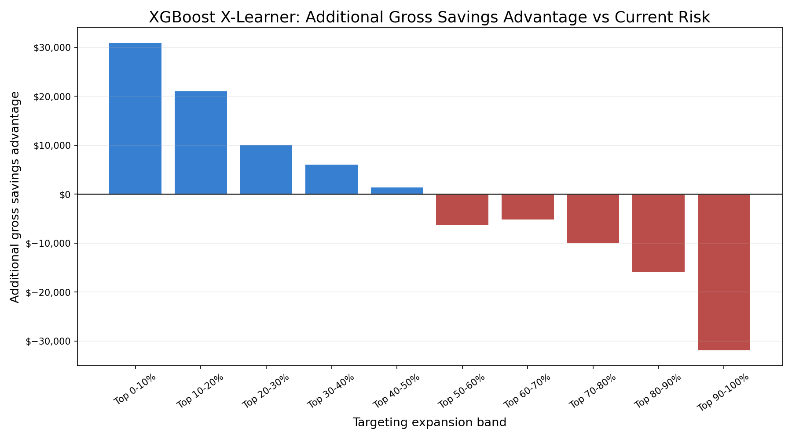
<!-- AUTO_CHART:xgboost_xlearner_marginal_advantage END -->

These estimates compare model-based targeting strategies rather than realized financial outcomes. Actual value depends on intervention effectiveness, achievable outreach capacity, intervention cost, ED-event cost, treatment adherence, duplicate-member handling, and prospective validation.

Supporting files:

- [`XGBoost T-learner ROI by decile`](Outputs/Uplift_Funds/Python/T-Learner/XGBoost/uplift_roi_by_decile.csv)
- [`XGBoost T-learner top-decile summary`](Outputs/Uplift_Funds/Python/T-Learner/XGBoost/top_benefit_decile_summary.csv)
- [`XGBoost X-learner ROI by decile`](Outputs/Uplift_Funds/Python/X-Learner/XGBoost/xlearner_roi_by_decile.csv)
- [`XGBoost X-learner cumulative targeting`](Outputs/Uplift_Funds/Python/X-Learner/XGBoost/cumulative_gross_savings_by_targeting.csv)
- [`XGBoost X-learner marginal targeting`](Outputs/Uplift_Funds/Python/X-Learner/XGBoost/marginal_gross_savings_by_targeting.csv)
- [`XGBoost X-learner marginal advantage`](Outputs/Uplift_Funds/Python/X-Learner/XGBoost/marginal_gross_savings_advantage_vs_current_risk.csv)

## Level 3 Summary: Operational Evaluation

The XGBoost models provide a coherent operational case for benefit-based prioritization, with the T-learner serving as the more aggressive targeting model and the X-learner as a more conservative robustness check.

On explainability, recent ED utilization dominates factual risk, while Percolator score, cost, utilization, admissions, medication burden, and housing instability contribute to benefit ranking. Several features change direction across frameworks, so SHAP should be used to explain model behavior—not to make causal claims about individual factors.

On business value, the XGBoost T-learner's top decile produces estimated net savings of $53,786 and ROI of 1.13 under the notebook assumptions. Through the top 30%, its uplift ranking captures approximately $172,626 in modeled gross savings versus $6,589 under current-risk ranking. The XGBoost X-learner estimates a smaller but still substantial top-30% gross targeting advantage of approximately $61,927. Both frameworks indicate that model-based benefit ranking concentrates more estimated value than current-risk ranking.

The operational recommendation is to use the XGBoost T-learner ranking as the primary candidate for a controlled pilot, use XGBoost X-learner agreement as a robustness signal, and concentrate initial outreach in the highest-benefit groups. Before production deployment, the organization should validate results prospectively, define member-level deduplication rules, monitor calibration and subgroup performance, and replace modeled savings with realized utilization and cost outcomes.
