# PRISM Intervention Benefit Modeling Oregon Report Draft

## Background

PRISM is intended to focus intervention resources on members most likely to benefit, not simply those most likely to have an emergency department event. This Oregon report mirrors the organization, methods, exhibits, and decision sequence of the **PRISM Intervention Benefit Modeling Funds Report Draft**, while using the Oregon two-year cohort and Oregon-specific preprocessing.

The analysis includes 1,268 episodes from 1,218 unique members. The outcome is a binary indicator of any emergency department use within 90 days. Treatment is engagement in PRISM. A positive benefit score means the model predicts lower 90-day ED-event risk under engagement than under no engagement.

> **Interpretation boundary.** This is an observational modeling analysis. Individual counterfactual outcomes are not observed, treatment was not randomized, and decile-level treatment/control counts are small. Results support model comparison and pilot design; they do not by themselves establish a causal intervention effect.

## Business Question

Which Oregon members are most likely to benefit from PRISM engagement, measured as a modeled reduction in the probability of an ED event within 90 days?

## Project Objectives

1. Apply the same T-Learner and X-Learner workflow used in the Funds Combined analysis.
2. Use only variables available before intervention and explicitly exclude treatment, outcome, and post-intervention information from predictors.
3. Compare XGBoost with regularized logistic regression using the same model-selection and evaluation logic as the Funds report.
4. Evaluate factual outcome prediction, benefit ranking, framework consistency, explainability, and illustrative targeting value.
5. Produce an Oregon report with the same reporting structure and visual treatment as the Funds report.

## Analytical Task 1: Understanding the Modeling Framework

### Outcome Variable

`outcome_ed_90d` is the outcome of interest. It was converted to binary form: any value greater than zero is 1 and zero is 0. Missing values were assigned to 0 as specified. The final cohort contains 272 events, an overall prevalence of 21.5%.

### Treatment Variable

`Engaged_flag = 1` defines treatment and `Engaged_flag = 0` defines control. `OptOut_flag` contains the inverse treatment information and was used only as a validation check before being excluded. The fields agreed for all modeling records; there were 0 contradictions and 0 unresolved rows.

### Predictor Variables

Only baseline variables were eligible. The preprocessing audit retained 34 source predictors and produced 102 encoded model features. Numeric imputation, categorical levels, and zero-variance filtering were learned from training data only.

The following post-intervention variables were detected and excluded before any model matrix was built:

<!-- AUTO_TABLE: oregon_post_treatment_exclusions -->
| Excluded post-intervention variable | Reason |
| --- | --- |
| ProgramStart | post-treatment leakage control |
| ProgramEnd | post-treatment leakage control |
| engaged_date | post-treatment leakage control |
| engagement_length | post-treatment leakage control |
| InterventionCount | post-treatment leakage control |
| SuccessfulInterventions | post-treatment leakage control |
| outcome_ed_30d | post-treatment leakage control |
| outcome_ed_6MO | post-treatment leakage control |
| outcome_admit_30d | post-treatment leakage control |
| outcome_admit_90d | post-treatment leakage control |
| outcome_admit_6MO | post-treatment leakage control |
| outcome_total_cost_90d | post-treatment leakage control |
| outcome_total_cost_6MO | post-treatment leakage control |

The member identifier was retained only for grouped splitting and traceability. Treatment and outcome fields were never predictors. No death-related field was available in the Oregon source, so no death flag could be derived; no member was excluded on the basis of death. The 192 missing and 93 out-of-range source risk-tier values were modeled as an explicit `Missing` category. Training-set zero-variance fields `client_contract`, `plan_type`, and `program` were removed.

### Overall Modeling Workflow

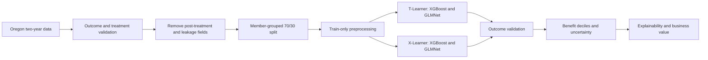

All 1,268 source episodes were retained, including 50 repeated member episodes. Grouping the split by `member_id` produced 886 training rows and 382 test rows with zero member overlap. The SageMaker execution audit records: `CUDA GPU required on device 0; modeling grid unchanged`.

### Treatment-Effect Frameworks

#### T-Learner

The T-Learner fits one outcome model among engaged records and a second among controls. Both models score every held-out record. The estimated benefit is:

`predicted ED risk without engagement − predicted ED risk with engagement`

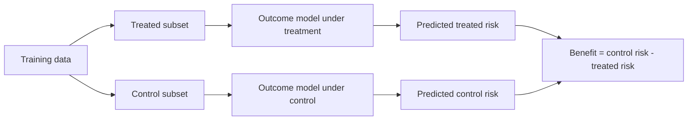

#### X-Learner

The X-Learner first models factual outcomes, imputes treatment effects for each treatment group, fits treatment-effect models, and combines their predictions using the estimated propensity score. It is included as a sensitivity analysis because it handles treatment-group imbalance differently from the T-Learner.

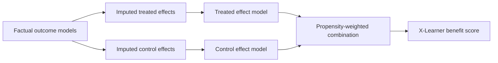

### Modeling Techniques

The report retains the Funds modeling choices: XGBoost and regularized logistic regression, the same hyperparameter-search logic, stratified cross-validation within treatment group, fixed random seeds, held-out member-grouped evaluation, T- and X-Learner constructions, benefit deciles, SHAP-style explanations, and the same illustrative economic assumptions. XGBoost used the SageMaker CUDA device recorded in the audit; no CPU refit was substituted for these results.

## Analytical Task 2: Data Review

<!-- AUTO_TABLE: oregon_data_review -->
| Measure | Oregon result |
| --- | --- |
| Analytical records | 1,268 |
| Unique members | 1,218 |
| Treated records | 882 (69.6%) |
| Control records | 386 (30.4%) |
| 90-day ED events | 272 (21.5%) |
| Treated outcome rate | 18.8% |
| Control outcome rate | 27.5% |
| Training rows / unique members | 886 / 852 |
| Test rows / unique members | 382 / 366 |
| Member overlap across splits | 0 |

The raw treated outcome rate (18.8%) is lower than the raw control outcome rate (27.5%). That difference is descriptive, not an adjusted treatment effect, because engagement was not randomized.

### Risk Tier Definition

Oregon source risk tiers were retained as baseline categories rather than reconstructed from the current risk score. Valid tiers covered 983 records.

<!-- AUTO_TABLE: oregon_risk_tier_definition -->
| Risk tier | Label | Records | Share of valid tiers | Minimum score | Maximum score | Average score |
| --- | --- | --- | --- | --- | --- | --- |
| 1 | Tier 1 (lowest risk) | 98 | 10.0% | 0.168 | 7.061 | 0.979 |
| 2 | Tier 2 | 150 | 15.3% | 0.287 | 21.704 | 1.661 |
| 3 | Tier 3 | 235 | 23.9% | 0.457 | 17.675 | 2.588 |
| 4 | Tier 4 | 456 | 46.4% | 0.701 | 60.654 | 6.807 |
| 5 | Tier 5 (highest risk) | 44 | 4.5% | 2.813 | 39.719 | 12.603 |

## Evaluation Roadmap

The Funds report evaluates models in three linked levels. Oregon follows the same sequence:

1. **Outcome model validation:** discrimination, factual separation, Brier score, and calibration.
2. **Uplift model validation:** benefit-score behavior, decile ranking, uncertainty, risk-versus-benefit mix, and agreement between T- and X-Learners.
3. **Operational interpretation:** model drivers and illustrative business value under fixed economic assumptions.

# Evaluation Level 1: Outcome Model Validation

## Analytical Task 3: Model Performance

### Event Counts And Modeling Constraints

<!-- AUTO_TABLE: oregon_factual_event_counts -->
| Split | Treatment group | Records | ED events | No ED event | Event rate |
| --- | --- | --- | --- | --- | --- |
| Train | Treated | 616 | 116 | 500 | 18.8% |
| Train | Control | 270 | 74 | 196 | 27.4% |
| Test | Treated | 266 | 50 | 216 | 18.8% |
| Test | Control | 116 | 32 | 84 | 27.6% |

The held-out control group contains 116 records and 32 events. These counts are adequate for an initial comparison but still make subgroup AUC, calibration, and decile-level estimates imprecise. Wide confidence intervals later in the report are therefore expected rather than anomalous.

### Discrimination Performance

<!-- AUTO_TABLE: oregon_model_performance -->
| Model | Treated CV AUC | Control CV AUC | Treated test AUC | Control test AUC | Treated Brier | Control Brier | Treated calibration error | Control calibration error |
| --- | --- | --- | --- | --- | --- | --- | --- | --- |
| XGBoost T-Learner | 0.786 | 0.807 | 0.715 | 0.725 | 0.137 | 0.172 | 0.062 | 0.088 |
| GLMNet T-Learner | — | — | 0.705 | 0.792 | 0.152 | 0.159 | 0.090 | 0.120 |

The GLMNet T-Learner has the higher mean held-out factual AUC (0.749 versus 0.720 for the XGBoost T-Learner), driven by its control-group AUC. The XGBoost T-Learner is slightly stronger for treated records and has the better average calibration error (0.075 versus 0.105). The Oregon result is therefore mixed rather than a simple winner on every metric.

### Factual Discrimination And Prediction Separation

<!-- AUTO_TABLE: oregon_prediction_separation -->
| Model | Group | AUC | Mean prediction: event | Mean prediction: no event | Difference |
| --- | --- | --- | --- | --- | --- |
| XGBoost T-Learner | Treated | 0.715 | 0.321 | 0.180 | 0.141 |
| XGBoost T-Learner | Control | 0.725 | 0.362 | 0.220 | 0.143 |
| GLMNet T-Learner | Treated | 0.705 | 0.344 | 0.161 | 0.183 |
| GLMNet T-Learner | Control | 0.792 | 0.515 | 0.188 | 0.327 |

<table><tr><td width="50%" valign="top">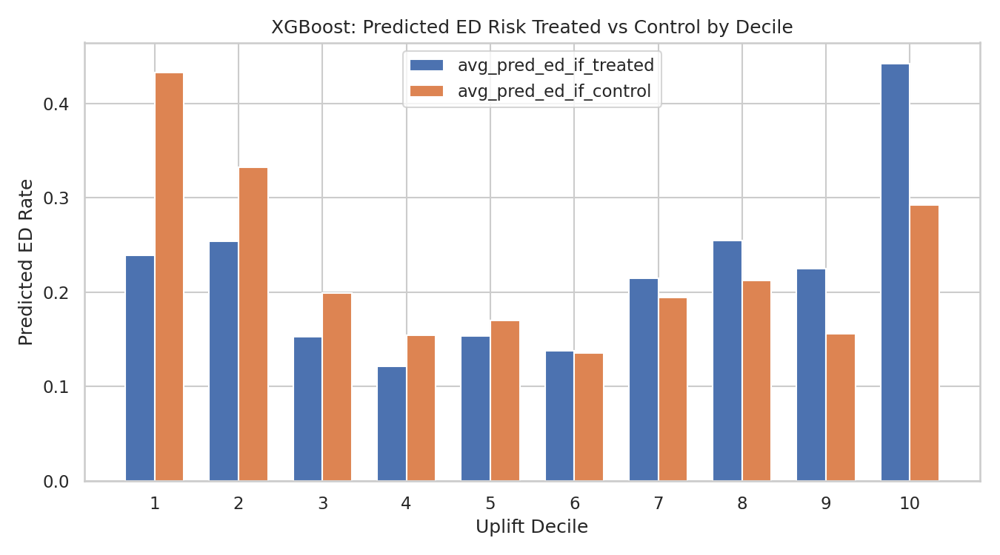</td><td width="50%" valign="top">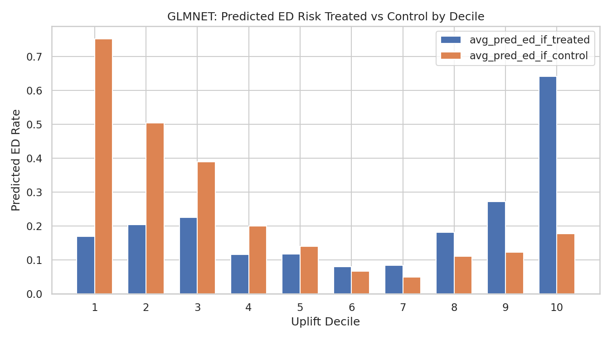</td></tr></table>

### Brier Score And Calibration

Both T-Learner model families have similar average Brier scores, while the XGBoost T-Learner has lower mean calibration error. Calibration matters directly here because a benefit score is the difference between two predicted probabilities; bias in either potential-outcome model can distort the estimated treatment-effect scale.

<!-- AUTO_CHART: oregon_calibration_comparison -->
<table><tr><td width="50%" valign="top"></td><td width="50%" valign="top">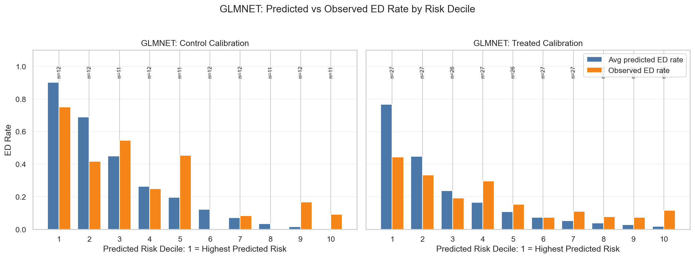</td></tr></table>

### Factual Prediction Range And Rare-Outcome Interpretation

<!-- AUTO_TABLE: oregon_prediction_ranges -->
| Model | Group | Minimum | P10 | Median | Mean | P90 | Maximum |
| --- | --- | --- | --- | --- | --- | --- | --- |
| XGBoost T-Learner | Treated | 0.057 | 0.065 | 0.151 | 0.207 | 0.472 | 0.716 |
| XGBoost T-Learner | Control | 0.057 | 0.076 | 0.198 | 0.259 | 0.525 | 0.671 |
| GLMNet T-Learner | Treated | 0.000 | 0.025 | 0.085 | 0.195 | 0.568 | 0.974 |
| GLMNet T-Learner | Control | 0.000 | 0.012 | 0.160 | 0.278 | 0.794 | 0.975 |

The event is not extremely rare overall, but subgroup sizes remain limited. Some probabilities approach the edges of the observed range, especially for GLMNet; this helps explain why GLMNet can rank records well while overstating the magnitude of its top predicted benefit.

### Model Performance Takeaway

For direct methodological parity with the Funds report, the XGBoost T-Learner remains the primary Oregon T-Learner and the GLMNet T-Learner remains the transparent sensitivity model. That choice is supported by the XGBoost T-Learner's stronger calibration and plausible top-decile benefit scale, not by universal AUC dominance. The GLMNet T-Learner's higher average factual AUC is reported explicitly and should be revisited in future cohorts.

## Level 1 Summary: Outcome Model Validation

The factual outcome models contain useful signal: held-out AUCs range from 0.705 to 0.792. However, discrimination alone does not validate uplift ranking. The XGBoost T-Learner offers the better probability calibration, while the GLMNet T-Learner has stronger average discrimination. Both therefore move forward to treatment-effect evaluation, with the XGBoost T-Learner as the primary T-Learner and the GLMNet T-Learner as a sensitivity check.

# Evaluation Level 2: Uplift Model Validation

## Analytical Task 4: Treatment Effect Analysis

For each held-out member episode, the T-Learner produces predicted ED risk under engagement and predicted ED risk under control. The difference is the modeled benefit. X-Learner scores provide a second estimate built from imputed treatment effects and propensity-weighted combination.

The top XGBoost T-Learner decile averages 0.194 predicted benefit—approximately 19.4 percentage points of modeled ED-risk reduction. Its observed control-minus-treated gap is 0.148, but the 95% interval (-0.119 to 0.443) includes zero.

### Synthetic True-Benefit Validation

The Funds workflow includes synthetic-data checks because true individual treatment effects are known in simulation. The Oregon observational file has no observed counterfactual and therefore no true individual benefit label. PEHE, true-benefit correlation, and true top-group overlap are not identifiable here. Oregon uses the corresponding real-data diagnostics available without inventing ground truth: observed within-decile treated/control gaps with Wilson intervals, T-versus-X consistency, and sensitivity to model family.

## Analytical Task 5: Uplift Decile Analysis

The strongest predicted benefit should appear in decile 1 and decrease toward decile 10. Predicted ranking is clear for both XGBoost learners, but observed gaps are noisy.

<!-- AUTO_TABLE: oregon_tlearner_deciles -->
| Decile | N | Average predicted benefit | Observed control - treated gap | 95% CI | Treated N | Control N |
| --- | --- | --- | --- | --- | --- | --- |
| 1 | 39 | 0.194 | 0.148 | -0.119 to 0.443 | 27 | 12 |
| 2 | 38 | 0.078 | 0.000 | -0.288 to 0.288 | 19 | 19 |
| 3 | 38 | 0.046 | 0.073 | -0.129 to 0.474 | 32 | 6 |
| 4 | 38 | 0.033 | 0.017 | -0.159 to 0.308 | 27 | 11 |
| 5 | 38 | 0.016 | 0.179 | -0.087 to 0.471 | 26 | 12 |
| 6 | 39 | -0.002 | 0.024 | -0.224 to 0.383 | 31 | 8 |
| 7 | 38 | -0.020 | 0.019 | -0.230 to 0.326 | 26 | 12 |
| 8 | 38 | -0.042 | 0.096 | -0.146 to 0.393 | 26 | 12 |
| 9 | 38 | -0.069 | -0.084 | -0.307 to 0.190 | 23 | 15 |
| 10 | 38 | -0.150 | 0.238 | -0.073 to 0.546 | 29 | 9 |

<!-- AUTO_CHART: oregon_tlearner_decile_pair -->
<table><tr><td width="50%" valign="top"></td><td width="50%" valign="top"></td></tr></table>

The XGBoost T-Learner's decile Spearman correlation between predicted benefit and observed gap is -0.091. The negative, near-zero value means the observed gap does not decline monotonically with predicted benefit. This is the central validation weakness of the current T-Learner result.

The XGBoost X-Learner produces a wider score spread, from 0.267 in decile 1 to -0.198 in decile 10. Its first-decile observed gap is 0.306, with a 95% interval of 0.025 to 0.579.

<!-- AUTO_TABLE: oregon_xlearner_deciles -->
| Decile | N | Average predicted benefit | Observed control - treated gap | 95% CI | Treated N | Control N |
| --- | --- | --- | --- | --- | --- | --- |
| 1 | 39 | 0.267 | 0.306 | 0.025 to 0.579 | 27 | 12 |
| 2 | 38 | 0.128 | 0.185 | -0.098 to 0.468 | 25 | 13 |
| 3 | 38 | 0.059 | -0.058 | -0.308 to 0.259 | 26 | 12 |
| 4 | 38 | 0.011 | -0.036 | -0.278 to 0.256 | 24 | 14 |
| 5 | 38 | -0.012 | 0.117 | -0.125 to 0.467 | 30 | 8 |
| 6 | 39 | -0.033 | 0.566 | 0.247 to 0.799 | 29 | 10 |
| 7 | 38 | -0.056 | -0.057 | -0.249 to 0.243 | 27 | 11 |
| 8 | 38 | -0.081 | -0.179 | -0.386 to 0.097 | 24 | 14 |
| 9 | 38 | -0.121 | -0.202 | -0.442 to 0.111 | 24 | 14 |
| 10 | 38 | -0.198 | 0.275 | -0.010 to 0.601 | 30 | 8 |

<!-- AUTO_CHART: oregon_xlearner_decile_pair -->
<table><tr><td width="50%" valign="top"></td><td width="50%" valign="top"></td></tr></table>

GLMNet's T-Learner has a positive decile Spearman correlation (0.636), but its top predicted benefit (0.584) lies above the observed-gap 95% interval (-0.035 to 0.518). It may rank more consistently while overstating absolute benefit.

### Risk Tier Versus Benefit Group

Current risk and modeled benefit answer different questions. Within each source risk tier, members were divided into high-, medium-, and low-benefit thirds based on the respective model score.

<!-- AUTO_TABLE: oregon_tlearner_risk_benefit_mix -->
| Risk tier | High benefit | Medium benefit | Low benefit |
| --- | --- | --- | --- |
| 1 | 26.7% | 50.0% | 23.3% |
| 2 | 11.1% | 53.3% | 35.6% |
| 3 | 13.4% | 29.9% | 56.7% |
| 4 | 39.2% | 20.9% | 39.9% |
| 5 | 58.3% | 16.7% | 25.0% |

For comparison, the X-Learner risk-tier mix is:

<!-- AUTO_TABLE: oregon_xlearner_risk_benefit_mix -->
| Risk tier | High benefit | Medium benefit | Low benefit |
| --- | --- | --- | --- |
| 1 | 23.3% | 53.3% | 23.3% |
| 2 | 13.3% | 40.0% | 46.7% |
| 3 | 26.9% | 32.8% | 40.3% |
| 4 | 44.6% | 19.6% | 35.8% |
| 5 | 41.7% | 41.7% | 16.7% |

<!-- AUTO_CHART: oregon_risk_benefit_pair -->
<table><tr><td width="50%" valign="top">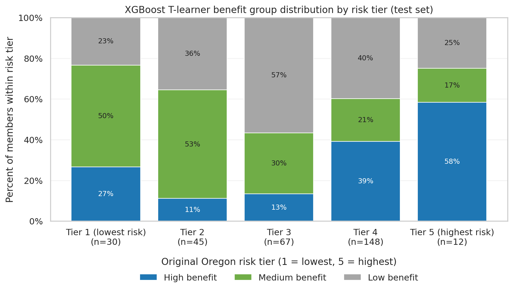</td><td width="50%" valign="top">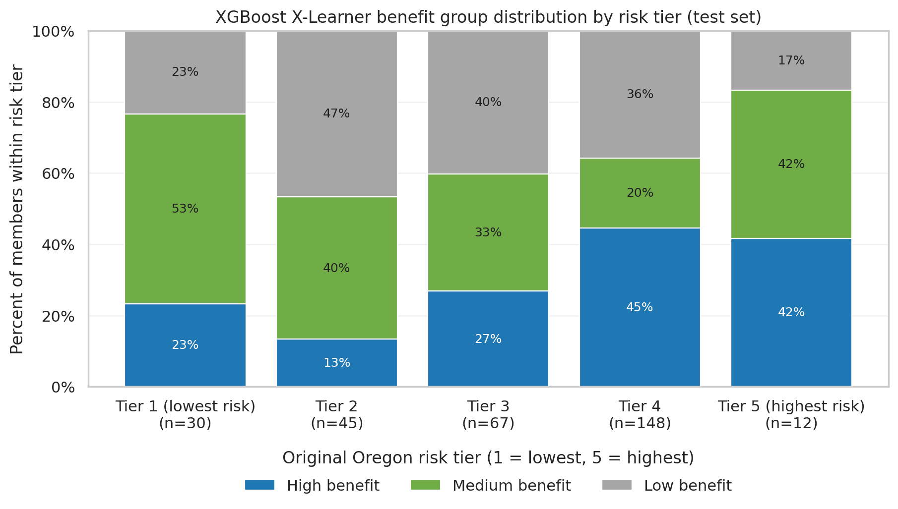</td></tr></table>

High modeled benefit appears in multiple risk tiers rather than only in the highest-risk tier. For example, 26.7% of valid tier-1 test records fall in the T-Learner high-benefit group. Risk-only targeting would therefore select a meaningfully different population.

### Framework Consistency

<!-- AUTO_TABLE: oregon_framework_consistency -->
| Model family | Pearson correlation | Spearman correlation | Top-decile overlap | T-Learner mean benefit | X-Learner mean benefit |
| --- | --- | --- | --- | --- | --- |
| XGBoost model family | 0.592 | 0.631 | 30.8% | 0.009 | -0.003 |
| GLMNET model family | -0.006 | 0.037 | 15.4% | 0.044 | 0.025 |

The XGBoost model family has moderate T-versus-X score agreement (Spearman 0.631), while GLMNet agreement is weak. Moderate score correlation with limited top-decile overlap means framework choice materially changes which individual records are prioritized.

### True-Benefit Top-Group Overlap

True-benefit top-group overlap cannot be calculated for Oregon because individual counterfactual benefit is unobserved. The report instead shows T-versus-X top-decile overlap: 30.8% for the XGBoost model family. This is a stability diagnostic, not a truth benchmark.

## Level 2 Summary: Uplift Model Validation

The Oregon analysis produces clear predicted score gradients but mixed empirical validation. The XGBoost T-Learner's top predicted magnitude is compatible with its wide observed interval, yet its observed gaps are not monotonic. The XGBoost X-Learner's first decile has a positive observed-gap interval, but the two frameworks overlap on only about one-third of top-decile records. These findings support a targeted prospective pilot and do not support interpreting the scores as proven individual causal effects.

# Evaluation Level 3: Operational Evaluation

## Analytical Task 6: Variable Importance and Explainability

### Risk Drivers

The treated and control factual models emphasize related but not identical risk drivers. These are predictors of 90-day ED outcome under each observed treatment condition; they are not automatically drivers of treatment benefit.

<!-- AUTO_TABLE: oregon_factual_shap_treated -->
| Rank | Treated-model feature | Mean absolute SHAP |
| --- | --- | --- |
| 1 | percolator_score | 0.394 |
| 2 | ed_visits_last_6m | 0.233 |
| 3 | total_cost_last_6m | 0.180 |
| 4 | age | 0.126 |
| 5 | ed_visits_last_30d | 0.110 |
| 6 | risk_tier_3 | 0.104 |
| 7 | substance_use_flag | 0.073 |
| 8 | asthma_flag | 0.068 |
| 9 | bh_flag | 0.063 |
| 10 | anxiety_flag | 0.061 |

<!-- AUTO_TABLE: oregon_factual_shap_control -->
| Rank | Control-model feature | Mean absolute SHAP |
| --- | --- | --- |
| 1 | ed_visits_last_6m | 0.531 |
| 2 | percolator_score | 0.310 |
| 3 | total_cost_last_6m | 0.271 |
| 4 | current_risk_score | 0.122 |
| 5 | ed_visits_last_30d | 0.070 |
| 6 | admits_last_6m | 0.063 |
| 7 | age | 0.049 |
| 8 | asthma_flag | 0.029 |
| 9 | rx_count_last_6m | 0.026 |
| 10 | risk_tier_4 | 0.025 |

<table><tr><td width="50%" valign="top">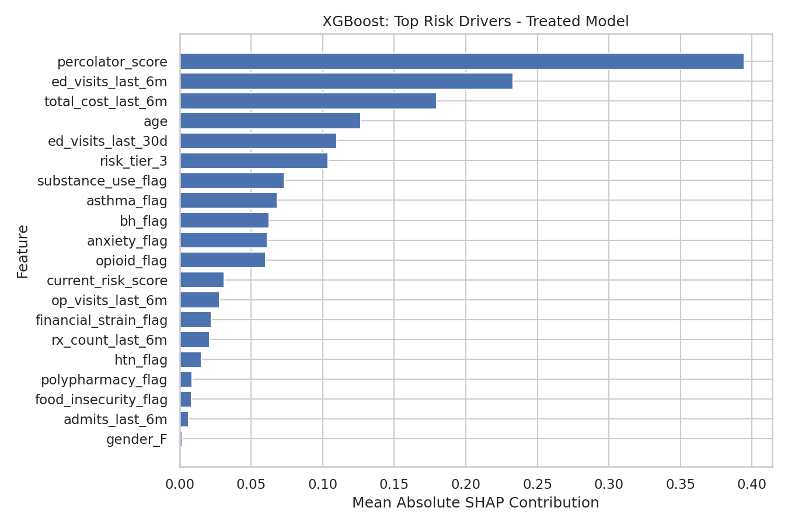</td><td width="50%" valign="top">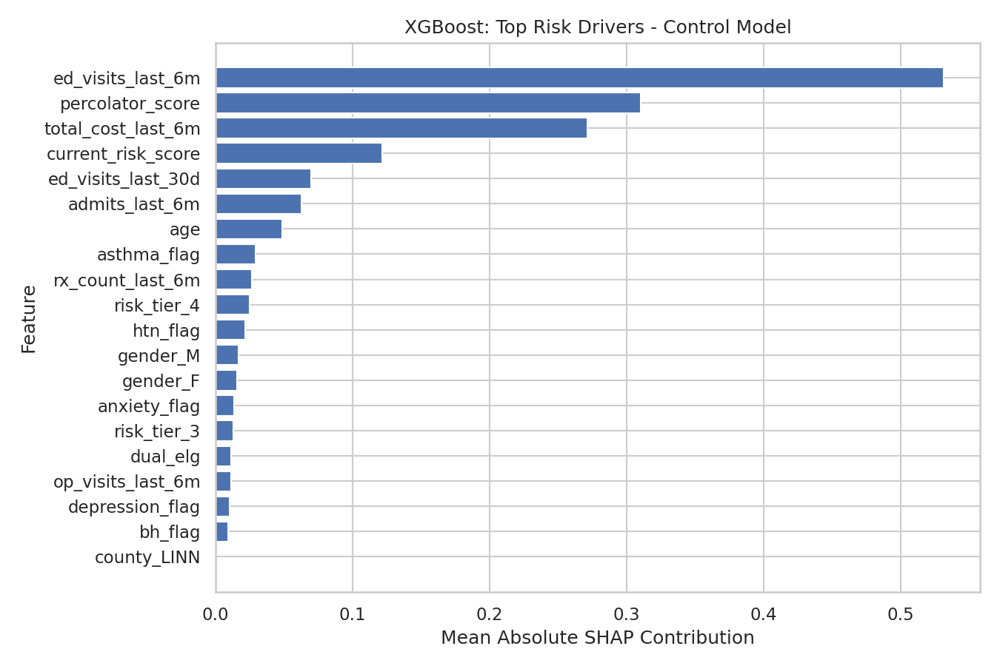</td></tr></table>

### Explainability Approaches

The report uses model-specific explanation methods. XGBoost uses TreeSHAP-derived contributions; GLMNet uses exact linear contributions on the transformed model matrix. Absolute values show importance, signed values show average direction in the modeled benefit score, and the positive share shows how often the feature contribution raises predicted benefit. None of these quantities implies that intervening on the feature would change benefit.

### Coefficient-Based Benefit Contributions

<!-- AUTO_TABLE: oregon_glmnet_benefit_contributions -->
| Rank | Feature | Mean absolute contribution | Mean signed contribution | Positive contribution share |
| --- | --- | --- | --- | --- |
| 1 | asthma_flag | 0.536 | 0.012 | 82.5% |
| 2 | htn_flag | 0.452 | -0.032 | 74.1% |
| 3 | risk_tier_Missing | 0.445 | -0.028 | 20.9% |
| 4 | ed_visits_last_6m | 0.409 | 0.024 | 47.6% |
| 5 | anxiety_flag | 0.392 | -0.011 | 37.4% |
| 6 | current_risk_score | 0.341 | 0.026 | 29.6% |
| 7 | polypharmacy_flag | 0.327 | -0.035 | 6.3% |
| 8 | substance_use_flag | 0.300 | -0.015 | 77.5% |
| 9 | copd_flag | 0.296 | 0.028 | 11.5% |
| 10 | admits_last_6m | 0.280 | -0.010 | 77.5% |

GLMNet provides a transparent sensitivity view, but its top-decile benefit magnitude was outside the observed interval. Coefficients and contributions should therefore be read as model mechanics rather than causal effect modifiers.

### SHAP Benefit-Score Contributions

<!-- AUTO_TABLE: oregon_tlearner_benefit_shap -->
| Rank | XGBoost T-Learner feature | Mean absolute benefit SHAP | Mean signed SHAP | Positive SHAP share |
| --- | --- | --- | --- | --- |
| 1 | ed_visits_last_6m | 0.340 | -0.193 | 36.4% |
| 2 | total_cost_last_6m | 0.199 | -0.150 | 21.2% |
| 3 | percolator_score | 0.187 | -0.110 | 33.5% |
| 4 | age | 0.127 | -0.004 | 60.2% |
| 5 | current_risk_score | 0.111 | -0.016 | 47.9% |
| 6 | asthma_flag | 0.098 | 0.017 | 82.5% |
| 7 | risk_tier_3 | 0.091 | 0.009 | 82.5% |
| 8 | substance_use_flag | 0.073 | 0.009 | 77.5% |
| 9 | ed_visits_last_30d | 0.062 | -0.027 | 41.6% |
| 10 | opioid_flag | 0.060 | 0.011 | 90.1% |
| 11 | bh_flag | 0.057 | 0.020 | 53.4% |
| 12 | admits_last_6m | 0.056 | 0.018 | 77.5% |

<!-- AUTO_TABLE: oregon_xlearner_benefit_shap -->
| Rank | XGBoost X-Learner feature | Mean absolute benefit SHAP | Mean signed SHAP | Positive SHAP share |
| --- | --- | --- | --- | --- |
| 1 | ed_visits_last_6m | 0.049 | -0.019 | 44.2% |
| 2 | total_cost_last_6m | 0.033 | -0.002 | 51.6% |
| 3 | age | 0.029 | 0.005 | 59.2% |
| 4 | asthma_flag | 0.029 | -0.000 | 82.5% |
| 5 | percolator_score | 0.023 | -0.007 | 45.8% |
| 6 | current_risk_score | 0.020 | -0.002 | 32.2% |
| 7 | rx_count_last_6m | 0.020 | 0.002 | 77.7% |
| 8 | admits_last_6m | 0.017 | 0.006 | 78.5% |
| 9 | county_KLAMATH | 0.014 | 0.004 | 3.9% |
| 10 | ed_visits_last_30d | 0.013 | 0.001 | 61.5% |
| 11 | bh_flag | 0.010 | -0.000 | 52.6% |
| 12 | substance_use_flag | 0.010 | -0.001 | 77.5% |

<!-- AUTO_CHART: oregon_benefit_shap_pair -->
<table><tr><td width="50%" valign="top"></td><td width="50%" valign="top"></td></tr></table>

Recent ED utilization, recent total cost, percolator score, age, and current risk score dominate the XGBoost T-Learner benefit explanation. The XGBoost X-Learner also emphasizes recent ED use, total cost, and age, though at a smaller contribution scale. The overlap is reassuring at the population level; the limited top-decile member overlap shows that similar global drivers do not imply identical individual rankings.

### Known Synthetic Driver Alignment

There are no known synthetic treatment-effect drivers in the Oregon observational data. Accordingly, the report does not claim alignment to a known causal data-generating process. The closest available check is cross-framework agreement on broad driver families, which is descriptive only.

## Analytical Task 7: Business Value Assessment

This section compares uplift-based targeting with traditional risk-based targeting by estimating expected avoided ED visits and gross savings under both approaches.

The current calculation assumes:

```text
expected_ed_rate_reduction = avg_benefit_score
expected_ed_visits_avoided = n * expected_ed_rate_reduction
gross_savings = expected_ed_visits_avoided * cost_per_ed_visit
intervention_cost = n * cost_per_intervention
net_savings = gross_savings - intervention_cost
roi = net_savings / intervention_cost
```

The analysis assumes an average cost of **$1,200 per ED visit** and **$250 per intervention**. Because Evaluation Levels 1 and 2 identify the XGBoost model family as the primary Oregon modeling family, business-value estimates are presented for both XGBoost frameworks.

### XGBoost T-Learner Targeting

<!-- AUTO_TABLE:xgboost_tlearner_roi_summary START -->
| Targeted group | Members targeted | Uplift gross savings | Current-risk gross savings | Uplift advantage | Uplift ED visits avoided | Current-risk ED visits avoided |
| --- | --- | --- | --- | --- | --- | --- |
| Top 10% | 38 | $8,933.58 | $3,832.99 | $5,100.60 | 7.4447 | 3.1942 |
| Top 20% | 76 | $12,578.84 | $4,880.22 | $7,698.63 | 10.4824 | 4.0668 |
| Top 30% | 114 | $14,704.37 | $4,148.27 | $10,556.10 | 12.2536 | 3.4569 |
| Top 40% | 152 | $16,225.01 | $1,785.99 | $14,439.02 | 13.5208 | 1.4883 |
| Top 50% | 190 | $16,993.29 | $355.67 | $16,637.62 | 14.1611 | 0.2964 |
<!-- AUTO_TABLE:xgboost_tlearner_roi_summary END -->

<!-- AUTO_TEXT:xgboost_tlearner_roi_interpretation START -->
This view compares two targeting policies on the same held-out test population: ranking members by XGBoost T-Learner predicted uplift versus ranking members by current risk score. Through the top 30% of targeted members, uplift targeting captures $14,704.37 in estimated gross savings, compared with $4,148.27 from current-risk targeting, an uplift advantage of $10,556.10. Gross savings are estimated from the XGBoost T-Learner predicted benefit score, so this is a targeting-policy comparison rather than a claim of realized savings.
<!-- AUTO_TEXT:xgboost_tlearner_roi_interpretation END -->

<!-- AUTO_CHART:xgboost_tlearner_roi_by_decile START -->
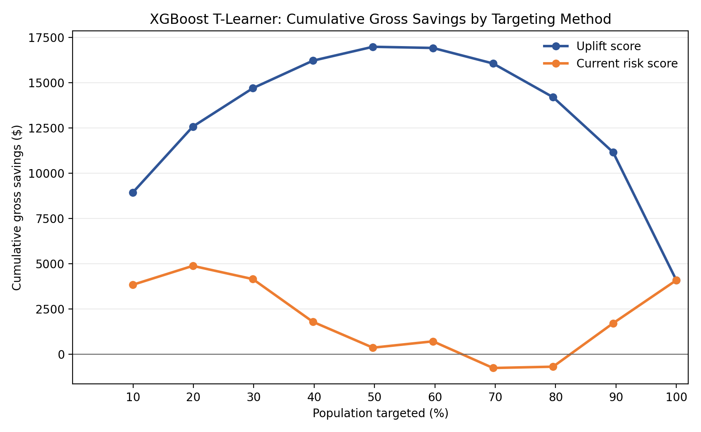
<!-- AUTO_CHART:xgboost_tlearner_roi_by_decile END -->

The chart below compares the marginal gross savings of uplift-based targeting with current-risk targeting across successive targeting bands. Positive values indicate that benefit-based targeting captures more estimated value within that band. In this run, the XGBoost T-Learner maintains a positive marginal advantage through the top 50% of targeted members before the advantage becomes mixed in later bands.

<!-- AUTO_CHART:xgboost_tlearner_marginal_advantage START -->
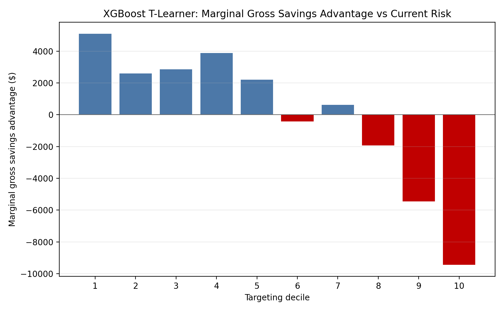
<!-- AUTO_CHART:xgboost_tlearner_marginal_advantage END -->

### XGBoost X-Learner Targeting

<!-- AUTO_TABLE:xgboost_xlearner_roi_summary START -->
| Targeted group | Members targeted | X-Learner gross savings | Current-risk gross savings | X-Learner advantage | X-Learner ED visits avoided | Current-risk ED visits avoided |
| --- | --- | --- | --- | --- | --- | --- |
| Top 10% | 38 | $12,290.01 | $2,849.45 | $9,440.56 | 10.2417 | 2.3745 |
| Top 20% | 76 | $18,205.36 | $4,350.76 | $13,854.60 | 15.1711 | 3.6256 |
| Top 30% | 114 | $20,966.23 | $2,976.15 | $17,990.08 | 17.4719 | 2.4801 |
| Top 40% | 152 | $21,523.24 | $1,520.41 | $20,002.83 | 17.9360 | 1.2670 |
| Top 50% | 190 | $21,018.34 | $648.28 | $20,370.06 | 17.5153 | 0.5402 |
<!-- AUTO_TABLE:xgboost_xlearner_roi_summary END -->

<!-- AUTO_TEXT:xgboost_xlearner_roi_interpretation START -->
The X-Learner view uses the same held-out test population and the same cost assumptions, but members are ranked by XGBoost X-Learner predicted benefit. Through the top 30% of targeted members, X-Learner benefit targeting captures $20,966.23 in estimated gross savings, compared with $2,976.15 from current-risk targeting, an advantage of $17,990.08. The X-Learner savings estimates are larger in absolute dollars because its highest-ranked Oregon benefit scores are larger than the corresponding T-Learner scores.
<!-- AUTO_TEXT:xgboost_xlearner_roi_interpretation END -->

<!-- AUTO_CHART:xgboost_xlearner_roi START -->

<!-- AUTO_CHART:xgboost_xlearner_roi END -->

The XGBoost X-Learner maintains a positive marginal advantage through the top 50% of targeted members, indicating that benefit-based targeting captures more estimated value than current-risk targeting across the evaluated targeting bands.

<!-- AUTO_CHART:xgboost_xlearner_marginal_advantage START -->

<!-- AUTO_CHART:xgboost_xlearner_marginal_advantage END -->

These estimates compare targeting strategies rather than realized financial outcomes. Actual savings would depend on intervention effectiveness, cost assumptions, treatment adherence, and validation using live production data.

Overall, both XGBoost frameworks suggest that prioritizing members by predicted treatment benefit captures greater estimated value than prioritizing members by baseline risk alone through the top 50% of the test population. The XGBoost X-Learner produces the larger modeled gross-savings advantage in Oregon, while the XGBoost T-Learner provides an independent comparison framework. Because Oregon is observational and framework agreement is incomplete, these results should be treated as operational targeting hypotheses requiring prospective validation.

Supporting files:

- [`XGBoost T-Learner/uplift_roi_by_decile.csv`](Outputs/Uplift_Oregon/Python/T-Learner/XGBoost/uplift_roi_by_decile.csv)
- [`XGBoost T-Learner/cumulative_gross_savings_by_targeting.csv`](Outputs/Uplift_Oregon/Python/T-Learner/XGBoost/cumulative_gross_savings_by_targeting.csv)
- [`XGBoost T-Learner/cumulative_gross_savings_summary_top50.csv`](Outputs/Uplift_Oregon/Python/T-Learner/XGBoost/cumulative_gross_savings_summary_top50.csv)
- [`XGBoost T-Learner/marginal_gross_savings_by_targeting.csv`](Outputs/Uplift_Oregon/Python/T-Learner/XGBoost/marginal_gross_savings_by_targeting.csv)
- [`XGBoost T-Learner/marginal_gross_savings_advantage_vs_current_risk.csv`](Outputs/Uplift_Oregon/Python/T-Learner/XGBoost/marginal_gross_savings_advantage_vs_current_risk.csv)
- [`XGBoost T-Learner/dashboard_cumulative_gross_savings_targeting.png`](Outputs/Uplift_Oregon/Python/T-Learner/XGBoost/dashboard_cumulative_gross_savings_targeting.png)
- [`XGBoost T-Learner/dashboard_marginal_gross_savings_advantage_vs_current_risk.png`](Outputs/Uplift_Oregon/Python/T-Learner/XGBoost/dashboard_marginal_gross_savings_advantage_vs_current_risk.png)
- [`XGBoost X-Learner/xlearner_roi_by_decile.csv`](Outputs/Uplift_Oregon/Python/X-Learner/XGBoost/xlearner_roi_by_decile.csv)
- [`XGBoost X-Learner/cumulative_gross_savings_by_targeting.csv`](Outputs/Uplift_Oregon/Python/X-Learner/XGBoost/cumulative_gross_savings_by_targeting.csv)
- [`XGBoost X-Learner/cumulative_gross_savings_summary_top50.csv`](Outputs/Uplift_Oregon/Python/X-Learner/XGBoost/cumulative_gross_savings_summary_top50.csv)
- [`XGBoost X-Learner/marginal_gross_savings_by_targeting.csv`](Outputs/Uplift_Oregon/Python/X-Learner/XGBoost/marginal_gross_savings_by_targeting.csv)
- [`XGBoost X-Learner/marginal_gross_savings_advantage_vs_current_risk.csv`](Outputs/Uplift_Oregon/Python/X-Learner/XGBoost/marginal_gross_savings_advantage_vs_current_risk.csv)
- [`XGBoost X-Learner/dashboard_cumulative_gross_savings_targeting.png`](Outputs/Uplift_Oregon/Python/X-Learner/XGBoost/dashboard_cumulative_gross_savings_targeting.png)
- [`XGBoost X-Learner/dashboard_marginal_gross_savings_advantage_vs_current_risk.png`](Outputs/Uplift_Oregon/Python/X-Learner/XGBoost/dashboard_marginal_gross_savings_advantage_vs_current_risk.png)

## Level 3 Summary: Operational Evaluation

The XGBoost models provide a coherent operational case for benefit-based prioritization, with the T-Learner serving as the direct two-model targeting framework and the X-Learner as an independent robustness check.

On explainability, recent ED utilization, recent cost, Percolator score, age, and current risk contribute strongly to the Oregon benefit rankings. Several features change magnitude or direction across frameworks, so SHAP should be used to explain model behavior—not to make causal claims about individual factors.

On business value, both XGBoost frameworks produce greater modeled gross savings through the top 50% when ranking by predicted benefit rather than current risk. Through the top 30%, the XGBoost T-Learner produces a modeled targeting advantage of $10,556.10, while the XGBoost X-Learner produces an advantage of $17,990.08.

The operational recommendation is to treat the XGBoost T-Learner ranking as the primary direct candidate and use XGBoost X-Learner agreement as a robustness signal, while recognizing that Oregon's nonmonotonic T-Learner observed gaps and limited framework overlap require prospective validation before production use.

---

Supporting files: [executed Oregon notebook](Code/Uplift%20Model%20Code_Oregon_2YearDataset.ipynb), [preprocessing audit](Outputs/Uplift_Oregon/Python/preprocessing_audit_summary.csv), [column-level leakage audit](Outputs/Uplift_Oregon/Python/preprocessing_column_audit.csv), [model evaluation summary](Outputs/Uplift_Oregon/Python/model_evaluation_summary.csv), and [output parity manifest](Outputs/Uplift_Oregon/Python/output_parity_manifest.csv).
