# PRISM Intervention Benefit Modeling — Oregon 2-Year Dataset

## Background

This report reproduces the analytical workflow, model families, validation sequence, charts, and output structure of the Funds Combined PRISM intervention-benefit notebook using `DataSets/Oregon_2YearDataset.csv`. The executed analysis is in `Code/Uplift Model Code_Oregon_2YearDataset.ipynb`; all generated artifacts are isolated under `Outputs/Uplift_Oregon/`.

The outcome is a binary indicator of any emergency-department use within 90 days. The treatment is PRISM engagement. A positive benefit score means the model predicts a lower 90-day ED-event probability under engagement than under no engagement.

> This is an observational, model-based prioritization analysis. The individual benefit scores are not directly observed causal effects. Small treatment/control counts within some test-set deciles produce wide confidence intervals, so operational use should follow prospective validation.

> The committed notebook is configured to require a SageMaker CUDA GPU on device 0. The checked-in numerical outputs in this report are the completed local CPU validation snapshot produced before enabling the GPU requirement. A full SageMaker rerun will replace those outputs; regenerate this report afterward if fitted results change.

## Business Question

Which Oregon members are most likely to benefit from PRISM engagement, measured as an estimated reduction in the probability of any ED utilization within 90 days?

## Project Objectives

1. Reproduce the Funds Combined methodology with Oregon-specific preprocessing.
2. Prevent leakage by excluding treatment indicators, outcomes, and all known post-intervention fields from the predictor matrix.
3. Compare XGBoost and regularized logistic-regression (GLMNet-equivalent) T-Learners.
4. Add X-Learners using the same propensity-score and evaluation framework as the source notebook.
5. Evaluate outcome-model discrimination and calibration, uplift ranking, uncertainty, explainability, and illustrative business value.

## Analytical Task 1: Modeling Framework

### Outcome

`outcome_ed_90d` was numerically coerced, missing values were assigned to zero as requested, and all values greater than zero were binarized to one. The source count distribution was preserved in the preprocessing audit. No source values were overwritten.

### Treatment

`Engaged_flag = 1` defines treated records and `Engaged_flag = 0` defines controls. `OptOut_flag` was used only to validate the treatment definition and was then excluded. The two fields were exact inverses for all 1,268 modeling records; no contradictory or unresolved treatment rows were found.

### Predictors and leakage controls

Only baseline variables were eligible as predictors. The following post-treatment fields were detected and excluded before preprocessing:

| Source field | Status | Reason |
| --- | --- | --- |

Additional exclusions were:

| Source field | Role | Reason |
| --- | --- | --- |
| client_contract | candidate baseline predictor | zero-variance or all-missing predictor removed using training data only |
| plan_type | candidate baseline predictor | zero-variance or all-missing predictor removed using training data only |
| ProgramFinal | candidate baseline predictor | zero-variance or all-missing predictor removed using training data only |
| Engaged_flag | treatment source | canonical treatment source; never a predictor |
| OptOut_flag | treatment validation source | redundant inverse treatment signal; validation only |
| ProgramStart | post-treatment variable | post-treatment leakage control |
| ProgramEnd | post-treatment variable | post-treatment leakage control |
| engaged_date | post-treatment variable | post-treatment leakage control |
| engagement_length | post-treatment variable | post-treatment leakage control |
| case_manager_name | excluded identifier/all-missing field | non-generalizable identifier field and entirely missing in Oregon |
| InterventionCount | post-treatment variable | post-treatment leakage control |
| SuccessfulInterventions | post-treatment variable | post-treatment leakage control |
| outcome_ed_30d | post-treatment variable | post-treatment leakage control |
| outcome_ed_6MO | post-treatment variable | post-treatment leakage control |
| outcome_admit_30d | post-treatment variable | post-treatment leakage control |
| outcome_admit_90d | post-treatment variable | post-treatment leakage control |
| outcome_admit_6MO | post-treatment variable | post-treatment leakage control |
| outcome_total_cost_90d | post-treatment variable | post-treatment leakage control |
| outcome_total_cost_6MO | post-treatment variable | post-treatment leakage control |

The member identifier was retained only for grouped splitting and result traceability. The treatment and outcome were never predictors. No death-related variable was present in this Oregon file; no death flag was created, and no record was removed based on death.

### Preprocessing and split design

- All 1,268 source records were retained, including 50 repeated member episodes. There were 0 exact duplicate rows.
- The 70/30 split was grouped by `member_id`, producing zero member overlap between train and test.
- Numeric imputation medians, categorical levels, unseen-category handling, and zero-variance filtering were learned from training data only.
- Risk tiers 1–5 were retained. Missing and out-of-range source values were mapped to an explicit `Missing` level.
- `total_cost_last_6m` was converted from its source currency-like representation to numeric before train-only median imputation.
- Three training-set zero-variance fields—`client_contract`, `plan_type`, and `program`—were removed.
- The final model used 34 baseline predictors and 102 encoded features.
- Explicit pre-model and final encoded-feature leakage assertions passed.

### Workflow

The notebook keeps the Funds Combined sequence and choices: descriptive review, predictor distributions, group-aware holdout, treatment-specific outcome models, T-Learner benefit scores, GLMNet comparison, overlap-weighted sensitivity analysis, X-Learner construction, decile diagnostics, SHAP-style explanation, and ROI targeting summaries. Hyperparameter grids, cross-validation structure, random seeds, and evaluation methods were retained. The committed notebook now matches the Funds GPU requirement: XGBoost uses `tree_method='hist'` with `device='cuda:0'`, and explicit assertions verify that fitted boosters used CUDA.

The Funds source notebook does not define separate Qini or cumulative-gain calculations. Its cumulative uplift-by-targeted-fraction curve is reproduced as written; no additional metric was invented because doing so would change the authoritative source method.

## Analytical Task 2: Data Review

| Measure | Value |
| --- | --- |
| Analytical records | 1,268 |
| Unique members | 1,218 |
| Treated records | 882 (69.6%) |
| Control records | 386 (30.4%) |
| 90-day ED events | 272 (21.5%) |
| Treated outcome rate | 18.8% |
| Control outcome rate | 27.5% |
| Training records / unique members | 886 / 852 |
| Test records / unique members | 382 / 366 |
| Member overlap across train/test | 0 |

The lower observed event rate among engaged records is descriptive and unadjusted. It should not be interpreted as the intervention effect because engagement was not randomized and baseline risk may differ between groups.

### Risk Tier Definition

The source risk tier was used as a baseline categorical predictor rather than recalculated from the current risk score. Among the 983 records with valid tiers, the distribution was:

| Tier | Label | Records | Share of valid tiers | Min score | Max score | Average score |
| --- | --- | --- | --- | --- | --- | --- |
| 1 | Tier 1 (lowest risk) | 98 | 10.0% | 0.168 | 7.061 | 0.979 |
| 2 | Tier 2 | 150 | 15.3% | 0.287 | 21.704 | 1.661 |
| 3 | Tier 3 | 235 | 23.9% | 0.457 | 17.675 | 2.588 |
| 4 | Tier 4 | 456 | 46.4% | 0.701 | 60.654 | 6.807 |
| 5 | Tier 5 (highest risk) | 44 | 4.5% | 2.813 | 39.719 | 12.603 |

There were 192 missing risk-tier values and 93 out-of-range values; both were assigned to the explicit `Missing` category for modeling.

## Evaluation Roadmap

The model is evaluated at three levels:

1. **Outcome-model validity:** can each treatment-specific model distinguish records with and without a 90-day ED event, and are its probabilities calibrated?
2. **Uplift-model validity:** does the estimated benefit ranking show useful separation, stable results across learner frameworks, and reasonable agreement with observed within-decile gaps?
3. **Operational value:** which variables drive the scores, and what do illustrative targeting economics look like under fixed cost assumptions?

## Evaluation Level 1: Outcome Model Validation

### Analytical Task 3: Model Performance

#### Event counts

| Split | Group | Records | ED events | No ED event | Event rate |
| --- | --- | --- | --- | --- | --- |
| Train | Treated | 616 | 116 | 500 | 18.8% |
| Train | Control | 270 | 74 | 196 | 27.4% |
| Test | Treated | 266 | 50 | 216 | 18.8% |
| Test | Control | 116 | 32 | 84 | 27.6% |

The control test subgroup contains only 116 records and 32 events. This limits the precision of both outcome-model and uplift validation.

#### Discrimination, Brier score, and calibration

| Model | Treated CV AUC | Control CV AUC | Treated test AUC | Control test AUC | Treated Brier | Control Brier | Treated calibration error | Control calibration error |
| --- | --- | --- | --- | --- | --- | --- | --- | --- |
| XGBoost | 0.783 | 0.807 | 0.706 | 0.708 | 0.140 | 0.178 | 0.067 | 0.095 |
| GLMNET | — | — | 0.705 | 0.792 | 0.152 | 0.159 | 0.090 | 0.120 |

The XGBoost models achieved treated/control test AUCs of 0.706 and 0.708. GLMNet was similar in the treated subgroup and stronger in the control subgroup, although the control estimate is based on the smaller test sample. Neither method had uniformly strong calibration, so raw probabilities and derived benefit magnitudes should be treated cautiously.

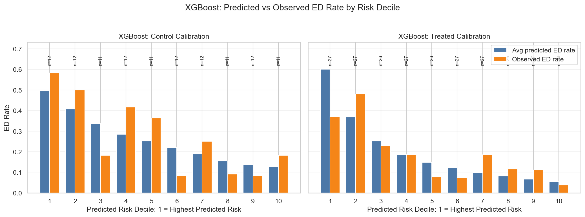

#### Prediction separation

| Model | Group | AUC | Mean prediction: event | Mean prediction: no event | Mean separation |
| --- | --- | --- | --- | --- | --- |
| XGBoost | Treated | 0.706 | 0.305 | 0.174 | 0.131 |
| XGBoost | Control | 0.708 | 0.327 | 0.237 | 0.090 |
| GLMNET | Treated | 0.705 | 0.344 | 0.161 | 0.183 |
| GLMNET | Control | 0.792 | 0.515 | 0.188 | 0.327 |

#### Prediction ranges

| Model | Group | Minimum | 10th percentile | Median | Mean | 90th percentile | Maximum |
| --- | --- | --- | --- | --- | --- | --- | --- |
| XGBoost | Treated | 0.049 | 0.062 | 0.133 | 0.199 | 0.480 | 0.745 |
| XGBoost | Control | 0.122 | 0.132 | 0.238 | 0.262 | 0.449 | 0.570 |
| GLMNET | Treated | 0.000 | 0.025 | 0.085 | 0.195 | 0.568 | 0.974 |
| GLMNET | Control | 0.000 | 0.012 | 0.160 | 0.278 | 0.794 | 0.975 |

### Level 1 Summary

| Model | Risk prediction | Calibration | Benefit-ranking diagnostic |
| --- | --- | --- | --- |
| XGBoost | Acceptable average test AUC (0.707) | Calibration needs review; avg abs calibration error 0.081, avg Brier 0.159 | Top decile predicted benefit 0.163; observed gap 0.077 (95% CI -0.158 to 0.364); predicted benefit is within observed-gap CI; decile rank corr -0.236 |
| GLMNET | Acceptable average test AUC (0.749) | Calibration needs review; avg abs calibration error 0.105, avg Brier 0.155 | Top decile predicted benefit 0.584; observed gap 0.258 (95% CI -0.035 to 0.518); predicted benefit is outside observed-gap CI; decile rank corr 0.636 |

Both model families have useful risk discrimination, but probability calibration and small subgroup sizes remain material limitations. Benefit ranking should therefore be validated with ranking-based and uncertainty-aware diagnostics rather than judged from AUC alone.

## Evaluation Level 2: Uplift Model Validation

### Analytical Task 4: Treatment-Effect Estimation

The T-Learner estimates two potential-outcome risks for each test record: predicted ED risk under engagement and predicted ED risk under no engagement. Benefit is `predicted control risk − predicted treated risk`; larger positive values represent greater predicted reduction in ED-event probability.

The source data do not contain observed individual counterfactuals, so true-benefit correlations, true top-decile overlap, and PEHE cannot be computed. Instead, the report uses observed treated-versus-control gaps within ranked deciles, Newcombe-Wilson confidence intervals, overlap weighting, and T-versus-X-Learner consistency as diagnostics.

### Analytical Task 5: Uplift Decile Analysis

#### XGBoost T-Learner

| Decile | N | Average predicted benefit | Observed control − treated gap | 95% CI for observed gap | Treated N | Control N | Treated share |
| --- | --- | --- | --- | --- | --- | --- | --- |
| 1 | 39 | 0.163 | 0.077 | -0.158 to 0.364 | 26 | 13 | 66.7% |
| 2 | 38 | 0.094 | 0.224 | -0.067 to 0.509 | 26 | 12 | 68.4% |
| 3 | 38 | 0.078 | 0.008 | -0.177 to 0.339 | 29 | 9 | 76.3% |
| 4 | 38 | 0.067 | 0.014 | -0.184 to 0.392 | 31 | 7 | 81.6% |
| 5 | 38 | 0.053 | 0.013 | -0.205 to 0.309 | 26 | 12 | 68.4% |
| 6 | 39 | 0.037 | 0.078 | -0.203 to 0.390 | 28 | 11 | 71.8% |
| 7 | 38 | 0.015 | -0.037 | -0.183 to 0.224 | 27 | 11 | 71.1% |
| 8 | 38 | -0.014 | 0.080 | -0.115 to 0.318 | 22 | 16 | 57.9% |
| 9 | 38 | -0.068 | 0.196 | -0.119 to 0.466 | 24 | 14 | 63.2% |
| 10 | 38 | -0.207 | 0.138 | -0.186 to 0.429 | 27 | 11 | 71.1% |

The top XGBoost T-Learner decile contained 39 records and had average predicted benefit 0.163. Its observed control-minus-treated gap was 0.077; the 95% interval was -0.158 to 0.364. The interval includes zero, reflecting the limited decile sample.

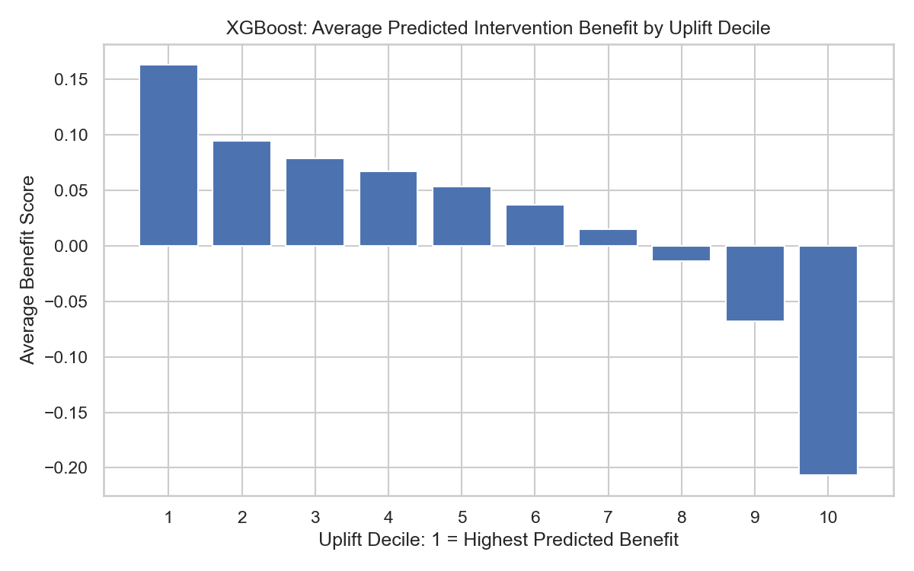

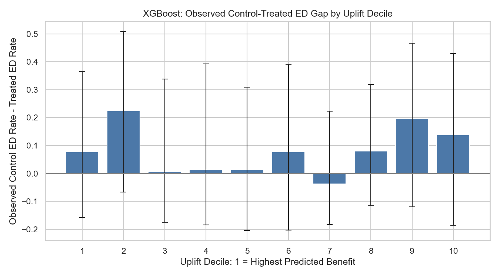

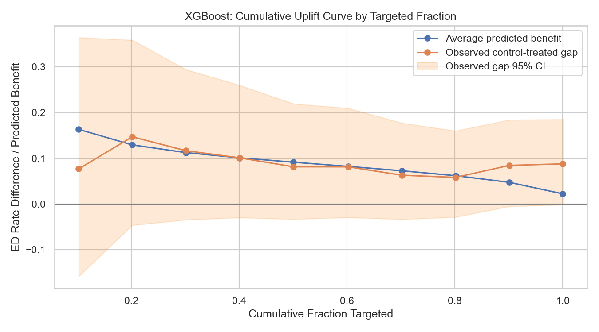

Across deciles, the Spearman correlation between predicted benefit and observed gap was -0.236, with mean absolute predicted-versus-observed gap 0.118. This does not establish reliable causal ranking; it supports treating the current result as a candidate model for further validation.

#### GLMNet T-Learner

The GLMNet top decile had average predicted benefit 0.584 and observed gap 0.258. The predicted magnitude was outside the observed-gap 95% interval, indicating probable overstatement of the absolute benefit scale even though its decile rank correlation was positive.

| Decile | N | Average predicted benefit | Observed control − treated gap | 95% CI for observed gap | Treated N | Control N | Treated share |
| --- | --- | --- | --- | --- | --- | --- | --- |
| 1 | 39 | 0.584 | 0.258 | -0.035 to 0.518 | 24 | 15 | 61.5% |
| 2 | 38 | 0.300 | 0.383 | 0.046 to 0.656 | 29 | 9 | 76.3% |
| 3 | 38 | 0.165 | 0.147 | -0.147 to 0.443 | 26 | 12 | 68.4% |
| 4 | 38 | 0.085 | 0.125 | -0.124 to 0.431 | 27 | 11 | 71.1% |
| 5 | 38 | 0.023 | -0.219 | -0.388 to 0.186 | 32 | 6 | 84.2% |
| 6 | 39 | -0.013 | -0.028 | -0.211 to 0.252 | 27 | 12 | 69.2% |
| 7 | 38 | -0.036 | -0.020 | -0.205 to 0.275 | 27 | 11 | 71.1% |
| 8 | 38 | -0.070 | 0.089 | -0.159 to 0.319 | 18 | 20 | 47.4% |
| 9 | 38 | -0.148 | -0.083 | -0.291 to 0.304 | 31 | 7 | 81.6% |
| 10 | 38 | -0.465 | 0.105 | -0.181 to 0.399 | 25 | 13 | 65.8% |

#### XGBoost X-Learner

| Decile | N | Average predicted benefit | Observed control − treated gap | 95% CI for observed gap | Treated N | Control N | Treated share |
| --- | --- | --- | --- | --- | --- | --- | --- |
| 1 | 39 | 0.283 | 0.149 | -0.129 to 0.453 | 28 | 11 | 71.8% |
| 2 | 38 | 0.122 | 0.226 | -0.056 to 0.490 | 23 | 15 | 60.5% |
| 3 | 38 | 0.053 | 0.114 | -0.133 to 0.374 | 22 | 16 | 57.9% |
| 4 | 38 | 0.017 | 0.146 | -0.143 to 0.526 | 32 | 6 | 84.2% |
| 5 | 38 | -0.005 | 0.208 | -0.075 to 0.583 | 32 | 6 | 84.2% |
| 6 | 39 | -0.023 | 0.000 | -0.213 to 0.284 | 26 | 13 | 66.7% |
| 7 | 38 | -0.050 | -0.057 | -0.249 to 0.243 | 27 | 11 | 71.1% |
| 8 | 38 | -0.079 | 0.006 | -0.231 to 0.272 | 22 | 16 | 57.9% |
| 9 | 38 | -0.119 | -0.052 | -0.318 to 0.259 | 25 | 13 | 65.8% |
| 10 | 38 | -0.215 | 0.238 | -0.073 to 0.546 | 29 | 9 | 76.3% |

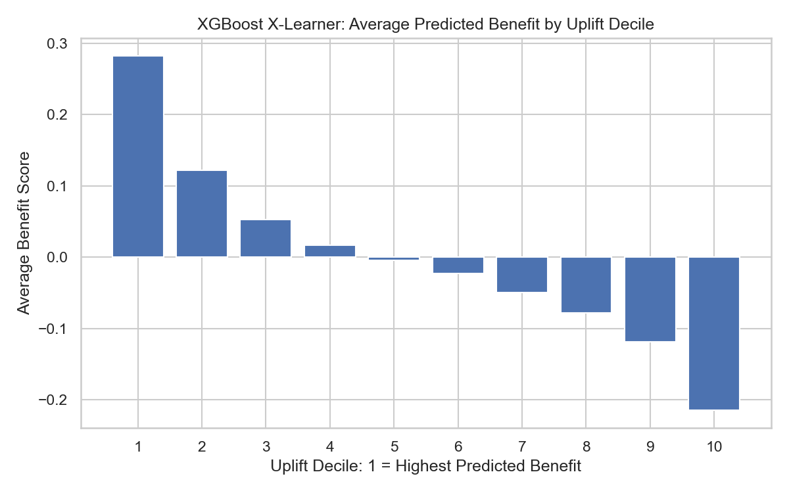

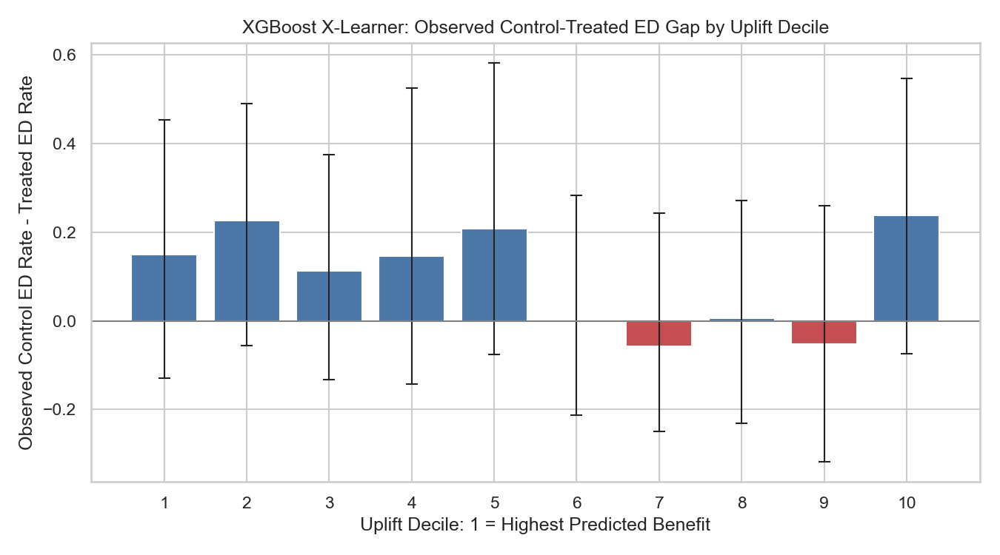

#### T-Learner versus X-Learner consistency

| Model family | Pearson correlation | Spearman correlation | Top-decile overlap | T-Learner mean benefit | X-Learner mean benefit |
| --- | --- | --- | --- | --- | --- |
| XGBoost | 0.532 | 0.547 | 43.6% | 0.022 | -0.001 |
| GLMNET | -0.006 | 0.037 | 15.4% | 0.044 | 0.025 |

The XGBoost implementations had moderate score correlation and 43.6% top-decile overlap. GLMNet showed little agreement across learner frameworks. Framework sensitivity is another reason to avoid using a single fitted benefit magnitude as a causal estimate.

### Level 2 Summary

The Oregon models produce differentiated benefit rankings, but the observed-gap pattern is noisy and sensitive to the learner framework. The XGBoost T-Learner is the closest direct reproduction of the original primary workflow; the X-Learner is best treated as a sensitivity analysis. A prospective or quasi-experimental validation design is needed before deployment.

## Evaluation Level 3: Operational Interpretation

### Analytical Task 6: Variable Importance and Explainability

#### XGBoost T-Learner benefit drivers

| Rank | Feature | Mean absolute benefit SHAP | Mean signed benefit SHAP | Positive SHAP share |
| --- | --- | --- | --- | --- |
| 1 | ed_visits_last_6m | 0.192 | -0.136 | 24.9% |
| 2 | total_cost_last_6m | 0.189 | -0.092 | 53.4% |
| 3 | percolator_score | 0.177 | -0.031 | 57.6% |
| 4 | ed_visits_last_30d | 0.118 | -0.014 | 69.1% |
| 5 | age | 0.110 | 0.003 | 65.4% |
| 6 | asthma_flag | 0.102 | 0.014 | 82.5% |
| 7 | bh_flag | 0.090 | 0.035 | 53.4% |
| 8 | substance_use_flag | 0.069 | 0.001 | 77.5% |
| 9 | risk_tier_3 | 0.067 | 0.005 | 82.5% |
| 10 | htn_flag | 0.058 | 0.009 | 74.1% |
| 11 | opioid_flag | 0.054 | 0.008 | 90.1% |
| 12 | gender_F | 0.044 | -0.008 | 24.3% |
| 13 | rx_count_last_6m | 0.044 | 0.002 | 42.4% |
| 14 | current_risk_score | 0.044 | -0.020 | 28.3% |
| 15 | anxiety_flag | 0.041 | 0.013 | 62.6% |

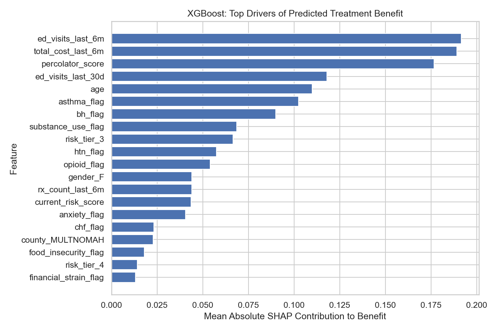

The leading benefit-score drivers were recent ED utilization, recent total cost, percolator score, recent 30-day ED utilization, and age. SHAP values explain model behavior; they do not establish that changing a feature would change treatment benefit.

#### XGBoost X-Learner benefit drivers

| Rank | Feature | Mean absolute benefit SHAP | Mean signed benefit SHAP | Positive SHAP share |
| --- | --- | --- | --- | --- |
| 1 | ed_visits_last_6m | 0.043 | -0.019 | 39.5% |
| 2 | total_cost_last_6m | 0.032 | -0.008 | 28.3% |
| 3 | age | 0.028 | 0.001 | 58.4% |
| 4 | asthma_flag | 0.027 | 0.001 | 82.5% |
| 5 | percolator_score | 0.023 | -0.006 | 38.0% |
| 6 | admits_last_6m | 0.019 | 0.006 | 78.3% |
| 7 | rx_count_last_6m | 0.017 | 0.001 | 76.2% |
| 8 | ed_visits_last_30d | 0.017 | -0.000 | 62.6% |
| 9 | current_risk_score | 0.015 | -0.002 | 29.1% |
| 10 | bh_flag | 0.014 | 0.000 | 52.6% |
| 11 | county_KLAMATH | 0.013 | 0.004 | 3.9% |
| 12 | substance_use_flag | 0.012 | -0.001 | 77.5% |
| 13 | opioid_flag | 0.010 | 0.000 | 90.1% |
| 14 | depression_flag | 0.010 | -0.003 | 68.6% |
| 15 | copd_flag | 0.009 | -0.001 | 12.3% |

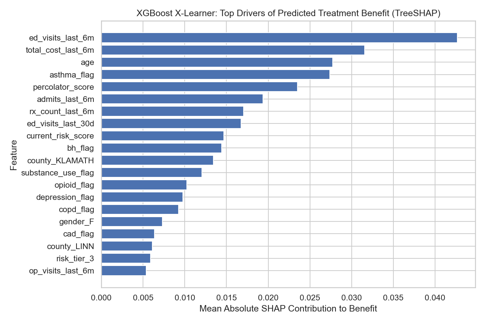

#### GLMNet comparison

The GLMNet benefit explanation remains available as a transparent linear-model comparison. Its leading absolute contribution terms were:

| Rank | Feature | Mean absolute benefit contribution | Mean signed contribution | Positive contribution share |
| --- | --- | --- | --- | --- |
| 1 | asthma_flag | 0.536 | 0.012 | 82.5% |
| 2 | htn_flag | 0.452 | -0.032 | 74.1% |
| 3 | risk_tier_Missing | 0.445 | -0.028 | 20.9% |
| 4 | ed_visits_last_6m | 0.409 | 0.024 | 47.6% |
| 5 | anxiety_flag | 0.392 | -0.011 | 37.4% |
| 6 | current_risk_score | 0.341 | 0.026 | 29.6% |
| 7 | polypharmacy_flag | 0.327 | -0.035 | 6.3% |
| 8 | substance_use_flag | 0.300 | -0.015 | 77.5% |
| 9 | copd_flag | 0.296 | 0.028 | 11.5% |
| 10 | admits_last_6m | 0.280 | -0.010 | 77.5% |

### Analytical Task 7: Illustrative Business Value

The notebook retains the Funds Combined business assumptions: **$1,200 gross value per avoided ED event** and **$250 intervention cost per targeted record**. These are scenario inputs, not measured Oregon financial outcomes. ROI is `(gross savings − intervention cost) / intervention cost`.

#### XGBoost T-Learner targeting

| Decile | N | Expected ED-rate reduction | Expected ED events avoided | Gross savings | Intervention cost | Net savings | ROI |
| --- | --- | --- | --- | --- | --- | --- | --- |
| 1 | 39 | 0.163 | 6.36 | $7,636 | $9,750 | $-2,114 | -21.7% |
| 2 | 38 | 0.094 | 3.59 | $4,305 | $9,500 | $-5,195 | -54.7% |
| 3 | 38 | 0.078 | 2.98 | $3,576 | $9,500 | $-5,924 | -62.4% |
| 4 | 38 | 0.067 | 2.53 | $3,039 | $9,500 | $-6,461 | -68.0% |
| 5 | 38 | 0.053 | 2.02 | $2,427 | $9,500 | $-7,073 | -74.5% |
| 6 | 39 | 0.037 | 1.44 | $1,726 | $9,750 | $-8,024 | -82.3% |
| 7 | 38 | 0.015 | 0.57 | $690 | $9,500 | $-8,810 | -92.7% |
| 8 | 38 | -0.014 | -0.52 | $-625 | $9,500 | $-10,125 | -106.6% |
| 9 | 38 | -0.068 | -2.60 | $-3,120 | $9,500 | $-12,620 | -132.8% |
| 10 | 38 | -0.207 | -7.86 | $-9,426 | $9,500 | $-18,926 | -199.2% |

For the top T-Learner decile, estimated gross savings were $7,636, intervention cost was $9,750, and net savings were $-2,114, corresponding to -21.7% illustrative ROI. The negative value means the predicted benefit does not clear the specified cost threshold for that complete decile.

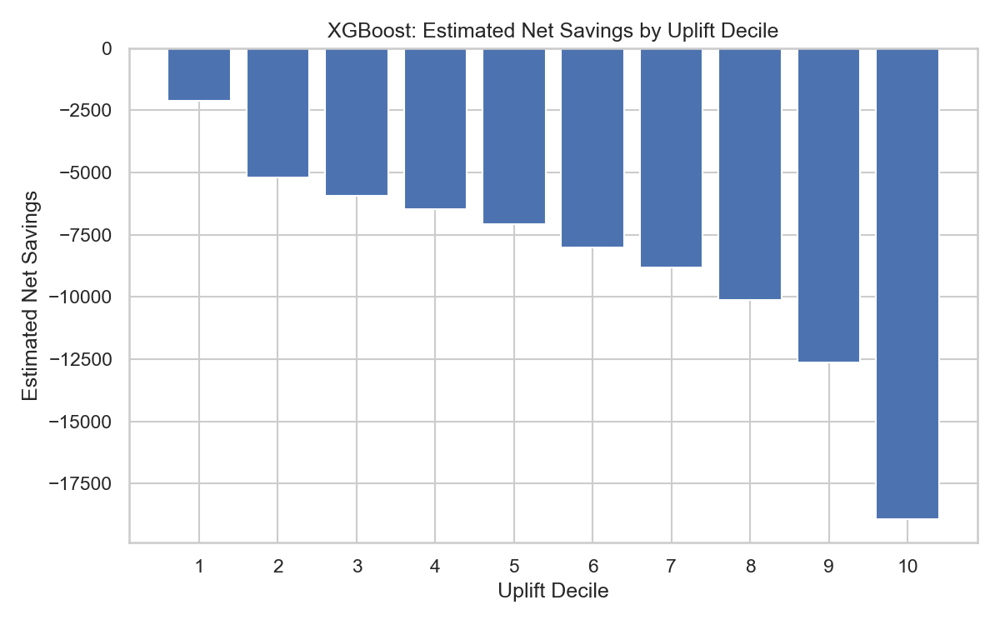

#### XGBoost X-Learner targeting

| Decile | N | Expected ED-rate reduction | Expected ED events avoided | Gross savings | Intervention cost | Net savings | ROI |
| --- | --- | --- | --- | --- | --- | --- | --- |
| 1 | 39 | 0.283 | 11.03 | $13,235 | $9,750 | $3,485 | 35.7% |
| 2 | 38 | 0.122 | 4.62 | $5,544 | $9,500 | $-3,956 | -41.6% |
| 3 | 38 | 0.053 | 2.00 | $2,405 | $9,500 | $-7,095 | -74.7% |
| 4 | 38 | 0.017 | 0.64 | $764 | $9,500 | $-8,736 | -92.0% |
| 5 | 38 | -0.005 | -0.18 | $-212 | $9,500 | $-9,712 | -102.2% |
| 6 | 39 | -0.023 | -0.91 | $-1,091 | $9,750 | $-10,841 | -111.2% |
| 7 | 38 | -0.050 | -1.89 | $-2,270 | $9,500 | $-11,770 | -123.9% |
| 8 | 38 | -0.079 | -2.99 | $-3,585 | $9,500 | $-13,085 | -137.7% |
| 9 | 38 | -0.119 | -4.52 | $-5,425 | $9,500 | $-14,925 | -157.1% |
| 10 | 38 | -0.215 | -8.17 | $-9,809 | $9,500 | $-19,309 | -203.3% |

The X-Learner produces a more favorable first-decile scenario but negative returns in later deciles. Because the T- and X-Learners disagree materially for some records, these values should be used for scenario planning rather than booked savings.

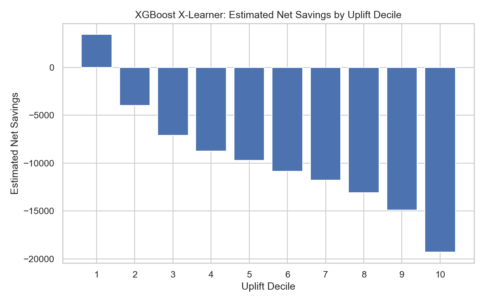

At approximately the top 50% of the test population, cumulative modeled gross savings were:

| Targeting approach | Population fraction | N | Cumulative gross savings |
| --- | --- | --- | --- |
| Uplift score | 49.7% | 190 | $21,751 |
| Current risk score | 49.7% | 190 | $489 |

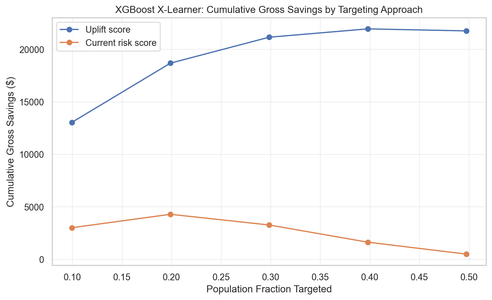

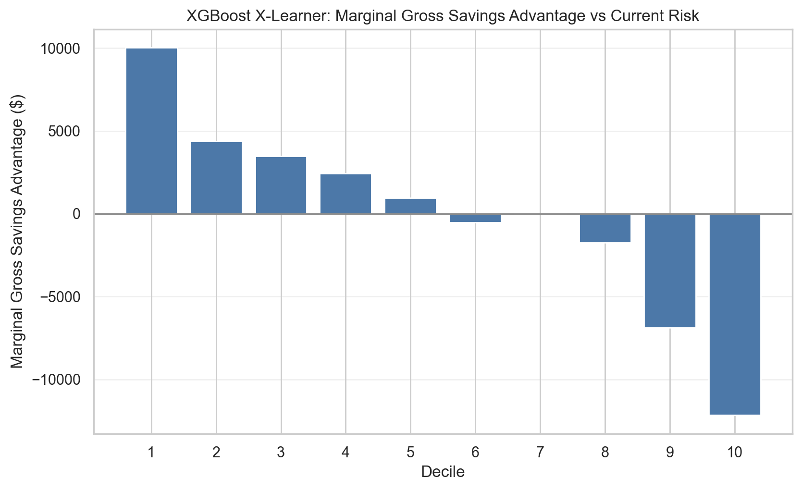

### Level 3 Summary

The models consistently emphasize recent utilization and cost-related baseline signals. Under the retained economic assumptions, the XGBoost T-Learner's full top decile is not cost-saving, while the X-Learner's first decile is positive. That contrast reinforces the need for prospective testing, explicit intervention-capacity constraints, and sensitivity analyses over unit cost and avoided-event value.

## Recommended Next Steps

1. Run a prospective pilot with randomized or defensible quasi-experimental assignment among high-ranked members.
2. Predefine ranking metrics, minimum detectable effect, and subgroup sample sizes before evaluation.
3. Recalibrate outcome probabilities and reassess learner-framework stability on a later Oregon cohort.
4. Replace illustrative cost assumptions with Oregon-specific allowed amounts and intervention delivery costs.
5. Monitor overlap, treatment propensity, and score drift; do not score members outside the baseline population without review.
6. Review fairness and operational feasibility across age, gender, geography, dual-eligibility status, and available demographic groups before deployment.

## Reproducibility and Output Audit

- Source data: `DataSets/Oregon_2YearDataset.csv` (read-only during analysis)
- Executed notebook: `Code/Uplift Model Code_Oregon_2YearDataset.ipynb`
- Notebook builder: `Code/build_oregon_uplift_notebook.py`
- Report generator: `Code/generate_oregon_uplift_report.py`
- Oregon outputs: `Outputs/Uplift_Oregon/`
- Random seed: 123
- Split: grouped by `member_id`; zero member overlap
- Preprocessing: fit on training data only
- Committed notebook backend: SageMaker CUDA GPU required on device 0
- Checked-in result snapshot backend: CPU hist (workspace has no CUDA); modeling grid unchanged
- Leakage assertions: passed
- Death handling: no death field present; no death-derived feature and no death-based exclusion

The parity manifest records 135 generated applicable artifacts, 6 applicable artifacts not generated, 27 Oregon-specific generated artifacts, and 39 synthetic-ground-truth artifacts marked not applicable. The six applicable-but-absent files are GLMNet T-Learner targeting outputs that were not produced by the Funds source workflow:

- `T-Learner/GLMNet/cumulative_gross_savings_by_targeting.csv`
- `T-Learner/GLMNet/cumulative_gross_savings_summary_top50.csv`
- `T-Learner/GLMNet/dashboard_cumulative_gross_savings_targeting.png`
- `T-Learner/GLMNet/dashboard_marginal_gross_savings_advantage_vs_current_risk.png`
- `T-Learner/GLMNet/marginal_gross_savings_advantage_vs_current_risk.csv`
- `T-Learner/GLMNet/marginal_gross_savings_by_targeting.csv`

These absences are explicit in `Outputs/Uplift_Oregon/Python/output_parity_manifest.csv`; no missing artifact is silently treated as generated.
