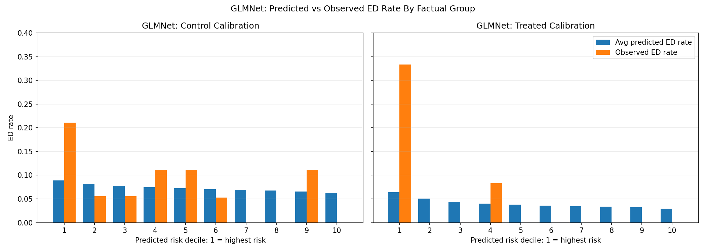
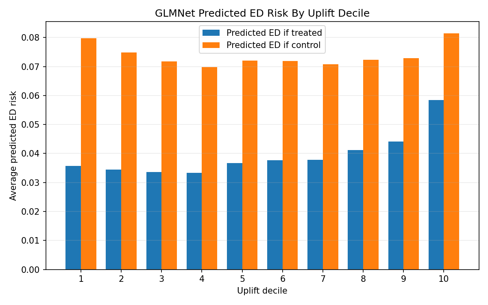
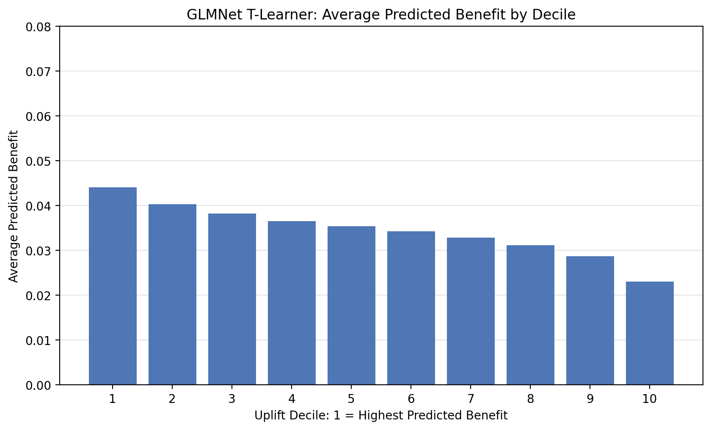
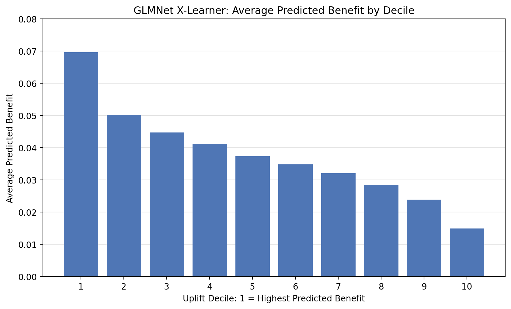
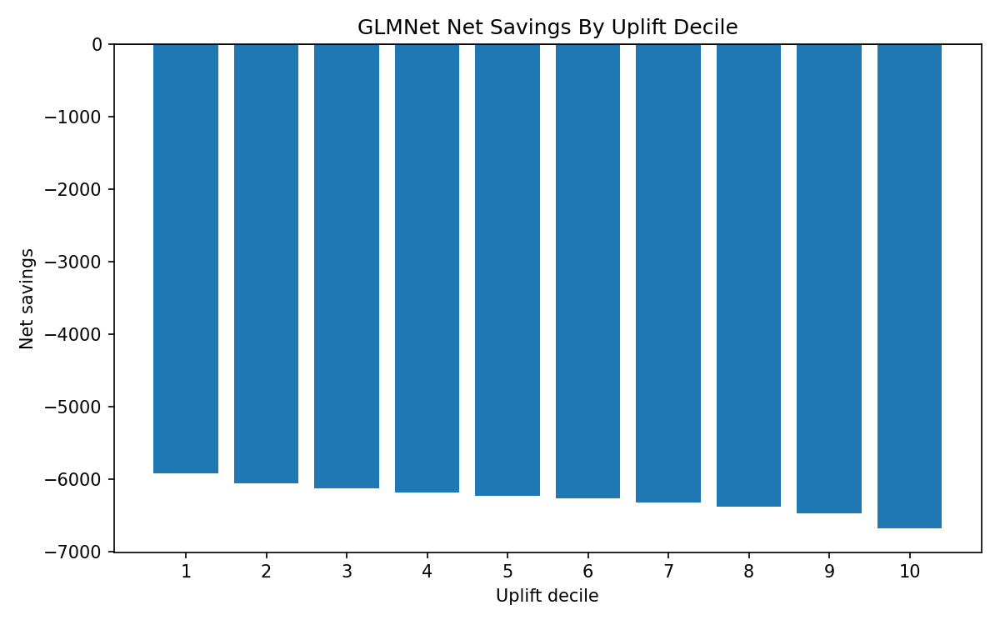

# PRISM Intervention Benefit Modeling Report Draft

This report draft summarizes the current results from the PRISM intervention benefit modeling workflow. It follows the order of the project requirements document, `Internship Project_PRISM Intervention Benefit Modeling.pdf`, and uses the outputs currently generated by `Code/Uplift Model Code_rh06032026.ipynb`.

The main output directory is `Outputs/Uplift/Python`. T-learner outputs are saved in `Outputs/Uplift/Python/T-Learner`, with separate `GLMNet` and `XGBoost` folders. X-learner outputs are saved in `Outputs/Uplift/Python/X-Learner`, also with separate `GLMNet` and `XGBoost` folders.

## Background

Care management programs must decide which members should receive intervention when outreach resources are limited. A common approach is to prioritize the highest-risk members, but high baseline risk does not always mean high intervention benefit. Some members may remain high risk even with intervention, while others may have risk that is meaningfully reduced by targeted care management.

This project evaluates an intervention benefit, or uplift, modeling framework to estimate the expected effect of intervention on future 90-day emergency department utilization. The goal is to identify members who are most likely to benefit from care management, not just members who are most likely to have an ED visit.

The analysis uses the PRP synthetic dataset. Although the dataset is synthetic, it is structured to resemble the variables and business use cases of a Medicaid care management population. Results are best interpreted as a demonstration of a reproducible modeling workflow, while recognizing that validation on live client data would be required before operational deployment.

## Business Question

The primary business question is:

> Which members are most likely to benefit from intervention in terms of reducing 90-day ED utilization?

The analysis also addresses what factors drive future ED utilization, what factors appear to influence expected intervention benefit, how care management resources could be prioritized using model results, and what estimated business value could be generated through targeted intervention.

## Project Objectives

The project evaluates whether uplift modeling can support care management prioritization. The workflow explains the modeling framework for both technical and non-technical audiences, evaluates model performance, compares practical business usefulness, interprets model outputs, identifies limitations, and documents a reproducible process that could later be applied to live client data.

## Analytical Task 1: Understanding And Explaining The Modeling Framework

### Outcome Variable

The outcome variable is `outcome_ed_90d`. It is a binary indicator for whether a member had emergency department utilization within 90 days. A value of 1 means the member had a 90-day ED outcome, and a value of 0 means the member did not.

The modeling goal is to estimate the probability of this outcome under two scenarios for each member: the probability of ED utilization if treated and the probability of ED utilization if untreated.

### Treatment Variable

The treatment variable is `intervention_flag`. It indicates whether the member received the care management intervention. A value of 1 indicates intervention, and a value of 0 indicates no intervention/control.

### Predictor Variables

Predictors were grouped into six defined categories: demographics, clinical conditions, social determinants of health (SDOH), utilization, pharmacy, and risk scores. These variables were selected because they represent member characteristics available before intervention and may influence either future ED risk or expected benefit from care management.

The demographics category includes `client_contract`, `service_region`, `program`, `case_manager_name`, `age`, `gender`, `dual_eligible`, `county`, `plan_type`, `language`, and `living_alone_flag`. Clinical conditions include `diabetes_flag`, `chf_flag`, `copd_flag`, `asthma_flag`, `depression_flag`, `anxiety_flag`, `substance_use_flag`, `ckd_flag`, `pregnancy_flag`, and `behavioral_health_risk_flag`. SDOH variables include `food_insecurity_flag`, `housing_instability_flag`, `transportation_barrier_flag`, and `utilities_insecurity_flag`.

Utilization variables include `pcp_visits_last_6m`, `specialist_visits_last_6m`, `ed_visits_last_30d`, `ed_visits_last_6m`, `admits_last_6m`, and `observation_stays_last_6m`. Pharmacy variables include `total_cost_last_6m`, `rx_count_last_6m`, `med_adherence_pdc`, `high_cost_drug_flag`, `opioid_flag`, and `polypharmacy_flag`. Risk score variables include the utilization, clinical, and SDOH score fields, plus `current_risk_score` and `risk_tier`.

The final model uses 41 predictors before one-hot encoding: 32 numeric predictors and 9 categorical predictors. The categorical predictors are `client_contract`, `service_region`, `program`, `case_manager_name`, `gender`, `county`, `plan_type`, `language`, and `risk_tier`. After one-hot encoding, the modeling matrix contains 77 columns.

The predictor data dictionary provides each variable's category, description, data type, missingness, number of unique values, example values, and value range where applicable. The numeric and categorical summary tables provide descriptive statistics that can be used in the written report.

Supporting files:

- [`predictor_data_dictionary.csv`](Outputs/Uplift/Python/Predictor_Distributions/predictor_data_dictionary.csv)
- [`numeric_predictor_summary.csv`](Outputs/Uplift/Python/Predictor_Distributions/numeric_predictor_summary.csv)
- [`categorical_predictor_summary.csv`](Outputs/Uplift/Python/Predictor_Distributions/categorical_predictor_summary.csv)

### Train/Test Methodology

The dataset is split into training and held-out test sets, with 700 data points used for training and 300 data points reserved for final evaluation. The split is stratified on the combination of treatment status and ED outcome so that the training and test sets preserve the treated-positive, treated-negative, control-positive, and control-negative proportions observed in the available dataset. This is important because the outcome is rare and the T-learner trains separate treated and control outcome models.

Within the training set, treated and control members are separated so that two outcome models can be trained: one model for members who received the intervention and one model for members who did not. Five-fold cross-validation is used within the training data to support model tuning and assess model stability. Final model performance is then evaluated on the held-out test data.

This setup is important because the uplift task is not only about predicting ED utilization. It is about comparing two counterfactual predictions for the same member: the expected ED risk if treated versus the expected ED risk if untreated.

### T-Learner Framework

The notebook uses a T-learner approach. A T-learner trains two separate outcome models:

1. Treated model: estimates `P(ED | Treated, member features)`
2. Control model: estimates `P(ED | Control, member features)`

Each member in the test data then receives two predicted probabilities, regardless of their actual treatment status:

```text
pred_ed_if_treated = predicted probability of ED within 90 days if treated
pred_ed_if_control = predicted probability of ED within 90 days if untreated
```

The predicted benefit score is calculated as:

```text
benefit_score = pred_ed_if_control - pred_ed_if_treated
```

A higher benefit score means the model predicts a larger reduction in ED risk if the member receives intervention. Members are then ranked by benefit score and assigned to uplift deciles, where decile 1 represents the highest predicted benefit group.

Separate treated and control models are useful because the relationship between member features and ED risk may differ depending on whether a member receives the intervention. A single risk model can identify members who are likely to have an ED visit, but it does not directly estimate whether the intervention changes that risk.

### X-Learner Framework

The X-learner is used as a second treatment-effect framework to check whether the uplift ranking is directionally consistent with the T-learner. It starts with the same basic counterfactual idea: estimate what would have happened to treated members without treatment and what would have happened to control members with treatment. It then converts those counterfactual comparisons into imputed treatment-effect targets and trains separate treatment-effect models.

For treated members, the X-learner compares the observed outcome with the predicted untreated outcome. For control members, it compares the predicted treated outcome with the observed outcome. These imputed effects are then modeled as functions of member features. At scoring time, a propensity model estimates each member's probability of receiving treatment, and the final X-learner benefit estimate is a weighted combination of the treated-effect and control-effect model predictions.

In this report, the X-learner is not used to replace the T-learner. It is used as a consistency check: if the T-learner and X-learner identify similar high-benefit members and show similar decile patterns, that increases confidence that the benefit ranking is not purely an artifact of one modeling framework.

### How The Analytical Tasks Fit Together

Analytical Tasks 2 and 3 are intentionally upstream of the T-learner versus X-learner comparison. Task 2 describes the data, treatment rate, outcome prevalence, and modeling constraints. Task 3 evaluates whether the factual outcome models are credible enough to support treatment-effect analysis. Those checks matter regardless of whether the final benefit estimate is produced through a T-learner or an X-learner.

The later tasks use those foundations differently. Task 4 explains the member-level treatment-effect logic using the GLMNet T-learner because it is the most direct way to show `pred_ed_if_treated`, `pred_ed_if_control`, and their difference. Task 5 then compares GLMNet T-learner and GLMNet X-learner decile behavior side by side to assess consistency across treatment-effect frameworks.

### Hyperparameter Tuning

Model tuning was performed within the training data using cross-validation. For XGBoost, the notebook used 5-fold cross-validation over tree depth, learning rate, and minimum child weight, with early stopping up to 500 boosting rounds. For GLMNet, the notebook used `LogisticRegressionCV` with standardized predictors, elastic-net mixing values from 0.0 to 1.0, and a regularization-strength grid. The selected treated and control outcome models were chosen using cross-validated AUC within the training data.

The current X-learner implementation uses fixed second-stage treatment-effect model settings as a framework comparison rather than a full tuning exercise. A future refinement would tune X-learner second-stage models separately and compare T-learner and X-learner results after both frameworks have been tuned.

### Modeling Techniques Used

Two modeling techniques were used inside the treatment-effect workflow: XGBoost and GLMNet. Both techniques can be used inside the T-learner and X-learner frameworks. The modeling technique controls how the relationship between member features and outcomes or treatment effects is learned; the learner framework controls how treatment benefit is constructed from those models.

XGBoost is a tree-based machine learning method. It builds many small decision trees sequentially, where each new tree attempts to correct errors made by the previous trees. Each tree splits members into groups based on predictor values, such as risk scores, utilization history, diagnosis flags, or demographic variables. The final XGBoost prediction is the combined output of all trees. In this project, one XGBoost model was trained on treated members and another was trained on control members. Each model outputs a predicted probability of 90-day ED utilization.

GLMNet is a regularized logistic regression approach. Logistic regression estimates the probability of a binary outcome by assigning weights, or coefficients, to predictor variables. GLMNet adds regularization, which shrinks coefficients and can reduce overfitting when there are many related predictors. In this project, GLMNet uses an elastic-net penalty, which combines ridge-style shrinkage and lasso-style feature selection. As with XGBoost, one GLMNet model was trained on treated members and another was trained on control members. Each model outputs a predicted probability of 90-day ED utilization.

The two approaches provide different strengths. XGBoost can capture nonlinear relationships and interactions between features, while GLMNet is more linear and easier to interpret through coefficients and model contributions. Comparing both methods helps evaluate whether the uplift findings are stable across a flexible tree-based model and a more interpretable regularized regression model.

## Analytical Task 2: Data Review

The current dataset contains 1,000 members. Of these, 394 received intervention and 606 were untreated/control members, giving an overall treatment rate of 39.4%. The ED outcome is relatively rare: 60 members had a 90-day ED event, for an overall outcome prevalence of 6.0%.

The observed ED rate is 4.1% among treated members and 7.3% among control members. This difference is directionally consistent with intervention being associated with lower ED utilization, but it is not interpreted as a causal treatment effect because treatment assignment may not be randomized and may be confounded by member characteristics.

<!-- AUTO_TABLE:data_review_summary START -->
| Metric | Current value |
| ---: | ---: |
| Total members | 1,000 |
| Treated members | 394 |
| Untreated/control members | 606 |
| Treatment rate | 39.4% |
| ED outcome events | 60 |
| Outcome prevalence | 6.0% |
| Treated observed ED rate | 4.1% |
| Control observed ED rate | 7.3% |
| Final predictors before one-hot encoding | 41 |
| Model matrix columns after one-hot encoding | 77 |
<!-- AUTO_TABLE:data_review_summary END -->

The dataset is synthetic and may not fully represent live client data. The low ED outcome prevalence also means predicted probabilities are expected to cluster closer to zero, which makes calibration and probability magnitude especially important. Future production use would require validation on live data, ongoing monitoring, and recalibration over time.

Supporting file:

- [`data_review_summary.csv`](Outputs/Uplift/Python/data_review_summary.csv)

## Analytical Task 3: Model Performance

This section evaluates whether the factual outcome models are credible enough to support treatment-effect analysis. These diagnostics are useful before comparing T-learner and X-learner results because both frameworks depend on reasonable estimates of ED risk under treated and untreated conditions. In the T-learner, treatment benefit is estimated by subtracting two predicted probabilities:

```text
benefit_score = pred_ed_if_control - pred_ed_if_treated
```

Because the benefit score depends on outcome modeling quality, model performance is evaluated first at the factual outcome-model level. The treated model is evaluated among actual treated members using `pred_ed_if_treated`, and the control model is evaluated among actual control members using `pred_ed_if_control`. Detailed uplift decile behavior is evaluated separately in Analytical Task 5.

### Hyperparameter Tuning

As described in Analytical Task 1, both model families were tuned using cross-validation within the training data. This tuning section is included before the treatment-effect comparison because both the T-learner and X-learner depend on credible underlying outcome models. In other words, Task 3 evaluates model quality before the report asks whether the T-learner and X-learner produce consistent uplift rankings.

Cross-validation AUC is useful for model selection, but held-out test performance is more important for judging generalization. Because the ED outcome is rare and each T-learner arm is trained separately, performance should be interpreted with attention to the number of positive ED events available in each group.

### Event Counts And Modeling Constraints

The main modeling constraint is not only the 6.0% overall ED outcome rate. It is the small number of positive ED events after splitting the data into treated and control groups. The treated model is especially data-limited because it has relatively few positive examples available for learning and evaluation.

<!-- AUTO_TABLE:factual_event_counts START -->
| Split | Group | N | Positive ED events | Negative ED events | Event rate |
| ---: | ---: | ---: | ---: | ---: | ---: |
| Train | Treated | 276 | 11 | 265 | 4.0% |
| Train | Control | 424 | 31 | 393 | 7.3% |
| Test | Treated | 118 | 5 | 113 | 4.2% |
| Test | Control | 182 | 13 | 169 | 7.1% |
<!-- AUTO_TABLE:factual_event_counts END -->

This event-count table is important context for all performance metrics. With only a small number of ED-positive cases, especially in the treated group, AUC, calibration, and decile-level observed rates can move noticeably with small changes in the train/test split. The results should therefore be interpreted as directional evidence rather than definitive proof of individual-level prediction accuracy.

### Discrimination Performance

Discrimination asks whether the model ranks actual ED-positive members above actual ED-negative members. In this project, treated AUC evaluates actual treated members using `pred_ed_if_treated`, and control AUC evaluates actual control members using `pred_ed_if_control`. This is the most direct test of whether each factual outcome model is learning useful risk ranking within the group it was trained to represent.

<!-- AUTO_TABLE:model_performance_summary START -->
| Model | Treated CV AUC | Control CV AUC | Treated test AUC | Control test AUC |
| ---: | ---: | ---: | ---: | ---: |
| XGBoost | 0.7399 | 0.6680 | 0.8354 | 0.5833 |
| GLMNet | 0.7138 | 0.6500 | 0.9062 | 0.6582 |
<!-- AUTO_TABLE:model_performance_summary END -->

GLMNet has the stronger held-out discrimination in this run. Its treated test AUC is meaningfully better than XGBoost's treated test AUC, and its control test AUC is also higher. XGBoost now ranks treated members well, but its control test AUC is weaker than GLMNet's control test AUC. Because both treated and control outcome models feed into the benefit score, GLMNet remains the stronger candidate for outcome-risk ranking.

### Factual Discrimination And Prediction Separation

AUC is useful, but it can feel abstract. The table below combines factual-group AUC with a more direct diagnostic: whether actual ED-positive members receive higher predicted risk than actual ED-negative members within the same factual group. For actual treated members, the comparison uses `pred_ed_if_treated`. For actual control members, the comparison uses `pred_ed_if_control`.

<!-- AUTO_TABLE:factual_prediction_separation START -->
| Model | Group | Positive events | Negative events | AUC | Avg pred for ED=1 | Avg pred for ED=0 | Avg difference | Median pred for ED=1 | Median pred for ED=0 |
| ---: | ---: | ---: | ---: | ---: | ---: | ---: | ---: | ---: | ---: |
| XGBoost | Treated | 5 | 113 | 0.8354 | 0.1289 | 0.1165 | 0.0124 | 0.1286 | 0.1110 |
| XGBoost | Control | 13 | 169 | 0.5833 | 0.1184 | 0.1134 | 0.0050 | 0.1119 | 0.1055 |
| GLMNet | Treated | 5 | 113 | 0.9062 | 0.0409 | 0.0401 | 0.0008 | 0.0410 | 0.0400 |
| GLMNet | Control | 13 | 169 | 0.6582 | 0.0864 | 0.0734 | 0.0130 | 0.0758 | 0.0689 |
<!-- AUTO_TABLE:factual_prediction_separation END -->

This table is one of the most important diagnostics for the project. The AUC column measures whether the model ranks actual ED-positive members above ED-negative members. The average and median prediction columns show whether ED-positive members receive higher predicted probabilities in magnitude. A useful risk model should show both stronger ranking and higher predicted risk among actual ED-positive members.

### Brier Score And Calibration

Brier score and calibration evaluate probability quality rather than ranking alone. Brier score measures the average squared difference between the observed outcome and predicted probability:

```text
Brier score = (1 / n) * sum((outcome_i - predicted_probability_i)^2)
```

Calibration error groups members into predicted-risk bins, compares each bin's average predicted ED rate with its observed ED rate, and then takes a weighted average of the absolute differences:

```text
Calibration error = sum((n_bin / n_total) * abs(observed_ED_rate_bin - average_predicted_ED_rate_bin))
```

<!-- AUTO_TABLE:brier_calibration_summary START -->
| Model | Treated Brier | Control Brier | Treated calibration error | Control calibration error |
| ---: | ---: | ---: | ---: | ---: |
| XGBoost | 0.0452 | 0.0681 | 0.0803 | 0.0644 |
| GLMNet | 0.0405 | 0.0651 | 0.0660 | 0.0298 |
<!-- AUTO_TABLE:brier_calibration_summary END -->

GLMNet has lower Brier scores and lower calibration error than XGBoost in both the treated and control groups. This supports GLMNet as the stronger probability model. However, Brier score should be interpreted carefully because the ED outcome is rare. A model can receive a low Brier score by predicting low probabilities for most members. For that reason, Brier and calibration should be interpreted alongside factual AUC, positive-vs-negative prediction separation, and prediction range.

<!-- AUTO_CHART:glmnet_calibration_plot START -->

<!-- AUTO_CHART:glmnet_calibration_plot END -->

### Factual Prediction Range And Rare-Outcome Interpretation

The model is not expected to produce many probabilities above 0.50 because the ED outcome rate is low. A maximum predicted probability below 0.50 does not imply model failure. The more important question is whether higher predicted probabilities correspond to higher observed ED risk and whether the model ranks members usefully within each factual group.

The prediction ranges below are **factual evaluation ranges**. For treated members, the table summarizes `pred_ed_if_treated` among members who were actually treated. For control members, it summarizes `pred_ed_if_control` among members who were actually untreated. These ranges are used to evaluate the outcome models on the groups where the observed treatment condition is known.

<!-- AUTO_TABLE:factual_prediction_ranges START -->
| Model | Group | Min | P10 | Median | Mean | P90 | Max |
| ---: | ---: | ---: | ---: | ---: | ---: | ---: | ---: |
| XGBoost | Treated | 0.1096 | 0.1096 | 0.1121 | 0.1170 | 0.1288 | 0.1525 |
| XGBoost | Control | 0.0814 | 0.0895 | 0.1057 | 0.1138 | 0.1557 | 0.1854 |
| GLMNet | Treated | 0.0394 | 0.0397 | 0.0400 | 0.0401 | 0.0408 | 0.0417 |
| GLMNet | Control | 0.0453 | 0.0525 | 0.0698 | 0.0744 | 0.1023 | 0.2067 |
<!-- AUTO_TABLE:factual_prediction_ranges END -->

This table helps explain probability magnitude in a rare-outcome setting. GLMNet's treated predictions are tightly compressed around 4.0%, so even small rank-order differences can produce a strong AUC while still producing very little probability spread. The GLMNet control model has a wider factual prediction range, which gives it more room to separate higher-risk and lower-risk members by probability magnitude.

### Model Performance Takeaway

Overall, GLMNet is the stronger outcome-risk model in this run. It has better held-out discrimination across the two factual groups, lower Brier scores, and lower calibration error. XGBoost performs well in the treated group but is weaker in the control group, while GLMNet is more consistent across both arms. The strongest conclusion is that GLMNet appears more useful for relative risk ranking and probability quality than XGBoost.

The main limitation is event scarcity. The treated model is trained and evaluated with very few positive ED events, which makes individual-level probability estimates and decile-level validation unstable. The current results support GLMNet as the preferred candidate model for the rest of the analysis, but the evidence should be described as directionally supportive rather than definitive. Uplift decile behavior and operational prioritization are evaluated in Analytical Task 5.

Supporting files:

- [`model_evaluation_summary.csv`](Outputs/Uplift/Python/model_evaluation_summary.csv)
- [`factual_event_count_summary.csv`](Outputs/Uplift/Python/factual_event_count_summary.csv)
- [`factual_prediction_separation.csv`](Outputs/Uplift/Python/factual_prediction_separation.csv)
- [`factual_prediction_ranges.csv`](Outputs/Uplift/Python/factual_prediction_ranges.csv)
- [`XGBoost/model_brier_scores.csv`](Outputs/Uplift/Python/T-Learner/XGBoost/model_brier_scores.csv)
- [`GLMNet/model_brier_scores.csv`](Outputs/Uplift/Python/T-Learner/GLMNet/model_brier_scores.csv)
- [`XGBoost/calibration_summary.csv`](Outputs/Uplift/Python/T-Learner/XGBoost/calibration_summary.csv)
- [`GLMNet/calibration_summary.csv`](Outputs/Uplift/Python/T-Learner/GLMNet/calibration_summary.csv)

## Analytical Task 4: Treatment Effect Analysis

This section applies the GLMNet T-learner outputs at the member level. GLMNet is used here because Analytical Task 3 identified it as the stronger candidate outcome-risk model. Each member receives two predicted ED probabilities: one assuming the member receives intervention and one assuming the member does not receive intervention. The benefit score is the difference between those two predicted probabilities:

```text
benefit_score = pred_ed_if_control - pred_ed_if_treated
```

A higher benefit score means the model predicts a larger reduction in ED risk under intervention. A near-zero benefit score means the model predicts little difference between treatment and no treatment. A negative benefit score means the model predicts a higher ED probability under treatment than under no treatment; this should be interpreted cautiously, but operationally it means the member would not be prioritized based on predicted benefit. In uplift modeling, these negative-benefit cases are sometimes called **sleeping dogs**: cases where outreach may be unnecessary or potentially counterproductive. In this project, a sleeping-dog score should not be interpreted as proof that intervention causes harm, but it is useful as a prioritization warning.

The key value of this section is that it separates **high risk** from **high expected benefit**. A member can be clinically high risk but not highly impactable if the model predicts high ED risk under both treatment and control. Conversely, a member with moderate baseline risk may be a strong outreach candidate if the model predicts a meaningful risk reduction under treatment.

Current high-benefit examples from the GLMNet T-learner scored output:

<!-- AUTO_TABLE:top_benefit_examples START -->
| Model | Example | Actual outcome | Treatment flag | Predicted ED if treated | Predicted ED if control | Benefit score | Uplift decile |
| ---: | ---: | ---: | ---: | ---: | ---: | ---: | ---: |
| GLMNet | Highest benefit | 1 | 0 | 0.0438 | 0.4700 | 0.4263 | 1 |
| GLMNet | Second highest benefit | 1 | 1 | 0.0443 | 0.4021 | 0.3579 | 1 |
<!-- AUTO_TABLE:top_benefit_examples END -->

In the highest GLMNet example, the predicted untreated ED probability is 0.4700 and the predicted treated ED probability is 0.0438, giving a predicted benefit of 0.4263. This means the model estimates a 42.63 percentage point reduction in ED probability under treatment for that member.

The high `pred_ed_if_control` values in this table are not inconsistent with the factual prediction-range table in Analytical Task 3. The Task 3 range summarizes held-out factual outcome-model evaluation only: actual treated test members are evaluated with `pred_ed_if_treated`, and actual control test members are evaluated with `pred_ed_if_control`. The scored-output examples in Analytical Task 4 come from the full scored output and use both predicted scenarios for each member because that is required to estimate benefit.

The table above shows the highest-benefit members, but benefit scores are most useful when comparing different member profiles. The examples below show how the same output fields can support outreach prioritization:

| Member comparison type | Predicted ED if treated | Predicted ED if control | Benefit score | Outreach interpretation |
|---|---:|---:|---:|---|
| High benefit | 0.04 | 0.47 | 0.43 | Strong outreach candidate because predicted ED risk is much lower under treatment. |
| High risk, low benefit | 0.30 | 0.32 | 0.02 | Clinically high risk, but the model does not predict a large intervention effect. |
| Low risk, low benefit | 0.02 | 0.03 | 0.01 | Lower outreach priority because baseline ED risk and predicted benefit are both low. |
| Possible negative benefit, or sleeping dog | 0.08 | 0.05 | -0.03 | Not prioritized by uplift score because predicted risk is not lower under treatment. |

This is why uplift modeling can be more useful than risk ranking alone. A pure risk model would tend to prioritize members with the highest predicted ED probability. The uplift model instead prioritizes members whose ED probability is expected to decrease the most if they receive intervention.

<!-- AUTO_CHART:glmnet_predicted_treated_vs_control START -->

<!-- AUTO_CHART:glmnet_predicted_treated_vs_control END -->

Supporting files:

- [`GLMNet/uplift_scored_output.csv`](Outputs/Uplift/Python/T-Learner/GLMNet/uplift_scored_output.csv)

## Analytical Task 5: Uplift Decile Analysis

Members are ranked by predicted benefit score and split into 10 uplift deciles. Decile 1 is the highest predicted benefit group.

Because GLMNet is the stronger candidate model based on held-out AUC, Brier score, calibration error, and predicted benefit separation, the decile review below focuses on GLMNet. This section compares the GLMNet T-learner and GLMNet X-learner decile patterns side by side so the two treatment-effect frameworks can be checked for consistency. Each decile contains 30 held-out test members.

<!-- AUTO_TABLE:glmnet_t_vs_x_decile_summary START -->
<table><tr>
<td valign="top" width="50%"><strong>GLMNet T-learner deciles</strong>
<table><thead><tr><th>Uplift decile</th><th>N</th><th>Avg benefit score</th><th>Observed ED rate</th><th>Avg predicted ED if treated</th><th>Avg predicted ED if control</th><th>Treatment pct</th></tr></thead><tbody><tr><td>1</td><td>30</td><td>0.0827</td><td>0.2333</td><td>0.0409</td><td>0.1236</td><td>0.5000</td></tr><tr><td>2</td><td>30</td><td>0.0576</td><td>0.1000</td><td>0.0406</td><td>0.0982</td><td>0.3667</td></tr><tr><td>3</td><td>30</td><td>0.0461</td><td>0.0333</td><td>0.0402</td><td>0.0863</td><td>0.5000</td></tr><tr><td>4</td><td>30</td><td>0.0382</td><td>0.0667</td><td>0.0401</td><td>0.0784</td><td>0.4000</td></tr><tr><td>5</td><td>30</td><td>0.0322</td><td>0.0667</td><td>0.0400</td><td>0.0722</td><td>0.2667</td></tr><tr><td>6</td><td>30</td><td>0.0281</td><td>0.0333</td><td>0.0400</td><td>0.0681</td><td>0.5333</td></tr><tr><td>7</td><td>30</td><td>0.0240</td><td>0.0000</td><td>0.0399</td><td>0.0639</td><td>0.4000</td></tr><tr><td>8</td><td>30</td><td>0.0205</td><td>0.0000</td><td>0.0398</td><td>0.0603</td><td>0.3000</td></tr><tr><td>9</td><td>30</td><td>0.0166</td><td>0.0000</td><td>0.0397</td><td>0.0563</td><td>0.4333</td></tr><tr><td>10</td><td>30</td><td>0.0116</td><td>0.0667</td><td>0.0396</td><td>0.0512</td><td>0.2333</td></tr></tbody></table>
</td>
<td valign="top" width="50%"><strong>GLMNet X-learner deciles</strong>
<table><thead><tr><th>Uplift decile</th><th>N</th><th>Avg benefit score</th><th>Observed ED rate</th><th>Avg predicted ED if treated</th><th>Avg predicted ED if control</th><th>Treatment pct</th></tr></thead><tbody><tr><td>1</td><td>30</td><td>0.0838</td><td>0.2000</td><td>0.0410</td><td>0.1181</td><td>0.5333</td></tr><tr><td>2</td><td>30</td><td>0.0552</td><td>0.0667</td><td>0.0404</td><td>0.0951</td><td>0.3667</td></tr><tr><td>3</td><td>30</td><td>0.0460</td><td>0.0333</td><td>0.0400</td><td>0.0763</td><td>0.2667</td></tr><tr><td>4</td><td>30</td><td>0.0410</td><td>0.0667</td><td>0.0401</td><td>0.0772</td><td>0.3000</td></tr><tr><td>5</td><td>30</td><td>0.0382</td><td>0.0667</td><td>0.0399</td><td>0.0691</td><td>0.2333</td></tr><tr><td>6</td><td>30</td><td>0.0352</td><td>0.0333</td><td>0.0399</td><td>0.0692</td><td>0.5333</td></tr><tr><td>7</td><td>30</td><td>0.0314</td><td>0.0000</td><td>0.0398</td><td>0.0646</td><td>0.4667</td></tr><tr><td>8</td><td>30</td><td>0.0278</td><td>0.1000</td><td>0.0399</td><td>0.0646</td><td>0.5000</td></tr><tr><td>9</td><td>30</td><td>0.0239</td><td>0.0333</td><td>0.0398</td><td>0.0640</td><td>0.3333</td></tr><tr><td>10</td><td>30</td><td>0.0137</td><td>0.0000</td><td>0.0399</td><td>0.0601</td><td>0.4000</td></tr></tbody></table>
</td>
</tr></table>
<!-- AUTO_TABLE:glmnet_t_vs_x_decile_summary END -->

<!-- AUTO_CHART:glmnet_t_vs_x_avg_benefit_charts START -->
| GLMNet T-learner | GLMNet X-learner |
|---|---|
|  |  |
<!-- AUTO_CHART:glmnet_t_vs_x_avg_benefit_charts END -->

The consistency summary below is limited to GLMNet because GLMNet is the model carried forward for interpretation. The correlations compare member-level T-learner and X-learner benefit scores on the held-out test set, while top-decile overlap shows how many members appear in both high-benefit groups.

<!-- AUTO_TABLE:glmnet_xlearner_consistency_summary START -->
| Model | Pearson benefit score corr | Spearman benefit score corr | Top decile overlap | T-learner mean benefit score | X-learner mean benefit score |
| ---: | ---: | ---: | ---: | ---: | ---: |
| GLMNet | 0.8062 | 0.6778 | 60.0% | 0.0358 | 0.0396 |
<!-- AUTO_TABLE:glmnet_xlearner_consistency_summary END -->

Supporting files:

- [`GLMNet/uplift_decile_summary.csv`](Outputs/Uplift/Python/T-Learner/GLMNet/uplift_decile_summary.csv)
- [`GLMNet X-learner/xlearner_decile_summary.csv`](Outputs/Uplift/Python/X-Learner/GLMNet/xlearner_decile_summary.csv)
- [`X-learner consistency summary`](Outputs/Uplift/Python/X-Learner/xlearner_vs_tlearner_consistency_summary.csv)

## Analytical Task 6: Variable Importance And Explainability

The explainability analysis separates risk drivers from benefit drivers. Risk drivers explain what predicts ED utilization in the treated and control outcome models. Benefit drivers explain what contributes to the predicted treatment benefit score, `pred_ed_if_control - pred_ed_if_treated`.

### Risk Drivers

The current top risk drivers are:

| Group | Top current drivers |
|---|---|
| Treated model | `current_risk_score`, `percolator_utilization_score`, `ed_visits_last_6m`, `total_cost_last_6m`, `risk_tier_High` |
| Control model | `utilities_insecurity_flag`, `current_risk_score`, `dual_eligible`, `ed_visits_last_6m`, `county_County_A` |

GLMNet identifies risk-related variables such as `current_risk_score`, recent utilization, and percolator scores as important ED risk drivers. This is clinically reasonable because prior utilization and composite risk scores are expected to be strongly related to future ED risk. In the control model, risk is also strongly influenced by `utilities_insecurity_flag`, `dual_eligible`, and recent ED utilization.

### Benefit Drivers

For GLMNet, benefit-driver importance is compared across the T-learner and X-learner frameworks. The T-learner benefit-driver calculation is based on:

```text
benefit_contribution = control_contribution - treated_contribution
```

The X-learner benefit-driver calculation uses the propensity-weighted contributions from the second-stage treated-effect and control-effect models. Comparing the two frameworks helps show whether the main drivers of predicted treatment benefit are directionally consistent.

The current top benefit drivers by magnitude are:

<!-- AUTO_TABLE:glmnet_benefit_magnitude START -->
_Pending: run the notebook to generate `Outputs/Uplift/Python/X-Learner/GLMNet/xlearner_benefit_driver_importance.csv`._
<!-- AUTO_TABLE:glmnet_benefit_magnitude END -->

The current top benefit drivers by signed value are:

<!-- AUTO_TABLE:glmnet_benefit_signed START -->
_Pending: run the notebook to generate `Outputs/Uplift/Python/X-Learner/GLMNet/xlearner_benefit_driver_importance.csv`._
<!-- AUTO_TABLE:glmnet_benefit_signed END -->

<!-- AUTO_TEXT:glmnet_benefit_driver_interpretation START -->
For GLMNet, `admits_last_6m`, `ed_visits_last_6m`, `percolator_clinical_score`, `chf_flag`, `current_risk_score` are the largest benefit-driver features by absolute contribution-difference magnitude. By signed value, `ed_visits_last_6m`, `admits_last_6m`, `current_risk_score` have the strongest positive average contribution to predicted benefit. The strongest negative signed contributor is `risk_tier_Very_High`.
<!-- AUTO_TEXT:glmnet_benefit_driver_interpretation END -->

The absolute benefit-driver value measures how strongly a feature changes predicted benefit, regardless of direction. The signed benefit contribution shows whether the feature tends to increase or decrease predicted benefit, and the percent-positive column shows the share of members where the feature increased predicted benefit. Therefore, the benefit-driver tables are interpreted using both magnitude and direction.

GLMNet provides coefficient-based interpretability, but coefficient interpretation can still be affected by correlation among predictors.

Collinearity can affect coefficient interpretation in GLMNet, so correlated predictors merit review before live deployment. The X-learner driver comparison should be treated as a consistency check rather than a separate causal explanation.

<!-- AUTO_CHART:glmnet_benefit_driver_chart START -->
_Pending: run the notebook to generate `Outputs/Uplift/Python/X-Learner/GLMNet/dashboard_xlearner_benefit_drivers.png`._
<!-- AUTO_CHART:glmnet_benefit_driver_chart END -->

Supporting files:

- [`GLMNet/shap_importance_treated_control_models.csv`](Outputs/Uplift/Python/T-Learner/GLMNet/shap_importance_treated_control_models.csv)
- [`GLMNet/shap_importance_benefit_score.csv`](Outputs/Uplift/Python/T-Learner/GLMNet/shap_importance_benefit_score.csv)
- [`GLMNet/dashboard_shap_treated_model.png`](Outputs/Uplift/Python/T-Learner/GLMNet/dashboard_shap_treated_model.png)
- [`GLMNet/dashboard_shap_control_model.png`](Outputs/Uplift/Python/T-Learner/GLMNet/dashboard_shap_control_model.png)
- [`GLMNet/dashboard_shap_benefit_score.png`](Outputs/Uplift/Python/T-Learner/GLMNet/dashboard_shap_benefit_score.png)
- [`GLMNet X-learner/xlearner_benefit_driver_importance.csv`](Outputs/Uplift/Python/X-Learner/GLMNet/xlearner_benefit_driver_importance.csv)
- [`GLMNet X-learner/dashboard_xlearner_benefit_drivers.png`](Outputs/Uplift/Python/X-Learner/GLMNet/dashboard_xlearner_benefit_drivers.png)
- [`GLMNet T-vs-X benefit-driver comparison chart`](Outputs/Uplift/Python/X-Learner/GLMNet/dashboard_t_vs_x_benefit_driver_comparison.png)

## Analytical Task 7: Business Value Assessment

The ROI analysis estimates the financial value of targeting members by uplift decile. It also compares uplift-based targeting with the prior-style approach of targeting members strictly by highest `current_risk_score`. The current calculation assumes:

```text
expected_ed_rate_reduction = avg_benefit_score
expected_ed_visits_avoided = n * expected_ed_rate_reduction
gross_savings = expected_ed_visits_avoided * cost_per_ed_visit
intervention_cost = n * cost_per_intervention
net_savings = gross_savings - intervention_cost
roi = net_savings / intervention_cost
```

The current cost assumptions are $1,200 per ED visit and $250 per intervention.

<!-- AUTO_TABLE:roi_summary START -->
| Targeting approach | Top decile n | Avg predicted benefit | Estimated ED visits avoided | Gross savings | Intervention cost | Net savings | ROI |
| --- | --- | --- | --- | --- | --- | --- | --- |
| GLMNet uplift score | 30 | 0.0827 | 2.4807 | $2,976.87 | $7,500.00 | -$4,523.13 | -0.6031 |
| Current risk score | 30 | 0.0749 | 2.2456 | $2,694.72 | $7,500.00 | -$4,805.28 | -0.6407 |
<!-- AUTO_TABLE:roi_summary END -->

<!-- AUTO_TEXT:roi_interpretation START -->
GLMNet uplift targeting estimates 2.4807 avoided ED visits in the top benefit decile. Targeting the top decile by current risk score instead estimates 2.2456 avoided ED visits. Under the current assumptions, the estimated gross savings do not exceed intervention costs in either approach, so ROI remains negative. However, uplift-based targeting produces a less negative ROI than current-risk targeting because it selects members with higher average predicted intervention benefit (-0.6031 versus -0.6407).
<!-- AUTO_TEXT:roi_interpretation END -->

The current-risk comparison uses the same held-out test population and the same cost assumptions. Members are selected by highest `current_risk_score`, and expected avoided ED visits are then calculated using the GLMNet predicted benefit scores for those selected members. This makes the comparison a targeting-policy comparison: prioritize by estimated intervention benefit versus prioritize by baseline risk.

<!-- AUTO_CHART:glmnet_roi_by_decile START -->

<!-- AUTO_CHART:glmnet_roi_by_decile END -->

These ROI results are directional rather than definitive. ROI is sensitive to the assumed ED visit cost, intervention cost, calibration of predicted benefit, and whether predicted benefit translates into actual avoided ED visits. A future write-up can add sensitivity testing with different cost assumptions.

Supporting files:

- [`GLMNet/uplift_roi_by_decile.csv`](Outputs/Uplift/Python/T-Learner/GLMNet/uplift_roi_by_decile.csv)
- [`GLMNet/dashboard_roi_net_savings_by_decile.png`](Outputs/Uplift/Python/T-Learner/GLMNet/dashboard_roi_net_savings_by_decile.png)

## Analytical Task 8: Client Perspective

From the perspective of a Medicaid health plan executive team, the most important conclusion is that the uplift framework provides a more targeted prioritization method than baseline risk alone. It attempts to identify members whose ED risk is expected to decrease with intervention.

GLMNet is the current candidate model for interpretation and operational discussion. It has better held-out test AUC, better calibration, and higher top-decile predicted benefit. However, after the stratified split, the GLMNet top decile does not have a positive observed control-treated gap. This means the current results support GLMNet as the stronger ranking model, but they do not yet provide strong observed top-decile validation for operational targeting.

If the model were used for exploratory prioritization, uplift decile 1 would be the first group to review. GLMNet decile 1 has average predicted benefit of 0.0827 and an observed control-treated ED gap of -0.0667. The negative observed gap means the highest-ranked group should not be presented as validated proof of treatment benefit. Because estimated top-decile ROI also remains negative under current cost assumptions, the model is best presented as a promising prioritization proof of concept rather than a ready financial case.

The results are explainable enough for stakeholder discussion because GLMNet provides standardized coefficient/logit contribution explanations. The benefit-driver analysis is especially important because the variables that drive baseline ED risk are not always the same as the variables that drive expected treatment benefit.

Several limitations are central to the interpretation. The dataset is synthetic and may not reflect live population behavior. Treatment assignment may be confounded. Observed treated-control gaps are not randomized treatment effects. Decile-level sample sizes are small, which can make observed rates unstable. Rare outcome prevalence can compress predicted probabilities toward zero. ROI depends heavily on cost assumptions and model calibration. Live-data validation is required before production deployment.

Operationally, the workflow would score members using the trained uplift model, rank members by benefit score, assign uplift deciles, prioritize outreach starting with decile 1, review benefit drivers for operational context, track outcomes after intervention, and recalibrate/retrain the model over time.

## Recommendation

The uplift modeling framework provides a structured way to prioritize members by predicted intervention benefit rather than baseline ED risk alone. In the current outputs, GLMNet provides the stronger candidate model because it has better held-out test AUC, better calibration, and higher top-decile predicted benefit. The observed top-decile treatment gap is negative after the stratified split, so the model should be described as a promising but not yet validated prioritization workflow.

The current GLMNet top decile has average predicted benefit of 0.0827, observed ED rate of 23.3%, and observed control-treated ED gap of -6.67 percentage points. Estimated top-decile ROI remains negative under the current assumptions of $1,200 per ED visit and $250 per intervention. Therefore, the model is best presented as a promising prioritization workflow that requires live-data validation, calibration review, observed-outcome validation, and ROI sensitivity testing before production deployment.

## Presentation Summary

A presentation based on these results can be organized around the business problem, the reason high risk is not always high benefit, the T-learner modeling approach, the data review, model performance, uplift decile findings, explainability results, ROI, limitations, and final recommendation.

The strongest slide story is that GLMNet is the candidate model carried forward for uplift prioritization. The caution is that the observed top-decile control-treated gap is not positive after the stratified split, ROI is still negative under current assumptions, and the data are synthetic. The workflow is promising, but it requires live-data validation before operational use.

## Reproducibility

The analysis can be reproduced by opening `Code/Uplift Model Code_rh06032026.ipynb`, restarting the kernel, and running all cells in order. The GLMNet T-learner outputs used in the final interpretation are saved in `Outputs/Uplift/Python/T-Learner/GLMNet`; GLMNet X-learner comparison outputs are saved in `Outputs/Uplift/Python/X-Learner/GLMNet`.

After rerunning the notebook, refresh the generated README tables, text snippets, and chart embeds with:

```bash
python Code/generate_readme_tables.py
```

Key output files:

- [`data_review_summary.csv`](Outputs/Uplift/Python/data_review_summary.csv)
- [`model_evaluation_summary.csv`](Outputs/Uplift/Python/model_evaluation_summary.csv)
- [`model_recommendation_summary.csv`](Outputs/Uplift/Python/model_recommendation_summary.csv)
- [`GLMNet/uplift_decile_summary.csv`](Outputs/Uplift/Python/T-Learner/GLMNet/uplift_decile_summary.csv)
- [`GLMNet/uplift_roi_by_decile.csv`](Outputs/Uplift/Python/T-Learner/GLMNet/uplift_roi_by_decile.csv)
- [`GLMNet/calibration_summary.csv`](Outputs/Uplift/Python/T-Learner/GLMNet/calibration_summary.csv)
- [`GLMNet/uplift_observed_gap_by_decile.csv`](Outputs/Uplift/Python/T-Learner/GLMNet/uplift_observed_gap_by_decile.csv)
- [`GLMNet/top_benefit_decile_summary.csv`](Outputs/Uplift/Python/T-Learner/GLMNet/top_benefit_decile_summary.csv)
- [`GLMNet/shap_importance_treated_control_models.csv`](Outputs/Uplift/Python/T-Learner/GLMNet/shap_importance_treated_control_models.csv)
- [`GLMNet/shap_importance_benefit_score.csv`](Outputs/Uplift/Python/T-Learner/GLMNet/shap_importance_benefit_score.csv)
