# PRISM Intervention Benefit Modeling Report Draft

This report draft summarizes the current results from the PRISM intervention benefit modeling workflow. It follows the order of the project requirements document, `Internship Project_PRISM Intervention Benefit Modeling.pdf`, and uses the outputs currently generated by `Code/Uplift Model Code_rh06032026.ipynb`.

The main output directory is `Outputs/Uplift/Python`. T-learner outputs are saved in `Outputs/Uplift/Python/T-Learner`, with separate `GLMNet` and `XGBoost` folders. X-learner outputs are saved in `Outputs/Uplift/Python/X-Learner`, also with separate `GLMNet` and `XGBoost` folders.

## Background

Care management programs must decide which members should receive intervention when outreach resources are limited. A common approach is to prioritize the highest-risk members, but high baseline risk does not always mean high intervention benefit. Some members may remain high risk even with intervention, while others may have risk that is meaningfully reduced by targeted care management.

This project evaluates an intervention benefit, or uplift, modeling framework to estimate the expected effect of intervention on future 90-day emergency department utilization. The goal is to identify members who are most likely to benefit from care management, not just members who are most likely to have an ED visit.

The analysis uses the PRP synthetic dataset. Although the dataset is synthetic, it is structured to resemble the variables and business use cases of a Medicaid care management population. Results are best interpreted as a demonstration of a reproducible modeling workflow, while recognizing that validation on live client data would be required before operational deployment.

## Business Question

The primary business question is:

> Which members are most likely to benefit from intervention in terms of reducing 90-day ED utilization?

The analysis also addresses what factors drive future ED utilization, what factors appear to influence expected intervention benefit, how care management resources could be prioritized using model results, and what estimated business value could be generated through targeted intervention.

## Project Objectives

The project evaluates whether uplift modeling can support care management prioritization. The workflow explains the modeling framework for both technical and non-technical audiences, evaluates model performance, compares practical business usefulness, interprets model outputs, identifies limitations, and documents a reproducible process that could later be applied to live client data.

## Analytical Task 1: Understanding the Modeling Framework

This project evaluates a causal machine learning framework for estimating which members are most likely to benefit from care management intervention. Rather than predicting only future emergency department (ED) utilization, the framework estimates the expected benefit of intervention for each member. Different causal modeling approaches estimate this benefit in different ways. Some estimate potential outcomes under treatment and control, while others estimate treatment effects directly.

### Outcome Variable

The outcome variable is `outcome_ed_90d`, a binary indicator of whether a member experienced an emergency department visit within 90 days.

- **1** = Member had a 90-day ED visit
- **0** = Member did not have a 90-day ED visit

### Treatment Variable

The treatment variable is `intervention_flag`, indicating whether a member received care management intervention.

- **1** = Received intervention
- **0** = No intervention (control)

### Predictor Variables

The model uses predictors available before intervention that may influence future ED utilization or the expected benefit of care management. Predictors are organized into six categories:

- **Demographics**
- **Clinical conditions**
- **Social determinants of health (SDOH)**
- **Healthcare utilization**
- **Pharmacy**
- **Risk scores**

The final model includes **41 predictors** before one-hot encoding, consisting of **14 continuous/count variables**, **18 binary indicator variables**, and **9 categorical variables**. After one-hot encoding, the modeling matrix contains **77 features**.

Complete variable definitions and descriptive summaries are provided in:

- [`predictor_data_dictionary.csv`](Outputs/Uplift/Python/Predictor_Distributions/predictor_data_dictionary.csv)
- [`numeric_predictor_summary.csv`](Outputs/Uplift/Python/Predictor_Distributions/numeric_predictor_summary.csv)
- [`categorical_predictor_summary.csv`](Outputs/Uplift/Python/Predictor_Distributions/categorical_predictor_summary.csv)

### Overall Modeling Workflow

The dataset is divided into stratified training and test sets. Models are trained using cross-validation within the training data and evaluated on a held-out test set. Treatment-effect estimates are then used to rank members according to their predicted intervention benefit.

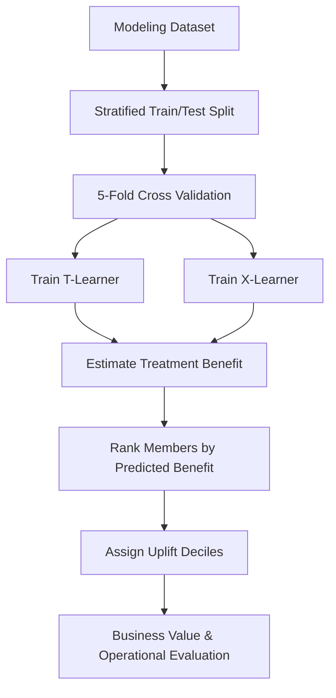

### Treatment-Effect Frameworks

Two causal treatment-effect frameworks are evaluated in this project.

#### T-Learner

The T-learner estimates treatment benefit by training separate outcome models for treated and untreated members. Each member receives predicted ED risk under both scenarios, and the treatment benefit is calculated as the difference between the two predicted risks.

```text
benefit_score = predicted ED risk if untreated − predicted ED risk if treated
```

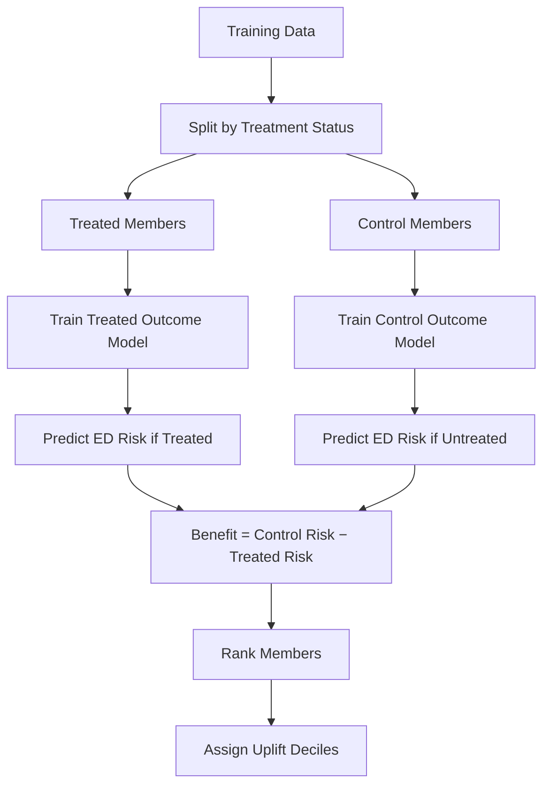

#### X-Learner

The X-learner estimates treatment benefit by first constructing counterfactual outcomes and then learning treatment effects directly. A propensity model combines information from treated and untreated members to produce a final treatment-effect estimate.

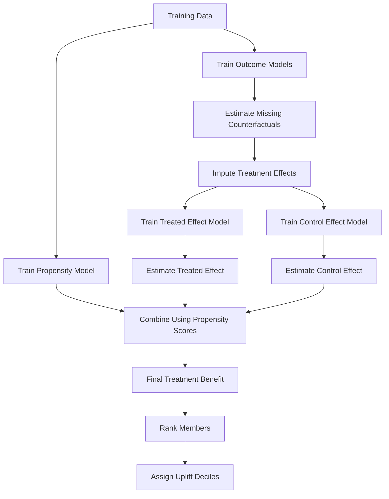

The T-learner provides a direct estimate of intervention benefit by comparing predicted risks under treatment and control. The X-learner provides an independent estimate of treatment effect and is used to evaluate whether the member rankings produced by the T-learner are consistent across causal modeling frameworks.

### Modeling Techniques

Two predictive modeling techniques are evaluated within each treatment-effect framework:

- **GLMNet** – a regularized logistic regression approach that emphasizes interpretability while reducing overfitting through elastic-net regularization.
- **XGBoost** – a gradient-boosted decision tree approach capable of modeling nonlinear relationships and feature interactions.

Comparing both modeling techniques helps evaluate whether treatment-benefit rankings are consistent across different predictive models.

## Analytical Task 2: Data Review

The current dataset contains 1,000 members. Of these, 394 received intervention and 606 were untreated/control members, giving an overall treatment rate of 39.4%. The ED outcome is relatively rare: 60 members had a 90-day ED event, for an overall outcome prevalence of 6.0%.

The observed ED rate is 4.1% among treated members and 7.3% among control members. This difference is directionally consistent with intervention being associated with lower ED utilization, but it is not interpreted as a causal treatment effect because treatment assignment may not be randomized and may be confounded by member characteristics.

<!-- AUTO_TABLE:data_review_summary START -->
| Metric | Current value |
| ---: | ---: |
| Total members | 1,000 |
| Treated members | 394 |
| Untreated/control members | 606 |
| Treatment rate | 39.4% |
| ED outcome events | 60 |
| Outcome prevalence | 6.0% |
| Treated observed ED rate | 4.1% |
| Control observed ED rate | 7.3% |
| Final predictors before one-hot encoding | 41 |
| Continuous/count numeric predictors | 14 |
| Binary indicator predictors | 18 |
| Multi-level categorical predictors | 9 |
| Model matrix columns after one-hot encoding | 77 |
<!-- AUTO_TABLE:data_review_summary END -->

The dataset is synthetic and may not fully represent live client data. The low ED outcome prevalence also means predicted probabilities are expected to cluster closer to zero, which makes calibration and probability magnitude especially important. Future production use would require validation on live data, ongoing monitoring, and recalibration over time.

### Risk Tier Definition

`risk_tier` is a categorical version of `current_risk_score`. In the current modeling dataset, the tier assignment follows these thresholds:

<!-- AUTO_TABLE:risk_tier_thresholds START -->
| Risk tier | Current risk score rule |
|---|---|
| Low | `< 35` |
| Medium | `35` to `< 55` |
| High | `55` to `< 75` |
| Very High | `>= 75` |
<!-- AUTO_TABLE:risk_tier_thresholds END -->

The risk tier distribution is concentrated in the Medium tier, with very few Very High members:

<!-- AUTO_TABLE:risk_tier_population_summary START -->
| Risk tier | Members | Percent of population | Current risk score range | Avg current risk score |
|---|---:|---:|---:|---:|
| Low | 161 | 16.1% | 14.5 to 34.9 | 30.5 |
| Medium | 720 | 72.0% | 35.0 to 54.9 | 43.7 |
| High | 117 | 11.7% | 55.1 to 73.9 | 60.8 |
| Very High | 2 | 0.2% | 76.2 to 79.8 | 78.0 |
<!-- AUTO_TABLE:risk_tier_population_summary END -->

<!-- AUTO_CHART:risk_tier_distribution START -->
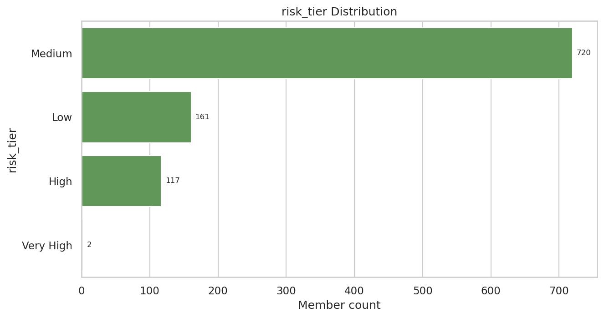
<!-- AUTO_CHART:risk_tier_distribution END -->

Supporting file:

- [`data_review_summary.csv`](Outputs/Uplift/Python/data_review_summary.csv)
- [`risk_tier_thresholds.csv`](Outputs/Uplift/Python/risk_tier_thresholds.csv)
- [`risk_tier_population_summary.csv`](Outputs/Uplift/Python/risk_tier_population_summary.csv)

## Analytical Task 3: Model Performance

Before estimating treatment effects, the factual outcome models should demonstrate reasonable predictive performance. This section evaluates the treated and control outcome models using discrimination, calibration, and prediction-quality metrics. Because the treatment-effect estimates produced by both the T-learner and X-learner depend on these factual outcome models, their performance provides the foundation for the remaining analyses.

Both model families were tuned using cross-validation within the training data, as described in Analytical Task 1. The results below focus on held-out test performance.

### Event Counts And Modeling Constraints

The primary modeling limitation is the small number of positive ED events after splitting the data into treated and control groups. This is especially important for the treated model, which contains relatively few positive examples for model training and evaluation.

<!-- AUTO_TABLE:factual_event_counts START -->
| Split | Group | N | Positive ED events | Negative ED events | Event rate |
| ---: | ---: | ---: | ---: | ---: | ---: |
| Train | Treated | 276 | 11 | 265 | 4.0% |
| Train | Control | 424 | 31 | 393 | 7.3% |
| Test | Treated | 118 | 5 | 113 | 4.2% |
| Test | Control | 182 | 13 | 169 | 7.1% |
<!-- AUTO_TABLE:factual_event_counts END -->

These event counts should be considered when interpreting all subsequent performance metrics. Because positive ED events are limited, especially in the treated group, the results are best interpreted as directionally informative rather than definitive.

### Discrimination Performance

Discrimination was evaluated using the area under the receiver operating characteristic curve (AUC) within the factual treatment groups.

<!-- AUTO_TABLE:model_performance_summary START -->
| Model | Treated CV AUC | Control CV AUC | Treated test AUC | Control test AUC |
| ---: | ---: | ---: | ---: | ---: |
| XGBoost | 0.7399 | 0.6680 | 0.8354 | 0.5833 |
| GLMNet | 0.7195 | 0.6472 | 0.9044 | 0.6600 |
<!-- AUTO_TABLE:model_performance_summary END -->

On this simulated dataset and train/test split, GLMNet demonstrated stronger held-out discrimination than XGBoost, particularly within the control group. Given the limited number of positive events, these differences should be interpreted cautiously

### Factual Discrimination And Prediction Separation

The table below complements AUC by comparing predicted probabilities between members who experienced an ED event and those who did not. A useful outcome model should assign higher predicted risk to members with observed ED events.

<!-- AUTO_TABLE:factual_prediction_separation START -->
| Model | Group | Positive events | Negative events | AUC | Avg pred for ED=1 | Avg pred for ED=0 | Avg difference | Median pred for ED=1 | Median pred for ED=0 |
| ---: | ---: | ---: | ---: | ---: | ---: | ---: | ---: | ---: | ---: |
| XGBoost | Treated | 5 | 113 | 0.8354 | 0.1289 | 0.1165 | 0.0124 | 0.1286 | 0.1110 |
| XGBoost | Control | 13 | 169 | 0.5833 | 0.1184 | 0.1134 | 0.0050 | 0.1119 | 0.1055 |
| GLMNet | Treated | 5 | 113 | 0.9044 | 0.0574 | 0.0395 | 0.0179 | 0.0606 | 0.0363 |
| GLMNet | Control | 13 | 169 | 0.6600 | 0.0774 | 0.0729 | 0.0045 | 0.0742 | 0.0713 |
<!-- AUTO_TABLE:factual_prediction_separation END -->

Both model families generally assigned higher predicted probabilities to observed ED-positive members, with GLMNet showing greater separation within the treated group.

### Brier Score And Calibration

Model calibration was evaluated using the Brier score and calibration error. Lower values indicate better agreement between predicted probabilities and observed outcomes.

Brier score:

```text
Brier score = (1 / n) * sum((outcome_i - predicted_probability_i)^2)
```

Calibration error:

```text
Calibration error = sum((n_bin / n_total) * abs(observed_ED_rate_bin - average_predicted_ED_rate_bin))
```

<!-- AUTO_TABLE:brier_calibration_summary START -->
| Model | Treated Brier | Control Brier | Treated calibration error | Control calibration error |
| ---: | ---: | ---: | ---: | ---: |
| XGBoost | 0.0452 | 0.0681 | 0.0803 | 0.0644 |
| GLMNet | 0.0392 | 0.0658 | 0.0615 | 0.0511 |
<!-- AUTO_TABLE:brier_calibration_summary END -->

GLMNet achieved lower Brier scores and calibration errors than XGBoost in both factual groups, indicating better calibrated probability estimates on this simulated dataset.

<!-- AUTO_CHART:glmnet_calibration_plot START -->

<!-- AUTO_CHART:glmnet_calibration_plot END -->

### Factual Prediction Range And Rare-Outcome Interpretation

The table below summarizes the distribution of predicted probabilities within the factual evaluation groups.

<!-- AUTO_TABLE:factual_prediction_ranges START -->
| Model | Group | Min | P10 | Median | Mean | P90 | Max |
| ---: | ---: | ---: | ---: | ---: | ---: | ---: | ---: |
| XGBoost | Treated | 0.1096 | 0.1096 | 0.1121 | 0.1170 | 0.1288 | 0.1525 |
| XGBoost | Control | 0.0814 | 0.0895 | 0.1057 | 0.1138 | 0.1557 | 0.1854 |
| GLMNet | Treated | 0.0274 | 0.0318 | 0.0372 | 0.0403 | 0.0545 | 0.0858 |
| GLMNet | Control | 0.0601 | 0.0644 | 0.0716 | 0.0732 | 0.0844 | 0.1084 |
<!-- AUTO_TABLE:factual_prediction_ranges END -->

Because the observed ED outcome is rare, predicted probabilities remain relatively low across both models. This behavior is expected and does not imply poor model performance. More important than the absolute probability values is whether higher predicted probabilities correspond to higher observed ED risk.

### Model Performance Takeaway

On this simulated dataset and train/test split, GLMNet demonstrated stronger overall performance than XGBoost. It achieved higher held-out discrimination, lower Brier scores, and better calibration across the factual treatment groups, making it the preferred outcome model for the remaining analyses.

The limited number of positive ED events, particularly in the treated group, means these results should be confirmed on the larger GenRocket dataset before drawing broader conclusions.

Supporting files:

- [`model_evaluation_summary.csv`](Outputs/Uplift/Python/model_evaluation_summary.csv)
- [`factual_event_count_summary.csv`](Outputs/Uplift/Python/factual_event_count_summary.csv)
- [`factual_prediction_separation.csv`](Outputs/Uplift/Python/factual_prediction_separation.csv)
- [`factual_prediction_ranges.csv`](Outputs/Uplift/Python/factual_prediction_ranges.csv)
- [`XGBoost/model_brier_scores.csv`](Outputs/Uplift/Python/T-Learner/XGBoost/model_brier_scores.csv)
- [`GLMNet/model_brier_scores.csv`](Outputs/Uplift/Python/T-Learner/GLMNet/model_brier_scores.csv)
- [`XGBoost/calibration_summary.csv`](Outputs/Uplift/Python/T-Learner/XGBoost/calibration_summary.csv)
- [`GLMNet/calibration_summary.csv`](Outputs/Uplift/Python/T-Learner/GLMNet/calibration_summary.csv)

## Analytical Task 4: Treatment Effect Analysis

This section applies the GLMNet T-learner to estimate member-level treatment benefit. Each member receives predicted ED risk under treatment and control, and the difference between these predictions defines the benefit score.

```text
benefit_score = pred_ed_if_control - pred_ed_if_treated

A higher benefit score indicates a larger predicted reduction in ED risk under intervention. The examples below illustrate how predicted risk and predicted treatment benefit can lead to different outreach priorities.

<!-- AUTO_TABLE:top_benefit_examples START -->
| Member profile | Actual outcome | Treatment flag | Predicted ED if treated | Predicted ED if control | Benefit score | Uplift decile | Outreach interpretation |
| --- | --- | --- | --- | --- | --- | --- | --- |
| Highest benefit | 0 | 1 | 0.0301 | 0.0839 | 0.0538 | 1 | Strong outreach candidate because predicted ED risk is much lower under treatment. |
| High risk, low benefit | 1 | 1 | 0.0868 | 0.0874 | 0.0006 | 10 | Clinically higher risk, but the predicted intervention benefit is small. |
| Low risk, low benefit | 0 | 0 | 0.0491 | 0.0665 | 0.0174 | 10 | Lower outreach priority because baseline ED risk and predicted benefit are both low. |
| Sleeping dog / lowest benefit | 1 | 1 | 0.2647 | 0.1782 | -0.0866 | 10 | Not prioritized by uplift score because predicted benefit is lowest in the scored population. |
<!-- AUTO_TABLE:top_benefit_examples END -->

The examples above illustrate why uplift modeling differs from traditional risk prediction. Members with the highest predicted ED risk are not necessarily those expected to benefit most from intervention. A member may remain high risk under both treatment and control, resulting in little predicted benefit, while another member with moderate baseline risk may experience a larger expected reduction in ED utilization and therefore receive a higher benefit score. Consequently, uplift modeling prioritizes members based on expected intervention benefit rather than baseline risk alone.

The final example represents a sleeping dog: a member whose predicted ED risk is higher under treatment than under no treatment. In uplift modeling, these members are generally considered low-priority candidates because the model predicts little or no expected benefit. Within this synthetic demonstration, a sleeping-dog prediction should be interpreted as a prioritization signal rather than evidence that intervention causes harm.

### Synthetic True-Benefit Validation

Because this project uses synthetic data, the known treatment-benefit formula can be used to validate treatment-effect estimates directly. The synthetic true benefit is:

```text
true_benefit =
    0.020
  + 0.018 * ed_visits_last_6m
  + 0.015 * admits_last_6m
  + 0.018 * food_insecurity_flag
  + 0.014 * transportation_barrier_flag
  + 0.012 * behavioral_health_risk_flag
  + 0.0006 * max(current_risk_score - 50, 0)
```

This validation uses the same 300 held-out test members for the GLMNet T-learner and GLMNet X-learner. The goal is to evaluate whether each model estimates the size and member-level pattern of treatment benefit, not just whether it predicts factual ED risk.

<!-- AUTO_TABLE:glmnet_true_benefit_validation START -->
| Model | N | Mean predicted benefit | Mean true benefit | Bias | MAE | RMSE | Pearson corr | Spearman corr |
|---|---:|---:|---:|---:|---:|---:|---:|---:|
| GLMNet T-learner | 300 | 0.034 | 0.055 | -0.020 | 0.026 | 0.037 | -0.467 | -0.368 |
| GLMNet X-learner | 300 | 0.038 | 0.055 | -0.017 | 0.024 | 0.031 | 0.391 | 0.168 |
<!-- AUTO_TABLE:glmnet_true_benefit_validation END -->

Both GLMNet methods underestimate the average true synthetic benefit, but the X-learner is closer on bias, MAE, and RMSE. More importantly, the X-learner has positive Pearson and Spearman correlation with true benefit, while the T-learner has negative correlation in this run. This suggests the GLMNet X-learner is the stronger of the two GLMNet methods for recovering the synthetic treatment-effect pattern.

Analytical Task 5 extends this member-level idea to population segments by comparing risk tiers against model-relative benefit groups.

Supporting files:

- [`GLMNet/uplift_scored_output.csv`](Outputs/Uplift/Python/T-Learner/GLMNet/uplift_scored_output.csv)
- [`GLMNet true-benefit validation summary`](Outputs/Uplift/Python/glmnet_true_benefit_validation_summary.csv)
- [`GLMNet true-benefit scored test comparison`](Outputs/Uplift/Python/glmnet_true_benefit_scored_test_comparison.csv)
- [`GLMNet T-learner risk tier benefit group summary`](Outputs/Uplift/Python/T-Learner/GLMNet/tlearner_risk_tier_benefit_group_summary.csv)
- [`GLMNet X-learner risk tier benefit group summary`](Outputs/Uplift/Python/X-Learner/GLMNet/xlearner_risk_tier_benefit_group_summary.csv)

## Analytical Task 5: Uplift Decile Analysis

Members are ranked by predicted treatment benefit and divided into ten uplift deciles, where Decile 1 represents the highest predicted benefit. This section compares GLMNet T-learner and X-learner rankings to evaluate whether the two treatment-effect frameworks identify similar high-benefit members.

<!-- AUTO_TABLE:glmnet_t_vs_x_decile_summary START -->
<table><tr>
<td valign="top" width="50%"><strong>GLMNet T-learner deciles</strong>
<table><thead><tr><th>Uplift decile</th><th>N</th><th>Avg T-learner benefit score</th><th>Observed ED rate</th><th>Avg predicted ED if treated</th><th>Avg predicted ED if control</th><th>Treatment pct</th></tr></thead><tbody><tr><td>1</td><td>30</td><td>0.0440</td><td>0.0667</td><td>0.0357</td><td>0.0797</td><td>0.3667</td></tr><tr><td>2</td><td>30</td><td>0.0403</td><td>0.0000</td><td>0.0345</td><td>0.0748</td><td>0.4333</td></tr><tr><td>3</td><td>30</td><td>0.0382</td><td>0.0000</td><td>0.0336</td><td>0.0717</td><td>0.3667</td></tr><tr><td>4</td><td>30</td><td>0.0365</td><td>0.0333</td><td>0.0333</td><td>0.0698</td><td>0.3667</td></tr><tr><td>5</td><td>30</td><td>0.0354</td><td>0.0667</td><td>0.0367</td><td>0.0721</td><td>0.4000</td></tr><tr><td>6</td><td>30</td><td>0.0342</td><td>0.0333</td><td>0.0376</td><td>0.0719</td><td>0.3333</td></tr><tr><td>7</td><td>30</td><td>0.0329</td><td>0.0667</td><td>0.0378</td><td>0.0707</td><td>0.5667</td></tr><tr><td>8</td><td>30</td><td>0.0312</td><td>0.1333</td><td>0.0411</td><td>0.0723</td><td>0.4000</td></tr><tr><td>9</td><td>30</td><td>0.0287</td><td>0.0000</td><td>0.0442</td><td>0.0729</td><td>0.3333</td></tr><tr><td>10</td><td>30</td><td>0.0230</td><td>0.2000</td><td>0.0584</td><td>0.0815</td><td>0.3667</td></tr></tbody></table>
</td>
<td valign="top" width="50%"><strong>GLMNet X-learner deciles</strong>
<table><thead><tr><th>Uplift decile</th><th>N</th><th>Avg X-learner benefit score</th><th>Observed ED rate</th><th>Treatment pct</th></tr></thead><tbody><tr><td>1</td><td>30</td><td>0.0696</td><td>0.2000</td><td>0.5667</td></tr><tr><td>2</td><td>30</td><td>0.0502</td><td>0.0333</td><td>0.3000</td></tr><tr><td>3</td><td>30</td><td>0.0447</td><td>0.0667</td><td>0.3000</td></tr><tr><td>4</td><td>30</td><td>0.0411</td><td>0.0000</td><td>0.2333</td></tr><tr><td>5</td><td>30</td><td>0.0374</td><td>0.0333</td><td>0.4000</td></tr><tr><td>6</td><td>30</td><td>0.0348</td><td>0.0667</td><td>0.4667</td></tr><tr><td>7</td><td>30</td><td>0.0321</td><td>0.0667</td><td>0.5000</td></tr><tr><td>8</td><td>30</td><td>0.0285</td><td>0.0333</td><td>0.2667</td></tr><tr><td>9</td><td>30</td><td>0.0239</td><td>0.1000</td><td>0.4667</td></tr><tr><td>10</td><td>30</td><td>0.0150</td><td>0.0000</td><td>0.4333</td></tr></tbody></table>
</td>
</tr></table>

_Note: In the T-learner table, benefit is the direct contrast between the control and treated outcome-model predictions. In the X-learner table, benefit is the final weighted treatment-effect-model estimate, so the table only shows the decile-level benefit score, observed ED rate, and treatment percentage._
<!-- AUTO_TABLE:glmnet_t_vs_x_decile_summary END -->

<!-- AUTO_CHART:glmnet_t_vs_x_avg_benefit_charts START -->
| GLMNet T-learner | GLMNet X-learner |
|---|---|
|  |  |
<!-- AUTO_CHART:glmnet_t_vs_x_avg_benefit_charts END -->

### Risk Tier Versus Benefit Group

The chart below compares baseline risk tier with predicted benefit group. Benefit groups are defined using uplift deciles rather than fixed benefit thresholds because the predicted treatment effects in this dataset are relatively small. This comparison illustrates that members with the highest baseline risk are not necessarily those expected to benefit most from intervention.

| Benefit group | Definition |
|---|---|
| High benefit | Uplift deciles 1–2 (top 20% by predicted benefit) |
| Medium benefit | Uplift deciles 3–7 (middle 50% by predicted benefit) |
| Low benefit | Uplift deciles 8–10 (bottom 30% by predicted benefit) |

Risk tiers are based on `current_risk_score`: Low `<35`, Medium `35` to `<55`, High `55` to `<75`, and Very High `>=75`.

<!-- AUTO_CHART:risk_tier_by_benefit_group START -->
| GLMNet T-learner | GLMNet X-learner |
|---|---|
| 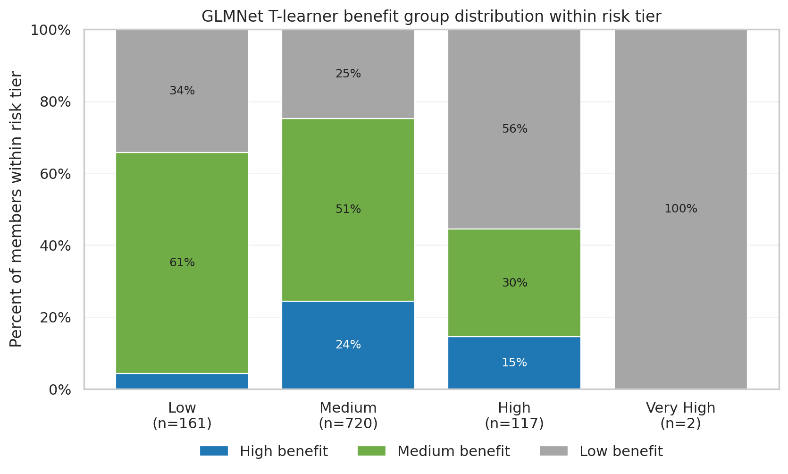 | 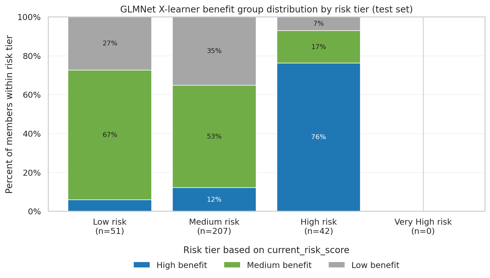 |
<!-- AUTO_CHART:risk_tier_by_benefit_group END -->

Both frameworks demonstrate that baseline risk and expected treatment benefit are related but not equivalent. In the T-learner, many High risk members remain in the low-benefit group, whereas the X-learner places a larger proportion of High risk members into the high-benefit group. These differences highlight how treatment-effect estimates can vary across causal modeling frameworks.

### Framework Consistency

The table below compares member-level treatment-benefit estimates from the GLMNet T-learner and X-learner. Correlations measure agreement between benefit scores, while top-decile overlap measures how many members are identified as highest benefit by both frameworks.

<!-- AUTO_TABLE:glmnet_xlearner_consistency_summary START -->
| Model | Pearson benefit score corr | Spearman benefit score corr | Top decile overlap | T-learner mean benefit score | X-learner mean benefit score |
| ---: | ---: | ---: | ---: | ---: | ---: |
| GLMNet | -0.0761 | 0.1608 | 16.7% | 0.0344 | 0.0377 |
<!-- AUTO_TABLE:glmnet_xlearner_consistency_summary END -->

The modest correlations and limited top-decile overlap indicate that the two frameworks do not rank members identically, despite producing similar average predicted benefit. This motivates comparing both approaches against the known synthetic treatment benefit.

### True-Benefit Top-Group Overlap

Because the synthetic treatment-benefit formula is known, each model's highest-ranked members can be compared directly with the true highest-benefit members. The top 10% overlap provides a strict evaluation of targeting accuracy, while the top 20% overlap corresponds to the project's **High benefit** group.

<!-- AUTO_TABLE:glmnet_true_benefit_decile_overlap START -->
| Model | Test members | Top 10% overlap | Top 20% overlap |
|---|---:|---:|---:|
| GLMNet T-learner | 300 | 2 of 30 (6.7%) | 4 of 60 (6.7%) |
| GLMNet X-learner | 300 | 14 of 30 (46.7%) | 29 of 60 (48.3%) |
<!-- AUTO_TABLE:glmnet_true_benefit_decile_overlap END -->

The GLMNet X-learner recovers substantially more of the true highest-benefit members than the GLMNet T-learner. Combined with the true-benefit validation results presented in Task 4, these findings suggest that the X-learner provides a more accurate ranking of treatment benefit for this synthetic dataset.

Supporting files:

- [`GLMNet/uplift_decile_summary.csv`](Outputs/Uplift/Python/T-Learner/GLMNet/uplift_decile_summary.csv)
- [`GLMNet X-learner/xlearner_decile_summary.csv`](Outputs/Uplift/Python/X-Learner/GLMNet/xlearner_decile_summary.csv)
- [`GLMNet true-benefit decile overlap summary`](Outputs/Uplift/Python/glmnet_true_benefit_decile_overlap_summary.csv)
- [`X-learner consistency summary`](Outputs/Uplift/Python/X-Learner/xlearner_vs_tlearner_consistency_summary.csv)

## Analytical Task 6: Variable Importance And Explainability

The explainability analysis separates risk drivers from benefit drivers. Risk drivers explain what predicts ED utilization in the treated and control outcome models. Benefit drivers explain what contributes to predicted treatment benefit.

Because synthetic true benefit is known in this dataset, Task 6 is organized around three levels of evidence:

| Level | Question answered | Main caution |
|---|---|---|
| Model-learned feature contributions | Which variables does the fitted GLMNet model use to explain predicted benefit? | Correlated predictors can split, absorb, or swap attribution. |
| Known true-driver alignment | Do the model explanations recover the known synthetic treatment-effect drivers? | Alignment is evaluated against true contribution terms, not raw coefficients. |
| Interpretation | Which explanation should be emphasized? | The X-learner explanations deserve more weight because Tasks 4-5 showed stronger treatment-effect recovery, but attribution is still directional rather than definitive. |

The true synthetic benefit formula is especially useful here because the real treatment-effect drivers are known: `ed_visits_last_6m`, `admits_last_6m`, `food_insecurity_flag`, `transportation_barrier_flag`, `behavioral_health_risk_flag`, and `current_risk_score` above 50. This makes it possible to evaluate whether feature explanations are recovering the known signal rather than only describing the fitted model.

### Risk Drivers

Before interpreting benefit drivers, it is useful to separate baseline ED-risk drivers from treatment-benefit drivers. The GLMNet treated and control outcome models identify expected risk-related variables, but these variables should not automatically be interpreted as evidence that they drive intervention benefit.

| Group | Top current drivers |
|---|---|
| Treated model | `current_risk_score`, `percolator_utilization_score`, `ed_visits_last_6m`, `total_cost_last_6m`, `risk_tier_High` |
| Control model | `utilities_insecurity_flag`, `current_risk_score`, `dual_eligible`, `ed_visits_last_6m`, `county_County_A` |

### Benefit Drivers

For GLMNet, benefit-driver importance is compared across the T-learner and X-learner frameworks. Comparing the two frameworks helps show whether the main drivers of predicted treatment benefit are directionally consistent.

Two contribution methods are shown:

| Method | Approach | What it answers | Advantage | Main limitation |
|---|---|---|---|---|
| Coefficient-based contribution | Builds contribution from the GLMNet equation using standardized feature values and fitted coefficients. | Which standardized GLMNet terms contribute most under the model equation? | Transparent and easy to trace back to the fitted model coefficients. | Sensitive to correlated features, coefficient shrinkage, and differences between the treated and control model fits. |
| SHAP benefit contribution | Explains the final fitted benefit-score function by attributing changes in predicted benefit to each feature. | Which variables most affect the fitted benefit-score function? | Works directly on the final benefit score and provides additive member-level reconciliation. | Still explains the fitted model, not necessarily the true data-generating formula; correlated predictors can split attribution. |

### Coefficient-Based Benefit Contributions

This section keeps the original GLMNet feature-contribution approach. These contribution tables are useful because they are transparent and reproducible. They show how the fitted GLMNet models construct predicted treatment benefit from standardized feature values and fitted coefficients.

For the GLMNet T-learner, benefit contributions are calculated from the two outcome models:

```text
benefit_contribution = control_model_contribution - treated_model_contribution
```

For the GLMNet X-learner, benefit contributions are calculated from the propensity-weighted second-stage effect models:

```text
xlearner_benefit_contribution =
    (1 - propensity) * treated_effect_model_contribution
  + propensity * control_effect_model_contribution
```

These tables answer:

> Which features have the largest model-derived contribution to predicted treatment benefit under the current GLMNet coefficient structure?

The values should be interpreted as model-specific contribution summaries, not definitive causal drivers. Collinearity can affect coefficient interpretation in GLMNet, and lasso or elastic-net regularization can shrink correlated features unevenly. This is especially relevant for the T-learner because the benefit contribution is calculated from two separately fitted outcome models.

The current top benefit drivers by magnitude are:

<!-- AUTO_TABLE:glmnet_benefit_magnitude START -->
<table><tr>
<td valign="top" width="50%"><strong>GLMNet T-learner</strong>
<table><thead><tr><th>Feature</th><th>Mean absolute contribution</th></tr></thead><tbody><tr><td>`percolator_utilization_score`</td><td>0.0369</td></tr><tr><td>`total_cost_last_6m`</td><td>0.0349</td></tr><tr><td>`percolator_clinical_score`</td><td>0.0259</td></tr><tr><td>`behavioral_health_risk_flag`</td><td>0.0250</td></tr><tr><td>`food_insecurity_flag`</td><td>0.0226</td></tr></tbody></table>
</td>
<td valign="top" width="50%"><strong>GLMNet X-learner</strong>
<table><thead><tr><th>Feature</th><th>Mean absolute contribution</th></tr></thead><tbody><tr><td>`anxiety_flag`</td><td>0.0022</td></tr><tr><td>`program_Complex_CM`</td><td>0.0018</td></tr><tr><td>`percolator_clinical_score`</td><td>0.0016</td></tr><tr><td>`pcp_visits_last_6m`</td><td>0.0016</td></tr><tr><td>`admits_last_6m`</td><td>0.0016</td></tr></tbody></table>
</td>
</tr></table>
<!-- AUTO_TABLE:glmnet_benefit_magnitude END -->

The current top benefit drivers by signed value are:

<!-- AUTO_TABLE:glmnet_benefit_signed START -->
<table><tr>
<td valign="top" width="50%"><strong>GLMNet T-learner</strong>
<table><thead><tr><th>Direction</th><th>Feature</th><th>Mean signed contribution</th></tr></thead><tbody><tr><td>Increase predicted benefit</td><td>`client_contract_Contract_B`</td><td>0.0022</td></tr><tr><td>Increase predicted benefit</td><td>`risk_tier_Very_High`</td><td>0.0017</td></tr><tr><td>Increase predicted benefit</td><td>`ckd_flag`</td><td>0.0016</td></tr><tr><td>Increase predicted benefit</td><td>`behavioral_health_risk_flag`</td><td>0.0015</td></tr><tr><td>Increase predicted benefit</td><td>`anxiety_flag`</td><td>0.0013</td></tr><tr><td>Decrease predicted benefit</td><td>`total_cost_last_6m`</td><td>-0.0042</td></tr><tr><td>Decrease predicted benefit</td><td>`service_region_Central`</td><td>-0.0029</td></tr><tr><td>Decrease predicted benefit</td><td>`risk_tier_High`</td><td>-0.0028</td></tr><tr><td>Decrease predicted benefit</td><td>`percolator_utilization_score`</td><td>-0.0020</td></tr><tr><td>Decrease predicted benefit</td><td>`service_region_West`</td><td>-0.0020</td></tr></tbody></table>
</td>
<td valign="top" width="50%"><strong>GLMNet X-learner</strong>
<table><thead><tr><th>Direction</th><th>Feature</th><th>Mean signed contribution</th></tr></thead><tbody><tr><td>Increase predicted benefit</td><td>`ed_visits_last_6m`</td><td>0.0005</td></tr><tr><td>Increase predicted benefit</td><td>`current_risk_score`</td><td>0.0004</td></tr><tr><td>Increase predicted benefit</td><td>`admits_last_6m`</td><td>0.0003</td></tr><tr><td>Increase predicted benefit</td><td>`risk_tier_High`</td><td>0.0003</td></tr><tr><td>Increase predicted benefit</td><td>`percolator_utilization_score`</td><td>0.0002</td></tr><tr><td>Decrease predicted benefit</td><td>`pcp_visits_last_6m`</td><td>-0.0004</td></tr><tr><td>Decrease predicted benefit</td><td>`opioid_flag`</td><td>-0.0003</td></tr><tr><td>Decrease predicted benefit</td><td>`transportation_barrier_flag`</td><td>-0.0002</td></tr><tr><td>Decrease predicted benefit</td><td>`case_manager_name_CM_11`</td><td>-0.0002</td></tr><tr><td>Decrease predicted benefit</td><td>`service_region_Central`</td><td>-0.0001</td></tr></tbody></table>
</td>
</tr></table>
<!-- AUTO_TABLE:glmnet_benefit_signed END -->

<!-- AUTO_TEXT:glmnet_benefit_driver_interpretation START -->
For GLMNet, `percolator_utilization_score`, `total_cost_last_6m`, `percolator_clinical_score`, `behavioral_health_risk_flag`, `food_insecurity_flag` are the largest benefit-driver features by absolute contribution-difference magnitude. By signed value, `client_contract_Contract_B`, `risk_tier_Very_High`, `ckd_flag` have the strongest positive average contribution to predicted benefit. The strongest negative signed contributor is `total_cost_last_6m`.
<!-- AUTO_TEXT:glmnet_benefit_driver_interpretation END -->

The absolute benefit-driver value measures how strongly a feature changes predicted benefit, regardless of direction. The signed benefit contribution shows whether the feature tends to increase or decrease predicted benefit, and the percent-positive column shows the share of members where the feature increased predicted benefit. Therefore, the benefit-driver tables are interpreted using both magnitude and direction.

<!-- AUTO_CHART:glmnet_benefit_driver_chart START -->
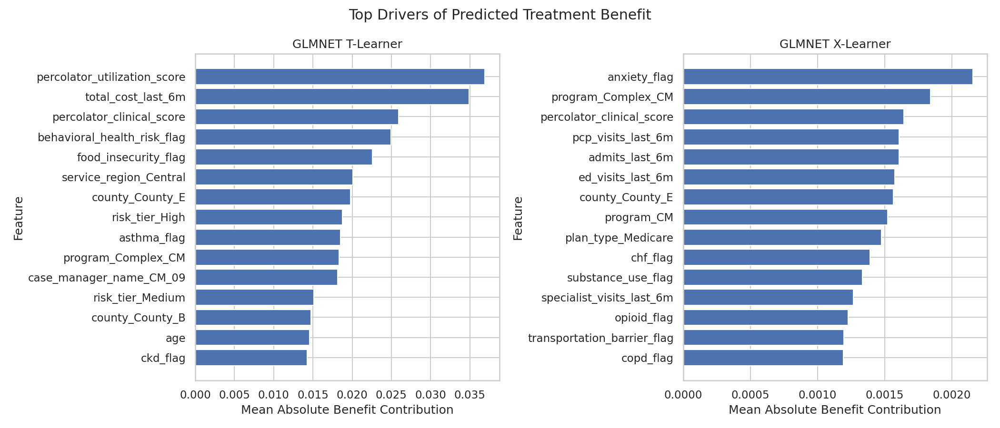
<!-- AUTO_CHART:glmnet_benefit_driver_chart END -->

### SHAP Benefit-Score Contributions

The notebook now also adds a SHAP-based benefit explanation layer for the GLMNet T-learner and GLMNet X-learner. This is intended to sit below the coefficient-based contribution tables, not replace them. The coefficient-based tables explain the GLMNet model through fitted coefficients, while the SHAP tables explain the final predicted benefit score directly.

For the GLMNet T-learner, SHAP is applied to the final benefit function:

```text
benefit_score(X) = pred_ed_if_control(X) - pred_ed_if_treated(X)
```

For the GLMNet X-learner, SHAP is applied to the final X-learner benefit function:

```text
benefit_score(X) = (1 - propensity(X)) * tau_treated_model(X)
                 + propensity(X) * tau_control_model(X)
```

This means each SHAP value answers:

> How much did this feature move the model's predicted benefit score up or down relative to the model baseline benefit?

The SHAP outputs are used in two ways: mean absolute SHAP ranks global feature importance, while signed and member-level SHAP values support directionality, additive reconciliation, and future member-level dashboard explanations.

SHAP also provides an additive reconciliation check:

```text
model baseline benefit
+ sum(member feature SHAP values)
= member benefit score
```

Across the population, the analogous check is:

```text
model baseline benefit
+ sum(mean signed feature SHAP values)
= average predicted benefit
```

Mean absolute SHAP is used for global importance ranking, but it is not expected to sum to average benefit because it measures magnitude regardless of direction. Signed SHAP values are used for reconciliation and direction.

This SHAP layer does not prove true causal mechanisms. It explains the model's predicted benefit score. It is still affected by the quality of the underlying uplift models, the chosen background/reference population, and correlation among predictors. However, it is better aligned with the future dashboard question: "Why did this member receive this predicted benefit score?" The X-learner and T-learner SHAP explanations should therefore be used as prediction explanations and model-comparison evidence, not as standalone causal proof.

The current top SHAP benefit drivers by magnitude are:

<!-- AUTO_TABLE:glmnet_benefit_shap_magnitude START -->
<table><tr>
<td valign="top" width="50%"><strong>GLMNet T-learner</strong>
<table><thead><tr><th>Feature</th><th>Mean absolute SHAP</th></tr></thead><tbody>
<tr><td>`percolator_clinical_score`</td><td>0.0020</td></tr>
<tr><td>`percolator_utilization_score`</td><td>0.0014</td></tr>
<tr><td>`total_cost_last_6m`</td><td>0.0014</td></tr>
<tr><td>`current_risk_score`</td><td>0.0012</td></tr>
<tr><td>`behavioral_health_risk_flag`</td><td>0.0009</td></tr>
</tbody></table>
</td>
<td valign="top" width="50%"><strong>GLMNet X-learner</strong>
<table><thead><tr><th>Feature</th><th>Mean absolute SHAP</th></tr></thead><tbody>
<tr><td>`anxiety_flag`</td><td>0.0022</td></tr>
<tr><td>`program_Complex_CM`</td><td>0.0021</td></tr>
<tr><td>`admits_last_6m`</td><td>0.0020</td></tr>
<tr><td>`case_manager_name_CM_04`</td><td>0.0019</td></tr>
<tr><td>`ed_visits_last_6m`</td><td>0.0018</td></tr>
</tbody></table>
</td>
</tr></table>
<!-- AUTO_TABLE:glmnet_benefit_shap_magnitude END -->

<!-- AUTO_CHART:glmnet_benefit_shap_driver_charts START -->
| GLMNet T-learner SHAP | GLMNet X-learner SHAP |
|---|---|
| 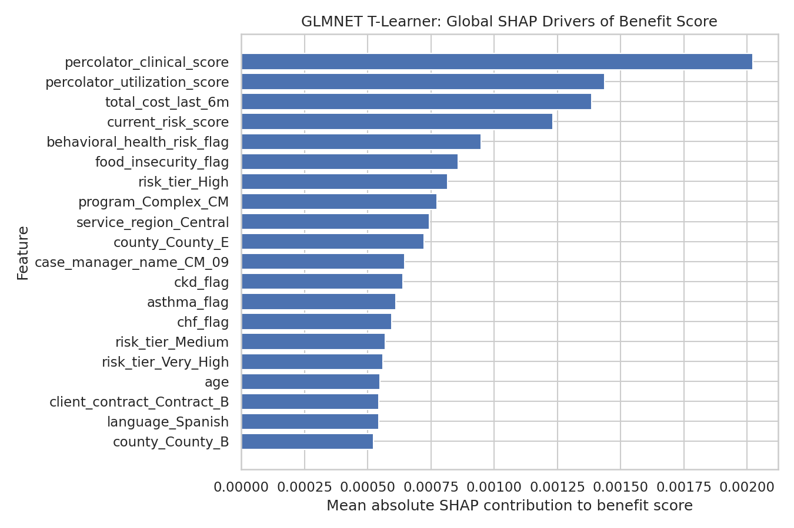 | 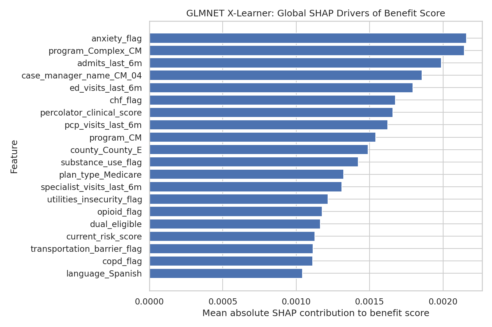 |
<!-- AUTO_CHART:glmnet_benefit_shap_driver_charts END -->

The current top SHAP benefit drivers by signed value are:

<!-- AUTO_TABLE:glmnet_benefit_shap_signed START -->
<table><tr>
<td valign="top" width="50%"><strong>GLMNet T-learner</strong>
<table><thead><tr><th>Direction</th><th>Feature</th><th>Mean signed SHAP</th></tr></thead><tbody>
<tr><td>Increase predicted benefit</td><td>`risk_tier_Very_High`</td><td>0.0006</td></tr>
<tr><td>Increase predicted benefit</td><td>`ckd_flag`</td><td>0.0001</td></tr>
<tr><td>Increase predicted benefit</td><td>`percolator_utilization_score`</td><td>0.0001</td></tr>
<tr><td>Increase predicted benefit</td><td>`client_contract_Contract_B`</td><td>0.0001</td></tr>
<tr><td>Increase predicted benefit</td><td>`specialist_visits_last_6m`</td><td>0.0001</td></tr>
<tr><td>Decrease predicted benefit</td><td>`case_manager_name_CM_09`</td><td>-0.0002</td></tr>
<tr><td>Decrease predicted benefit</td><td>`current_risk_score`</td><td>-0.0002</td></tr>
<tr><td>Decrease predicted benefit</td><td>`percolator_clinical_score`</td><td>-0.0002</td></tr>
<tr><td>Decrease predicted benefit</td><td>`case_manager_name_CM_04`</td><td>-0.0002</td></tr>
<tr><td>Decrease predicted benefit</td><td>`service_region_Central`</td><td>-0.0002</td></tr>
</tbody></table>
</td>
<td valign="top" width="50%"><strong>GLMNet X-learner</strong>
<table><thead><tr><th>Direction</th><th>Feature</th><th>Mean signed SHAP</th></tr></thead><tbody>
<tr><td>Increase predicted benefit</td><td>`service_region_West`</td><td>0.0002</td></tr>
<tr><td>Increase predicted benefit</td><td>`copd_flag`</td><td>0.0002</td></tr>
<tr><td>Increase predicted benefit</td><td>`anxiety_flag`</td><td>0.0002</td></tr>
<tr><td>Increase predicted benefit</td><td>`ed_visits_last_6m`</td><td>0.0002</td></tr>
<tr><td>Increase predicted benefit</td><td>`risk_tier_Medium`</td><td>0.0002</td></tr>
<tr><td>Decrease predicted benefit</td><td>`case_manager_name_CM_04`</td><td>-0.0007</td></tr>
<tr><td>Decrease predicted benefit</td><td>`program_Complex_CM`</td><td>-0.0004</td></tr>
<tr><td>Decrease predicted benefit</td><td>`specialist_visits_last_6m`</td><td>-0.0004</td></tr>
<tr><td>Decrease predicted benefit</td><td>`risk_tier_Very_High`</td><td>-0.0004</td></tr>
<tr><td>Decrease predicted benefit</td><td>`chf_flag`</td><td>-0.0003</td></tr>
</tbody></table>
</td>
</tr></table>
<!-- AUTO_TABLE:glmnet_benefit_shap_signed END -->

### Known Synthetic Driver Alignment

The known true contribution terms are compared against SHAP benefit contributions rather than coefficient-based contributions. SHAP values and true contribution terms are both expressed in benefit-probability units, while coefficient-based contributions are more sensitive to GLMNet scaling, shrinkage, and correlated predictors.

This comparison does **not** compare raw simulation coefficients against model importance. Raw coefficients are not directly comparable across variables because the features have different units and ranges. Instead, the validation uses member-level true contribution terms such as:

```text
true_ed_visits_contribution = 0.018 * ed_visits_last_6m
true_risk_score_contribution = 0.0006 * max(current_risk_score - 50, 0)
```

The first check asks whether each explanation method surfaces known true drivers among its top 10 global benefit drivers.

<!-- AUTO_TABLE:glmnet_true_driver_recovery START -->
| Model | Explainability method | True drivers recovered in top 10 | Recovered true drivers |
|---|---|---:|---|
| GLMNet T-learner | Coefficient contribution | 2 of 6 | `behavioral_health_risk_flag`, `food_insecurity_flag` |
| GLMNet T-learner | SHAP benefit contribution | 3 of 6 | `current_risk_score`, `behavioral_health_risk_flag`, `food_insecurity_flag` |
| GLMNet X-learner | Coefficient contribution | 2 of 6 | `admits_last_6m`, `ed_visits_last_6m` |
| GLMNet X-learner | SHAP benefit contribution | 2 of 6 | `admits_last_6m`, `ed_visits_last_6m` |
<!-- AUTO_TABLE:glmnet_true_driver_recovery END -->

The second check uses SHAP's member-level additive contributions. For each true driver, the member-level SHAP contribution is compared against that same member's known true contribution term. Spearman correlation is emphasized because it evaluates whether members with larger true contribution from a feature also tend to receive larger SHAP contribution for that feature. Direction is marked as recovered only when the SHAP contribution has positive rank alignment and positive average signed contribution, because all true synthetic contribution terms increase benefit.

<!-- AUTO_TABLE:glmnet_shap_true_driver_alignment START -->
| Feature | True contribution formula | Mean true contribution | T-learner SHAP Spearman | X-learner SHAP Spearman | Direction recovered? |
|---|---|---:|---:|---:|---|
| `ed_visits_last_6m` | `0.018 * ed_visits_last_6m` | 0.0163 | 0.931 | 0.934 | T: Yes; X: Yes |
| `admits_last_6m` | `0.015 * admits_last_6m` | 0.0054 | 0.793 | 0.793 | T: Yes; X: No |
| `food_insecurity_flag` | `0.018 * food_insecurity_flag` | 0.0038 | -0.710 | -0.006 | T: No; X: No |
| `transportation_barrier_flag` | `0.014 * transportation_barrier_flag` | 0.0036 | 0.760 | -0.752 | T: Yes; X: No |
| `behavioral_health_risk_flag` | `0.012 * behavioral_health_risk_flag` | 0.0046 | -0.843 | 0.843 | T: No; X: No |
| `current_risk_score` | `0.0006 * max(current_risk_score - 50, 0)` | 0.0010 | 0.753 | 0.749 | T: No; X: No |
<!-- AUTO_TABLE:glmnet_shap_true_driver_alignment END -->

This alignment check shows why feature attribution should be interpreted cautiously. The X-learner was stronger in Tasks 4-5 for treatment-effect recovery and top-benefit targeting, but its SHAP explanations still do not perfectly recover every known synthetic driver. Some true drivers are recovered clearly, especially recent ED visits and admits, while others are likely affected by correlated proxy features, limited sample size, and the fact that SHAP explains the fitted benefit model rather than the true data-generating equation.

Overall, the GLMNet X-learner appears stronger for treatment-effect ranking, but feature attribution remains less definitive because correlated predictors can split or absorb importance. Therefore, feature importance should be interpreted as directional model evidence. The strongest evidence comes from features that are both known true drivers and consistently surfaced across explainability methods.

Supporting files:

- [`GLMNet/shap_importance_treated_control_models.csv`](Outputs/Uplift/Python/T-Learner/GLMNet/shap_importance_treated_control_models.csv)
- [`GLMNet/shap_importance_benefit_score.csv`](Outputs/Uplift/Python/T-Learner/GLMNet/shap_importance_benefit_score.csv)
- [`GLMNet/dashboard_shap_treated_model.png`](Outputs/Uplift/Python/T-Learner/GLMNet/dashboard_shap_treated_model.png)
- [`GLMNet/dashboard_shap_control_model.png`](Outputs/Uplift/Python/T-Learner/GLMNet/dashboard_shap_control_model.png)
- [`GLMNet/dashboard_shap_benefit_score.png`](Outputs/Uplift/Python/T-Learner/GLMNet/dashboard_shap_benefit_score.png)
- [`GLMNet/glmnet_tlearner_global_benefit_shap_importance.csv`](Outputs/Uplift/Python/T-Learner/GLMNet/glmnet_tlearner_global_benefit_shap_importance.csv)
- [`GLMNet/glmnet_tlearner_global_benefit_shap_reconciliation.csv`](Outputs/Uplift/Python/T-Learner/GLMNet/glmnet_tlearner_global_benefit_shap_reconciliation.csv)
- [`GLMNet/glmnet_tlearner_member_benefit_shap_values.csv`](Outputs/Uplift/Python/T-Learner/GLMNet/glmnet_tlearner_member_benefit_shap_values.csv)
- [`GLMNet/dashboard_glmnet_tlearner_global_benefit_shap.png`](Outputs/Uplift/Python/T-Learner/GLMNet/dashboard_glmnet_tlearner_global_benefit_shap.png)
- [`GLMNet X-learner/xlearner_benefit_driver_importance.csv`](Outputs/Uplift/Python/X-Learner/GLMNet/xlearner_benefit_driver_importance.csv)
- [`GLMNet X-learner/dashboard_xlearner_benefit_drivers.png`](Outputs/Uplift/Python/X-Learner/GLMNet/dashboard_xlearner_benefit_drivers.png)
- [`GLMNet X-learner/glmnet_xlearner_global_benefit_shap_importance.csv`](Outputs/Uplift/Python/X-Learner/GLMNet/glmnet_xlearner_global_benefit_shap_importance.csv)
- [`GLMNet X-learner/glmnet_xlearner_global_benefit_shap_reconciliation.csv`](Outputs/Uplift/Python/X-Learner/GLMNet/glmnet_xlearner_global_benefit_shap_reconciliation.csv)
- [`GLMNet X-learner/glmnet_xlearner_member_benefit_shap_values.csv`](Outputs/Uplift/Python/X-Learner/GLMNet/glmnet_xlearner_member_benefit_shap_values.csv)
- [`GLMNet X-learner/dashboard_glmnet_xlearner_global_benefit_shap.png`](Outputs/Uplift/Python/X-Learner/GLMNet/dashboard_glmnet_xlearner_global_benefit_shap.png)
- [`GLMNet T-vs-X benefit-driver comparison chart`](Outputs/Uplift/Python/X-Learner/GLMNet/dashboard_t_vs_x_benefit_driver_comparison.png)
- [`GLMNet true-driver recovery summary`](Outputs/Uplift/Python/glmnet_true_driver_recovery_summary.csv)
- [`GLMNet SHAP true-driver alignment`](Outputs/Uplift/Python/glmnet_shap_true_driver_alignment.csv)

## Analytical Task 7: Business Value Assessment

The business value analysis estimates how much gross savings would be captured when members are targeted by predicted uplift versus the prior-style approach of targeting members strictly by highest `current_risk_score`. The main visual is a cumulative targeting chart: top 10%, top 20%, top 30%, and so on. This makes the comparison easier to interpret because it answers the operational question: if outreach capacity is limited, which ranking method captures more estimated savings first?

The current calculation assumes:

```text
expected_ed_rate_reduction = avg_benefit_score
expected_ed_visits_avoided = n * expected_ed_rate_reduction
gross_savings = expected_ed_visits_avoided * cost_per_ed_visit
intervention_cost = n * cost_per_intervention
net_savings = gross_savings - intervention_cost
roi = net_savings / intervention_cost
```

The current cost assumptions are $1,200 per ED visit and $250 per intervention. The primary comparison below focuses on gross savings because the goal is to compare targeting quality before layering in intervention-cost assumptions. Because Tasks 4 and 5 showed that the GLMNet X-learner better recovered true synthetic treatment benefit, Task 7 reports business-value estimates for both GLMNet frameworks.

### GLMNet T-Learner Targeting

<!-- AUTO_TABLE:roi_summary START -->
| Targeted group | Members targeted | Uplift gross savings | Current-risk gross savings | Uplift advantage | Uplift ED visits avoided | Current-risk ED visits avoided |
| --- | --- | --- | --- | --- | --- | --- |
| Top 10% | 30 | $1,584.79 | $979.31 | $605.47 | 1.3207 | 0.8161 |
| Top 20% | 60 | $3,034.54 | $2,230.93 | $803.61 | 2.5288 | 1.8591 |
| Top 30% | 90 | $4,408.92 | $3,509.56 | $899.36 | 3.6741 | 2.9246 |
| Top 40% | 120 | $5,723.57 | $4,856.15 | $867.42 | 4.7696 | 4.0468 |
| Top 50% | 150 | $6,998.17 | $6,164.20 | $833.97 | 5.8318 | 5.1368 |
<!-- AUTO_TABLE:roi_summary END -->

<!-- AUTO_TEXT:roi_interpretation START -->
This view compares two targeting policies on the same held-out test population: ranking members by GLMNet T-learner predicted benefit versus ranking members by current risk score. Through the top 30% of targeted members, T-learner benefit targeting captures $4,408.92 in estimated gross savings, compared with $3,509.56 from current-risk targeting, an advantage of $899.36. Gross savings are estimated from the GLMNet T-learner predicted benefit score, so this is a targeting-policy comparison rather than a claim of realized savings.
<!-- AUTO_TEXT:roi_interpretation END -->

<!-- AUTO_CHART:glmnet_roi_by_decile START -->
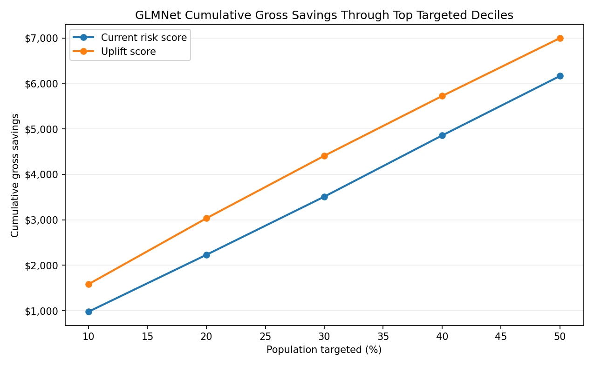
<!-- AUTO_CHART:glmnet_roi_by_decile END -->

The chart below compares the additional gross savings from each T-learner targeting band against the additional gross savings from selecting the same number of members by current risk. Positive bars mean benefit-based targeting adds more estimated value than the current-risk approach for that band; negative bars mean the current-risk approach adds more estimated value for that band. In this run, the T-learner has positive marginal advantage through the top 30%, then turns slightly negative in the 30-40% and 40-50% bands.

<!-- AUTO_CHART:tlearner_marginal_advantage START -->
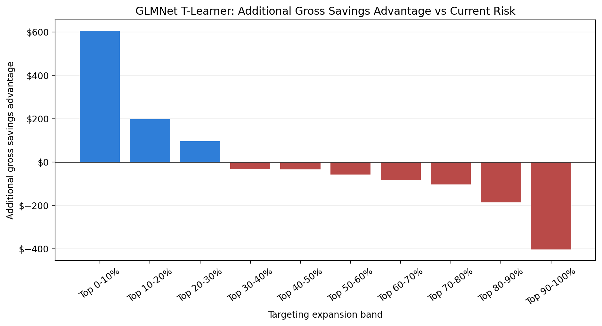
<!-- AUTO_CHART:tlearner_marginal_advantage END -->

### GLMNet X-Learner Targeting

<!-- AUTO_TABLE:xlearner_roi_summary START -->
| Targeted group | Members targeted | X-learner gross savings | Current-risk gross savings | X-learner advantage | X-learner ED visits avoided | Current-risk ED visits avoided |
|---|---:|---:|---:|---:|---:|---:|
| Top 10% | 30 | $2,503.95 | $2,288.56 | $215.39 | 2.0866 | 1.9071 |
| Top 20% | 60 | $4,311.28 | $3,839.89 | $471.38 | 3.5927 | 3.1999 |
| Top 30% | 90 | $5,920.10 | $5,189.50 | $730.61 | 4.9334 | 4.3246 |
| Top 40% | 120 | $7,400.14 | $6,392.43 | $1,007.71 | 6.1668 | 5.3270 |
| Top 50% | 150 | $8,746.05 | $7,600.75 | $1,145.30 | 7.2884 | 6.3340 |
<!-- AUTO_TABLE:xlearner_roi_summary END -->

<!-- AUTO_TEXT:xlearner_roi_interpretation START -->
The X-learner view uses the same held-out test population and the same cost assumptions, but members are ranked by GLMNet X-learner predicted benefit. Through the top 30% of targeted members, X-learner benefit targeting captures $5,920.10 in estimated gross savings, compared with $5,189.50 from current-risk targeting, an advantage of $730.61. The X-learner savings estimates are larger in absolute dollars because its predicted benefit scores are larger on average than the T-learner scores.
<!-- AUTO_TEXT:xlearner_roi_interpretation END -->

<!-- AUTO_CHART:xlearner_roi_by_decile START -->
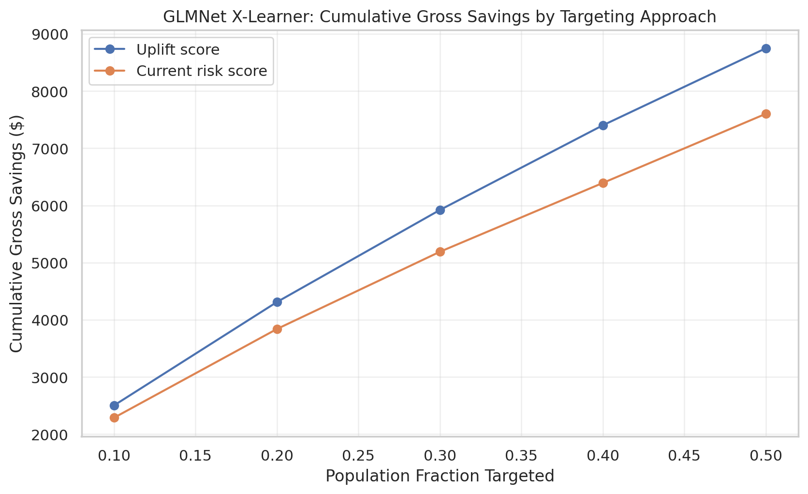
<!-- AUTO_CHART:xlearner_roi_by_decile END -->

The chart below shows the same marginal advantage comparison for the X-learner. In this run, the X-learner remains positive through the top 50%, meaning each additional 10% targeting band shown still adds more estimated gross savings than the current-risk approach.

<!-- AUTO_CHART:xlearner_marginal_advantage START -->
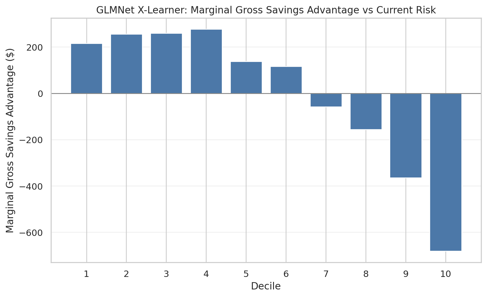
<!-- AUTO_CHART:xlearner_marginal_advantage END -->

The current-risk comparison uses the same held-out test population and the same cost assumptions within each model framework. Members are selected by highest `current_risk_score`, and expected avoided ED visits are then calculated using that framework's predicted benefit scores for those selected members. This makes the comparison a targeting-policy comparison: prioritize by estimated intervention benefit versus prioritize by baseline risk.

These savings results are directional rather than definitive. They are sensitive to the assumed ED visit cost, intervention cost, calibration of predicted benefit, and whether predicted benefit translates into actual avoided ED visits. A future write-up can add sensitivity testing with different cost assumptions.

Supporting files:

- [`GLMNet/uplift_roi_by_decile.csv`](Outputs/Uplift/Python/T-Learner/GLMNet/uplift_roi_by_decile.csv)
- [`GLMNet T-learner/cumulative_gross_savings_by_targeting.csv`](Outputs/Uplift/Python/T-Learner/GLMNet/cumulative_gross_savings_by_targeting.csv)
- [`GLMNet T-learner/cumulative_gross_savings_summary_top50.csv`](Outputs/Uplift/Python/T-Learner/GLMNet/cumulative_gross_savings_summary_top50.csv)
- [`GLMNet T-learner/marginal_gross_savings_by_targeting.csv`](Outputs/Uplift/Python/T-Learner/GLMNet/marginal_gross_savings_by_targeting.csv)
- [`GLMNet T-learner/marginal_gross_savings_advantage_vs_current_risk.csv`](Outputs/Uplift/Python/T-Learner/GLMNet/marginal_gross_savings_advantage_vs_current_risk.csv)
- [`GLMNet T-learner/dashboard_cumulative_gross_savings_targeting.png`](Outputs/Uplift/Python/T-Learner/GLMNet/dashboard_cumulative_gross_savings_targeting.png)
- [`GLMNet T-learner/dashboard_marginal_gross_savings_advantage_vs_current_risk.png`](Outputs/Uplift/Python/T-Learner/GLMNet/dashboard_marginal_gross_savings_advantage_vs_current_risk.png)
- [`GLMNet X-learner/cumulative_gross_savings_by_targeting.csv`](Outputs/Uplift/Python/X-Learner/GLMNet/cumulative_gross_savings_by_targeting.csv)
- [`GLMNet X-learner/cumulative_gross_savings_summary_top50.csv`](Outputs/Uplift/Python/X-Learner/GLMNet/cumulative_gross_savings_summary_top50.csv)
- [`GLMNet X-learner/marginal_gross_savings_by_targeting.csv`](Outputs/Uplift/Python/X-Learner/GLMNet/marginal_gross_savings_by_targeting.csv)
- [`GLMNet X-learner/marginal_gross_savings_advantage_vs_current_risk.csv`](Outputs/Uplift/Python/X-Learner/GLMNet/marginal_gross_savings_advantage_vs_current_risk.csv)
- [`GLMNet X-learner/dashboard_cumulative_gross_savings_targeting.png`](Outputs/Uplift/Python/X-Learner/GLMNet/dashboard_cumulative_gross_savings_targeting.png)
- [`GLMNet X-learner/dashboard_marginal_gross_savings_advantage_vs_current_risk.png`](Outputs/Uplift/Python/X-Learner/GLMNet/dashboard_marginal_gross_savings_advantage_vs_current_risk.png)

## Analytical Task 8: Client Perspective

From the perspective of a Medicaid health plan executive team, the most important conclusion is that the uplift framework provides a more targeted prioritization method than baseline risk alone. It attempts to identify members whose ED risk is expected to decrease with intervention.

GLMNet is the current candidate model for interpretation and operational discussion. It has better held-out test AUC, better calibration, and higher top-decile predicted benefit. However, after the stratified split, the GLMNet top decile does not have a positive observed control-treated gap. This means the current results support GLMNet as the stronger ranking model, but they do not yet provide strong observed top-decile validation for operational targeting.

If the model were used for exploratory prioritization, uplift decile 1 would be the first group to review. GLMNet decile 1 has average predicted benefit of 0.0827 and an observed control-treated ED gap of -0.0667. The negative observed gap means the highest-ranked group should not be presented as validated proof of treatment benefit. Because estimated top-decile ROI also remains negative under current cost assumptions, the model is best presented as a promising prioritization proof of concept rather than a ready financial case.

The results are explainable enough for stakeholder discussion because GLMNet provides standardized coefficient/logit contribution explanations. The benefit-driver analysis is especially important because the variables that drive baseline ED risk are not always the same as the variables that drive expected treatment benefit.

Several limitations are central to the interpretation. The dataset is synthetic and may not reflect live population behavior. Treatment assignment may be confounded. Observed treated-control gaps are not randomized treatment effects. Decile-level sample sizes are small, which can make observed rates unstable. Rare outcome prevalence can compress predicted probabilities toward zero. ROI depends heavily on cost assumptions and model calibration. Live-data validation is required before production deployment.

Operationally, the workflow would score members using the trained uplift model, rank members by benefit score, assign uplift deciles, prioritize outreach starting with decile 1, review benefit drivers for operational context, track outcomes after intervention, and recalibrate/retrain the model over time.

## Recommendation

The uplift modeling framework provides a structured way to prioritize members by predicted intervention benefit rather than baseline ED risk alone. In the current outputs, GLMNet provides the stronger candidate model because it has better held-out test AUC, better calibration, and higher top-decile predicted benefit. The observed top-decile treatment gap is negative after the stratified split, so the model should be described as a promising but not yet validated prioritization workflow.

The current GLMNet top decile has average predicted benefit of 0.0827, observed ED rate of 23.3%, and observed control-treated ED gap of -6.67 percentage points. Estimated top-decile ROI remains negative under the current assumptions of $1,200 per ED visit and $250 per intervention. Therefore, the model is best presented as a promising prioritization workflow that requires live-data validation, calibration review, observed-outcome validation, and ROI sensitivity testing before production deployment.

## Presentation Summary

A presentation based on these results can be organized around the business problem, the reason high risk is not always high benefit, the T-learner modeling approach, the data review, model performance, uplift decile findings, explainability results, ROI, limitations, and final recommendation.

The strongest slide story is that GLMNet is the candidate model carried forward for uplift prioritization. The caution is that the observed top-decile control-treated gap is not positive after the stratified split, ROI is still negative under current assumptions, and the data are synthetic. The workflow is promising, but it requires live-data validation before operational use.

## Reproducibility

The analysis can be reproduced by opening `Code/Uplift Model Code_rh06032026.ipynb`, restarting the kernel, and running all cells in order. The GLMNet T-learner outputs used in the final interpretation are saved in `Outputs/Uplift/Python/T-Learner/GLMNet`; GLMNet X-learner comparison outputs are saved in `Outputs/Uplift/Python/X-Learner/GLMNet`.

After rerunning the notebook, refresh the generated README tables, text snippets, and chart embeds with:

```bash
python Code/generate_readme_tables.py
```

Key output files:

- [`data_review_summary.csv`](Outputs/Uplift/Python/data_review_summary.csv)
- [`model_evaluation_summary.csv`](Outputs/Uplift/Python/model_evaluation_summary.csv)
- [`model_recommendation_summary.csv`](Outputs/Uplift/Python/model_recommendation_summary.csv)
- [`GLMNet/uplift_decile_summary.csv`](Outputs/Uplift/Python/T-Learner/GLMNet/uplift_decile_summary.csv)
- [`GLMNet/uplift_roi_by_decile.csv`](Outputs/Uplift/Python/T-Learner/GLMNet/uplift_roi_by_decile.csv)
- [`GLMNet/calibration_summary.csv`](Outputs/Uplift/Python/T-Learner/GLMNet/calibration_summary.csv)
- [`GLMNet/uplift_observed_gap_by_decile.csv`](Outputs/Uplift/Python/T-Learner/GLMNet/uplift_observed_gap_by_decile.csv)
- [`GLMNet/top_benefit_decile_summary.csv`](Outputs/Uplift/Python/T-Learner/GLMNet/top_benefit_decile_summary.csv)
- [`GLMNet/shap_importance_treated_control_models.csv`](Outputs/Uplift/Python/T-Learner/GLMNet/shap_importance_treated_control_models.csv)
- [`GLMNet/shap_importance_benefit_score.csv`](Outputs/Uplift/Python/T-Learner/GLMNet/shap_importance_benefit_score.csv)
